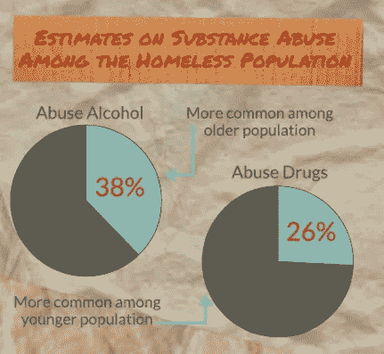

# 无家可归问题得到解决

> 原文：<https://medium.com/hackernoon/homelessnesssolved2017a-1b73c37a33ef>

## 从头开始重建住房阶梯

## **住房 100%的人，100%的时间**

在过去的两年里，我一直在[旅行，了解并结束无家可归的状况。我会见了社区领袖，睡在无家可归者的营地里，并带来了创造性的解决方案，如](/homes-for-the-homeless/solving-homelessness-in-san-francisco-65d13ce12a9#.cjokjg2wz)[市中心街道团队](http://www.streetsteam.org)在三藩市的生活。这段旅程让我坚信无家可归的问题是可以解决的。但要实现这一目标，城市必须管理与现在完全不同的事物。

在我深入探讨之前，有一个小警告——无家可归没有“完美的解决方案”。当为精神病患者、吸毒者、无家可归者创造解决方案时，你实际上是在为最难帮助的人群创造解决方案。记住这一点，我们的目标不应该是创造一个完美的解决方案，永远没有完美的解决方案，而是设想一个可以在 100%的时间容纳 100%的人的解决方案。在《解决无家可归问题》中，我提出了一个可扩展的、经济高效的系统级解决方案，通过一个重新想象的住房阶梯来消除无家可归问题。

《解决无家可归问题》的第一部分展示了整体解决方案，第二部分向城市展示了他们可以做些什么来立即开始向更好的模式转变，第三部分回顾了我们在实现这一目标的过程中将要经历的所有重要里程碑。

最后一个警告，如果你在无家可归者服务机构工作，请理解这篇文章并不是要淡化帮助无家可归者每天面临的挑战，而是简单地概述一个增加我们无家可归者住房供应的系统解决方案，并开启一个我们社区如何看待无家可归者的新时代。

**第一步:将无家可归者分成两组**

1.  不管出于什么原因，大约 50%的无家可归者在一年多的时间里，如果没有永久的免费住房，他们将再也无法照顾自己。这一群体通常患有严重的精神疾病、药物滥用问题或其他慢性健康问题，导致他们永远无法再工作。[http://www.nationalhomeless.org/factsheets/addiction.pdf](http://www.nationalhomeless.org/factsheets/addiction.pdf)

我们目前的系统被打破的原因，以及整个无家可归者行业的肮脏小秘密，是房产市场的失败。或者至少它没能让人们脱离政府福利项目。

我们最初认为我们可以给无家可归者免费的住房，他们会停止滥用药物，一旦他们重新站起来就搬出去。但是 20 年后，几乎所有的数据都显示，获得免费住房的人从来没有离开过，也从来没有再工作过，这使得没有住房留给下一批需要它的无家可归者。因此，你会看到无家可归者的支持者不断尖叫着他们需要更多的住房，因为那里没有给无家可归者的东西。事实是有住房，很多住房，但没有人离开它！

**百分之五十的人永远不会再工作，但百分之五十的人会。**

2)另一半无家可归人口完全有能力也愿意重新工作。他们的目标是拥有独立的生活，为摆脱无家可归而奋斗，摆脱政府的支持计划，继续他们的生活。这并不是说他们没有需要解决的严重问题，但这些问题是可以克服的。从本质上来说，无家可归的人几乎平均分为两类，一类是需要生活护理的人，另一类是可以帮助他们重返劳动力市场的人。

无家可归者中从来不会被问到的问题是:

我们应该把这两组分开吗？

b)如果我们现在就为这些群体制定解决方案，它们会是什么样的？

如果我们牢记这些问题，那么**整个无家可归者系统**看起来会有很大不同。

每个群体都需要在不同的领域得到关注才能重新站起来。然而，在目前的系统中，每个人都聚集在一个被误导的城市项目的大集群中。这是因为目前的系统是作为对无家可归者的反应而建立的，而不是解决无家可归者的方法。

> 社会总是对任何常识的新例子感到惊讶。——拉尔夫·瓦尔多·爱默生

# **第二步:为每个小组创建不同的解决方案**

目前，我们有一个系统，将吸毒者、毒贩和精神病患者放在刚刚丧失抵押品赎回权的新婚夫妇旁边。我们称它们为无家可归者收容所，它们是所有无家可归者解决方案的标志。

一个更好的解决方案是允许个人在准备重返劳动力市场和希望依靠政府服务生活的人群之间进行自我选择。

A 组:50%的人会努力摆脱无家可归。

B 组:40%的人永远不会再工作。

C 组*:大约 10%的人会在 B 组和 A 组之间移动，因为他们经历康复计划并试图重新获得对自己生活的控制。

## **地区退休社区**

*为那些不工作或不能工作的人提供一个快乐的地方*

对于那些无法工作的人，我们本质上是想为他们创造一个令人惊叹的生活社区。区域退休社区提供免费住房、综合社区和关键服务，只要有人愿意。它利用多个城市之间的可用政府土地来创建退休社区。这样做的好处是指数级的:

1.可用性和可扩展性:我们有大量的免费政府土地供各县使用。

2.节约成本:我们将能够从目前的支持性住房成本中节约 70%左右。

3.更好的服务:我们可以创建庞大的退休社区解决方案，提供比目前更多的活动、资源和更专业的护理。

4.更好的提供者:使用一个专业的提供者，我们可以在多个县使用最好的提供者，让该地区所有无家可归的人都有更好的专业护理。

5.没有邻避主义(不在我的后院):我们可以创造解决方案，而不必惹恼邻居和担心邻避主义。

6.增加低收入住房:通过在地区范围内建立新的低收入住房社区，我们释放了城市中现有的(有限的)低收入住房。

7.新工作——为区域社区附近的小城市创造全新的就业机会。

简而言之，区域住房解决方案将是负担得起的、可扩展的，并且提供比当前解决方案更好的服务。这一解决方案适用于近 50%的无家可归者。

区域性退休社区的一个例子是在旧金山和斯托克顿之间捐赠一大片土地。然后，旧金山、奥克兰、圣何塞和萨克拉门托等城市可以为无家可归者提供无限量的廉价住房，这一解决方案将解决美国前 20 名无家可归人口中的 4 人的无家可归问题。

然而，创造一个改变现状的解决方案有很大的障碍。

1.在创造将无家可归的人送出城市的解决方案时，有一种对“光学”的巨大恐惧。大部分政治都与“光学”有关，需要支持这一点的政治家们会害怕因为一些事情而危及他们的职业生涯，这些事情会:

1.拿走当地非营利组织的资金。

2.看到说当地非营利组织抛出狗屎风暴。

3.看到非营利组织召集倡导团体加入这场风暴，并试图羞辱任何阻碍他们的人。

简而言之，城市中无家可归者的减少会伤害当地的非营利组织和倡导团体。他们会竭尽全力保持重要地位，不会看到他们的资金被重新分配给其他人，也不会解雇他们的员工。这些组织的目标并不与其他所有人的目标一致。

例如，当一个朋友的组织最近进入一个新城市时，有一个根深蒂固的提供商与这个城市签订了几十年的合同。他们很糟糕，是一个管理不善的组织，他们的资金几乎没有什么成果，运营成本是我朋友的组织的 4 倍，产生的结果也乏善可陈。遗产组织的执行董事有一颗金子般的心，我相信每个人都喜欢他们。因此，当把资金从平淡无奇的组织转移到我朋友的组织时，该市其他无家可归者组织和倡导者的联盟聚集起来支持这个过时的组织。不是因为它们很好，而是因为这个生态系统中的每个人都在为彼此而战，而不是为了我们整个社区的改善。因此，寻找新供应商的过程耗时数年，而不是数月。这仅仅是因为幕后有很多秘密渠道和有触觉的政治活动。

事实是，有很多人住在城外，只要他们想去，就可以乘坐公交。只要我们提供返回城市的免费交通选择，那么那些居住在地区社区的人就会得到充分的照顾。

Community First is a Homeless Retirement Community in Austin, TX

## **低收入劳动力住房(LIWH)**

*对于那些想要工作并让生活步入正轨的人*

对于 50%想要并且能够工作的无家可归者来说，低收入劳动力住房是摆脱无家可归和重返社区的完美解决方案。

这些“过渡中心”包括免费住房、职业培训、服务、食物以及介于两者之间的一切。它们是帮助他人重新站起来的基础解决方案。

一个例子是买下旧的游轮，把它们改装成带有职业培训项目的临时住所，这是我和前旧金山市长阿特·阿格诺斯今年早些时候研究的一个解决方案。该解决方案比旧金山目前的员工住房解决方案便宜 95%。

另一个例子是使用一个只为这个群体提供服务的无家可归者收容所，旁边还有一个职业培训中心，如 GoodWill。尽管这个例子没有可伸缩性或成本效益。

目前，像旧金山这样的城市尽最大努力创造这些解决方案，然而他们失败了，因为他们没有将社区和严重精神疾病患者以及药物滥用患者分开。每当你遇到一些不认真想让生活回到正轨的人和其他认真想让生活回到正轨的人混在一起时，整个项目都会受到影响。

这就像把你的孩子放在一个教室里，一半的孩子关心，另一半的孩子不关心，而把他们放在一个有着相似目标的积极进取的孩子的教室里。

这就是为什么这些中心需要是安全的空间，远离毒品、酒精和严重的精神疾病。在毒品和无家可归的问题上没有中间立场。要么你在建立一个安全的地方来激励人们，要么你在建立一个被每个违反规则的人贬低的东西。过渡中心必须有一个**零容忍无毒区**才能成功。

## **康复中心**

*针对那些寻求从药物滥用、愤怒管理和其他精神健康问题中恢复的人*

住房阶梯的最后一个支柱是帮助那些遭受药物滥用和/或精神健康问题的人。一个让人们克服个人心魔的安全空间。这一解决方案适用于大约 10%的无家可归者，他们在绝望和努力重返职场之间挣扎。

诚然，药物滥用会导致人们无家可归，但对许多人来说，药物滥用也是无家可归的一种应对机制。那些受苦的人已经陷入了更深的困境。物质滥用和精神疾病使事情复杂化。有暴力犯罪记录让事情变得复杂了。被关进监狱让事情变得复杂了。

Michael’s House, A Study on Homelessness and Addiction

许多人还没有准备好重新加入我们生活的这个世界。重新加入我们的老鼠赛跑，离开无家可归的社区。但当它们存在时，总会有一个吸引它们的路径点。一个重新发现希望和相信自己的地方。对许多人来说，康复中心是回到这个世界的第一步，过渡中心是他们期待的隧道尽头的光。

# **第三步:重新定义无家可归文化**

第三步是重新定义无家可归的含义。

## 羞辱可耻的人

在旧金山，似乎有一些虚假的借口，认为无家可归者的存在让这座城市变得更加坚韧和真实。这是我们城市身份的一部分。在某种程度上，无家可归已经成为我们文化的一部分。

这有一个很大的问题。无家可归不是一个城市伟大的原因。无家可归是这座城市的耻辱！无家可归不会改善任何人的生活。它不会让城市变得更好。你不是一个更全面的人，因为你几乎无家可归！它不断提醒我们，我们的制度不起作用，我们的政客不称职(或许应该被解雇)，我们的税收没有得到有效利用。

让一个城市伟大的是它的价值观。人们如何对待彼此。我们如何一起解决问题。我们如何照顾彼此。这是心照不宣的约定。这就是社区的本质。

尽管我刚才说的很美，但当无家可归的人普遍存在，人们在我们的街道上濒临死亡和贫困时，这些都不存在了。我们都有责任，因为我们让政客们逍遥法外，没有提出更好的解决方案。

在旧金山过去的 30 年里，你可以看到一个又一个的市长站在他们的讲台上，谈论他们将如何解决问题，然后转身失败。他们对正在发生的事情撒谎，他们提出无效且管理不当的解决方案，然后他们不负任何责任。我们允许这样。在商界，我们会解雇这个人。然后下一个人就会知道我们是认真地想看到这个问题得到解决。如果我们不让我们的市长为此负责，那么什么都不会改变。

市民缴纳税款，用来解决这些城市问题。普通公民不应该羞于给予更多。给乞丐钱不是我们的责任。如果一个城市不能使用我们的税收来有效地帮助人们，那么人们应该找到一种更好的方式来使用他们的税收为公民造福。

## 赋予人民权力

我们还必须帮助无家可归者摆脱被剥夺权利的观点，更多地转向更有权利的心态。无家可归者社区的成员应该有机会参加项目，帮助他们克服超出人们想象的自尊和身份问题。

我们必须对我们的项目——住房、劳动力和精神健康——有更高的期望。我使用健康，因为这不是一个心理健康问题，这是关于个人健康。我们需要给无家可归者同样的工具，如果不是更好的话，就像教练今天给我们所有人提供的一样。大多数无家可归者不需要心理医生，他们需要更接近于生活教练的东西。

目前，他们只能通过 12 步计划、宗教和外部力量来获得力量。我们需要帮助人们找到控制、代理、信任和对自己的信念。

我见过的无家可归的人希望看到他们的生活得到改善。他们想学习新的东西。他们想工作。他们想要相信自己。他们希望人们对他们负责。去关注他们。有人指望他们。他们希望得到帮助和推动，以回到他们想要的生活。

在未来，遭受极端贫困(而不是无家可归)的人将是城市过渡中心的人。他们可能是你一生中遇到的最鼓舞人心、最美丽的人。他们会在每天的生活中寻找新的意义，与经历这些的人接触会令人振奋，就像你的城市做得很好一样令人欣慰。

# **结论**

住房第一永远是答案，但倡导者并不完全理解 95%接受住房的人在他们的生活中不会再工作一天。知道我们现在所知道的，住房选择应该是我们所吹捧的。城市内的临时劳动力住房或城市外的永久性支持性住房。中间还有康复选择。做出你的选择。

无家可归是可以解决的。这些解决方案易于实施且经济实惠。飞行员可以很容易地建立，研究和发展。我们可以为无家可归者找到一个可行的解决方案，而花费的钱要少于我们花在已经让我们失败了几十年的反动解决方案上的钱。知道了我们现在所知道的，我们就能为无家可归者、为我们自己、也为未来的几代人创造一个更美好的世界。所需要的，只是给进步一个机会。

我希望你喜欢无家可归的解决:第 1 部分。在这篇文章的第二部分，我将概述一个城市实施这些解决方案的第一步，在第三部分，我将介绍新的劳动力和福利解决方案。

