# 智人、进化、货币和比特币

> 原文：<https://medium.com/hackernoon/homo-sapiens-evolution-money-bitcoin-33f69701de>

一种奇怪的猿类物种是如何从易货到比特币的。一篇论文。

# 前言

我大约在 6 个月前开始写这篇该死的文章……或者更久——我现在都不记得了。它一直和我另外 50 篇未完成/写了一半的文章放在一起，我一直在说“我会很快找到时间完成的”..

这里的信息构成了我在这个领域的许多论点的基础，也是我几次演讲的基础，包括几个月前我在澳大利亚举行的一次非常粗略的演讲，这是有录音的(链接在最后)。

我的目的是利用历史、人类学、传播学、进化论等来探索什么是钱，什么是比特币，它们是如何进化的，这次有什么不同&为什么这项创新如此重要。

虽然这些年来，我从数以千计的书籍、视频、文章、文章和博客中获得了信息，但我还是要感谢尤瓦尔·诺亚·哈拉里、[安德烈亚斯·m·安东诺普洛斯](https://medium.com/u/898f59563d67?source=post_page-----33f69701de--------------------------------)和[海军·拉维坎特](https://medium.com/u/67f5049293c7?source=post_page-----33f69701de--------------------------------)给了我巨大的灵感。我建议你找出他们每个人是谁..尽快。

所以现在…好吧…我要试着完成它。或者至少让它好到可以发布…

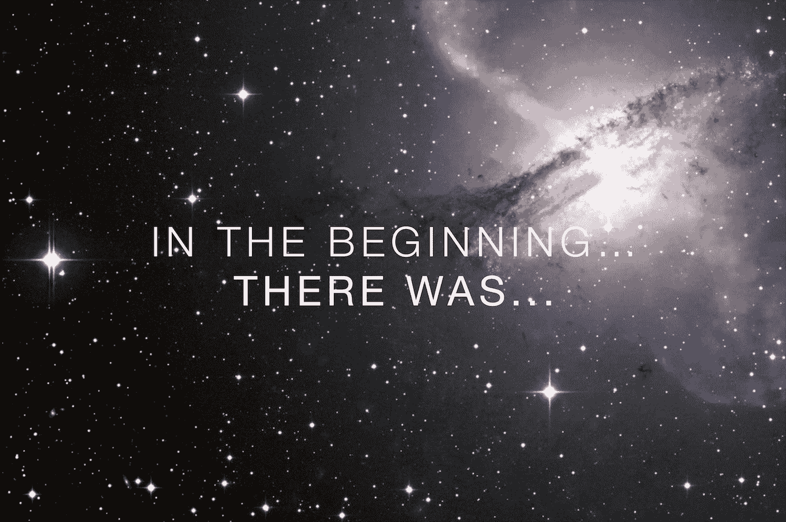

# **最初……有比特币**

*比特币&“区块链”的发展开始于大约 7 万年前——那时智人作为一个物种超越了他们的生物极限。*

这是一个植根于人类进化的故事。

人类已经在这个星球上生活了 200 多万年。

智人，作为人类的一个物种，只存在了大约 15 万年。

7 万年前，发生了一些事情——这与我们前额叶皮层的激活、我们消化系统的萎缩和其他一些事情有关，尽管没有人真正知道它是如何发生的，但它导致我们从食物链的中间迅速移动到食物链的顶端。

这是“历史”时代开始的地方，对人类和世界来说，这改变了一切。

但是……在我们探索发生了什么变化之前，让我们先了解一下背景。

# 邓巴数

罗宾·邓巴是英国人类学家，他花了数年时间研究人类和灵长类动物的平均社会群体大小和大脑功能。

他的发现使他认为:

*人类认知处理系统最多可以容忍 150 个“朋友”，或稳定的社会关系。*

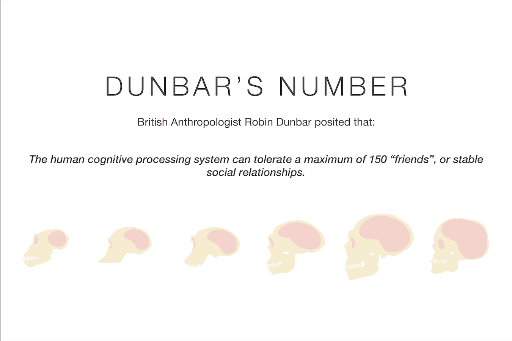

这个 150 被称为“邓巴数”,几千年来，在人类和灵长类的所有物种中，这个数字基本上是正确的。

这被认为是我们智人至今仍有的进化生物学极限。

但是…

超过这个数字的群体合作能力改变了 7 万年前的一切(历史的开端)..

怎么会？

# **通信**

交流改变一切。但它不是任何形式的交流。

动物、哺乳动物、昆虫等都以自己的方式交流——结果建立了部落、群体、族群等。

事实上，大多数人比人类更擅长组织和建立复杂的合作群体(例如:蚂蚁)——但是——这些群体&它们的交流纯粹是*生物性的。*

智人的进化超越了所有其他物种(包括人类)，因为我们能够以某种方式在更高的层次上交流，超越了我们的生物限制。

这有两个部分:一个基础，第二个；衍生品&这一切的关键。

## ***第一部分:复杂语言***

> 语言可能是作为一种“廉价”的社交修饰方式出现的，它让早期人类能够有效地维持社会凝聚力。邓巴推测，如果没有语言，人类将不得不花费将近一半的时间在社交打扮上，这将使得富有成效的合作努力几乎不可能。语言可能让社会保持凝聚力，同时减少对身体和社会亲密关系的需求。”
> 
> *来源:维基百科:邓巴的数字*

复杂语言是我们大脑进化方式的独特之处。新皮层&前额叶皮层)。

它给了我们时间(物理上)和空间，**认知上，**去构建第二层:

## ***第二部:《共享小说》***

我们是唯一能够交流、分享和联系实际上并不存在的事物的物种。

Monkey who just stole a banana…and is on the run…yep…

猴子会撒谎。

他们可以说天空中有一只鹰来欺骗他们的猴子同伴逃跑，所以他自己得到了所有的香蕉。

猴子也可以警告危险，即；“河边有一头狮子”。

另一方面，只有智人可以说:“狮子是我们人类的精神祖先”。

只有智人——他们来自世界的不同地方，彼此不认识，从未见过面，也没有生物学上的理由信任彼此——可以搭讪，建立融洽关系，建立信任，仅仅因为他们是意大利人，或者中国人，或者其他一些“虚构”的国籍。

只有智人可以用同样的理由团结起来&建造金字塔，或者“以我们国家的名义”炸掉对方，就像我们在 WW1、二战或任何其他战争中所做的那样..

共享小说本身就是语言，几千年来已经有很多:

*   种姓的
*   赛马会
*   《列王纪》
*   诸神
*   宗教
*   国家
*   法律
*   企业
*   金钱

所有这些都是为了在更广的层面上促进合作和协调，有助于抽象交流，并允许一个更复杂的社会成长和发展。

最早的“共享虚构物”之一是钱，它今天仍然存在，因为它对社会的运转是如此重要。

# 金钱与沟通

在最基本的层面上，金钱是一种交流方式。

> ***金钱是一种共享的虚构。***

这是一个我们都同意代表价值的抽象概念。

货币的“形式”已经演变了多年。从香料，到贝壳，到硬币，到黄金，到纸张，到塑料，到现在的原生数字货币。

金钱是唯一一种经受住了时间考验的交流形式(共享虚拟)，它设法超越了所有其他共享虚拟所受到的边界和障碍。

甚至宗教也无法与金钱的力量相提并论。

为什么？

因为它代表了:

# **值&交换**

在社会的基础上，它的成长能力和功能是一个关键因素:**价值**

此外，交换价值的能力是社会运行的动力。

当我们合作时，我们在做“工作”，它有某种形式的“价值”，在我们所有的贡献和互动中，我们有这种价值的交换。当你在复杂的层次上推断时，你创造的社会能够以数量级超过邓巴的数量。

同样重要的是要注意，随着社会复杂性的增加，价值将继续抽象化，以降低交换的摩擦。

这就是为什么钱如此重要。

价值是主观的，可以有多种形式，但金钱是一种客观的工具，它给我们一个机会来表现/量化它。

# 货币的演变

*(本文粗略简化)*

几个世纪以来，钱以很多很多的形式出现。

我们从物物交换，到商品货币，如奶牛和香料，到最初的抽象概念，如贝壳，再到更好的抽象概念，如金属，如青铜，然后是银，然后是金。

大约 3000-5000 年前，我们进入了第二层抽象的时期，在这个时期“信任”被引入来帮助促进更好的交易和交换，即:硬币是用皇帝/权威的批准印章铸造的。

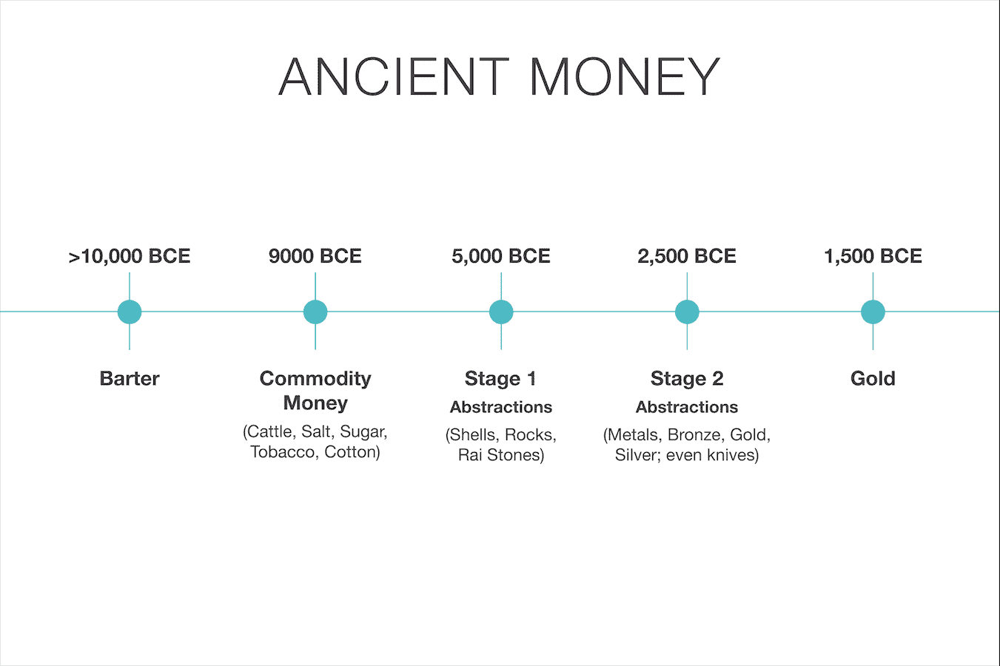

这种模式(在许多变体中)持续了几千年，在多重物物交换、黄金、极度通货膨胀的铸币时代等等(谢谢你，尼禄，第一个大的)，直到下一个主要的抽象；即；票据或本票。

它在文艺复兴时期被佛罗伦萨的银行家族所普及，因为携带一张承诺赎回一定数量黄金的票据比随身携带黄金更容易。

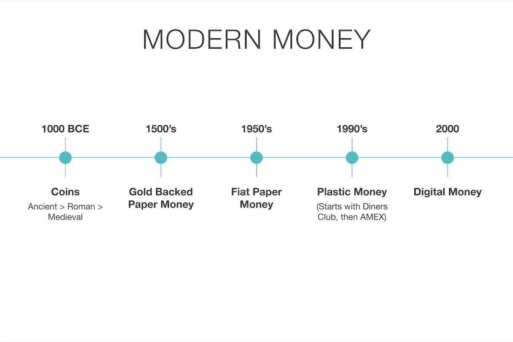

这是 500 年来的定义模型(在金本位时期，等等)，直到期票转变成我们现在的“法定货币”时代，即:一种除了“对国家的信任”或“对发行者的信任”之外没有任何支撑的货币。

到目前为止，这个法定货币模型已经迭代了 3 次:

*   纸
*   塑料的
*   数字单板(现在)

它占据了至高无上的地位..直到 2009 年 1 月，中本聪推出了比特币。

时机……再好不过了。

# 货币的属性

在我们定义“我们需要的货币”之前，让我们回顾一下货币的属性。

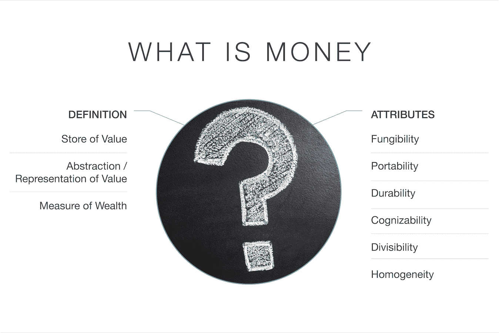

通过每一个抽象，我们能够给钱添加更好的属性。

但是随着抽象的每一层，我们增加了对信任的依赖。

我们添加的属性越多，信任的支柱就越被权力、秘密所笼罩&越少。这就是为什么我们需要一种新的货币形式。

# 我们需要的钱？

对于这样一个世界，什么是理想的金钱/价值储存方式:

*   变得越来越相互关联。
*   变得越来越复杂。
*   需要更好、更快、更透明的交易方式？
*   需要一种更健壮、抗脆弱、不可信的价值抽象形式？
*   正在迅速转向这样一个时代，在这个时代，国界不再像过去那样重要，语言障碍正在被分解到最基本的层面。

我们需要一种价值储存和交换的形式，这种形式是开放的、去中心化的、不受审查的，可以被公众看到，在一个所有人都可以访问的账本上，有一个数字的、可分割的、可替代的、固定的和有限供应的令牌。

而这已经存在了——它从 2009 年就开始盯着我们了。

# **在数字世界中成长**

每一代人都习惯于相信“x”是真钱。

过去几个世纪，由“政府”或中央银行支持的黄金和票据一直是主要的持有者。

当我们第一次开始使用塑料时，有一片哗然，认为这不是“真钱”。

同样的事情也发生在我们今天使用的在货币上建立数字贴面的过程中。但是人们会适应。

虽然这些持续的抽象有优点和缺点，但它们为真正的本地数字、全球货币/价值储存/交换手段的出现铺平了道路。

对我们中的一些人来说，它似乎仍然是互联网假钞，但对下一代来说，纸张、现金和塑料似乎是过去无用的遗物。

*原生数字*货币是未来，最重要的是那些去中心化的、无边界的、全球性的&抵制审查的货币——因为技术正在使其他一切民主化，而我们需要一种形式的货币与之相伴。

# 价值的数字存储

围绕非政府支持的数字货币的想法有很多争议，其中很大一部分是由于它们的波动性。

人们说“这些永远不可能是货币”，因为它们不稳定。

虽然现在这可能是真的，但他们忽略了一些基本的东西:

***某物在成为价值交换之前，必须成为价值储存。***

成为价值储存库需要时间——尤其是当它对世界上这么多地方的这么多利益相关者造成如此大的破坏时。

我们习惯性地认为，因为我们生活在一个技术驱动的世界，我们可以快速创新——这种新形式的货币也应该以某种方式快速创新/改变/移动。这是不正确的——因为金钱更像互联网，而不是互联网公司。这是一个需要时间来建立的网络(稍后会详细介绍)。

另一个论点是，它没有“任何东西的支持”。

好吧，最后一个(也是唯一一个)真实的、不可信的价值储存手段是黄金。这也没有任何回报，除了它是真实的和有形的，这意味着它是安全的。它也恰好是相对可替代的、有限的(稀缺的)、可识别的、持久的和大部分稳定的，因此我们都同意它具有某种价值。

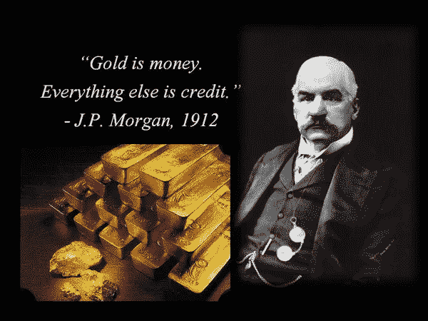

From the OG Banker himself…Jamie should take a leaf from him..

事实上，正是因为它不变，它才有价值。

顺便说一下；它的市值(网络价值)超过 7 万亿美元，更重要的是，它花了 5000 年才达到这一水平！

*比特币迄今已成为价值的默认数字存储，因为它是抗审查的货币，有* [*主权级保护*](https://twitter.com/TusharJain_/status/966062290847092736)*；旨在抵御大型民族国家的攻击。*

比特币的第一个也是最重要的用例将是成为一种储备资产。

**安全和抵制审查是根本。**

数字货币已经具备了其余的属性。随着时间的推移，只要基本面保持正确，他们的采用会增加，他们的网络价值也会增加，从而使他们真正有机会成为真正的交易媒介。

这不是一个“如果”——这是一个“当”

因为时间*和*历史永远站在“网络”一边。

这让我想到了下一点:

# 网络

没有人曾经成功地预测过任何对社会有重大影响的网络的增长(这可能有点夸张，但你明白我的意思)。最重要且根深蒂固的网络，例如:

*   电流
*   电话
*   互联网
*   脸谱网
*   货币和价值交换

没有人预见到这些变化，也没有人预测到它们的增长。

回顾每一个网络的发展，我最喜欢的部分是阅读这些引言:

> *“事实是；没有任何在线数据库可以取代你的日报，没有任何光盘可以取代一名合格的教师，也没有任何计算机网络可以改变政府的工作方式。”*
> 
> 美国天文学家和作家克利夫·斯托尔，1995 年

美国人需要电话，但我们不需要。我们有很多送信的男孩。”

威廉·普利斯爵士，英国邮政局总工程师，1878 年。

> *“这个‘电话’有太多的缺点，不值得认真考虑作为一种通讯手段。该设备对我们来说本来就没有价值。”*
> 
> 西联汇款备忘录，1878 年(或 1876 年)。

当(1878 年的)巴黎展览会结束时，电灯也将随之关闭，人们将不再听到它的声音

牛津教授；伊拉斯谟·威尔逊

我最喜欢的一个:

> *“互联网的增长将大幅放缓，因为‘梅特卡夫定律’的缺陷变得明显:大多数人彼此无话可说！到 2005 年左右，人们将会清楚地看到，互联网对经济的影响并不比传真机大。*
> 
> **保罗·克鲁格曼，**诺贝尔经济学奖得主，1998 年写道。

自早期以来，比特币也是如此(参见比特币的讣告，以获得一些笑声)，或者我从《连线》杂志上看到的这个:

*“有线，累，2012 年过期:过期—比特币”*

**全方位空中摇摆。**

但在他们看来，这是有原因的。非常非常聪明的人做出非常非常错误的预测是有原因的:

# 线性与二次/指数增长。

人类的思维已经发展了几十万年，可以线性地思考和感知。

在大草原上，当你在躲避狮子时，你需要意识到你能以多快的速度逃离它——否则你就死定了！

*线性思维是一种生存机制:*

30 步= 30 米。

再走 30 步=总共 60 米。线性。

指数增长是另一个极端。每走一步都是翻倍。

我们都听说过摩尔定律，该定律指出，集成电路中的晶体管数量大约每 2 年翻一番。

在过去的 70 年里，科技一直紧紧跟随这条轨迹，这也是我们(作为一个社会)几乎每一个预测都是错误的一个重要原因。

这是非直觉的增长:

30 直线步= 30 米。

30 个指数级= 10 亿米！

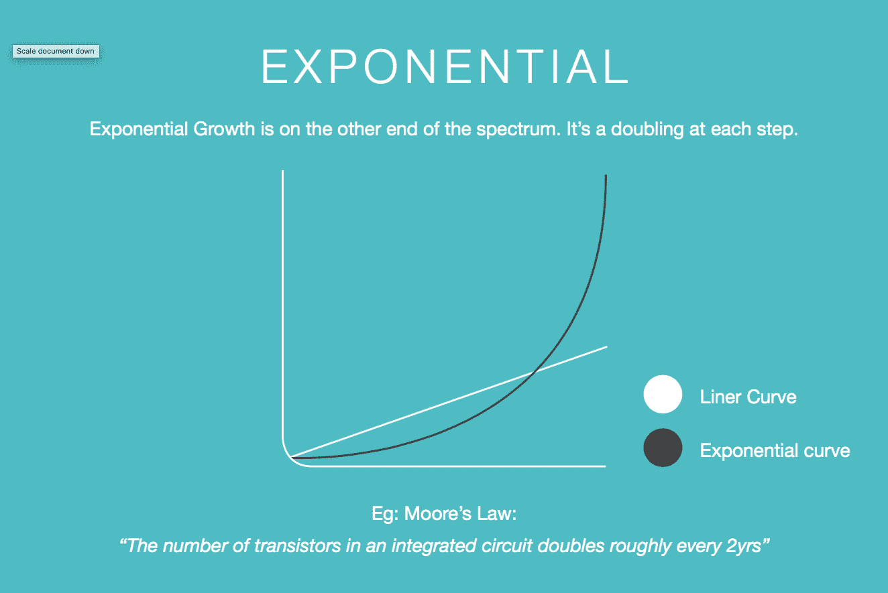

It’s deceptive. We initially over-estimate, and subsequently underestimate.

二次增长不是一样的，而是介于两者之间。梅特卡夫定律对此做了最好的描述，它指出:

> “一个网络中潜在连接的数量与参与者数量的平方成正比，即；n2 "

所以如果网络中有一个人，就有一个连接。

10 = 100 个连接

100 = 10，000 个连接

1000 = 1m 个连接

1m =亿个连接

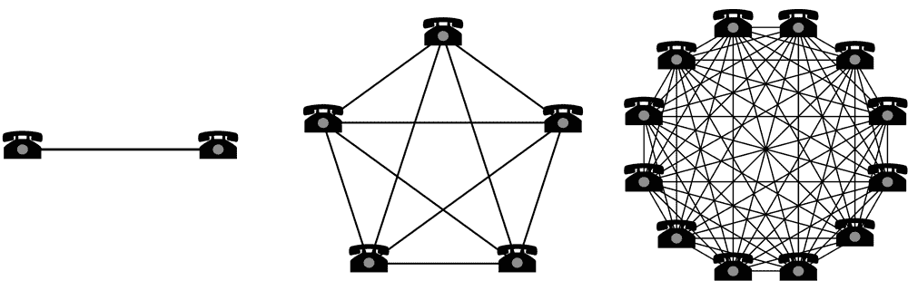

Simple Representation of Metcalfe’s Law.

无论是经济学家、银行家、天文学家，还是我们任何人，都无法真正从根本上理解这一点。我们的 DNA 中没有这样做的基因，此外，传统学科中的大多数培训都是围绕线性的、局部的概念建立的，因此它进一步限制了我们远离技术和网络如何发展。

现在有一个有趣的想法:

比特币和真正的公共区块链网络是二次网络增长和指数技术扩张的结合。

那只是偶尔发生一次…

事实上，上一次发生如此重大的事情可以说是互联网(尽管你可能会认为 AWS 和脸书也是很好的例子，但我会说互联网更类似于比特币，因为它们更像公用事业而不是公司)，尽管迄今为止它已经改变了世界，但我们只是触及了未来的表面。

# 网络 VS 公司

有了关于网络增长如何运作的基本概述，让我们探究一下为什么我们的估值完全错误。

网络从根本上不同于公司传统的资本基础设施模式。

在过去的 100 年里，我们开发的用来衡量和分析资本、市场、公司、合作社等的心智模型并不符合管理网络的法则。

*网络不是公司。*他们不必担心利润、亏损、股东、董事会、客户或任何这类事情。

回想一下网络泡沫。你记得发生了什么吗？

网络公司繁荣兴旺，但互联网继续发展。事实上，它加速了！

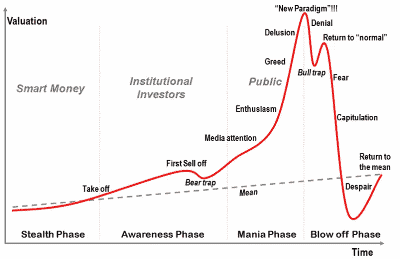

Red = Web Companies. Dotted Line = Internet. Same will be true for Crypto & Bitcoin.

建立在互联网上的公司受到了影响，但基础网络(互联网)没有受到影响。

我们已经被训练和习惯于根据利润、收益、收入、客户、利润、投资回报、资本配置等来评估事物。

网络只是不受制于相同的估价模型&因此我们无法预测它们未来的价值会是什么样子。

网络有*时间*在他们这边。在企业界，时间通常对你不利，因为你在为市场份额而战，为精神份额而战，为竞争而战，为新的创业公司而战。

对于像比特币这样的东西，除了灾难性的失败，新技术来来去去的事实并不意味着什么。

比特币(作为一种协议)是稳定的。比特币有基础设施。比特币有安全性。比特币是我们拥有的最分散的东西。比特币没有“蛇头”，因此最具审查抵抗力。比特币是一个有着巨大网络效应的反常事件，作为一种全球性的、数字化的、中立的、不受审查的价值储存手段，它领先于其他任何东西几个数量级。

所以当你试图评估这个空间时，你应该问的问题不是:“今天的技术有多好或多有价值”，但是；

“随着时间的推移，它将如何演变？它有基础吗？一种稀缺、安全、不受审查、开放、公开、透明和可分割的分散化数字交换手段有多大价值，它允许世界各地的人们在任何时间与任何人即时、自由(廉价)地进行价值交易”？

这是一个非常不同的问题，需要一个新的框架和一套全新的心智模型来衡量和评估。克里斯·伯恩斯克在这个领域做了一些了不起的工作，T2 和布莱恩·科拉沃斯基也是如此。

# 40 亿人没有银行账户或银行服务不足

在我把这个带回家之前，我将概述一个我在一次演讲中用过的例子。不，这不是我的版本的令人毛骨悚然的“婴儿正在死去”，罗杰弗一直提到..

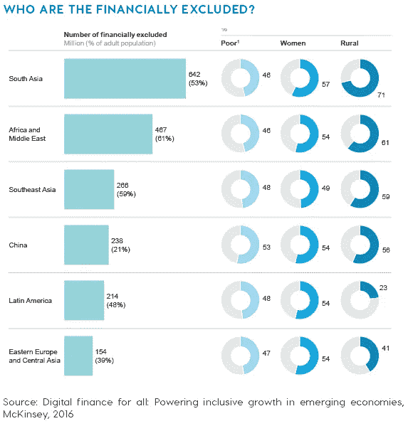

Combining banked & underbanked, we get to roughly 4bn (or more).

比特币的一个主要用途是为没有银行账户的人提供银行服务，如果成功的话，可能会导致有银行账户的人去银行化。让我们探索一下:

**你可能听说过《崛起的十亿人》**

也就是说，有 10 亿人越过了传统的“贫困线”，进入了全球经济。

指数技术已经给他们带来了参与所需的工具。智能手机、无线互联网等。

但是银行和金融服务呢？

*嗯；银行不能&也不会为他们服务，因为银行是公司*

他们需要赚钱&现在还赚不到钱。

开放的、公共的、分散的协议(网络)没有这个问题。

比特币不在乎你是谁，你在哪里，你有多少或者你为什么要用它。

有了电话和互联网接入，无银行账户者将拥有我们在“发达”世界目前视为理所当然的基本金融服务——事实上，可能更好，因为他们不必出卖自己的隐私和灵魂来获得接入。

等到银行赶上来并努力为这 40 亿人服务时，一切都已经太晚了。

当人们拥有比传统银行业更好的东西时，为什么还要让自己受制于传统银行业的严格、歧视和约束呢？

当我们被超越时，你认为我们其他人会有什么感觉？

你认为这会对世界产生怎样的影响？

10 亿人对二次网络的价值做了什么？

我让你自己算。

# 展望未来。金钱之后是什么？

进步的社会，一旦他们有了钱，就会继续建立新的治理结构和更深层次的交流和交换。

他们开始问“我们如何更好地管理社会”这个问题？

这就是事情变得有趣的地方。

在当今世界中，通信和信息基础设施带来了第一波大规模变革，而我们正处于其上的价值转移和交换层的黎明。

之后发生的事情将是以下关键支柱的转变:

公平、道德、自由、机会、创新、身份、主权等。

我们今天有 2000 种数字货币，可能只有 5 种能够长期存在——因为另一个 1995 年，除了很大一部分是天真和愚蠢(或诈骗)之外，就是不需要自己的基础设施，它们所代表的思想也太遥远了。它们只是短期内不需要，因为首先需要对金钱/价值进行分类，然后是上面列出的关键支柱。

在所有这些都完成之后(这将需要很多年)，我们将看到在这些之上的抽象层，其中将开发数百万个应用程序，这些应用程序在一个基于更现代、更分散的价值交换、治理、身份等形式的世界中运行得更好。

请注意，还将有一百万个应用程序在其当前的集中格式下运行得更好——并不是所有使用区块链的应用程序都更好。事实上，大部分情况更糟！

What the actual fuck….

但是，社会的基本要素，即；价值交换、治理、身份认同是这个领域中所有真正创新发生的地方。

我们的工作是先把基础层做好——其他的都在后面。

# 采用→价值→稳定性

为了让这个实验成功，我认为我们需要做以下事情:

1.  提高采用率，结果是:
2.  增加网络价值(价值储存/储备资产)，因此；
3.  我们将看到这种资产类别稳定下来，然后，由于它的效用，它将有机会成为一种全球性的、开放的、公共的、即时的、分散的价值交换形式(即:钱)。

然而现在最重要的是，我们需要把精力放在(1)上。

2 和 3 将会随着采用的增加而发生。

那么我们该怎么做呢？简单(但不一定容易):

a)更好的入口匝道和出口匝道。

我们只需要创造更好的交流&让人们更好地进入这个领域。对于一个人来说，了解这项新技术最好的方法就是实际购买一些。

b)更好的基础设施。

这包括钱包、节点、闪电节点、Metamask 等工具等。一旦人们“进入”这个空间，他们需要有更好的体验。例如，钱包已经走过了漫长的道路——但它们还有很长的路要走。

c)教育。

所有“繁荣”的新兴产业都带来了成群结队的牛仔和蛇油推销员。你看到 Bitconnect、USI 理工大学、梅威瑟、史蒂文·西格尔、Ai 区块链这样的垃圾将解决世界饥饿问题&打扫你的房子、牙医硬币，天知道还有什么马粪从木头里冒出来，你想知道这些怎么会是合法的..

嗯——大部分不是——而且大部分是短期噪音，它们将在下一个“秘密冬天”消失(虽然姗姗来迟，但非常必要)。

但是，作为了解这个空间的“某些东西”的人，我们有责任以有意义的方式教育和解释其他人——我知道这并不容易。直到今天，经过多年的研究，仍然没有简单的解释来解释比特币或区块链是什么，而不会打开进一步问题的潘多拉盒子..但是，我们就要到了。

在这种情况下，如果你想了解更多，这里有一个人的快速列表，你应该关注/订阅:

*   安德烈亚斯·m·安东诺普洛斯
*   [海军拉维坎特](https://medium.com/u/67f5049293c7?source=post_page-----33f69701de--------------------------------)
*   [吉米·宋](https://medium.com/u/4acb12744ff8?source=post_page-----33f69701de--------------------------------)
*   [追踪迈耶](https://medium.com/u/75e93b5827c9?source=post_page-----33f69701de--------------------------------)
*   [凯尔·萨马尼](https://medium.com/u/2e8de4ec5cc0?source=post_page-----33f69701de--------------------------------)
*   [克里斯·伯尼斯克](https://medium.com/u/2a8f9285c9aa?source=post_page-----33f69701de--------------------------------)
*   [亚尼克·鲁](https://medium.com/u/6098e80b175b?source=post_page-----33f69701de--------------------------------)
*   [两位白痴](https://medium.com/u/dd6a8357807c?source=post_page-----33f69701de--------------------------------)
*   [贾科莫·祖科](https://medium.com/u/557ceedfc78?source=post_page-----33f69701de--------------------------------)
*   [赛菲迪安·阿摩斯](https://medium.com/u/becf6824fd89?source=post_page-----33f69701de--------------------------------)
*   图尔·德默斯特
*   [纳西姆·尼古拉斯·塔勒布](https://medium.com/u/f138bf5466fe?source=post_page-----33f69701de--------------------------------)

还有更多的，但这是我脑海中的一个快速列表。

# 结束语

我希望这篇略显冗长的文章能让读者对比特币存在的原因、它的重要性、它可能不会消失的原因以及为什么“历史”现在走上了与以前不同的轨迹有一个很好的基础理解。

也许这种理解会让你意识到所有的炒作是怎么回事。因为尽管有欺诈性的 ICO 和愚蠢的金钱在飞来飞去，实际上这里有一些真正值得兴奋的东西。

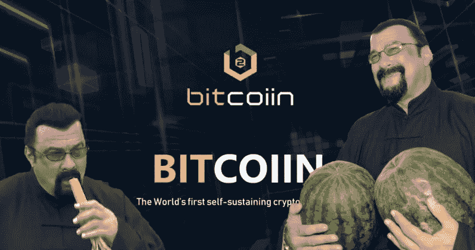

Last one..I promise…I don’t even know if this is real…but FML…

## 注意:

读完这篇文章后，有些人可能会把我理解为“比特币最大化主义者”,而且…..这部分是对的:

谈到钱，我感兴趣的是最分散的， ***防审查*** *价值的储存和随后作为交换媒介的机会，这将形成未来价值衡量和转移的基础。*

目前，根据我多年来所做的研究——不仅仅是对区块链的研究，还包括对社会进化、货币史、人类史等的研究——比特币遥遥领先于其他货币，是最有可能成功的货币。

*比特币的价值主张(还)不是数字货币——现有货币的 90%已经作为数字货币存在；比特币的价值主张是其保证数字货币可信度的方法。*

我认为，对于不同的用例，不同的协议集是可以优化的——这在我看来是一个好主意，即:使用工作中最好的工具。这很可能会发生。比特币应该做 SoV +货币+储备资产层/安全全球网络，做到最好。(不管怎么说，这是最有争议的，所以这是一个需要解决的大问题)。

最后，我想说明的是，我写这篇文章的目的是展示我目前为止得出的结论，这些结论是基于我设法获得和提炼的。我相信还会有更多，随着事情的进展，我的观点也会如此。

*请注意，这可能会持续很长时间，但鉴于我要建立一家公司，我需要去做一些工作，所以:*

无论你是通过我参与的应用在 [www.getamber.io](http://www.getamber.io) 还是其他任何交易所购买一些比特币，都无关紧要。

重要的是我们采用这种新技术，并把它传播出去。

买点比特币。成为一个用户，成为一个“节点”——网络将会以我们任何人都无法想象的速度增长。

谢谢你。

___________________________________________________________________

# 关于作者

可能和大多数密码狂热者一样，我与一堆事情有关，尽管我的核心项目是建立澳大利亚第一个*真正的*加密货币&令牌化资产的备用零钱交易所，其目的是让更多人参与进来(采用)。

您可以在此找到更多信息:

[www.getamber.io](http://www.getamber.io)

我也阅读…很多。

我有时间就写作。我还有另外 30 篇写了一半的文章，很快就会完成，我还有一篇爆炸性的文章，从去年开始就在准备中，我应该赶快发布，因为它会很好地从贾科莫·祖科最近的推特风暴 re: Bitcoin/BCash:

如果你想和我联系，我在 LinkedIn 和 Twitter 上(我可能应该开始更多地使用它们)，如果你在 Medium +上关注我并分享这篇文章，我会非常感激(一些掌声也很好)。

享受这个？

 [## tippin.me

### 使用闪电网络和比特币，通过网络收取小额小费和微支付的简单方法。

tippin.me](https://tippin.me/@AleksSvetski)  [## 亚历山大·斯维特斯基|职业简介| LinkedIn

### 查看 Aleksandar Svetski 在 LinkedIn 上的职业简介。LinkedIn 是世界上最大的商业网络，帮助…

www.linkedin.com](https://www.linkedin.com/in/alekssvetski/)  [## 亚历山大·斯维茨基—中等

### 阅读亚历山大·斯韦茨基在媒介上的作品。试图“思考”的企业家。我所有东西的出口加密…

medium.com](/@AleksandarSvetski)  [## 亚历山大·斯维茨基(@亚历山大·斯维茨基)|推特

### Aleksandar Svetski 的最新推文(@AleksSvetski)。CEO @ Valley Iconic。澳大利亚

twitter.com](https://twitter.com/AleksSvetski) 

___________________________________________________________________

# 资源和参考:

https://en.wikipedia.org/wiki/Dunbar%27s_number

[https://medium . com/block channel/cryptoeconomic-theory-basics-of-social-order-2 be 4c 1 be 89 c 1](/blockchannel/cryptoeconomic-theory-basics-of-social-order-2be4c1be89c1)

[http://humanscience.wikia.com/wiki/Worst_Predictions](http://humanscience.wikia.com/wiki/Worst_Predictions)

智人；尤瓦尔·诺亚·哈拉里

安德烈亚斯·m·安东诺普洛斯的所有书籍，以及数百个他的视频。

这些年来我从上面列出的所有名字中读到的内容，你也应该关注。

我最近读到的几篇相关文章:

 [## 为什么比特币与众不同

### 如果你是比特币领域的新手，那么过去的几个月相当疯狂。有一些陡峭的攀登和…

medium.com](/@jimmysong/why-bitcoin-is-different-e17b813fd947)  [## 尤瓦尔·赫拉利论历史知识的悖论和历史的真实价值

### 我犯了一个可怕的错误。

medium.com](/the-polymath-project/yuval-harari-on-the-paradox-of-historical-knowledge-and-the-real-value-of-history-5aa5330dceb2)  [## 二十世纪的货币政策灾难

### 美国联邦储备系统创建于 1913 年，很快就做了央行几乎总是做的事情:它开始印刷…

fee.org](https://fee.org/articles/monetary-policy-disasters-of-the-twentieth-century/) 

在《为什么比特币与众不同》一书中，[吉米·宋](https://medium.com/u/4acb12744ff8?source=post_page-----33f69701de--------------------------------)完美地总结道:

“比特币将继续与众不同，因为不同于集中式硬币，它是由市场驱动的，不可改变，不可分割。这些恰好是巨大的价值储存手段的属性，这赋予了比特币一种其他代币所不具备的效用”。

还有一个重要的区别:

“集中化对企业来说当然是一件好事，因为他们经常试图通过向客户提供一些商品或服务来盈利。集中化的企业可以更好地响应市场需求，改变他们的销售以获得更好的利润”

哦，是的…这是我几个月前做的那个演讲的链接..不是我最好的一个小时…但是，嘿…我想有几点是可以理解的:

 [## 比特币黑客&思想者-黑客正午

### 比特币是一种世界性的加密货币和数字支付系统。这是第一种分散的数字货币。的…

hackernoon.com](https://hackernoon.com/bitcoin/home)