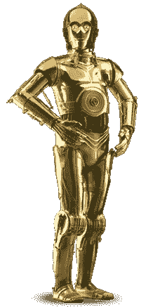
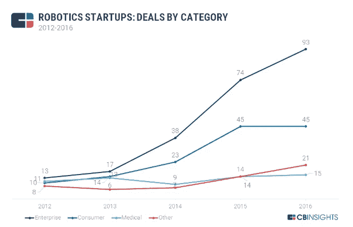
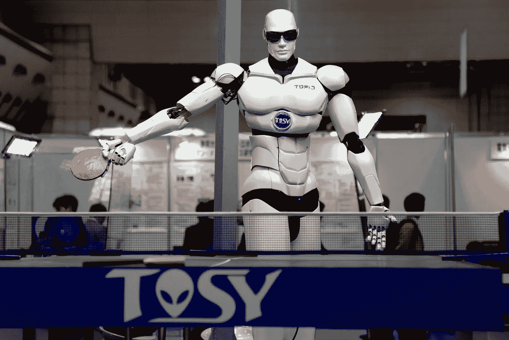

# 亲爱的。人形机器人在这里

> 原文：<https://medium.com/hackernoon/honey-the-humanoids-are-here-e392593cf552>

## 看一看有着人类面孔的数字助理

Photo by [Rock’n Roll Monkey](https://unsplash.com/photos/R4WCbazrD1g?utm_source=unsplash&utm_medium=referral&utm_content=creditCopyText) on [Unsplash](https://unsplash.com/search/photos/robot?utm_source=unsplash&utm_medium=referral&utm_content=creditCopyText)

> 整个历史的进程不是经验的对象；历史没有艾多斯，因为历史的进程延伸到未知的未来。”—艾里科·弗格林

简单来说，我们是我们的智力(由智商衡量)和情感(由情商衡量)的结合体。我之所以说粗略，是因为智商和情商是捕捉我们人性有限一面的公式。另一方面，我们有一个理解最少的概念——意识。但是，没有情商，很难想象 AI 会一天比一天更像人。这篇文章着眼于不同的企业如何忙着给人工智能戴上人类的面具，以使机器人在真实的人看来更自然。虽然人工智能正在经历人类的转变，但它也在改变客户的体验，并每天提高客户的期望。这篇文章着眼于人工智能的进化，并以提出一个更大的问题作为结尾:类人机器人只是通往机器人镇的高速公路上的另一块里程碑吗？

C 3po, Star Wars — By Source ([WP:NFCC#4](https://en.wikipedia.org/w/index.php?curid=39228240)), Fair use

艺术总是模仿生活吗？很大程度上，是的。然而，生活如何模仿科幻小说几乎是不可思议的。如果你和我一样是《星球大战》的粉丝，你会想像 R2·D2 和 C 3po 这样的机器人(顺便说一下,“机器人”这个词是卢卡斯影业的注册商标)什么时候会成为现实？你猜怎么着，那个时候到了。

一场旅程从制作自动化日常任务的软件开始，然后转移到聊天机器人和数字助理，如 Siri、Alexa 和 Cortana，现在正进入下一个阶段，即用人类面具伪装人工智能。后果很容易理解——拥有人类面孔的人工智能可以更快地做人类今天所做的一切。换句话说，人形机器人的市场是无限的。尽管这项技术仍处于早期阶段，但它的潜力是巨大的。

# 从电话上的人类到视频上看起来像人类的机器

起初，有全球化。金融服务界和商界普遍利用发达国家和发展中国家的劳动力市场经济，将联络中心外包给像印度这样成本低廉的英语国家。信息技术支持服务(ITeS)成为印度的主要增长引擎，就像外包制造业成为中国的增长引擎一样。这种情况一直持续到工资差距缩小到外包不再那么明显的程度。然后开始寻找像菲律宾这样说英语的小国。菲律宾现在在英语联络中心方面处于世界领先地位。

今天，机器学习和人工智能(ML&AI)正在经历一场新的复兴，自动化正在取代外包经济学不再具有吸引力的领域。机器人过程自动化(RPA)已经自动化了许多日常批量工作，先进的 ML 和 AI 算法将继续消耗更高阶的人类工作，从而解放人类，使其更具创造力。从无人机到医疗机器人，机器人正在慢慢承担越来越多的工作。不要误解我——外包仍然是一个庞大的行业。只是一系列替代方案已经扩展到包括人工智能。类人型机器人将在商业领域取代人类劳动方面发挥关键作用。

# 伙计，有多少机器人？

机器人这个词来自捷克语单词*‘robota’*，意思是强迫劳动。这个术语第一次出现在 k .恰佩克的戏剧 *R.U.R.* 《罗森的通用机器人》(1920)中。然而，有许多与机器人相关的同义词。机器人是一个更广泛的术语，包括长得像人的机器人和长得不像人的机器人。机器人是具有人类外表的机器人。机器人是一种人形机器人，但并不是所有的人形机器人都是机器人。人形是一个更广泛的术语。也许，最好的描述方式是当机器人的外表是一个人的形式。此外，还有控制论有机体，即植入了芯片的人类。换句话说，生物组织和芯片融合了。首先，让我们看看纯机器人。句号。他们可能看起来不像人类。这些机器人中最广泛的一类是机器人宠物或机器人真空吸尘器。

Sony aibo (source: wikimedia commons)

比如机械机器狗——艾博(索尼制造)。这是人工智能应用于室内娱乐的一个例子。2017 年，[索尼](https://www.sony.net/SonyInfo/News/Press/201711/17-105E/index.html)发布了新版本的艾博，拥有一系列新功能，包括与其所有者建立联系，并随着时间的推移而成熟。机器人也可以指没有形式的深度学习算法。它们只是存在电脑里。比如 [DeepMind 的](https://deepmind.com/)著名机器人——在中国围棋比赛中打败一个人类的 [AlphaGo](https://deepmind.com/research/alphago/) 。

Demis Hassabis, Founder of Deep Mind

此外，机器人可以只是软件代码的一部分，自动化人工任务，如客户订单处理，会计对账，库存管理等。

# 人形机器人

索尼随后推出了 Qrio ( **Q** uest 为 cu **RIO** sity】)，这是一款用于娱乐目的的两足人形机器人。然而，索尼从未出售过 Qrio。它只是把它推向市场。2015 年 5 月， [Musio](https://en.wikipedia.org/wiki/Musio) (一个人形机器人)由 AKA intelligence 在 Indiegogo 上推出。Musio 可以与人交谈，理解面部表情，并帮助人们学习英语。

TOPIO By Humanrobo — Own work, CC BY-SA 3.0, [https://commons.wikimedia.org/w/index.php?curid=18947366](https://commons.wikimedia.org/w/index.php?curid=18947366)

从 2008 年到今天，在不同的时间点推出了许多其他的人形机器人:韩国人形机器人[胡博](https://en.wikipedia.org/wiki/HUBO)，印度机器人 [Manav](https://en.wikipedia.org/wiki/Manav_(robot)) ，西班牙人形机器人 [REEM](https://en.wikipedia.org/wiki/REEM) ，越南乒乓球机器人 [TOPIO](https://en.wikipedia.org/wiki/TOPIO) ，法国建造的 NAO 于 2015 年被[软银集团](https://en.wikipedia.org/wiki/SoftBank_Group)收购。

由大阪大学开发并由 Kokoro 有限公司制造的 [Actroid](https://en.wikipedia.org/wiki/Actroid) 是一个类似日本年轻女性的人形机器人。首次亮相的第一个类人机器人是由汉森机器人公司创造的机器人，名为[‘索菲亚’](http://www.hansonrobotics.com/robot/sophia/)。索菲娅是现代类人机器人中的一员，它能以越来越多的能力与人互动。

The humanoid Sofia with her creator David Hanson -Source: [Sazzad Hossain](https://commons.wikimedia.org/wiki/User:SazzadHossain)

索菲亚于 2016 年在西南偏南大会上首次亮相。同样，索菲亚和好莱坞之间的联系就像 R2D2 和好莱坞之间的联系一样。索菲亚由前华特迪士尼幻想工程设计师大卫·汉森设计。

在金融服务领域，许多简单的任务，如询问账号、银行代号和其他日常细节，可以很容易地委托给类人机器人。例如，ANZ 银行已经在使用一个名为“杰米”的人形机器人来回答基本的客户询问。这个人形机器人是由位于新西兰奥克兰的一家名为[灵魂机器的公司开发的。它的网站上说:](https://www.soulmachines.com/https://www.soulmachines.com/)

"*我们将技术带入生活，创造出令人难以置信的栩栩如生、情感反应灵敏的人造人，这些人造人具有允许机器与我们面对面交谈的个性和特征！*

*我们的愿景是让人工智能人性化，以更好地造福人类。”*

Jamie by Soul Machines on Youtube

此外，大阪大学智能机器人实验室主任石黑浩创造了日本第一位人形新闻主播——[艾丽卡](https://www.livescience.com/61575-erica-robot-replace-japanese-news-anchor.html)。欧盟创造了一个名为 [iCub](http://www.icub.org/) 的一米高机器人——一个开源的认知人形机器人平台。

[软银的](https://group.softbank/en/)系列机器人包括 Pepper(一种具有理解人类独特品质的人形机器人，可以部署在企业或家庭中使用)、NAO(与 Pepper 一起可以用于创造独特的教育和研究体验)和 [Romeo](https://www.softbankrobotics.com/emea/en/robots/romeo) (一种用于帮助老年人的机器人)。

健五郎是一个非常独特的会流汗的机器人。由日本研究人员开发的 Kengoro 利用汗水冷却电机，而不使用散热器。

Kengoro On Youtube

就我个人而言，我和[吉姆](https://ubtrobot.com/collections/jimu-robots)玩过很多次——这是一个由 UBTech 设计的机器人，以有趣的方式促进 STEM 教育。然而，UBTech 拥有一系列机器人，包括人形机器人 [Alpha 1 Pro](https://ubtrobot.com/pages/alpha) 。从一般学习的角度来看，我发现制造一个机器人令人难以置信地满足。我最大的收获是努力让自己不断更新世界上令人眼花缭乱的技术。人们会认为世界上的某些经济体会关注机器人技术。或许，那些人口老龄化的国家迫切需要这样做。但是，你可以从上面的事实推断出，人形机器人无处不在。也许，你不久会邀请一个人到你家吃饭。

# 解围的人或事件

未来，奇点(计算机超越人类智能的临界点)将要求将生物组织与芯片融合，创造出控制生物体或电子人，这种可能性似乎越来越大。虽然，谁也说不准什么时候。基因工程等各种指数级技术正在重塑智人这一物种。人工智能就是这样一种技术。科幻小说和好莱坞中有许多具有人类面孔的机器人，例如《终结者》系列、《机械战警》系列、《异形盟约》中的机器人大卫(由迈克尔·法斯宾德饰演)、《Ex 玛奇纳》中的艾娃(由艾丽西卡·维坎德饰演)等。这些机器人有一个好的版本和一个坏的版本。每一个场景都给我们带来一个永恒的问题:AI 会不会变流氓？如果是这样，我们如何应对和克服它。当然，反乌托邦的观点将是世界末日的场景。然而，更乐观的场景是我们创造传奇的艺术作品。在人工智能的帮助下，艺术可以民主化，太空旅行将不再是现实。人形机器人将成为完美的伴侣，甚至是抗抑郁药的解毒剂。我们谁也不知道未来，但终身学习已经成为我们在应对变革浪潮和尽可能控制未来时需要掌握的一项重要技能。现在，我把我最喜欢的作家之一拉尔夫·沃尔多·爱默生的话留给你们:

> “把握当下，在每一步中寻找旅程的终点，最大限度地享受美好时光，这就是智慧”

参考资料:

1.  机器人连线指南:【https://www.wired.com/story/wired-guide-to-robots/ 
2.  关于机器人对未来工作意味着什么的世界经济论坛:[https://www . we Forum . org/agenda/2018/01/heres-What-robots-Mean-the-Future-of-Work](https://www.weforum.org/agenda/2018/01/heres-what-robots-mean-for-the-future-of-work)