# 在 Microsoft Azure 中托管方舟节点

> 原文：<https://medium.com/hackernoon/hosting-ark-node-s-in-microsoft-azure-71ae880f0b12>

## 带模板部署演练

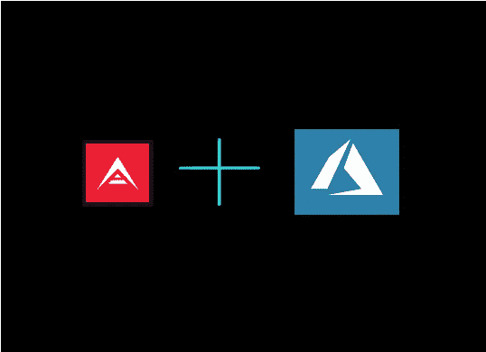

有很多关于如何创建[方舟节点](https://blog.ark.io/how-to-setup-a-node-for-ark-and-a-basic-cheat-sheet-4f82910719da)、[保护您的节点](https://blog.ark.io/how-to-secure-your-ark-node-541254028616)、以及[方舟统计](/@jarunik/installing-and-managing-an-ark-node-577a9074b9bb)汇编的指南。

专业人士在上面的链接中已经详细描述了这些任务，与其一个接一个地进行，我更想把重点放在服务器所在的*。*

*大多数指南都让您使用便宜的 DigitalOcean droplet，或其他一些 5 美元的服务器。虽然经济实惠，但在这一点上肯定不符合方舟的最低要求。通过改用 Azure，您可以使虚拟机高度可用、可扩展，并且可以通过门户网站上的模板轻松复制。通过使用该平台，还可以实现 PowerShell 自动化功能。*

***我们将执行以下操作:** 创建 Azure 门户/资源管理器登录
部署我们的第一台虚拟机
—创建新的“资源组”
—配置 Azure 防火墙(“网络安全组”)
使用第一台虚拟机创建模板
通过该模板部署另一台方舟节点虚拟机，并与第一台虚拟机加入“可用性集”*

***运行 Ark 节点的最低要求，根据 Ark.io 文档:** 操作系统:Ubuntu 16.04
CPU: 1 核(越多越好)
RAM: 4GB(越多越好)
磁盘:20GB —推荐 SSD*

*一些接近这些要求的 Azure 尺寸快速细分可在以下网站找到:https://azure.microsoft.com/en-us/pricing/calculator/*

***让我们从基础开始。**我们将登录@[HTTPS://portal.azure.com](HTTPS://portal.azure.com)——如果需要创建帐户，请使用信用卡进行试用。如果您有一个现有的 MSDN 账户，还有每月 150 美元的开发者计划福利。*

*登录 Azure 资源管理器仪表板后，单击“+新建”，它将打开一个选项“刀片”。
—我们将使用日益流行的 **Ubuntu Server 16.04 LTS 虚拟机**(长期服务分支虚拟机)*

*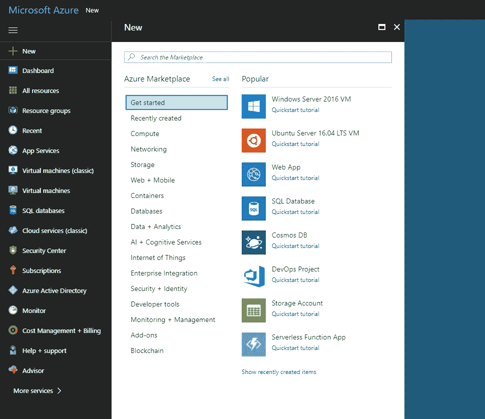*

*+ New -> Search for Ubuntu 16.04 OR click on the quickstart tile*

*一旦您选择/找到 Ubuntu 16.04 LTS 虚拟机，点击它，它将打开创建步骤。*

*如果您对 SSH 认证有信心，请放心使用该虚拟机。如果你不熟悉，没有很好的理解，你可以在这里阅读:[https://help.ubuntu.com/community/SSH/OpenSSH/Keys](https://help.ubuntu.com/community/SSH/OpenSSH/Keys)*

 *[## SSH/OpenSSH/Keys -社区帮助 Wiki

### 对于大多数人来说，公钥认证是比密码好得多的解决方案。事实上，如果你不介意离开…

help.ubuntu.com](https://help.ubuntu.com/community/SSH/OpenSSH/Keys)* 

*为了便于跟踪，我们将坚持使用基于密码的认证。我们还将创建一个新的“资源组”，这是一种 Azure 资源容器。所有彼此相关的项目，在这个实例中是 Ark，都将被添加到这个资源组中。将来，我们可以很容易地找到并管理我们正在制作的所有这些相互关联的项目。*

*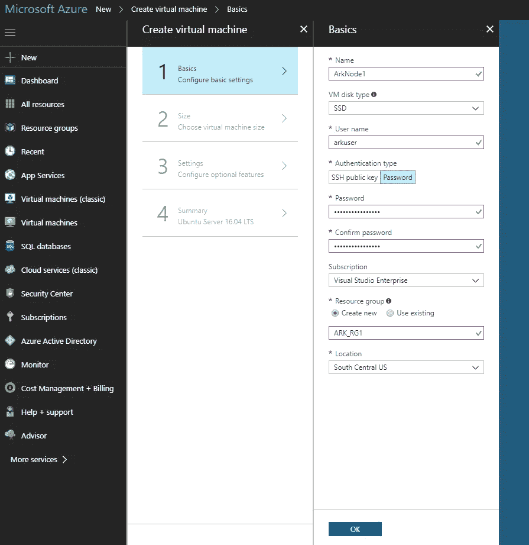*

*General Configuration Settings to Follow*

***这里要注意的重要部分**是**磁盘类型**(默认为 SSD)，非 root 用户名，以及**资源组**。在这里，我们为所有 Ark 节点创建了一个全新的**资源组，命名为 ARK_RG1** 。列出的位置是虚拟机、存储和虚拟网络的存放位置，可以从一个分组进行管理。*

*点击下一步，你将被要求选择一个机器的大小(基本上是你想花费多少与资源分配)。*

*您有几个选项来满足系统要求，这取决于您希望如何进行。一个好的经验法则是从低开始，根据需要增加资源。虽然“纵向扩展”时确实需要重新启动，但从较小的规模开始无疑更具成本效益。*

*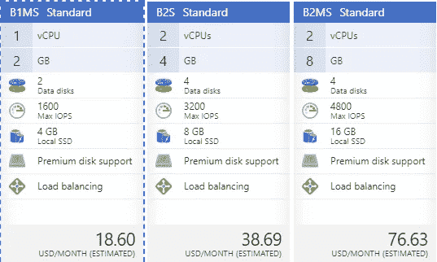*

*All pricing and availability for this guide is based on US South Central region for Azure (May vary between datacenters)*

*我将为该指南推出“B1MS 标准”大小的虚拟机。如果我加入节点网络，并且我的节点开始落后，我可以通过快速点击几下并重新启动，轻松地“扩展”到其他虚拟机性能级别。*

*单击**选择**继续您的虚拟机大小选择。接下来是可选功能配置部分。**我将逐一介绍每一部分，因为它们都有自己的“设置之刃”**:*

***高可用性:**点击+“新建”
— **名称:**易于识别的东西
— **故障域**(同一故障域中的虚拟机共享一个公共电源和物理网络交换机。):最少 2 个
— **更新域:**(在计划维护期间，同一更新域中的虚拟机将一起重启。Azure 从不一次重启多个更新域。):横向扩展建议 5*

*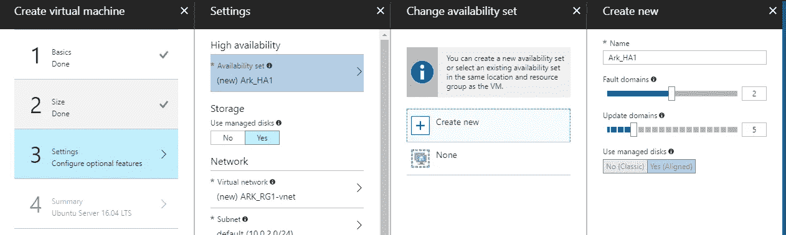*

*Picture of Settings for High Availability*

***存储—被管理的磁盘？是的***

***网络:
—虚拟网络:** +“新建”
— —默认即可，除非您在此子网中运行超过 256 台服务器，或者有一个特殊/不同的名称。*

***—** **子网:**默认就可以了，除非你在这个子网中运行超过 256 台服务器或者有一个特殊/不同的名字。*

***—公共 IP 地址:** +“新建”
———默认名称即可。分配=动态(如果需要，可以在以后更改)。意味着它没有静态 IP 地址。*

***—网络安全组(防火墙):**这是我们为您的资源设置 Azure 防火墙的地方。这将是位于虚拟机前面的防火墙。
— —默认:默认允许 ssh 设置为端口 22。如果您希望将 SSH 端口更改为自定义端口，这可以随时更改。(到达后请参阅 Ark 安装端口建议)
→单击+添加入站规则
→单击“高级”并输入设置:
源:任何*(如果您想根据入站的 public-ip 地址限制访问，可以更改此设置)*
源端口范围:*
目的地:任何(也可以更改)
目的地端口范围:4001–4002(Ark 端口)
协议:TCP
操作:允许【T23*

***扩展:**无*

***自动关机:**关*

***监控:
—** 引导诊断:关闭(除非您开始遇到引导问题，否则可以稍后打开)
—客户操作系统诊断:关闭*(如果需要，可以稍后打开)**

***点击“下一步”进入总结页面。***

*下一页验证您到目前为止所做的一切都可以安全部署。它还列出了您已经配置的所有内容，最重要的是，它允许您下载模板和参数，以便在将来更快地进行部署。*

*点击**“下载模板和参数”**，得到模板文件的 ZIP 文件。您可以选择通过单击“添加到库”将此新模板添加到您的“模板库”*

*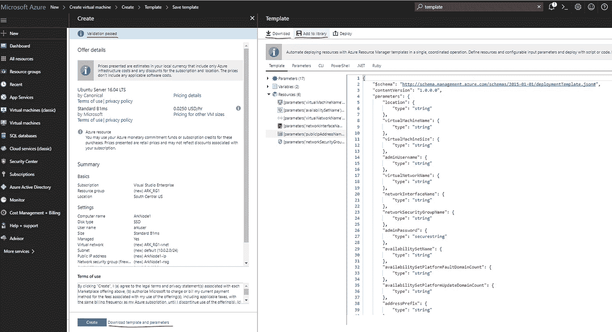*

*Summary Screen and Template download options*

*通过单击“添加到库”，您将需要命名模板，并留下部署的详细描述。*

*保存完模板后，**从我们原始部署的“摘要”部分单击“创建”**。这个**将在 Azure 中创建第一个虚拟机**。*

*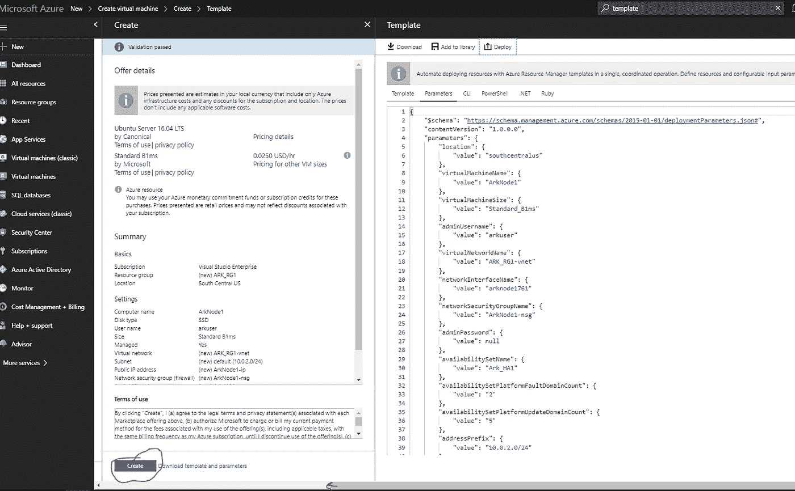*

*Create Button*

*在您的服务器完全部署之前，大约需要 5 分钟。*

*要查看您的虚拟机/资源组，请导航到资源组> ARK_RG1
—在这里，您将能够查看所有存储组、虚拟机、防火墙(NSG)设置和可用性集。*

*单击您的虚拟机，在资源组 ARK_RG1 中我的实例“ArkNode1”*

*我们希望为此虚拟机设置一个 DNS 地址，以便您可以使用动态 DNS 名称而不是静态 IP 进行连接。单击虚拟机概述中“DNS 名称”下的“配置”。*

*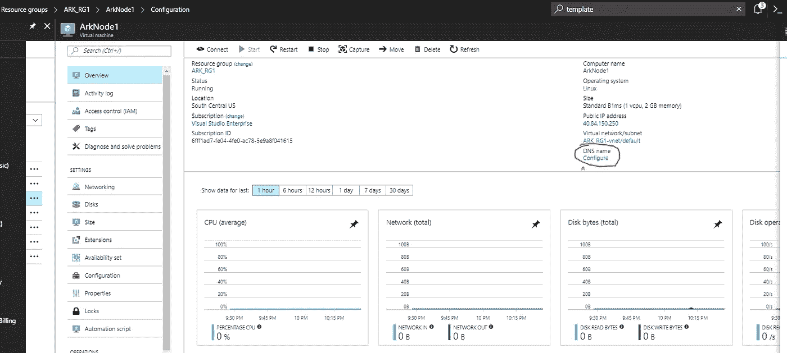*

*DNS Menu in the VM ‘Blade’*

*请随意设置 DNS 名称。为了便于记忆，我将其命名为与 VM 本身相同的名称。*

*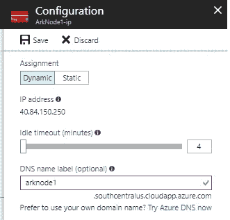*

*The DNS Name will be whatever you choose + The Azure Cloudapp domain for your datacenter location*

*这意味着，当使用 PuTTY 连接到这个虚拟机时，您可以使用 DNS 名称:arknode1.southcentralus.cloudapp.azure.com*

*这是由 Azure 的后端动态更新的 DNS，所以如果你的 VM 动态改变公共 IP，你也不需要自己设置。*

*这意味着，当使用 PuTTY 连接到这个虚拟机时，您可以使用 DNS 名称:arknode1.southcentralus.cloudapp.azure.com*

***或者，**您可以选择“静态”IP，但是静态 IP 和动态 IP 每月都有费用。*

*在我们开始任何种类的 Ark 节点配置之前，不幸的是，目前还不容易实现自动化，让我们执行第二个 VM 到这个可用性组的模板部署。通过学习这项技能，您可以快速部署任意数量的额外虚拟机，而无需调整第一次部署时的所有细节。*

*在 Azure 搜索面板中，键入“模板”并选择“模板(预览)”*

*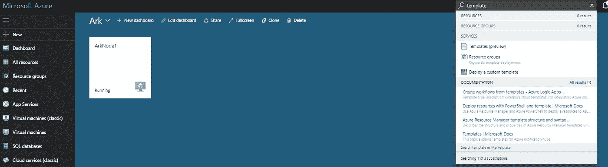*

*Searching in Azure for Templates (Preview)*

*选择你之前创建并保存到你的模板库中的模板，我将我的命名为“ark_node_template”，它将打开它。*

*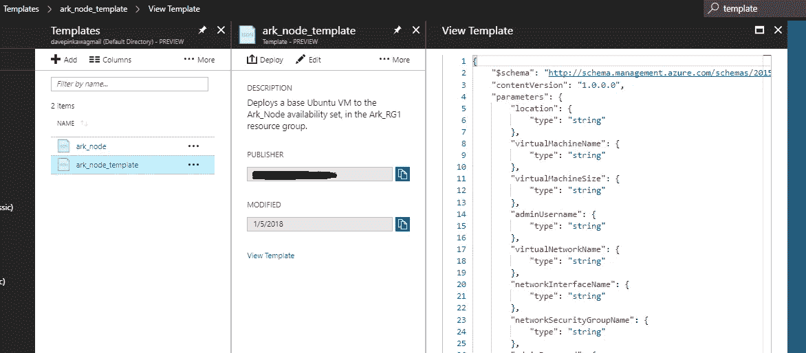*

*All settings preserved, nice!*

***点击【部署】**弹出新模板部署需要设置的参数。它们最初都是空白的。*

*要用旧虚拟机的数据填充这些值，并进行必要的细微调整，请执行以下操作:*

*点击“编辑参数”,调出编辑背景数据的选项。*

*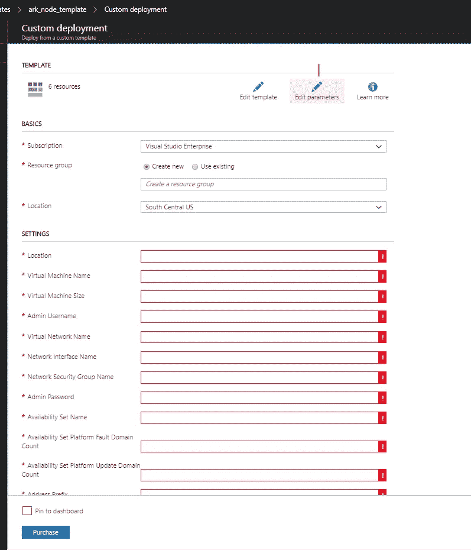*

*使用之前下载的 ZIP 文件，您需要将该文件解压缩到您计算机上的某个位置，单击“编辑参数”页面上的“加载文件”。*

*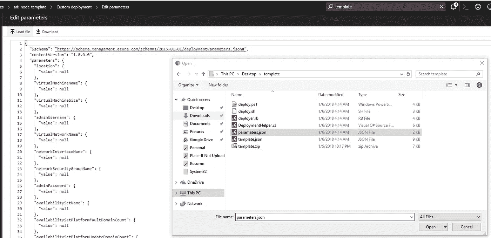*

*“Load file” in top-left opens up the file explorer*

*在上传参数 JSON 文件之后，单击“Save ”,它将带您回到现在已经完全填充的部署信息集。*

***有几个字段需要调整**，请务必根据需要填写/调整。对我来说，以下需要调整:*

*资源组—设置为 ARK_RG1
虚拟机名称— ArkNode2(新虚拟机名称)
网络接口名称— arknode1762(虚拟机的新网络接口)
管理员密码— <相应设置>
public IP address Name—ARK node 2-IP(该虚拟机的新/独立公共 IP)
—side 注意:您还需要进入虚拟机并为此设置 DNS 地址。*

*参数列表中的所有其他项目保持相同是安全的，因为它们是可重用的和重叠的。*

*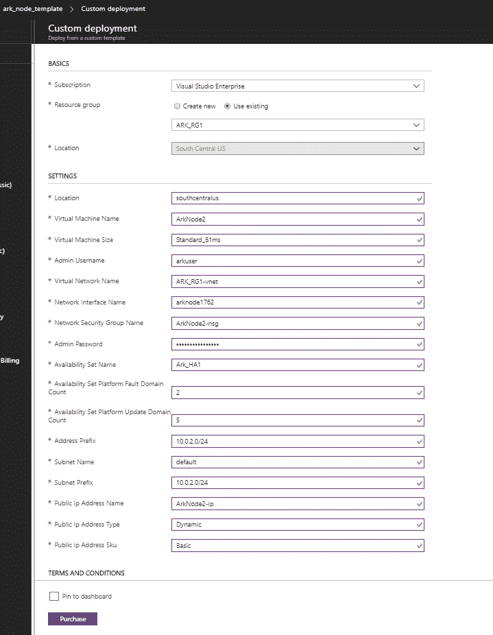*

*单击“同意”和“购买”开始部署这个新虚拟机。*

*在通常的 5 分钟左右之后，它应该会成功结束。继续从资源组中的设备页面仔细检查虚拟机设置。*

*现在，您可以使用在配置步骤中分配/创建的登录名和密码，通过 PuTTY 自由连接到您的两个虚拟机。*

*还可以部署尽可能多的虚拟机，而不仅仅是 Ark 相关的应用程序。对于 Azure 中的任何 VM 场来说，这都是一个相当普通的设置。*

*通过将两个虚拟机放入一个具有 2 个容错域的高可用性集中，我们可以保证 Azure 在其数据中心发生任何形式的停机时，至少有一台服务器 99.99%的正常运行时间。*

*我将通过 Ansible 为 Ark 的设置和配置更新指南。这样，可以针对多个服务器同时调用命令，这样我们就可以配置 Ark 节点，而不用一直坐在控制台前。(当那篇文章完成后，我会更新这篇文章)*

***好资源/参考:***

*Ark.io 节点的设置:[https://blog . ark . io/how-to-setup-a-node-for-ark-a-basic-cheat-sheet-4f 82910719 da](https://blog.ark.io/how-to-setup-a-node-for-ark-and-a-basic-cheat-sheet-4f82910719da)*

*保护你的节点:[https://blog . ark . io/how-to-secure-your-ark-node-541254028616](https://blog.ark.io/how-to-secure-your-ark-node-541254028616)*

*Jarunik 快速配置方舟节点:[https://medium . com/@ Jarunik/installing-and-managing-an-Ark-Node-577 a 9074 b9bb](/@jarunik/installing-and-managing-an-ark-node-577a9074b9bb)*