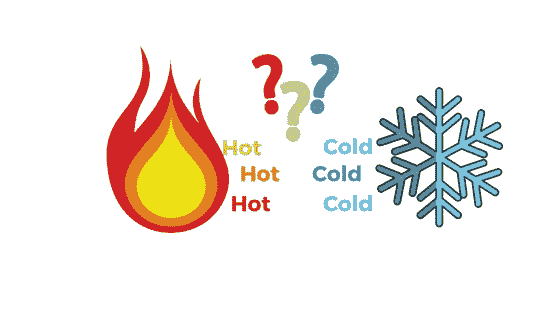
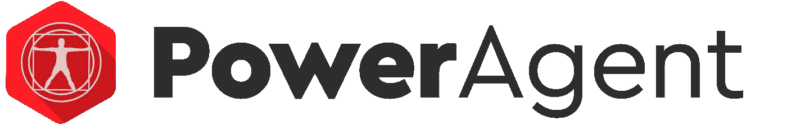
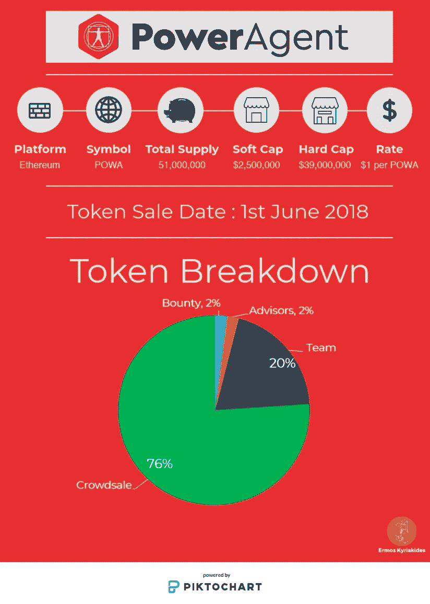

# 热或冷:PowerAgent ICO

> 原文：<https://medium.com/hackernoon/hot-or-cold-poweragent-ico-bc2dd9577793>

我之前的博客文章标志着我的新博客系列 ***“热或冷 ICO 评论”*** 的发布，其中包括[**we mark**](https://tge.wemark.com/?utm_source=tge&utm_medium=ekm)——一个基于区块链的数字内容市场，你可以在这里找到。作为后续，我将讨论将于 6 月 1 日**发布的**power agent**ICO。**

Hot or Cold?

# 价值主张

> [**PowerAgent**](https://www.poweragent.io/) 是一个数字合同平台，用于创建、管理、跟踪和保护职业运动员合同。该平台允许对智能合同编程一无所知的用户创建可执行的数字协议。
> 
> 它将体育俱乐部和运动员之间的运动员合同谈判和协议中涉及的所有各方联系起来，并记录从部署到付款的整个合同流程，以一目了然的用户友好界面显示，并保证在所有合同协议都得到满足时自动付款。

[**power agent**](https://www.poweragent.io/)**是一个面向体育俱乐部、运动员和管理者的**区块链 powered platform** 。它将提供各种**智能合同模板**，并使平台用户能够创建他们自己的模板，他们可以在**市场**上出售这些模板。这种模板的例子可以是专业服务合同、背书合同、外观合同等等。本质上，[**power agent**](https://www.poweragent.io/)**将授权各方创建、管理、跟踪和完成一份协议，该协议将具有*“具有法律约束力的合同效力”*(稍后将详细介绍)*。*****

****[**power agent**](https://www.poweragent.io/)**将基于*“私人许可的 Hyperledger 区块链”，*然而，关于他们为什么决定走这条路线的细节却不得而知*。*******

******该平台的用户注册后将收到一份数字档案。这些档案必须由一个 **PowerAgent 合作伙伴**验证**K**now**Y**our**C**客户 **KYC** 。根据[**power agent**](https://www.poweragent.io/)***“一个经过验证的数字平台将是俱乐部能够在现实世界中开展业务的证据”*(稍后将详细介绍)。********

******不幸的是，我无法更深入地了解这个项目，因为他们的白皮书还没有发布。离他们的 ICO 不到一个月。就目前情况而言，手头有几个问题:******

*   ******尽管他们的网站声明智能合同具有法律约束力，但这是一个研究仍在进行的灰色地带。虽然这可能是未来的情况，但 Clifford Chance(世界十大律师事务所之一)认为，“智能合同解决方案尚未显著取代传统的签约方式，但这种情况必将改变。实施成熟的智能链解决方案的技术和法律障碍仍然令人望而生畏”。你可以在这里找到更多关于这件事的信息。******
*   ******引入一个将执行 KYC 检查的 **PowerAgent 伙伴**，使得平台**集中化**。**无法保证**执行这些检查的 **PowerAgent 合作伙伴**是公正的或完全透明的，这可能会导致运动员或体育俱乐部被错误地禁止进入平台。******
*   ****他们的网站只谈论智能合约的财务方面；没有提到智能合同的细节将如何处理。****

****不幸的是，有几个问号挥之不去，因为这是一个肯定可以使用区块链和加密货币进行翻新的行业——这是一个差距[**power agent**](https://www.poweragent.io/)**已经确定。******

# ******[PowerAgent](https://www.poweragent.io/) 令牌& ICO 概述******

******下面的图片提供了 ICO 的详细信息和一些关于 **PowerAgent 令牌**的信息。什么是 ICO，什么是总供应量等术语。可以在我以前的博文中找到，你可以在这里找到。******

********

****令牌细分看起来相当标准，但是，有一个很大的挥之不去的问题，我还没有找到答案…为什么他们有/需要 39，000，000 美元的硬性上限？****

# ****代币使用****

> ****任何想要使用数字验证、智能合约、加密货币企业服务和套利系统的参与者，都需要获得 **POWA** 令牌，并在平台上使用它们。 **POWA** 令牌也将是网络内支付交换的一种手段，当在平台内使用时，由于它没有任何交易费用，因此将受到青睐。****

****本质上， **PowerAgent 令牌** ( **POWA** )提供了**对平台服务**的访问，包括数字验证、智能合约的创建、企业服务等。此外，它将作为**货币**供参与者与*进行交易，并因其没有任何交易费用而受到青睐*。****

# ****团队和顾问****

****不幸的是，他们的网站上没有关于团队和/或顾问的详细信息。我唯一能找到的是，根据他们在 LinkedIn 上的简介，PowerAgent 似乎住在伦敦。****

****在我看来，这是一面**巨大的红旗**。如果团队和/或顾问在构建隐私币时保持匿名，这是可以理解的，但在这种情况下， [**PowerAgent**](https://www.poweragent.io/) 没有构建隐私币，因此**没有理由不披露他们的团队和顾问**。****

# ****合作伙伴和投资者****

****我首先要指出的是，拥有合作伙伴或现有投资者并不一定会成就或破坏 ICO。有许多 ico 没有任何合作伙伴和/或投资者产生了非凡的业绩。得到资本主义者( **VC** )的支持，预示着快速而有利可图的增长潜力。****

****考虑到这一点，[**power agent**](https://www.poweragent.io/)**似乎没有任何合作伙伴或现有投资者。******

# ******裁决——热还是冷？******

******[**PowerAgent**](https://www.poweragent.io) 发现了市场中的一个缺口，这一缺口肯定会因区块链和加密货币的引入而发生革命性变化。然而，考虑到以上所有要点，在我看来，[**power agent**](https://www.poweragent.io)**有许多危险信号，使其成为值得(且安全)的投资。********

******我会将 **PowerAgent** 归类为:******

********

****Cold****

****[**PowerAgent 的**](https://www.poweragent.io) ICO 将于 6 月 1 日上线——如需了解更多信息和参与详情，请点击链接[此处](https://www.poweragent.io)。****

****在接下来的**《热或冷》**中给我留言或评论你想看到的 ico 吧！****

****一定要给帖子一个👏**拍手**👏如果你喜欢这篇文章并想看更多，请关注。****

********

****也可以捐款到以下地址以示支持:
**ETH**:0x4c 7195 e 074 cf 0 ab 6 f 77 BDB 7 c 97 FD 2567066 bb 712****

****免责声明:这篇博文中的所有信息和数据仅供参考。我的观点是我自己的。我不提供个人投资建议，我也不是合格的持牌投资顾问。我对任何信息的准确性、完整性、适用性或有效性不做任何陈述。我将不对任何错误，遗漏，或任何损失，或因其展示或使用引起的损害负责。所有信息均按原样提供，不含任何担保，也不授予任何权利。****