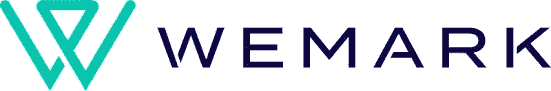
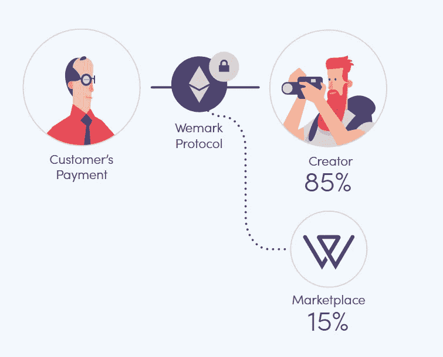
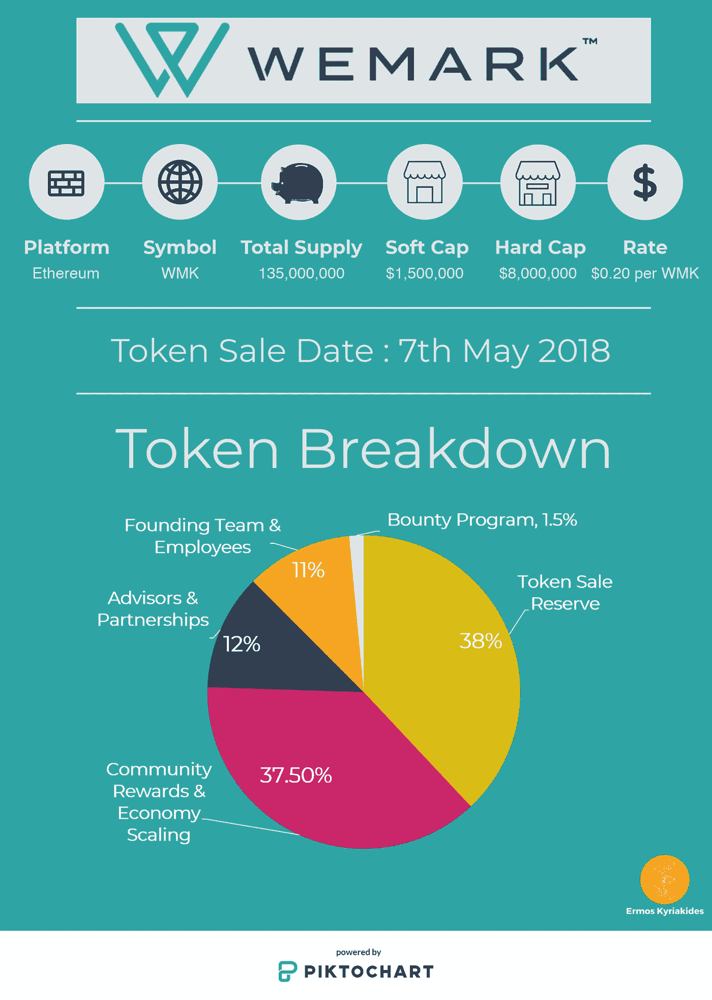

# 热或冷:Wemark ICO

> 原文：<https://medium.com/hackernoon/hot-or-not-wemark-an-ico-review-e0a9cdd6cce8>

> 在继续之前，我要再次感谢我的每一位读者和关注者，感谢他们对我的特殊支持，感谢他们让我在 [**【金融】**](/tag/finance)[**投资**](/tag/investing) 和 [**比特币**](/tag/bitcoin) 中成为一名**中型顶级作家。**

我很高兴地宣布，继大获成功的 ***“加密货币的真实世界应用”*** 系列之后，我将推出名为 ***“热门与否 ICO 回顾”*** 的新系列，届时我将回顾即将推出的 ICO。

在我新系列的第一篇文章中，我将回顾一下位于区块链的数字内容市场。

# 价值主张

> Wemark 正在开发一个基于区块链的数字内容分发系统，实现我们的“分布式市场”概念。分布式市场允许创建者将他们的内容直接授权给客户，让他们完全控制对其内容的权利。

换句话说，[**we mark**](https://tge.wemark.com/?utm_source=tge&utm_medium=ekm)**正在建立一个平台，这个平台将**赋予内容创作者**权力——不需要中间人。他们的第一个用例将是创建一个股票摄影市场；到 2020 年[将超过**40 亿美元**的行业。](http://www.selling-stock.com/Article/global-market-size-for-stock-images)**

**当前的集中式解决方案(Shutterstock、Getty Images 等)存在一些问题。).首先也是最重要的一点，大多数内容创作者都与代理机构合作，为了赚钱，他们不得不放弃对其内容的权利。第二，这些机构(和中央平台)从内容创作者那里拿走了一大笔提成(高达 85%)，留给他们的很少。不幸的是，由于没有足够的竞争，这个领域的玩家垄断了它，可以随心所欲。**

**[**Wemark**](https://tge.wemark.com/?utm_source=tge&utm_medium=ekm) 旨在通过**给予创作者权利和对其内容的控制权**以及**最小化费用**(目前提议的费用为 15%)来解决这一问题。**

> **客户将能够直接从主要摄影师那里获得策划的商业照片的许可。创新的发现、协作和监管工具还提高了客户查找和管理他们需要的内容的能力。**

****

**事实上，[**we mark**](https://tge.wemark.com/?utm_source=tge&utm_medium=ekm)****已经在几周前推出了**他们的股票摄影平台，拥有**超过 3000 名贡献者**和**40000 张照片**，其中包括一些业内领先的内容提供商。****

****这是一个肯定需要彻底改革的领域。我相信区块链和加密货币将能够彻底改变这个行业，因此 **Wemark** 有了一个良好的开端。****

# ****Wemark 令牌和 ICO 概述****

****在继续之前，我想弄清楚一些术语，以便每个人都能关注我的帖子。****

*   ******初始硬币发行(ICO)**—摘自维基百科:*ICO 是一种以加密货币为中心的众筹方式，可以成为创业公司的资本来源。在 ICO 中，一定数量的众筹加密货币以“代币”的形式出售给投资者，以换取法定货币或其他加密货币。*****
*   ******平台** —提供实用程序和功能来创建运行于其上的**D**e**App**应用程序(dapp)。Wemark 就是这种 dApp 的一个例子。****
*   ******符号** —令牌的唯一标识符。通常这在各个交易所、图表网站等都是一致的。****
*   ******总供应量** —将会存在的代币/硬币的总量。****
*   ******软上限**—ICO 需要筹集的最低金额。通常，如果没有达到软上限，ICO 将被取消，资金将被退还。****
*   ******硬上限**—ICO 将筹集的最大金额。一旦达到硬上限，ICO 将立即终止，并停止筹集更多资金。****
*   ******费率**—ICO 期间 1 个代币的费用。****

****下面的图片提供了 ICO 的详细信息和一些关于 **Wemark 令牌**的信息。为了参与，请点击链接[这里](https://tge.wemark.com/?utm_source=tge&utm_medium=ekm)。****

********

# ****代币使用****

> ******Wemark** 正在推出一种专用令牌，为数字内容的直接经济提供动力。we mark token(**WMK**)旨在作为网络的本地支付系统，奖励所有创建、分发和推广数字内容的相关方。****

****Wemark Token ( **WMK** )有一个非常简单易懂的用例；它将纯粹充当 Wemark 平台上的货币。****

****此外，由于创作者在 **WMK** 获得报酬，他们可能成为平台的既得利益者，因为随着 **Wemark 平台**被进一步采用，他们的收入可能会增加；比内容创作者目前与代理商的关系好得多。****

# ****团队和顾问****

****[**we mark**](https://tge.wemark.com/?utm_source=tge&utm_medium=ekm)**成立于 2015 年，总部位于美国旧金山**和以色列特拉维夫的**esearch**&D**development(R&D)办公室。Wemark 的创始人包括:**********

*   **[**Tai Kaish**](https://www.linkedin.com/in/taikaish/)**(CEO)——**进入数字营销领域已经超过十年。Underline 创始人、前 CEO 一家专门从事初创企业、以色列品牌和在线业务的数字营销机构(著名客户包括 Leumi Bank、Discount Bank、Weizmann Institute、TrustWare 和 Trump Foundation)。除全职工作外，Tai 还在 IDC Herzliya 国际学校担任营销和创业方面的客座讲师和导师。**
*   **[**Pavel El kind**](https://www.linkedin.com/in/devenv/)**(CTO)——**十多年的软件工程和管理经验。林库里前 R & D 总监；领导大约 20 名不同团队的员工。此外，帕维尔是 NFX 行会的成员；总部位于旧金山的种子和首轮风险投资公司。在此之前，他是以色列情报局 8200 部门的研发经理。**
*   **[**罗伊·梅洛姆**](https://www.linkedin.com/in/roymeirom/) **(业务发展副总裁)——**连续创业者，曾涉足多个不同的角色和行业，从创始人、董事、国际代表团协调员等等。**

**Wemark 拥有一个优秀的顾问委员会，由多个相关领域的行业专家组成。一些著名的顾问有: [**拉尔斯·帕金斯**](https://www.linkedin.com/in/larsperk/)**(Picasa 的前首席执行官&创始人，谷歌的董事) [**李·托伦斯**](https://www.linkedin.com/in/leetorrens/) (坎瓦的市场总监) [**迈克尔·c·莱塞**](https://www.linkedin.com/in/michaelclesser/)(Shutterstock 的前法律总顾问/副总裁) [**克伦·萨克斯**](https://www.linkedin.com/in/keren/)(Shutterstock 的前内容开发总监)。你可以在这里找到所有的。****

****尽管创始人**在这个领域没有任何经验**，但他们有着在各种行业建立和启动成功企业的**良好记录**。此外， **Wemark** 背后的顾问委员会将有助于抵消这一点，因为他们在这个领域是非常有名的。****

# ****合作伙伴和投资者****

****[**Wemark**](https://tge.wemark.com/?utm_source=tge&utm_medium=ekm) 已经获得**V**enture**C**a pital(**VC**)撑腰 [**萨罗纳风投**](http://www.sarona.vc/) 、 [**、NFX**](https://www.nfx.com/) 和 [**电梯**](http://www.elevatorfund.com/) 。这表明 Wemark 拥有快速盈利增长的巨大潜力，否则风投不会支持他们；一个重要的积极点。****

****他们也有合作关系，名字像 [GuruShots](https://gurushots.com/) 、 [Solume.io](https://solume.io/) 、 [Deloitte](https://www.deloitte.com/) 等等，但是这些合作关系的细节不得而知。****

# ****结论——热不热？****

****考虑到以上各点，在我看来，[**we mark**](https://tge.wemark.com/?utm_source=tge&utm_medium=ekm)**在识别当前数字内容贡献的集中方法的问题方面做得很好。将数字内容市场转移到去中心化的世界对创作者和消费者都有好处。创造者得到更大的份额，因此可以更积极地定价，这反过来有利于消费者。Wemark 团队和顾问看起来完全有能力渡过难关，并且已经获得了风投的支持，这给了潜在的 ICO 投资者进一步的成功信心。******

******我会把 [**Wemark**](https://tge.wemark.com/?utm_source=tge&utm_medium=ekm) :******

********

****Hot****

****[**Wemark 的**](https://tge.wemark.com/?utm_source=tge&utm_medium=ekm) ICO 将于 5 月 7 日上线——如需更多信息和参与详情，请点击此处的[链接](https://tge.wemark.com/)。****

****在接下来的**《热不热》**中给我留言或者留言你想看的 ico！****

****一定要给帖子一个👏**拍手**👏和我的博客 a **关注**如果你喜欢这篇文章并想看更多。****

********

****也可以捐款到以下地址以示支持:
**ETH**:0x4c 7195 e 074 cf 0 ab 6 f 77 BDB 7 c 97 FD 2567066 bb 712****

*****免责声明:这篇博文中的所有信息和数据仅供参考。我的观点是我自己的。我不提供个人投资建议，也不是合格的特许投资顾问*。*我不保证任何信息的准确性、完整性、适用性或有效性。我将不对任何错误，遗漏，或任何损失，或因其展示或使用引起的损害负责。所有信息均按原样提供，不含任何担保，也不授予任何权利。*****