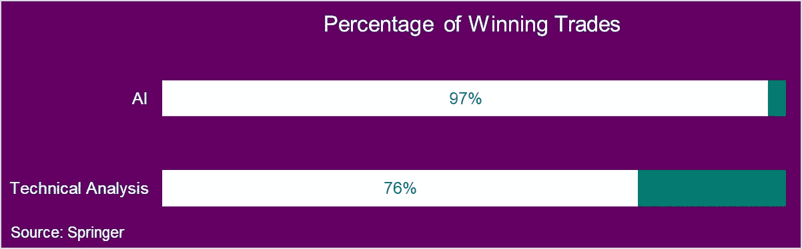

# 11 种趋势如何表明人工智能是加密货币交易的未来

> 原文：<https://medium.com/hackernoon/how-11-trends-indicate-that-ai-is-the-future-of-cryptocurrency-trading-a38c0437450d>

这 11 个理由都是基于真实的科学研究和学习，在这里浓缩和解读。人工智能和机器学习相对较新，但它已经席卷了金融和密码世界。

让我们开始吧。

## 排名第一的计算机算法已经产生了大部分交易

随着计算机稳步接管市场，与使用自主交易技能的交易员竞争变得越来越困难。因此，为了保持竞争力，快速决策是绝对必要的。

监管者和学者估计，计算机现在产生了大约 50 %- 70%的股票市场交易、60%的期货交易和 50%以上的国债交易。

> “机器学习和人工智能正越来越多地被用于分析数据、交易证券和提供投资建议。”**——密歇根法学院金融科技大会**

## #2 人工智能对于整理海量数字数据流至关重要

数字世界的规模每两年翻一番！

“人工智能是一个重要的，甚至是必要的工具，可以解析世界现在产生的大量数字数据。IDC 估计，到 2020 年，数字数据量将达到 44 兆字节(万亿千兆字节)，这个数据量如此之大，如果全部放入 iPad Air 平板电脑，从地球到月球的数据量将超过 6 倍。

## #3 AI 对冲基金的表现优于其他对冲基金

人工智能在对冲基金行业的应用仍处于早期阶段——一些对冲基金经理将人工智能作为其交易流程的一部分输入(保留对投资和风险管理的全权控制)，而其他人，我们称之为“纯人工智能对冲基金”，已经将交易和风险管理方面都外包给了机器，基金经理的输入最少。

Research conducted by Eurekahedge found that AI hedge funds outperform other quantitative and traditional hedge funds.

在五年、三年和两年的年化期间，人工智能/机器学习对冲基金的表现都超过了传统的 quants 和全球对冲基金的平均水平，在这些期间分别实现了 7.35%、9.57%和 10.56%的年化收益。

## #4 神经交易系统为下一个交易日提供高级信息

从 1995 年到 2000 年的 5 年数据被输入到人工智能中，人工智能产生了对 2001 年的市场预测。

结果证实，以历史市场数据为基础的神经交易系统可以在短短一年内为下一个交易日提供出色的信息，超过买入并持有投资组合 150%以上。

“Taiwanese High-Tech Stocks: Using Artificial Neural Networks to Test Weak-Form Market Efficiency in the Taiwan Electronic Index and to Develop an Evaluation Model of Investment Strategy in Taiwanese Stock Markets”

这项研究的目的是测试神经网络是否可以根据历史市场数据预测未来的每日回报率。

## #5 人工智能可以发现市场操纵

《经济学人》杂志在 2017 年 5 月发表了一篇关于金融领域机器学习应用的文章。

除了提到未来的 CFA(特许金融分析师)将需要人工智能专业知识才能通过 2019 年开始的考试，这篇文章还介绍了一些关于人工智能在交易中的应用的有趣发现。

**例如:**

自 2013 年以来，资产管理公司之一 Castle Ridge Asset Management 通过使用复杂的遗传机器学习系统，实现了 32%的年平均总回报率。如此高的回报部分归功于 AI 在 24 项收购宣布前就能获得的能力。人工智能算法发现了这些收购，因为有迹象表明有少量内幕交易。

今年早些时候，专注于加密货币人工智能算法的 [RoninAI](http://roninai.com) 项目发现，由于社会情绪指标的异常行为，出现了多起市场操纵行为。

*   [在大规模加密交易前发现异常的加密货币市场行为](https://www.ccn.com/unsual-cryptocurrency-market-behavior-before-big-crypto-drop/)
*   [突发新闻:比特币市场操纵被 AI 抓](https://hackernoon.com/breaking-news-bitcoin-market-manipulation-detected-by-artificial-intelligence-a4534b7be369)
*   [神经网络检测到比特币市场在近期暴跌中被操纵](https://dailyhodl.com/2018/09/06/neural-network-detects-bitcoin-market-manipulation-in-recent-crypto-dip/)

## #6 人工神经网络优于买入并持有策略

研究人员想测试反向传播神经网络(BPN)方法在预测股票价格方面的有效性。最重要的是，他们想看看人工智能驱动的交易策略相对于买入并持有的投资组合表现如何。

“Backpropagation Neural Network Model for Stock Trading Points Prediction”

## #7 人工智能表现更好，甚至/尤其是在金融动荡时期

研究人员已经证明，基于人工智能的算法能够做出有利可图的投资决策。当应用于 1992 年至 2015 年的标准普尔 500 成份股时，他们选择的股票产生了两位数的年回报率——而最高利润是在金融动荡时期获得的。

人工智能驱动的算法在 1999 年观察到特别强劲的 334%的年回报率，这一年导致了网络泡沫。这些在 2000 年以 545%的年回报率被超过，当时泡沫最终破裂，科技股市值损失数十亿美元。

最大的异常值出现在 2008 年，当时随着全球金融危机的爆发，年回报率下降了 681%。

特别是，2008 年 10 月，即雷曼兄弟破产后的一个月，回报率超过了 100%——这是 1992 年 12 月至 2015 年 10 月期间迄今为止最强劲的时期。最后，2011 年 10 月，正值欧债危机的高峰期，回报率达到了 35%。

因此，可以公平地说，在市场高度动荡时期，机器学习算法在捕捉证券之间的相对错误定价方面是有效的。

## #8 人工智能最大化成功交易的百分比

进行了一项研究，看看是否模糊神经网络可以超越传统的技术分析交易系统。

来自新加坡证券交易所的 5 只股票的每日收盘价被用于产生实证结果。1991 年 1 月至 2000 年 12 月(10 年)的价格序列用于训练，2001 年 1 月至 2004 年 12 月(4 年)的价格序列用于测试。

以下是他们的发现:

经验结果表明，神经网络能够显著优于基准交易系统，因为它能够过滤掉错误或错误的交易信号，并利用股票计数器的波动。

提议的交易系统还将成功交易的百分比提高到 90%以上；很少有亏损的交易。

此外，亏损交易本质上是预防性的；他们因即将亏损而退出，所有亏损的交易都是因为交易成本。

## #9 人工智能在金融工具定价方面非常出色

加密领域很难给最受欢迎的加密货币(如比特币、以太币和莱特币)赋予适当的基本价值。虽然有许多理论围绕着可能合适的定价方法，但没有人提出一个被广泛接受的标准具。

解决方案在于神经网络。

第一个也是最著名的期权定价模型是 Black 和 Scholes 在 1973 年提出的，旨在为欧式股票期权定价。经济学家因为这个公式获得了诺贝尔经济学奖。

鉴于 Black-Scholes 在实物期权定价中的某些不完善之处，研究人员想看看神经网络是否可以改善这种情况。

Bennell 和 Sutcliffe 在 2005 年发表了一项题为“Black-Scholes 与人工神经网络在 FTSE 100 期权定价中的比较”的研究。

> 本文比较了 Black-Scholes 和人工神经网络在为富时 100 指数的欧式看涨期权定价时的表现。对于价外期权，人工智能显然优于布莱克-斯科尔斯期权。对于价内期权，神经网络的性能与布莱克-斯科尔斯模型相当。
> 
> 研究人员指出，鉴于欧式股票期权是 Black-Scholes 的发源地，神经网络的优越性相当令人惊讶。这项研究表明，人工智能可能在定价其他期权方面发挥重要作用，这些期权要么没有封闭形式的模型，要么封闭形式的模型不如布莱克-斯科尔斯期权那样成功。"

## #10 人工智能成功预测了各种传统和新兴资产类别的价格

无数的研究论文已经发表，证明人工智能可以在广泛的资产类别上显著超越现有的交易策略和买入并持有的投资组合。

**股票**

*   研究人员发现，机器学习算法产生的绝对回报更高，夏普比率也更高(夏普比率=风险调整后的回报)

**期货**

*   Lukas Schulze-Roebbecke 的一项研究发现，人工神经网络可以为铜期货带来低标准差的显著回报。

**外汇**

*   Jinxing Han Gould 的另一项研究发现，反向传播神经网络汇率可以预测，从而实现最大利润。

**房地产**

*   Emerald Journal 上发表的一篇有趣的文章提出了宝贵的见解，说明了为什么先进的估值方法，如人工神经网络和模糊逻辑，比传统方法更可取。
*   文章提供了一个表格，总结了一些机器学习算法的优势，这些算法被用作房地产的高级估价方法

## #11 人工智能产品组合大幅领先市场

南安普顿大学工程科学博士 Magnus Erik Hvass Pedersen 在 2016 年 1 月进行了一项名为“长期投资的人工智能”的研究。

本研究的目的是利用人工智能模型确定长期投资的最优投资组合配置。

> *“1995 年至 2015 年间，人工智能模型的表现平均每年超过标准普尔 500 指数约 18%。当股票被严重错误定价时，人工智能模型表现得尤其出色，例如，在 2000 年左右的互联网泡沫期间，股票价格普遍过高，然后在金融危机期间，股票价格普遍非常便宜。”*