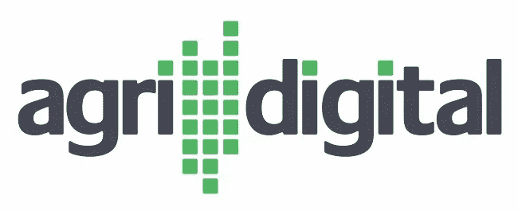
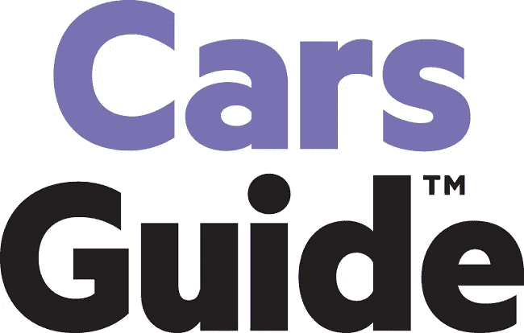
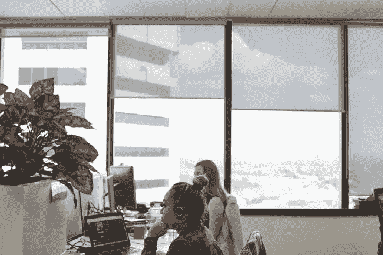
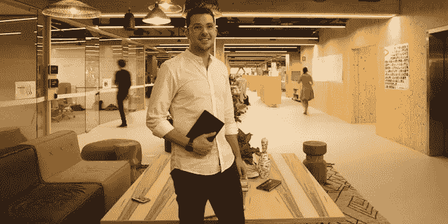
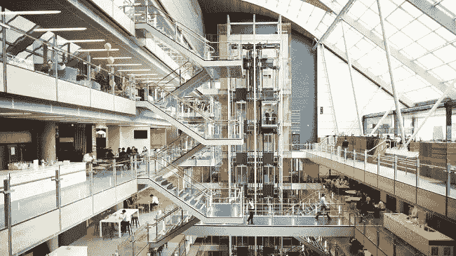

# 6 家澳大利亚顶级公司如何为未来工作做准备

> 原文：<https://medium.com/hackernoon/how-6-of-australias-top-companies-are-preparing-for-the-future-of-work-7c19ca0f9ab2>

*未来*。有些人害怕它，有些人兴奋。它激发了富有想象力的预测，但这些往往被证明是错误的(我们看着你，*回到未来*)。不管你对未来有什么想法和感受，为它做准备是不容商量的。

随着新技术、人工智能和自动化在工作场所的快速出现，未来的工作可能会与今天的工作大不相同。那么，在这样的环境下，领先的公司是如何让自己和员工适应未来的呢？让我们来看看。

# [AgriDigital](https://www.themartec.com/employers/agridigital)

“在 AgriDigital 公司，我们相信教育是关键，我们的团队是我们最宝贵的资产，”该公司的公关助理西蒙·巴拉卡特说。这家农业软件解决方案提供商正在崛起，刚刚获得了[一轮 550 万美元的融资](http://www.afr.com/technology/agriculture-blockchain-startup-agridigital-raises-55m-in-square-peg-led-round-20180223-h0wkbp)，以帮助其向北美扩张。尽管取得了成功，但他们仍然注意到科技领域的不可预测性，以及未来发展业务的需要。

巴拉卡特所说的教育有多种形式。AgriDigital 积极鼓励员工寻找学习和提升技能的机会，并为那些投入时间或金钱进行教育的人提供帮助。

AgriDigital 也是 Slack、Trello 和 G Suite 等基于云的协作工具的热情采纳者，这些工具给了该公司难以置信的灵活性。“现在，我们的团队可以在世界任何地方，在适合他们的时间工作！这对我们来说非常重要——我们的信念之一是‘工作是你做什么，而不是你去哪里’，随着我们开始在全球范围内发展，这一点尤其重要。灵活的工作条件允许我们的员工创建自己的工作时间表，这有助于他们保持工作/生活的平衡，并在工作中获得支持。”

此外，该公司并不认为自动化对他们的团队是一件坏事。“曾经必须手工完成的工作实践的自动化意味着员工一天中有更多的时间从事其他高级(通常更具创造性)任务。巴拉卡特说:“这提高了他们的技能和知识，同时也让他们的工作更愉快、更有趣。”。

# [汽车导轨](https://www.carsguide.com.au/)

在竞争异常激烈的在线市场领域，保持领先地位需要真正的开拓性方法。自 2011 年成立以来，CarsGuide 一直设法保持这一点，他们的创新没有放缓的迹象。

CarsGuide 的首席技术官杰瑞米·古普塔(Jeremy Gupta)认为，他的团队在让组织适应未来方面发挥着与其他任何事情一样重要的作用。

“我热衷于雇佣、提拔和创造聪明的多面手，”他说。“随着科技的飞速发展，拥有一匹只会玩把戏的小马是一种灾难。如果专家们过于囿于自己的圈子，他们实际上会妨碍团队的灵活性和自己的职业生涯。”

通过黑客日、棕色袋子、修补时间和结构化培训等举措，古普塔的目标是培养各行各业的高手，而不是某一行的大师。

古普塔很清楚自动化可能引发的革命。“自动化将是变革的最大驱动力，也是某些技能组合过时的速度。”

但他也看到了潜在的好处。“自动化有助于全面发展。无论是在工程、质量保证、数据科学、金融还是人力资源领域，它都将人们解放出来，让他们从事更高价值的工作。每当有人从手工和重复的事情中解脱出来，就少了一件消耗他们一天的事情——这是非常积极的。我们需要拥抱它，否则它会与我们擦肩而过。”

像科技领域的大多数人一样，CarsGuide 和 Gupta 强调个人和组织的思维模式是最重要的面向未来的工具，而不是采用任何特定的策略或技能。

“是一种终身学习者，不安于现状的心态；再加上一颗好奇的心，你就拥有了适应能力和在模糊复杂的环境中脱颖而出的能力。”

# [Nuix](https://www.themartec.com/employers/nuix)

Nuix 的高级人事和文化业务合伙人(APAC &日本)萨曼莎 [**切斯特尼**](https://www.linkedin.com/in/samanthachestney/) 说:“在为未来做准备时，公司正被置于跳出框框思考的位置。”。

作为澳大利亚领先的软件公司之一，Nuix 的团队对创新并不陌生。正是这种创新的愿望创造了一个拥抱变化的环境，并随之产生了对未来可能性的兴奋。

“为自动化的预期增长做好准备——许多未来的技能将与思维-机器接口相关，”切斯特尼预测道。“随着这种水平的技术变革和自动化，公司需要在思维和态度上变得越来越灵活，无论是精神上还是身体上，但不能以交付成果为风险。

“随着人才和劳动力能力的转变，领先企业还需要投资教育(软件平台、分析、通过理解信息和数据分享好故事)。”

# 埃森哲

**埃森哲**，一家领先的全球专业服务公司，希望授权其员工与其客户一起工作，这些客户是澳大利亚最具代表性的公司。他们支持员工每天全力以赴地工作，并受到致力于解决问题的团队文化的支持。

[**兰迪·万德马赫**](https://www.linkedin.com/in/randy-wandmacher-a51b977/) ，该公司的 ANZ 人力资源主管，完美地体现了埃森哲的哲学。对他来说，公司和员工的未来都很光明；虽然该公司对未来的预测非常现实，但他并不认为技术的崛起会让人类完全被机器取代。

“利用今天的技术，人们所做的大约一半的任务可以自动化。这是一个惊人的数字。但是同样有趣，也许更重要的是，只有 5%的工作可以完全自动化。

“埃森哲的观点是，未来的工作将会被重新配置，而不是被移除和取代。人工智能的引入将创造新的就业机会，员工在这一领域接受再培训和再技能培训至关重要。此外，研究表明，2020 年最受欢迎的人类属性将是个人解决问题、运用批判性思维和展示创造力的能力。这些是我们致力于为所有员工培养的技能。”

灵活性也是埃森哲的重要议程。“我们提供一系列灵活的工作安排，帮助我们的员工实现工作/生活平衡，同时满足我们的业务需求。Wandmacher 说:“我们的返程计划、智能工作计划和客户现场灵活的工作安排有助于解决我们的许多咨询员工在职业旅行中遇到的挑战。

该公司的性质也意味着重点放在远程协作上，使那些实际上可能不需要从他们喜欢的地方去工作的员工能够工作。

最后，Wandmacher 列出了他认为专业人士在这个不断变化的数字世界中需要的品质。埃森哲寻找符合以下条件的员工:

*   数字远见者
*   聪明的冒险者
*   自信的船长
*   敏捷成就者
*   好奇的知识分子
*   自然合作者

# [Optus](http://www.optus.com.au/)

作为一家帮助和促进其他企业向数字未来过渡的企业， **Optus** 在洞察接下来可能发生的事情方面处于相当独特的地位。 [**Cam Harris**](https://www.linkedin.com/in/camharris/) ，该公司数字商业解决方案组的高级主管，提供了他对未来工作场所的看法。

“团队合作是职场中最重要的方面之一。但为了让团队合作更有效，公司需要采用现代工作实践和技术，帮助团队成员——无论他们在哪里——以简单高效的方式分享他们的工作。”

为此，Optus 采纳了自己的建议，在自己的组织内发起了一系列合作创新。“据估计，普通员工每周要花 28%的时间管理电子邮件，将近 20%的时间寻找内部信息或寻找能帮助完成特定任务的同事。

“协作工具为团队提供了一种方式，将他们的对话集中到一个地方，可以从台式机、平板电脑或智能手机访问，而不必整理电子邮件、登录多个应用程序或出差参加会议。”

Optus 和 Harris 并不认为人工智能和其他自动化技术的出现是人类劳动力的终结，而是一个有用的助手，将提高员工的工作能力，甚至可能提高他们对某个角色的享受。

“要在数字时代蓬勃发展，组织需要更聪明地工作。这最终将使他们具有创新性、竞争力，并为客户提供改变游戏规则的体验。有效的协作需要时间，而技术只能做这么多繁重的工作。但这是在数字时代支持团队和现代工作流程的正确方向上迈出的一步。”

# [CommBank](https://www.commbank.com.au/)

银行业可能是自动化趋势最明显的领域。从自动取款机的普及开始，随着从现金和支票簿转向网上银行的趋势继续发展，最后随着电子支付形式变得极其简单，银行早就看到了在曾经需要人工的地方使用技术的好处。

但这种转变并不是轻率进行的，事实证明，澳大利亚“四大”之一的 CommBank 有自己的企业责任总经理。

[**凯莉·麦克法兰**](https://www.linkedin.com/in/kylie-macfarlane-0a34871/) ，这位有争议的总经理解释说[我们将在不久的将来看到的许多职业实际上还没有被发明出来](https://www.commbank.com.au/guidance/newsroom/jobs-of-the-future-rising-to-the-challenge-201711.html)，事实上，今天存在的职业在 5 年前还不存在。

“我们在联邦银行看到了这一点，令人兴奋的新角色，如创新经理、行为经济学家和分行门房，都是最近才出现的。这是时代的标志——我们的客户需求在快速发展，我们的员工也在同步适应这些需求。”

她强调了改变心态的必要性——父母必须认识到，他们的孩子不太可能拥有他们所谓的“正常”工作，必须尽他们所能引导年轻人去扮演一个更不适应未来的角色。

“正如未来学家罗斯·劳森在我们新的[英联邦银行未来工作和技能报告](https://www.commbank.com.au/content/dam/caas/newsroom/docs/CommBAnk_REPORT_NOV_FINALpdf.pdf)中强调的，对科学、技术、工程和数学(STEM)领域合格候选人的需求已经超过了供应。与此同时，随着编码、机器人和虚拟现实等技术融入日常活动，技术将在课堂上发挥更大的作用。然而，随着我们越来越依赖全面的技术，情商、适应性和人际关系技能等人类属性将比以往任何时候都更加重要。”

麦克法兰还向我们保证，CommBank 明白，像他们这样的大国伴随着巨大的责任。“联邦银行在与教育提供商的合作中投入巨资，以确保我们的年轻人为未来做好准备，无论是在职业生涯还是财务健康方面。作为全国最大的雇主之一，我们有责任帮助澳大利亚人为未来做好准备。这是我们非常认真对待的责任，但它也提供了帮助塑造国家更美好未来的令人兴奋的前景。”

你想让你的职业适应未来吗？澳大利亚一些最大最好的科技公司正在寻找人才。查看我们的 [**工作清单**](https://www.themartec.com/jobs) **，看看你的未来会走向何方！**