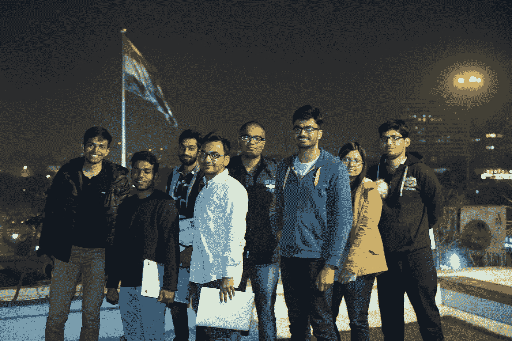
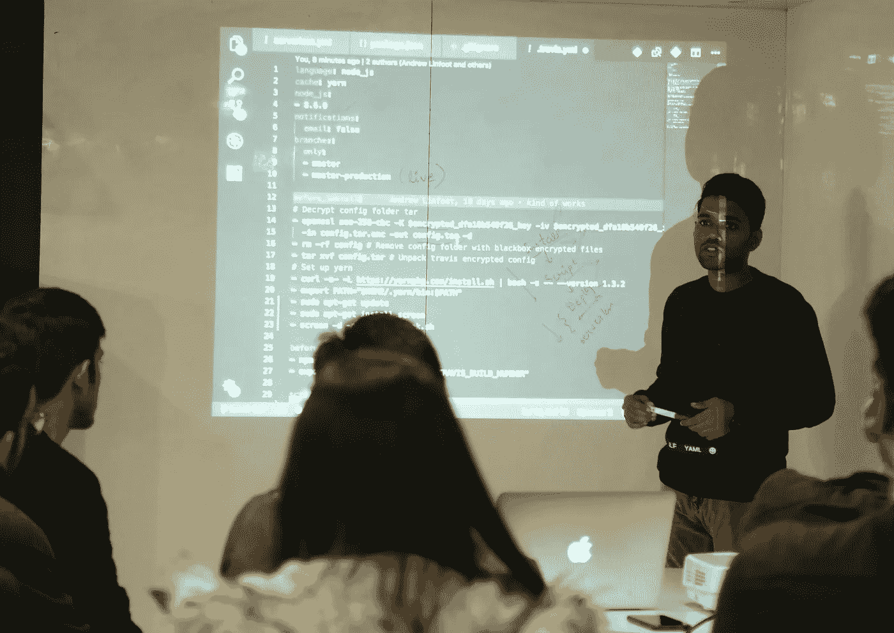

# 一个来自旧金山的孩子如何在印度开办了一所学校

> 原文：<https://medium.com/hackernoon/how-a-kid-from-san-francisco-ended-up-starting-a-school-in-india-a868606a6f0c>

我的创业失败了，我没钱付房租。三周后，卖掉了我几乎所有的东西，我拿着一张单程票和一个背包登上了去曼谷的飞机。

我的经济状况并没有让我担心。我的银行账户里只有几百美元，但我有我的笔记本电脑，我是一名优秀的软件工程师。

美国优秀的软件工程师可以做每小时 150 美元的自由职业者，即使是在泰国的海滩上远程工作。

# 九个月后

当我在印度德里的一个合作空间完成一些工作时，我遇到了一个叫 Ayush 的当地孩子。我们开始聊天，一见如故。我们都是刚起步的孩子和自学的程序员。

我们开始谈论我的旅行，他问我，“你怎么买得起这个？”。我告诉他美国的自由职业市场，他回答道:

> 每小时 150 美元？！？我可以在印度以每月 150 美元的价格雇佣一名拥有计算机科学学位的工程师！

起初我半信半疑，一个好的工程师不可能为了每月 150 美元而工作。然而，阿尤什坚持。我们决定做一个测试项目。

# 我们的第一个项目

事实证明 Ayush 夸大了一点，我们雇佣的第一个工程师希望月薪接近 1000 美元…

**也就是每年 12000 美元，不到一名入门级硅谷工程师工资的十分之一！**

问题是，我们的第一个工程师没有那么好。

他知道如何编码。他有计算机科学学位和 2 年的工作经验，但是他的代码很粗糙。

每次他提交新代码供审查，我都不得不拒绝他，提供反馈并督促他做得更好。

**经历了 3 个月的拒绝、数百次代码审查和在他的电脑前熬夜之后，他的代码开始看起来像我自己写的一样好。**

当 Ayush 和我继续建立我们的印度开发商店时，我们一遍又一遍地看到同样的事情:

我们会以每年不到 12，000 美元的价格雇佣一名工程师。他们一开始写的代码与你对年薪 12，000 美元的工程师的期望相当。

然而，和我们在一起 3 个月后，他们会交付顶级的工作，你会从硅谷一个年薪 120，000 美元的工程师那里期待的代码质量。

Our first engineer, Nimish, teaching new students how to set up Travis CI

# 一年后的项目

Ayush 和我很快意识到我们的工程师有多好。他们英语流利，拥有计算机科学学位，工作比我在硅谷的大多数朋友都努力。

如果他们有美国签证，他们会很容易在美国科技公司找到工作。我们无法为他们获得签证，但我们可以让他们与美国科技公司匹配，在那里他们可以作为全职远程承包商工作。

客户很喜欢。这就像在内部雇佣远程员工一样，只是更便宜、更快、更容易。很快，签约的公司数量就超过了我们培训的工程师数量。

生意兴隆。

只有一个问题，Ayush 和我讨厌我们的业务建立在人为保持员工低工资的基础上。

我们的工程师和美国的工程师一起工作，做同样的工作，却挣不到 10%的钱，这感觉很不对。

我们想知道是否有更好的方法。如果我们不把每个员工都放在工资单上，而是简单地培训他们，并把他们与美国公司联系起来，会怎么样？

然后，我们可以让每个工程师签署一份收入分享协议，他们支付未来工资的一小部分，而不是期望他们能够预先支付硅谷的优质培训。

我们和客户谈过，他们喜欢让每个 Pesto 工程师通过他们自己的技术面试和招聘程序的想法。然而，他们不想处理雇佣海外员工的税务、法律或后勤方面的复杂问题。

这是我们知道我们正在做一件大事的时候。我们可以轻松实现文书工作和发票开具的自动化，帮助美国公司起草标准合同，并以美元支付工资。这将使招聘过程像为代理工作付费一样简单。然后，我们可以在办公室里提供一张预定的桌子，这样公司就不必在印度设立办公室了。复杂性解决了。

唯一剩下的问题是这个会变得多大？

[**目前仅在美国就有超过 50 万个软件工程职位空缺。预计到 2020 年，这一数字将超过 140 万。**](https://qz.com/929275/you-probably-should-have-majored-in-computer-science/)

[**印度有 500 万软件工程师。**](https://www.computerworld.com/article/2483690/it-careers/india-to-overtake-u-s--on-number-of-developers-by-2017.html) **他们的平均年薪在**[**【6600 美元(入门级)**](https://www.payscale.com/research/IN/Job=Software_Engineer/Salary)**[**【11400 美元(高级)**](https://www.payscale.com/research/IN/Job=Senior_Software_Engineer/Salary) **之间。****

**我们已经证明，如果我们在印度找到最努力工作的软件工程师，并对他们进行世界级的强化培训，他们可以成为美国公司中有效的远程团队成员，赚到比他们想象的更多的钱。**

**能够为数百万人放弃 20 倍的经济增长机会是非常酷的。**

**随着 Pesto 的发展，我们决定放弃我们咨询业务的巨大利润，将全部精力放在我们的培训项目上。**

**我们开发了针对印度的课程，不仅教授软件开发，还着重于弥合文化差异和成为高效的远程员工。**

**我们整夜运行我们的培训计划，允许我们通过来自硅谷的实时流引入专家工程师，并让学生为时区调整做好准备，这可能是与他们未来在美国的队友远程协作所必需的。**

**我们刚刚宣布了我们新的教育产品，在印度已经收到了巨大的兴奋。**

**大多数人无法相信，在他们和 20 倍的经济潜力增长之间，唯一真正的障碍是一段短暂但令人疲惫不堪的教育时间，以及介绍给在世界另一端工作的人。**

# **未来**

**我一直是机会均等理念的支持者。如果你足够努力，你可以成为任何你想成为的人。**

**我努力成为一名优秀的软件工程师。**

**但我比我的联合创始人阿尤什更努力吗？阿尤什把他的一切都投入到他之前的创业中，结果却无家可归，住在我遇见他的那个合作空间里。大概不会。**

**然而，当我们的创业都失败时，我最终无忧无虑地去了泰国的海滩，而他最终无家可归。**

**全球经济中的平等机会并不存在。大多数人连机会都没有。他们的潜力被永久地限制了，仅仅因为他们出生在哪里。**

****在 Pesto，我们正在创造一个世界，在这个世界中，教育和远程工作让每个人都有平等的机会，无论他们出生在哪里。****

**我们从印度的 500 万软件工程师开始。**

***我们目前正在为下一批学生寻找招聘伙伴。如果您有兴趣先看看我们的工程师，请给我发电子邮件至 andrew@pesto.tech.***

**如果你知道谁在招聘工程师，如果你能和他们分享我们的故事，我会很感激。**