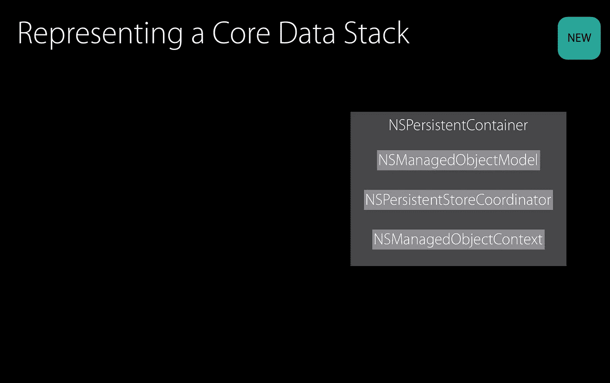

# 模型控制器如何在 Swift 中处理核心数据

> 原文：<https://medium.com/hackernoon/how-a-model-controller-works-with-core-data-in-swift-c94481ff5316>

来自 [SwiftCraft 播客](https://emanleet.com/category/swiftcraft-podcasts/)的最近一集特别报道了对 [Matteo Manferdini](https://twitter.com/MatManferdini) 的有趣采访，Matteo Manferdini 从第一代 iPhone 开始就一直在 iOS 中开发，在那之前一直在开发 Mac 应用。

它提供了目前对 iOS 体系结构的反向观点，但却引起了我的共鸣——支持 MVC。

在快速变化的软件行业中，保持一个极度开放的思维是非常重要的，因为时尚和革命之间的界限很窄。尽管近年来我一直在探索 MVP、MVVM 和 VIPER，但它们都没有足够的说服力让我相信它们没有 MVC *那么复杂和干净。*

我一直想写一篇博文来阐述 Matteo 的 [Lotus MVC 模式](https://matteomanferdini.com/ios-architecture-lotus-mvc-pattern/)，为什么无情的精益 MVC 可能是最干净的解决方案，以及这一切是如何与编程文化联系在一起的**我们正在将稍微复杂的概念变成极其复杂的解决方案**。

对我来说，Lotus MVC 模式仍然有点太接近 VIPER，但这是我所见过的最接近于支持精益 MVC 的文献，精益 MVC 能够有机地增长，而不是从一开始就设置不必要的样板代码。我将详细阐述我对 Lotus MVC 的想法，以及它如何与一种我称之为 **FUMVC** (半开玩笑半认真)的模式联系起来，以对抗复杂性加倍的趋势。

当高内聚和低耦合的经典软件工程概念与坚实的原则一起应用时，iOS 中的 MVC 倾向于在一个特别好的抽象但易于遵循的架构之间取得平衡。这对快速原型或 MVP，或长期遗留代码(*有机的* MVC 增长)都是有益的。

Matteo 提到的模型和视图控制器之间的抽象是一个**模型控制器**，我不禁认为这是我通常用于任何核心数据工作的小型且可管理的模式。除了我通常称之为`ModelManager`或`ModelCoordinator`之类的东西。

# 尝试不同的抽象

多年来，我在处理核心数据的几种不同模式之间摇摆不定，这些模式可以总结为以下几个阶段:

1.  当我启动 iOS dev 时，我更多地使用模型控制器模式，中央模型对象执行 CRUD 操作(或者在 iOS 中更学究式地说，添加、获取、保存和删除)，并设置`NSManagedObjectContext`、`NSPersistentStoreCoordinator`、`NSManagedObjectModel`核心数据堆栈，以及所需的任何*重量级迁移*。不幸的是，这通常也是一个单一的。
2.  在一个特定的项目中，一名前端开发人员提供了一些关于 API 接口调用的反馈，他认为这对 iOS 前端更有意义。基于此，我尝试采用一种模式，其中每个模型的类或扩展包含它们自己的 CRUD 操作。因此，它们可以像下面的`modelType.create(withProperty: String)`或`modelType.fetch(byProperty: String, containingValue: String)`一样使用。这里有很多样板文件，但都没有什么收获。像 fetch 调用这样的东西的最初意图是作为指定谓词字符串的替代，并使用来自枚举的定制排序描述符等。但是仔细想想，我认为每个开发人员都应该熟悉谓词字符串，因为语法普遍适用于 SQL 查询，每个开发人员都应该熟悉 SQL 查询，即使是在使用 ORM 时。
3.  从 iOS 10 开始，当`NSPersistentContainer`简化了核心数据堆栈的设置，在此之前，当泛型随着 Swift 的兴起而成为一件事情时，我一直倾向于一种方法，其中 1 或 2 个较小的抽象在数据模型和视图控制器之间进行协调。泛型使得减少样板代码的前景变得特别有吸引力，并且每当你需要一个后台 MOC 时,`NSPersistentContainer`温和地引导你创建一个新的后台 MOC，这也有助于在精神上阻止你作为一个单独的实现它。



A slide [from WWDC 2016](https://developer.apple.com/videos/play/wwdc2016/242/), the introduction of NSPersistentContainer.

关于这一点，我想我可以分享上面我喜欢的核心数据`ModelController`的最新实现——目的是任何人*都可以把它放到他们的代码库中，不管你的数据模型是如何建立的！*

# *模型控制器*

*我已经将它上传到了一个新的[库](https://github.com/thepost/FUMVC)中，这个库将用于更大的可重用 **FUMVC** 抽象的目的。这是对 FUMVC 的第 1 个[贡献，所以这个库目前真的很小。](https://github.com/thepost/FUMVC)*

*如果它的主要目的是高度可重用，就不应该尝试所有的事情。出于这个原因，我将代码保持在最低限度。*

*我通常使用传统的冗长的苹果影响的函数名，比如像`addDataStorageEntry`这样的名字。然而，最近我受到了我在 React 应用程序中的工作的影响，它的命名似乎受到了中间操作的影响——这似乎也是苹果正在向转移的命名惯例。所以函数定义为:*

*   *`add(type:)`*
*   *`total(type:)`*
*   *`fetch(type: predicate: sort:)`*
*   *`save()`*
*   *`delete(by objectID:)`*
*   *`delete(type: predicate:)`*

*这篇博文中的示例代码没有做到的是——它只使用了一个托管对象上下文(用于主线程的视图上下文)，并且它没有实现线程处理，因为它会转移对主主题的注意力。虽然我已经用一些线程处理更新了 Github 库，并在下面稍微介绍了一下。但是现在，让我们深入研究上面的每一个功能…*

*`ModelController`属性仅仅由一个`NSPersistentContainer`和两个`NSManagedObjectContext`组成，分别用于主线程和后台线程。*

*有一个方便的初始化器，它的唯一目的是通过依赖注入来设置模型名称，而不是耦合到核心数据抽象。`NSPersistentContainer`也因此偷懒。private `modelName`的默认值应该将模型名设置为 bundle，如果您选择指定的初始化器，这可能是一个安全的场景。`modelName`是通过便利的初始化器而不是设置器来设置的，因为它的唯一目的是在实例化时被需要，而不是在其他地方。*

*`ModelController+Add`负责创建一个新的`NSManagedObject`子类。如果 Recipe 是您的模型实体之一，您可以通过`modelController.add(Recipe.self)`使用它。*

*我在`ModelController+Fetch`中包含了一个 total 函数和一个 fetch 函数，因为它们都与 fetch 相关。这是完成`NSFetchRequest`的地方，谓词字符串和排序描述符是可选的，因为您可能希望使用 fetch 简单地检索所有记录。*

*如何使用 total 和 fetch:*

```
*let total = modelController.total(Recipe.self)let predicate = NSPredicate(format: "name LIKE %@", "Fetcheroni Pizza")
let fetched = modelController.fetch(Recipe.self, predicate: predicate)*
```

*`ModelController+Save`相当标准。即使你没有使用核心数据抽象，你也很可能已经编写了一个`save()`方法来检查`hasChanges`并包装一个 try/catch。*

*最后是`ModelController+Delete`。这里有两个删除方法——一个是 fetch 方法中使用的标准接口模式，传递类型和谓词来查找要删除的对象。*

*另一个检查`NSManagedObjectID`，这是一个在删除核心数据对象时经常被忽略的问题。通过 fetch 访问对象并不能保证相同的对象会在访问它的同一线程上被删除，所以 Apple 推荐使用 ID 删除。由于这个原因，谓词方法也包装了`delete(by objectID:)`方法。*

*如何使用:*

```
*modelController.delete(by: recipe.objectID)let predicate = NSPredicate(format: "name LIKE %@", "Deep Pan Pizza")
modelController.delete(Recipe.self, predicate: predicate)*
```

# *线程处理*

*使用`perform(_:)` 和`performAndWait(_:)`都有好处。这两个函数都接受闭包，使您能够在与托管对象关联的正确线程上使用托管对象上下文。*

*请注意，这与使用`DispatchQueue.global()` `async(_:)`或`sync(_:)`略有不同，当然，虽然它们可能会在不同的线程上执行，但您不一定要启用上下文来将匹配到与相关联的*线程。**

*回到`perform(_:)`和`performAndWait(_:)`，两者之间唯一的区别是`perform(_:)`继续执行流程。因此，在一个函数中，如果您出于某种原因想要返回值，而该返回值不依赖于任何异步操作，那么您可以使用`perform(_:)`继续执行并返回不基于该块的内容。*

*另一方面，如果你的函数返回的内容依赖于块，你可以使用`performAndWait(_:)`来允许块在函数返回之前完成执行。这里更多的是[解释](https://cocoacasts.com/more-core-data-and-concurrency)。*

*我们可以采用`ModelController`中的任何一种方法，或者我们甚至可以采用一种组合。现在，我已经用`perform(_:)`方法更新了 repo(上面的示例代码没有线程处理)，并添加了一个完成块作为函数参数，以允许通过完成继续执行(与使用`performAndWait(_:)`的返回方法相反)。*

*我只是认为通过限制`performAndWait(_:)`的使用直到真正需要的时候，减少了阻塞主 UI 线程的机会。毕竟，`ModelController`和大多数好的抽象一样，不应该限制调用组件使用它的灵活性——由父对象决定是否阻塞主线程，而不是封装接口中的神秘盒子行为。*

*然而，保持提供`performAndWait(_:)`返回和`perform(_:)`完成块的灵活性需要付出一点代码清理的代价。出于这个原因，如果`ModelController`最终会将`performAndWait(_:)`行为添加到它的实现中，我想通过 Max Howell 的 [PromiseKit](https://github.com/mxcl/PromiseKit) 来实现。这使用了 JavaScript 的承诺概念，以减少嵌套完成块的混乱，并传播错误处理。*

*`ModelController` repo 目前也没有利用后台上下文，提供该功能将是下一个明显的实现。它不需要再吹了，这应该是一个非常简单和精简的可重用库，作为任何核心数据代码库的第一个调用点。我觉得可重用库是最好的方式，任何额外的功能都应该是该库的扩展，或者只是为正在工作的特定代码库定制的。否则它不会得到重用的**，这就是库的全部意义。***

# ***接下来去哪里？***

***我发现按照`EntityName.self`的思路将类型作为值来访问有点多余，而从一个优雅的 API 中一步就可以解决这个问题。我不确定这是否可能，但是如果您能够通过实现`StringLiteralConvertible`协议，为核心数据模型类型添加一个枚举，就像 Benedikt Terhechte 的博客文章中关于[使用定制数据类型](https://appventure.me/2015/10/17/advanced-practical-enum-examples/)的部分一样，那将会非常好。另一方面，这是与 Swift 中的*枚举*相关的所有内容的绝佳参考，我强烈推荐给它添加书签。***

***最紧迫的问题是为后台托管对象上下文提供一个优雅且最小的接口。这可以通过在`ModelController`上的扩展或选项协议来完成，因为我认为拥有一个后台 MOC 是大多数开发人员在不需要它的情况下匆忙做的事情。***

****我还会在博客上更新 FUMVC 的更大概念，以及资源库可能会如何形成。****