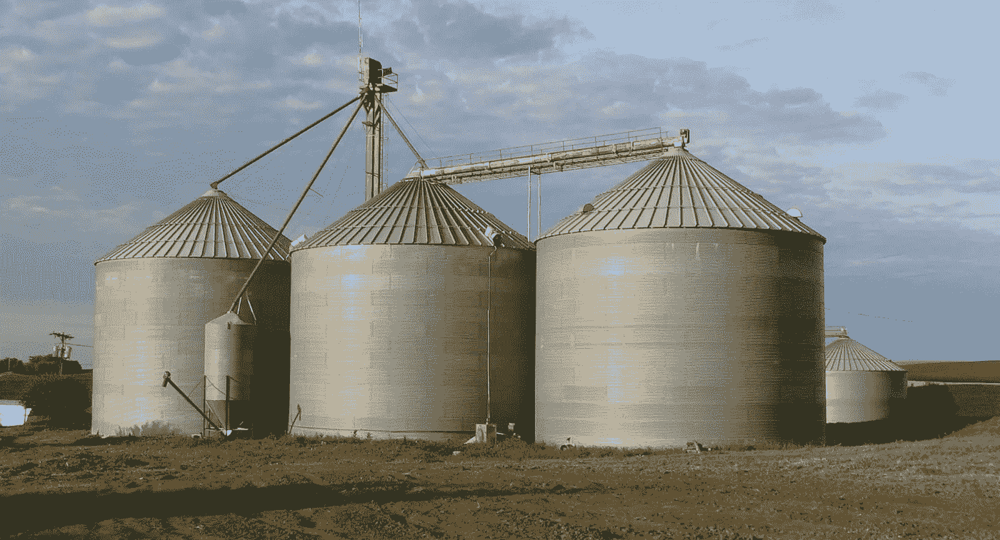
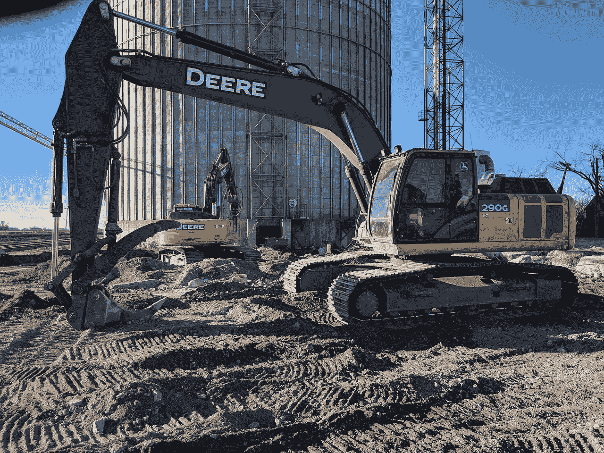
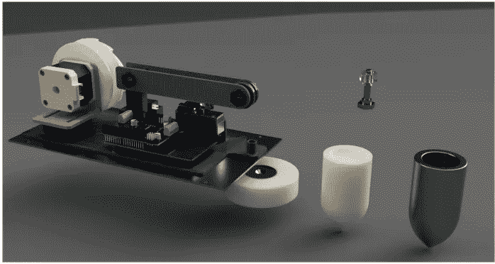
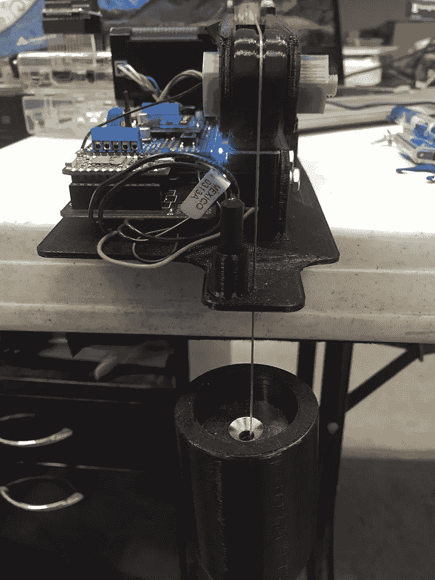
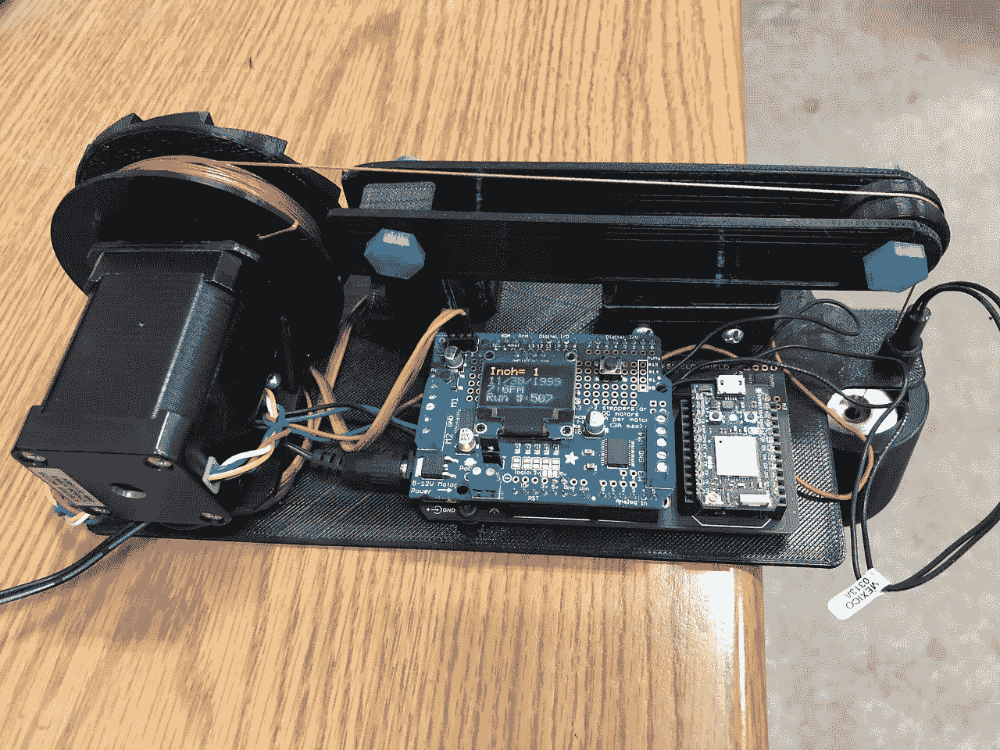
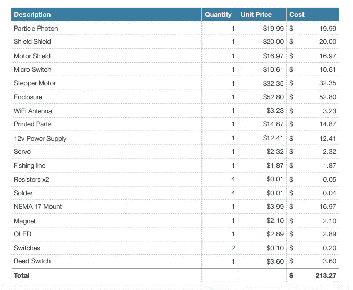

# 北达科他州的农民如何建立物联网驱动的农场

> 原文：<https://medium.com/hackernoon/how-a-north-dakota-farmer-built-an-iot-driven-farm-99a0ecc56f10>

## 从自动挖掘机到自我测量的粮仓，这些物联网项目正在提高农场生活的效率，减少税收

# 物联网挖掘机

Greg Meandel 不是普通的农民——他喜欢建造和规划物联网项目，消除日常农场生活的复杂性。

例如，他的许多物联网项目中有一个是可以远程启动的挖掘机。通过使用一个[电子](https://www.particle.io/products/hardware/electron-cellular-2g-3g-lte)(将设备连接到互联网的蜂窝[硬件](https://hackernoon.com/tagged/hardware))，他可以远程加热挖掘机的机体加热器，这有助于启动发动机。在某些情况下，他不得不等待几个小时让内部模块升温。现在，他可以醒来，通过手机向电子设备无线发送命令。早餐结束时，挖掘机已经加热，随时可以使用。

*Using an electron, Greg can send a command via his mobile phone and heat up the excavator’s internal block wirelessly.*

这只是格雷格在他的农场实施的许多物联网项目之一。在这篇文章中，Greg 分享了一个分步教程，讲述了他如何建造一个自我测量的谷物储存箱。

# 问题是

玉米收获后，谷物被收集在大的储存箱里。对格雷格来说，他不得不爬上一个梯子，仅仅是为了看看箱子里面，跟踪已经收获了多少玉米。当你一天要检查好几次的时候，这就变成了一个相当及时和痛苦的重复任务。

*A 3D rendering of Greg’s bin level device*

但是 Greg 知道这个问题可以通过合适的硬件来解决。利用一个光子、一个电机驱动器和一些弹簧开关，格雷格知道他可以创造出一种设备来为他测量粮仓。

# Bin 级设备要求

对于这个物联网项目，Greg 设定了一些要完成的目标:

1.  建造一个能够抵御天气变化的设备，它可以在潮湿和多尘的环境中工作。
2.  **找到负担得起的硬件组件**，这样他就可以创造出多种可以放在不同箱子里的设备(还可能卖给其他农民)。
3.  **创建一个端到端设备**，它可以连接到云并与其他设备通信。
4.  **便于联合收割机驾驶员和卡车司机使用**。

*The completed bin-level device*

# 解决方案

格雷格使用了一个[光子](https://www.particle.io/products/hardware/photon-wifi)(一个 Wi-Fi 连接的微控制器)，这样该设备就可以连接到互联网并与其他设备通信(如他的手机和联合收割机的接口)。他还计划在箱子里放一个砝码来确定谷物的高度，所以他买了两个开关(一个用来降低砝码，另一个用来重置设备)。然后，他购买并 3D 打印了其他组件来完成该设备。一旦完成，他就把所有的部件都存放在一个封闭的地方，以保证它远离灰尘和潮湿的环境。

# 它是如何工作的

下面是格雷格·米恩德尔的最终设备是如何一步步工作的。有了它，他再也不用爬梯子了:

1.  **格雷格通过向光子发送命令来启动进程**。
2.  **光子在装置上释放**一个缺口，导致一个重物自由落体，直到击中谷粒。
3.  **一旦重物击中谷粒**，电机会将线和重物倒带。
4.  **设备对每一步**进行计数，以确定料仓料位(200 步/每转)。
5.  **重物顶部的强磁体**告知光子重物何时回到初始位置。
6.  **光子将测量结果**发送到格雷格的手机上。
7.  **和**，就是这样！

# 最终预算

格雷格制造了几个可以放在多个粮仓里的装置。如果他愿意的话，他可以建更多的房子卖给其他农民。

# 所有的一切

通过物联网硬件，Greg Meandel 正在悄悄地从日常农场生活中消除令人痛苦的重复任务。Meandel 不仅能够制作出一个易于访问和使用的设备，他还能够在保守的预算下完成它。如果你最近建立了一个物联网项目，请随时为其他正在建立自己的物联网驱动计划的人发布你自己的故事和技巧。