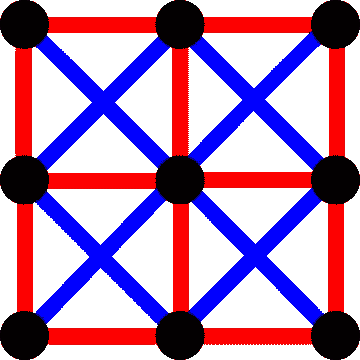

# 一块布如何让学生对编程感兴趣

> 原文：<https://medium.com/hackernoon/how-a-piece-of-cloth-can-get-students-interested-in-programming-568f4aee6300>

Photo by [Mikael Kristenson](https://unsplash.com/@mikael_k?utm_source=medium&utm_medium=referral) on [Unsplash](https://unsplash.com?utm_source=medium&utm_medium=referral)

当我开始在我的硕士项目期间教授本科 C 语言编程时，我做了很多思考，想了想几年前当我还是一名学生坐在同样的课堂上时的感受。对我来说，那段时间的特点是，我确信对许多学生来说，这不是“真正的”计算机编程。课程中的所有输入和输出都是通过终端进行的，但是我们中的一半人以前甚至从来没有见过使用过终端，我们当然也没有定期从终端上运行程序。在消费类软件中，GUI 占据着至高无上的地位。难怪我觉得我正在学习的计算机编程与我作为软件用户的经验有些不一致。

当然，[的这种想法](https://hackernoon.com/tagged/thinking)暴露了我年轻时的一些天真，但这是一个有效的问题:当你的观众习惯于以图形方式与计算机互动时，你如何让他们感觉到他们通过使用纯粹基于文本的 I/O 学到了什么？带着这个目标，我想为这个类制作一个看起来华而不实、令人印象深刻的演示，但需要大量的计算才能实现。通过这种方式，我希望能够说服一群不感兴趣的大学生，让他们相信他们已经基本上能够开发出他们最感兴趣的那种计算机程序。

从某个方面来说，我是幸运的，因为正在讨论的这门面向工程师编程的课程，有一个关于数值方法的重要单元。所有这些学生都刚刚学会如何编写数值 ODE 解算器，这是大量物理模拟的核心。物理模拟人生计算量大吗？检查。它们会产生华而不实、令人印象深刻的结果吗？你打赌。这些学生有能力写一个吗？不管怎样，如果给他们密码，他们就能理解。

Aforementioned flashy and impressive results of physical simulations

我认为布料模拟在复杂性和壮观性之间达到了完美的平衡。这实际上是一个已经解决的问题，一些实现产生了令人印象深刻的真实结果(见下文)。因此，虽然它可能不是最具革命性的项目，但我知道这个问题有大量的支持材料，这有利于课堂演示。有不同复杂程度的模型，简单的模型容易理解，不会显得琐碎。

所选模型将布料视为一组由弹簧连接的点质量。这里的好处是，它可以用只需要高中水平的物理知识的过程来解释，并且如果需要的话，在不改变基础模型的情况下，添加额外的动力学来提高准确性是可能的。

All cloth in this surreal video is computer-generated

因此，在它的核心，布料实际上是一个粒子网格，每个粒子通过弹簧连接到它的 8 个近邻，如下所示:

你如何获得这样一个模型的动力？如果我们知道每个粒子在给定时刻的位置，我们可以假设很短时间后的位置大致是这个位置加上瞬时速度乘以那个很短的时间。恭喜你，你刚刚理解了一个颂歌解算器是如何工作的。但是按照这种方法，我们需要通过对作用在每个粒子上的力求和来获得对每个粒子速度的估计。我们除以质量，很快，就有一个加速度，我们可以用它来估算速度。牛顿第二定律有多好？

我们认为(至少)作用在每个粒子上的力是重力，以及与之相连的 8 个弹簧的贡献。

如果我们想模拟风或碰撞或其他什么，我们也可以添加。但本质上，系统的演化包括计算每个时刻作用在每个顶点上的净力；由此确定加速度矢量；从中找出速度和位置向量。

重力很容易，那只是一个常数-9.8 *m* 在 z 方向。

弹簧有点棘手。阻尼弹簧上的力既抵抗当前拉伸量 *x* ，又抵抗当前瞬时速度 *v* 。因此，公式为:

*F* = - *kx-cv*

其中 k 和 c 是常数。

Visualisation of the forces acting on a damped spring

这里有些棘手，因为在这种情况下，速度是两个相邻粒子之间的相对速度。在任何情况下，做 8 次，每个近邻做一次，将结果相加，得到粒子上的净力。

有了这些公式和这个模型，我就能做出一个像样的布料模拟。在实践中，我使用了一个稍微复杂一点的 ODE 解算器，叫做[龙格-库塔解算器](https://en.wikipedia.org/wiki/Runge%E2%80%93Kutta_methods)，这使得模拟更加健壮，并且不容易不稳定。鉴于这是学生所学的求解器，使用它是一个很好的学习机会。

对于输出，我只是将结果数据打印到终端，一行一个时间点。记住，这个程序的重点是强调计算本身的重要性，我认为它做得很好。大量的精力投入到产生作为输出的数字上，包括计算资源和设计程序的脑力劳动。

但是，当然，如果我们能从中产生漂亮的图片，我们应该。因此，通过编写一些补充脚本，我获得了解算器的输出，并使用 [pbrt](http://www.pbrt.org/) 渲染了一系列帧，我将这些帧拼接成了一个视频。

奇妙的东西。事情是这样的，得到那个结果真的不需要太多的后处理。我希望能够让任何开始计算机科学之旅的学生相信，像这样的事情是他们力所能及的。渲染器并不是制作视频的重要部分，我们的程序才是，因为没有它，就没有东西可以渲染。

顺便说一下，这个模拟远非完美:这里有许多方法可以探索，使我们的模拟更加健壮、准确或通用。我们可以检查布料的自相交，我们可以向模型添加额外的弹簧以防止在顶点形成尖锐的边缘，我们可以模拟与固体物体的碰撞，或者添加外力，如风。代码在 [Github](http://www.github,com/at-white/simplecloth) 上全部公开；随意克隆它，做一些改进。

那么这是怎么回事呢？嗯，我把它展示给学生，很多人都留下了深刻的印象，这当然是令人愉快和鼓舞的，但这不是我感兴趣的东西。因为衡量成功的真正标准是他们是否相信他们有能力做同样的事情，我希望他们相信。

当你第一次学习编程时，你会有这样的感觉:你所有的项目都只是‘真实’程序的微小部分；或者没有任何意义的玩具例子。所以我认为让学生感觉到他们所学的东西在某种程度上是相关的，这变得越来越重要。通过向他们举例说明他们的代码可能如何适应更大的图景，我们不仅让他们能够继续在该领域的研究，而且让他们能够开始摆弄编程，或许最终做出令人难以置信的东西。