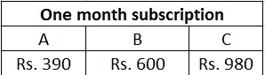
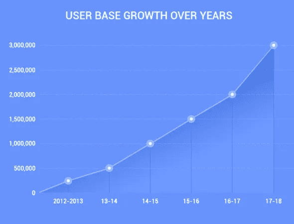

# 一个独立的、非技术性的创始人如何建立一个百万美元的科技初创公司保持自举

> 原文：<https://medium.com/hackernoon/how-a-solo-non-technical-founder-built-a-million-dollar-tech-startup-staying-bootstrapped-e9f2f7b31b0e>

## [推送采访](https://www.facebook.com/groups/Pushstarter) 08:

## 一个独立的非技术创始人如何建立一个百万美元的科技初创公司的旅程保持自举。

[**https://unsplash.com/**](https://unsplash.com/)

每当我们谈到一家价值百万美元的科技初创公司，我们脑海中浮现的第一个问题是: ***到目前为止它已经筹集了多少资金？***

*那么，有没有可能造出百万美元的科技* [*初创*](https://hackernoon.com/tagged/startup) *留守* [*自举*](https://www.investopedia.com/terms/b/bootstrap.asp) *？*

**历史告诉我们，是的，当然！**

[**vCommission**](https://medium.com/u/f2fbe9e794c#!/about) 和[**PayOOM**](https://www.payoom.in/)**也帮助把聚焦的观众送到[嘎嘎嘎](https://www.quackquack.in/)。**

## **从 10 万到 100 万用户:**

> **现在是真正增长的时候了，从 10 万用户增长到 100 万。当你被引导的时候很有挑战性。**

**为了解决这个问题，我们尝试通过定价来增加收入，这样我们就可以将多余的钱再投资于获取更多的用户。**

****

***我们* ***A/B/C 测试了定价差异*** *以找到合适的定价，并成功地将我们的* ***基础价格从 390 印度卢比更改为 980 印度卢比。*****

**我们将剩余资金投资于增长黑客和数字营销。推动增长的致命组合。**

**我们也投资了 [**SEO**](https://searchengineland.com/guide/what-is-seo) 但是惨败，因为我们的团队没有达到标准。**

## **从 100 万到 300 万用户:**

**我们用尽了所有的在线渠道来吸引流量到[呱呱呱](https://www.quackquack.in/)。**

**那时，我们希望通过 [**和**](https://blog.kissmetrics.com/app-store-optimization/) 来增加我们的 Android 和 iOS 应用的流量。我们的努力得到了回报，每天的注册人数从 800 人增加到了 1500 人。**

**我们还开展了一些社交媒体活动来推动病毒式传播。这在一定程度上确实有效。看看这些— [**像比尔**](https://www.facebook.com/pg/thequackquack/photos/?tab=album&album_id=542523999255236) **和**[**# happy single**](https://www.facebook.com/pg/thequackquack/photos/?tab=album&album_id=415796091928028)。后者从**[**BuzzFeed**](https://www.buzzfeed.com/sahilrizwan/bharat-notrimony?utm_term=.sij2wgjz8#.rakWeNjVG)**The**[**【赫芬顿邮报】**](http://www.huffingtonpost.in/2015/03/10/lame-reasons-to-get-marri_n_6837930.html)[**BollywoodShaadis.com**](http://www.bollywoodshaadis.com/articles/19-really-hilarious-excuses-that-indian-parents-give-to-convince-their-children-to-marry-3617)[**India times**](https://www.indiatimes.com/culture/who-we-are/17-crappy-things-indian-parents-say-to-get-their-kids-married-231091.html)等等得到了我们的报道！****

****就在这一刻，我们决定通过彻底改革我们的整个团队，给 SEO 再一次机会。这花了一年多的时间，但努力得到了回报。****

****现在，掌握了交易技巧，我们一直在清洗和重复我们的增长黑客模型。结合[数字营销](https://blog.hubspot.com/marketing/what-is-digital-marketing)和 [SEO](https://searchengineland.com/guide/what-is-seo) 的成功，我们现在每个月接近 *10 万新用户，并且还在增长！*****

## ****我们在过去 7 年中的增长:****

********

## ****要再添加几个指针:****

*   ****我们不会用电子邮件和推送通知来轰炸我们的用户，因此减少了他们与过量垃圾邮件的摩擦。****
*   ****我们的 Android 应用程序大小不到 10 MB，重量很轻，不会消耗太多电池。****
*   ****总而言之，通过做大量的 A/B 测试和迭代，我们能够降低我们的采购成本，而无需在[营销](https://hackernoon.com/tagged/marketing)上花费额外的费用。****
*   ****我们有时只向一小部分受众发布新功能，以判断他们的参与度。如果我们得到满意的结果，我们将在我们的用户群中推出它。****

# ****💰你的商业模式是什么？****

> ****我们从第一天开始就有一个免费增值模式。但是为什么要免费增值呢？****
> 
> ****因为预先向客户收费很难，而且只有广告收入是不够的。****

****我们的高级订阅提供了人们所寻求的真正的增值。我们的一些高级功能是我们独有的，例如:****

*   ****您可以直接与任何用户开始聊天。****
*   ****兴趣助推器可以帮助你节省时间，并代表你发送兴趣，而无需你登录。****
*   ****查看您的个人资料访问者和喜欢。****

****在早期，我们也考虑过广告+订阅的收入模式。****

> ****但印度的广告收入相当低，我们发现，如果用户点击广告，他们最终会减少。因此，我们决定让[完全没有广告。](https://www.quackquack.in/)****

****我们针对不同年龄段的用户有不同的套餐 **(1、3、6、12 个月)**。特别是对于年轻观众，我们将价格保持在低水平，这样他们就能买得起。****

## ****我们 2017-2018 财年的收入:****

*****印度卢比 3 亿卢比*****

# ****💪作为一个 Solo 创始人，你是如何让自己保持动力的？****

> ****事实上，当你独自创业时，很难保持动力。当一个新的想法出现时，你总是在寻找确认和动力。****
> 
> ****然而，让你的产品/业务更上一层楼的意愿是我前进的动力。****

# ****🏁你未来的目标是什么，你打算如何实现它们？****

****我们未来的计划是扩大我们在印度的用户群，并保持在线约会初创公司的前三名，核心重点是商业化。****

****我们也在努力在美国、英国和加拿大进行试运行。现在还为时过早，但我们正在这些国家进行广告试点，如果我们觉得参与度指标令人满意，我们将很快扩大营销活动，在印度以外开展业务。****

# ****🌋到目前为止，你面临的最大挑战是什么？****

****我们过去面临过许多挑战，并且每天都在面临新的挑战。几个核心挑战是:****

*   ****抓住早期用户是一个挑战。然而，通过增长黑客技术，我们成功地在预算紧张的情况下实现了增长。****
*   ****当我们开始时，我们被支付网关拒绝了多次。对银行来说，约会是一项有风险的业务。然而，我们仍然坚定不移，坚持到底。****
*   ****我们已经从许多受资助的初创企业的竞争中幸存下来，因为我们完全是自力更生的。他们来了，在品牌推广/用户获取上花了一大笔钱，给了我们一场噩梦。然而，我们一直专注于让我们的平台一天天变得更好。****

# ****🗒，你对刚开始的人有什么建议？****

*   ****创业看起来光鲜亮丽，很酷。但是这个旅程可能会充满压力和孤独。为此做好准备。****
*   ****如果你充满激情，试试你的想法。但是对市场要现实一点。****
*   ****做好失败的准备，并从容应对。****

# ****✉️:我们怎样才能和你联系上？****

****可以在**[**Linkedin**](https://www.linkedin.com/in/ravimittal9/)**或者** [**脸书**](https://www.facebook.com/ravimittal) 上联系我******

## ******非常感谢你的阅读！如果你喜欢，请鼓掌支持👏🏻还有分享帖子。请随意发表评论💬下面。******

## ******想成为印度最活跃的创业社区的一员吗？******

*******在* [***上发送请求 Pushstart***](https://www.pushstart.in/join-network-community) *成为我们不断壮大的大家庭的一员。*******

*****嘿！Neeraj 这里是*[***Pushstart***](http://pushstart.in/feed)*的创始人，印度最活跃的企业家社区。我每周都会发布对成功企业家的采访。**[***脸书***](https://www.facebook.com/jneeraj0807)***|***[***Linkedin***](https://www.linkedin.com/in/jneeraj0807)***| neeraj . Joshi @ pushstart . in |***[***Twitter***](https://twitter.com/jneeraj0807)*****