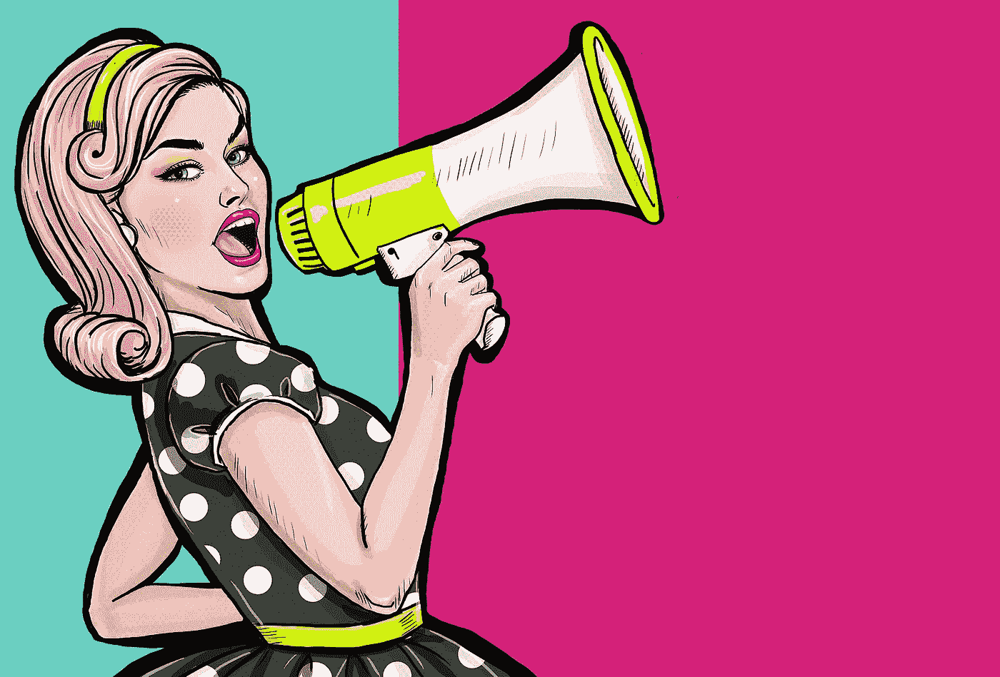

# 糟糕的发型帮助我在脸书找到了自己的声音

> 原文：<https://medium.com/hackernoon/how-a-terrible-haircut-helped-me-find-my-voice-at-facebook-3fa161f4a546>

## 一位女性对直言不讳的力量和负面影响的体验。

在脸书的可用性研究中，我的信心降到了最低点。

一段时间以来，工作一直很艰难。

我一直与几个同事发生冲突——感觉就像当**我试图大声说出**我认为重要的事情时，**这被视为对他们权威的挑战**。

我试着变得更小更安静了几个月来缓和他们的反应。我没有让事情变得更容易，反而觉得这些关系的负面强度增加了。我的生产力下降了。我不仅对为用户说话感到不自信，而且对我的总体工作也不自信。

当身体开始弯曲时，你每弯曲一英寸，头部就会把你的脖子和脊柱拉下 10 磅。这种紧张感会收紧你的背部，锁住你的肌肉，使你的肩膀进一步向前弯曲。动作都是保护性的，本能是可以理解的。但是很快你就再也不能完全伸直了。

当我遭遇低谷时，我刚刚结束在脸书门洛帕克办公室为期两天的可用性研究的第一天。

我是主持人，和参与者坐在一起，面对 5 个摄像头，一个单向玻璃的面板，我的同事在另一边的一个观察室里。

我在玻璃前流汗，不安地警惕着，摸索着通过每一次面试。每次治疗结束后，我都会去观察室，和与我有矛盾的同事进行一次糟糕的谈话。

说着说着，我就不说话了。我刚刚结束一天的工作。

我回家喝了几杯啤酒。

我放上恩雅。天知道为什么。

然后我给自己理了全世界最糟糕的发型。

我们说的是一种*“浴室洗手池”、“没有赞美，只有歉意的眼神”、“来自《加州火车》上朋克少年的击掌”*的发型。

太可怕了。

我们谈论的是那种可怕的“设计同行悄悄询问，以防这是一个来自荷兰的热门流行趋势，他们应该已经知道了”。

我醒来，穿上一件 t 恤，然后带着这个发型回到可用性实验室，那里有荧光灯和单向玻璃。我记得当时的想法是——就是这样。再也没有头发可以藏在后面了。

混蛋们。现在你将看到真正的东西。

Shortly after the world’s worst haircut, I also tried to dye it blue. And then popped a tire commuting in a storm. The color melted out. When it rains…

# 可怕的头发的可靠逻辑

那次自动理发是我遇到的最好的事情。

糟糕的头发意味着你已经感觉暴露了。人们已经把你当成外星人看待了。

当有人扬起眉毛时，你不再退缩。

我发现我的信心立刻恢复了。如果我有相关数据或意见要补充，我会说出来。大会议，小会议，都没关系。如果房间里一半的人已经在看头发了，为什么不增加一些数据呢？

更好的是，这个糟糕的发型让我除了逻辑之外什么都不懂。

*当然*团队不应该不经测试就相信我的建议或意见——*看看这根头发*。但是我有信心提出我的研究、问题和担忧，因为这些是我们应该一起努力的事情。

为数据、为用户、为团队仗义执言— **一个健康的工作场所让人们能够仗义执言，说出他们认为重要的**或对公司有益的事情。

你不需要给自己一个世界上最糟糕的发型来获得在工作中发言的信心。你只需要**相信你的工作质量，相信你对用户和团队的责任**去做正确的事情。

# 有什么值得大声疾呼的？

公司不是人。团队不会像人类一样感同身受地思考。组织不一定要寻找像概念或可用性问题这样的复杂问题。有时候，数字上看起来很好，但体验中有很大的问题。

你在一家公司的价值是你的思想——以及你的工作。在重要的地方发表意见是你的责任之一。

当然，如果你总是在台上大喊大叫，你的声音会失去紧迫感和分量。对那些重要到足以投资你的社会资本的事情进行内部阅读是有帮助的。

以下是一些我认为足够重要的事情:

*   **用户需求**——我把自己在团队中的工作视为用户的代言人——为设计提供建议，用数据检验影响，帮助用户实现目标。
*   **项目优先级** —有时工程目标与用户体验或可用性的改善相冲突。我确保分享关于这些问题的影响以及解决这些问题的相对好处的信息。
*   **同事之间的信任和优秀** —我花时间在同事之间识别和表彰优秀的工作和严谨的决策。我尽量参考人们的想法、研究、设计或数据，并尽可能地注明出处。尤其是对女性来说，这是职业发展的一个重要部分，如果你已经自信地说出来，你可以很容易地帮上忙。

# 邀请人们进来，不要只是购买理论

当你在会议上发言时，你的目标应该是**表达关切或意见，展示数据，并鼓励行动**。

太多时候，工作对话会变成人们展示他们的“一面”，然后团队中的其他人把它当作争论而不是探索。

> ”声音关切。呈现数据。鼓励行动。”

设法邀请人们参与你解决问题的过程。用数据和问题接近怀疑者要比用观点和请求容易得多。

*   邀请人们参与到这个过程中来——用数据和问题接近怀疑者比用观点和请求容易得多。随着更多人的参与，你的解决方案可能会更快更优雅。
*   **像对待活动一样对待问题**——而不是立即行动。一次投票，短跑中的一个位置)，先做好基础工作。提出问题，建立理解，收集利益相关者的支持，然后呼吁采取行动。
*   **在做出决定之前达成一致**——当你的团队与决策者一起坐下来决定发布什么产品时，每个人都应该达成一致。在决策会议之前，应该分享信息，喝咖啡，问问题。否则，你会冒着不完全知情的决定和激怒队友的风险。

# 别往心里去

对某些类型的人来说，大声表达的意见就像狗的哨子。即使在伟大的团队中，偶尔也会有人对你的个性和风格做出反应，而不是对你观点的实质做出反应。

尤其是在女性中，直言不讳或直言不讳地表达自己的观点会被解读为“咄咄逼人”或“好斗”。那种反馈很愚蠢，很伤人，但不应该阻止你说出来。

这是一个同事对脸书表现的辛辣评论，他不能把我的风格和我的结果分开。

从这个反馈的主观性质来看，我想盖伊可能不喜欢我个人。但是这种反馈并不能阻止产品的出货——在这次绩效评估之后，我得到了晋升、加薪、更多的股票，并被调到了一个不同的团队。

我分享这些是为了告诉你，只要你站在尊重、数据和关心用户和公司的立场上，即使是负面反馈也不会让你的船沉没。

这里有一些方法来缓和你可能会遇到的主观的、消极的反应。

*   **投资于个人关系**——结识你团队中的人，投资于私下了解他们。如果人们知道你来自哪里，并相信你的意图，他们就不太可能做出消极的反应。大型的小组会议不是介绍你自己和你对产品有争议的观点的地方。
*   **为自己说话**——如果有人在你表达你的担忧或观点时让你闭嘴，一定要确保他们用逻辑和数据来抵消你的观点。否则，再次大声说你的观点仍然成立。
*   不要只是扔炸弹，帮助接住它们——如果你指出了一个大的缺陷或问题，有助于投入紧急响应。作为一名研究人员，我试图收集一系列支持信息，以帮助团队开始找出第一步，并协调后续研究，以评估问题的大小/原因。

## 大声说！

你对倡导团队精神和缓解紧张局势有什么建议？**请在评论中加入你的智慧！**