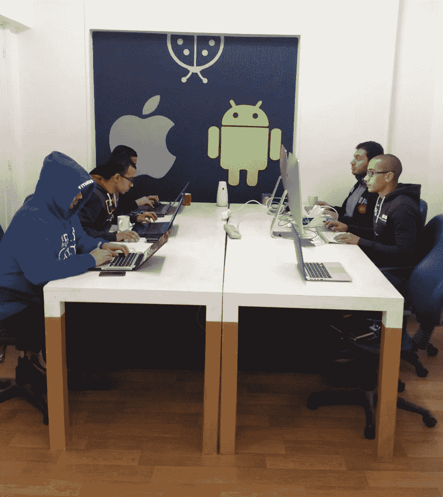
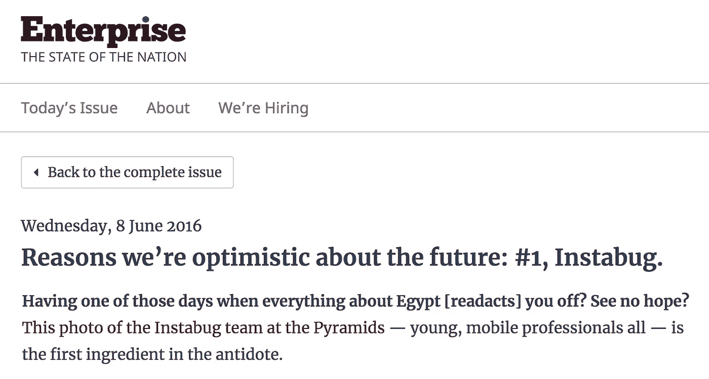
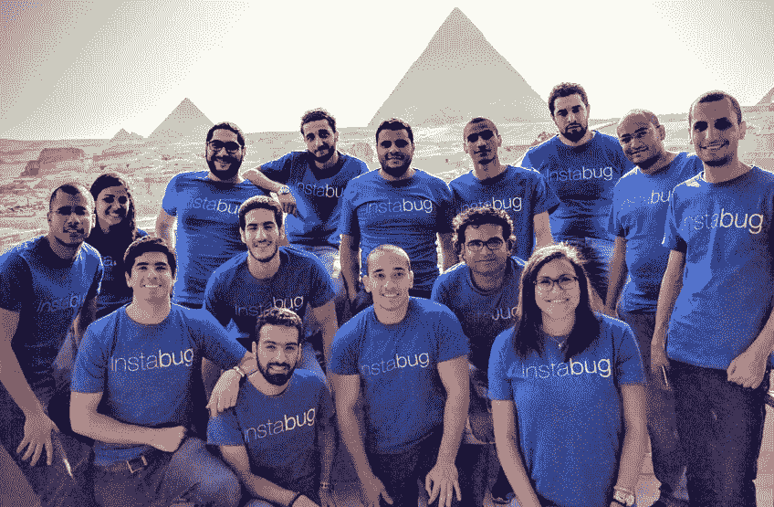

# 如何在埃及建造独角兽

> 原文：<https://medium.com/hackernoon/how-a-unicorn-is-being-built-in-egypt-ep-1-techcrunched-32ec6984d7fc>

[*Instabug*](https://instabug.com) *总部位于埃及开罗，成立于奥马尔·贾布尔(Omar Gabr)和穆塔兹·索利曼(Moataz Soliman)在开罗大学的最后一个学期。从 2012 年大学毕业到 2016 年从 Y Combinator 毕业，两人建立了一个团队，推出了针对国外客户的 MVP，开发了核心产品，扩展到了相邻的垂直领域，壮大了* [*Instabug 的*](https://hackernoon.com/tagged/instabugs) *用户群，并获得了越来越大的投资。*

*本文是关于 Instabug 的* [*初创公司*](https://hackernoon.com/tagged/startup) *旅程的系列博文的一部分——该公司“胜利”背后的挣扎以及克服这些挣扎的经验教训。*

# Instabug 不为人知的故事第 1 集:科技粉碎

两年前，我第一次听说 Instabug 是通过一个朋友，他告诉我他们最近的一轮融资。当时，这是埃及初创企业获得的最大一笔投资。

开罗的企业家队伍很年轻，但是充满激情。每周，你都会听到一家旨在解决问题和改变世界的有前途的新公司。每周都会有另一家前途无量的创业公司无声无息地消失。有时，一家初创公司会实现一个新的行业里程碑，推动整个创业生态系统向前发展。

去年加入 Instabug 团队后，我想明白为什么创业公司不属于那 90%默默消失的人。通过对公司历史的讨论和对各种团队成员的采访，我发现关于 Instabug 的那些众所周知的故事只是冰山一角。幕后总是有更多的层次、更多的人性和更多引人注目的细节。

我决定分享这些不为人知的故事，不仅因为它们很有趣，也是为了记录 Instabug 的特征，这些特征使它成为埃及第一只独角兽。

Instabug 的 2016 年投资是在科技博客 TechCrunch 上宣布的，世界各地的初创公司都渴望在这个博客上亮相。每月有数百万人访问博客，被“技术处理”意味着你的初创公司网站流量的大幅增加，以及投资者、竞争对手、同行和潜在客户的关注。Instabug 之前在另外三篇文章中已经在 *TechCrunch* 上被提到过，但是他们知道这次是特殊的。

与通常的情况不同，这篇文章没有展示创始人的照片或产品模型，而是展示了 Instabug 团队在吉萨大金字塔前的照片。

“我们知道这项投资对这个国家来说是一笔巨大的交易，我们也知道 TechCrunch T1 的文章很容易传播，我们知道这将是公司历史上的一个巨大里程碑，”奥马尔告诉我。“所以我们想拍好这张照片。我们不希望它只是一次产品更新。我们希望照片中的团队，也就是建造 Instabug 的人。”

“金字塔照片在埃及的科技界引起了巨大反响。“他们非常自豪，因为在 *TechCrunch* 上有一张埃及队在金字塔前的照片，”莫阿塔兹解释道。“我们获得了 10 倍的被‘技术破解’的效果，因为我们是一家埃及公司，这种情况不会每天发生在埃及公司身上。此外，这是一连串的报道，从 2016 年 2 月 [Instabug 3.0 发布](https://techcrunch.com/2016/02/02/instabug-the-yc-startup-out-of-cairo-is-out-of-beta-to-squash-mobile-bugs/)到 2016 年 6 月[金字塔图片](https://techcrunch.com/2016/06/06/ycs-instabug-raises-1-7m-seed-round-led-by-accel-to-grow-beyond-bugs/)结束

金字塔图片显示出了这个 BugSquad 是多么的“不择手段”。

“我们的计划是花两个小时去拍照，然后回到办公室继续工作。但我们最终在那里呆了一整天，所以我们都回家了，只是为了得到足够的睡眠，以便第二天继续工作，”Android 团队负责人 Mohamed Nagy 说。“在埃及发展一家初创公司并不容易，这也是这张照片如此重要的原因。”

这就是那张照片背后的故事。

# 技术加工

当 Instabug 在完成 Y Combinator 的 2016 年冬季批次后立即筹集到 170 万美元时，创始人们震惊了。他们相信自己的愿景、产品和团队，但他们没想到真的能筹到那么多钱。

“我们带着从银行投资中获得的大约 15 万美元去了 YC，我们实现了盈利，这意味着我们有无限的发展空间。但与此同时，我们没有任何空间进行实验；我们仍然被银行存款所限制。种子期过后，我们突然意识到我们的银行账户里有 190 万美元，”Moataz 解释道。

在 Y Combinator 之后，奥马尔和莫阿塔兹在 2016 年春天比预期的更早回到开罗。他们认为，在 YC 之后，他们需要一个月的时间来完成一轮投资，然后才能回到埃及。他们在三天内结束了这轮谈判。

“我们不断刷新银行账户页面，当钱在那里时，我们决定是时候回到埃及了，这样我们就可以 100%地专注于最重要的事情:开发产品。我们有很多工作要和团队一起做，以推动事情向前发展，我们希望确保我们带回了动力，并将这种兴奋转移到团队的其他成员身上。我们周二完成了交易，周五返回开罗，周日在办公室，”Moataz 回忆道。

“我们不知道他们会来，”人民的合作伙伴多尼亚·沙拉文说。“我们正在办公室，突然莫阿塔兹进来了。我们问他，“怎么样？”他只是说，“很好，还可以。”他继续工作。那天晚些时候，我们开了个会，奥马尔宣布了这个消息。我们没想到估值和投资会那么高。会议一结束，我们就回去工作了。"

*One of Instabug’s first offices in Cairo, Egypt.*

当时，Instabug 的办公室位于开罗东部边缘的一个两居室小公寓里，墙壁很薄。狭窄的客厅是 15 人团队的共享工作空间，卧室用于会议、采访、一对一、午餐、晚餐和国际足联比赛。在一个宽走廊大小的房间里，隔壁日托中心的孩子在尖叫，楼上的青少年在大声播放音乐，奥马尔宣布，该公司在由风险投资公司 Accel 和天使投资人牵头的一轮融资中获得了 170 万美元。

“他谈到了阿塞尔和[富翁](https://www.forbes.com/profile/rich-wong/)，我们未来的计划。当时我们并没有制定出每一个细节，但我们知道我们在银行里有很多钱，所以我们有勇气去做新的事情和下错误的赌注，以知道我们应该赌什么。作为一家公司，我们知道我们应该一如既往地保持足智多谋。

Instabug 与 Accel 的合作不仅是该公司的一个里程碑，也是埃及创业生态系统的一个里程碑。

“在创业公司工作并不是埃及典型的职业道路。但目前，创业作为一种有效的轨迹的想法已经发展起来，它正在推动人们尝试新事物，并在全球层面上工作。Instabug 表明这是可能的，”高级成长型营销人员 Yasmine Helmy 解释道。

两个月后， *TechCrunch* 向全世界宣布了 Instabug 的投资，团队在金字塔的画面传遍了埃及的创业现场。

[*Local news coverage*](https://enterprise.press/stories/2016/06/08/reasons-were-optimistic-about-the-future-1-instabug/) *of Instabug’s 2016 seed round in which it raised $1.7 million led by Accel.*

*The Instabug BugSquad at the Great Pyramids of Giza in the summer of 2016.*

# 金字塔图片

在 TechCrunch 的文章发表之前，文章的作者 Mike Butcher 要求附上一张图片。奥马尔和莫阿塔兹决定，他们希望这是一个团队的照片，产品背后的人。他们也为自己是一家实现这一里程碑的埃及公司而自豪。他们只是需要一个位置。

“金字塔怎么样？”奥马尔建议道。

“哦，那太疯狂了，”莫阿塔兹回答道。“就这么办吧。”

为了拍摄这张照片，该团队计划在工作日的中间去一趟金字塔。本来是两个小时的郊游，结果变成了一整天的任务。但是到了最后，团队让它发生了。

纳吉说:“要想以 15 人一组穿着同样 t 恤的身份进入金字塔群，官员们告诉我们，我们必须从 5 个不同的部门获得许可，因为他们认为我们要拍电视广告什么的。”。“真是荒谬。我们只想进去，拍张照，然后出来。但是他们不让我们进去。”

所以团队决定即兴发挥。“我们非常足智多谋，所以我们决定分散成组，想办法拍出最好的照片，”亚斯敏说。

“我们就像在办公室一样工作。我们分组工作来解决一个共同的问题，当我们面临任何挑战时，我们寻找变通办法，直到我们成功，”Donia 解释说。

一组人骑马进入沙漠，寻找金字塔建筑群的后门。其他人穿着没有品牌的 t 恤进入，为团队的其他人寻找不同的方式。另一组人试图与附近的建筑协商，以便进入它们的屋顶拍照。

在太阳下搜寻了几个小时后，队员们又饿又脱水，他们决定休息一下，去位于金字塔群正对面的必胜客吃点东西。

虽然足智多谋是实现目标的关键因素，但纯粹的运气有时可以成就目标，也可以毁掉目标。

纳吉说:“我们很饿，所以我们点了菜单上的所有东西，但没有足够的空间给我们所有人，所以他们把我们送到了屋顶。”当团队到达那里时，他们找到了拍摄照片的最佳视角。他们对图片的第一选择被否定了，他们花了一整天的时间寻找其他拍摄图片的方法，但没有成功，只是偶然找到了理想的位置。

纳吉告诉我说:“我们看起来像是在金字塔，但实际上我们是在必胜客的屋顶上，我们只是黑进了照片。”。

该团队最终找到了一个足够好的视角，但实际上拍摄照片本身又是一个挑战。

“我们用专业相机拍了很多角度的照片，但都没有效果。要么你看不到金字塔，要么你看不到队员的脸，”纳吉解释道。

有效的解决方案最终成为最简单的选择，尽管这需要做出牺牲。

“我们试了几次才拍到这张照片。我们甚至请了一些在那里的游客为我们拍照。最终，发表在 TechCrunch 上的照片是我用手机给团队拍的，”纳吉说。

“现在当我看到这张照片时，我不后悔我不在里面，”他继续说。“事实上，我很自豪是我拍的。”

# Instabug 是怎么活下来的？

Instabug 的案例似乎说明了几十年来心理学和管理学研究告诉我们的一个道理:对逆境的适应力和成功是正相关的。

Instabug 的核心价值观之一——公司文化赖以建立的行为标准，也是所有团队成员必须具备的——是“让它发生”。通过勇气、韧性或运气，让它发生。

当我问 Omar 和 Moataz 为什么 Instabug 会让事情发展到这一步时，他们并没有意识到，但他们的回答反映了这些研究已经证明的一切。

“只是出现，只是坚持，”莫阿塔兹告诉我。“肯定是运气。我认为这主要是因为我们在任何情况下都没有放弃——不仅仅是奥马尔和我，整个团队。我们都生活在同样的条件下，在这个国家发生一切的时候，我们通宵达旦地工作。”

“一致性，”奥马尔回答。“一贯努力。我们知道我们不是最聪明的人。我们尝试一件事，如果不成功，我们就尝试另一件事。这是我欣赏的人的最重要的特点之一，它已经融入了公司的文化。我们不容易被激励，也不容易被打击。这并不是因为我们固执，而是我们需要不顾一切地实现这一目标。我们转了几次。我们放弃了一些事情。这是一致性和毅力的结合。”

*原载于 2018 年 9 月 26 日*[*【instabug.com*](https://instabug.com/blog/instabug-untold-stories-ep-1-techcrunched/)*。*