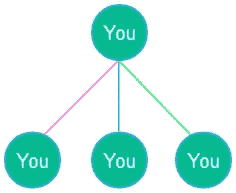
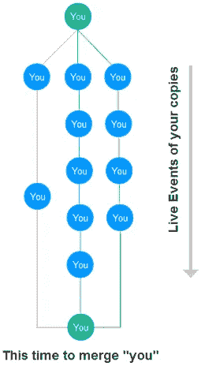
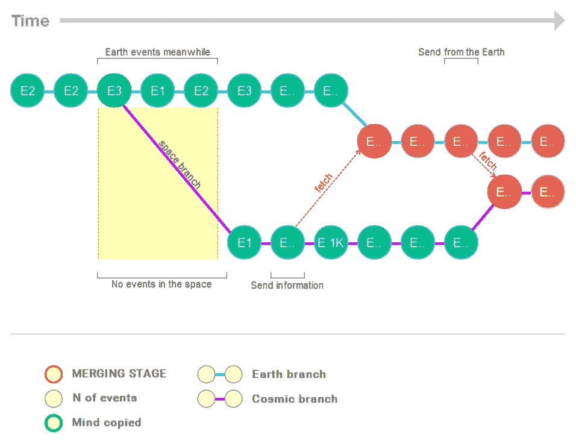

# 光速太空旅行

> 原文：<https://medium.com/hackernoon/how-about-travel-as-file-or-many-of-you-68454c8b812b>

在这篇文章中，我想说的是你关于殖民和生产力的激进观点，就我们现在拥有的技术而言。

关键点:

*   你在同一时刻出现在许多地方
*   你以光速在银河系旅行
*   主观体验维基数据库

# 像上帝一样有生产力(好吧，不如上帝，但像军队)

想象一下在未来，技术可以将你从备份信息中恢复到新的身体或机器人中。这种[技术](https://hackernoon.com/tagged/technology)不仅可以复制你，还可以创造你的 N 个例子。此外，你的所有克隆人将把他们的经历融合成一个中心*你*。

Hello Matrix!

部分软件开发人员猜测我是什么:[版本控制](https://en.wikipedia.org/wiki/Version-control)或者 GIT 为例。你可以阅读 GIT [这里](https://en.wikipedia.org/wiki/Git)或者[这里](https://marklodato.github.io/visual-git-guide/index-en.html)。换句话说，它是一个监视你修改的文本(你的程序)变化的程序。在任何时候你都可以把你的文本分成两个分支(就像把你的文件复制粘贴到同一个文件夹中)。例如，在第一个分支中，你可以添加新句子并重写部分，在第二个分支中，你可以检查并修复错误，添加图片并重写部分。过一段时间后，你会认为把它们的部分混合起来，合二为一会更好。

**举例**
举例来说，你可以立刻住在马尔代夫和其他地方**，接受教育，获得新的资金，并与工程师一起检查工厂，以便完全控制你的业务。**

****可扩展****

*   **这对你有好处。认识，旅游等更多。**
*   **这是超级科学。能够在许多地方工作以发展新的人道主义或经济理论的科学家。每天读 10 本书的学生。**
*   **这是规模令人难以置信的超级资本主义。当然，这与微观管理无关，而是与商业哲学有关。通过一个视图实现高级解决方案的效率。**
*   **…
    多得多**

**问题是微不足道的:**

*   **认知结构的表现**
*   **经验合并前的最优约简算法**
*   **将宝贵的一天经历融合在一起(因为有启动，小事也很重要)**

**我的立场:**

*   **我不相信不可能复制(这就像生活在石器时代，等待互联网的发明)**
*   **我不相信“你的”。我强烈相信上传的混合体验是你自己的，据称你以前生活过(如果我有时间和读者的兴趣，我会在未来的文章中解释这一点)**

# **把它当成你的经历**

**第二个想法是开源(从机密中提炼)经验的数据库:数学、语言、贫民窟的生活或当总统。这不是关于“如果我只生产子产品，为什么要活着”因为我们获得大众教育，维基百科，互联网不是关于人类文明的死亡，只是因为你生活在总统和权力的去精英化，你可以选择任何你想要的工作或伴侣。**

# **殖民！**

**第三部分是关于人类的扩张。(对不起，结构-媒体阻止子插件插入)简短地说:**

**思维复制的可能性假设:**

1.  **唯物主义立场**
2.  **作为信息的思维和记忆**

> **你需要知道的是，绝对没有理由*通过巨大的空间转移 150 多磅的软脂肪蛋白质生物质**

*   **我们需要一群自主的微型机器人，它们将带着上传的思想在太空中飞行**

**所以这些机器人会**

*   **寻求在可用环境条件下安排活动的方法(协商、研究和分析资源，根据最终目标评估可用的解决方案)**
*   **用地球上的材料创造工厂**
*   **生产新的机器人，并把人类的意识上传到它们身上**
*   **生产无线电、激光或量子发射器(如果需要)**

**同时“机器人”——人类**

*   **研究和其他目标**
*   ****通过无线电频道将思想作为信息发送回地球，以融合经验和知识****
*   **科学家和地球上的人们分享经验，就像他们在那个星球上一样**

**好吧，饭桶。你上场了！**

****

**微型机器人利用智能创造环境。自然工程师:白蚁群体还是人类文明。你不需要成为黑夜里的蝙蝠，也不需要成为巨人来建造摩天大楼。聪明的小步骤成就大事业。我们可以利用分子生物学中可控的东西，比如发明新的蓝细菌等

所以:**

*   **微型机器人可能比火箭还快([太阳帆](https://en.wikipedia.org/wiki/Solar_sail)，[突破星空](https://en.wikipedia.org/wiki/Breakthrough_Starshot))**
*   **以光速旅行——打破物理极限的奖励**
*   **通过使用信息减少物理瓶颈(DNA 不需要像人类一样大，这使它成为非常有效的自然模型)**

**问题**

*   **我们需要物理转移自主机器人的第一部分，这是任务时间的 80%以上。瓶颈**
*   **事实上，地球上的人们在没有死亡的时候从来没有到过外星球。这是我命名的人文主义的扩展困境(我将在下一篇文章中解释这个有趣的想法)**

**现在的问题:**

*   **无线电和激光信道的带宽**非常不利于**巨型空间传输大东西(科学上需要 20-400 年)。量子物理学可能是候选者**
*   **在未来 50-300 年内，思维克隆和融合是不可能的技术**
*   **愚蠢和自闭的机器人没有能力解决真正创造性的问题(20-100 年)**
*   **愚蠢的谈判技巧，即使是博弈论等(你好政治-我不知道有多少)**
*   **材料科学正处于绿色发展阶段(20-200 年)**

# **类似**

*   **大脑扫描类似于 [3D 打印](https://en.wikipedia.org/wiki/3D_printing)之前塑料立方体的 [3D 扫描](https://en.wikipedia.org/wiki/3D_scanning)形式**
*   **[文件](https://all3dp.com/3d-file-format-3d-files-3d-printer-3d-cad-vrml-stl-obj/)中有立方体的扫描数据，我们可以通过互联网在全球范围内传送给我们在澳洲的朋友**
*   **朋友用自己的 3D 打印机打印立方体**

**结束？不。我担心没有尽头的未来。**