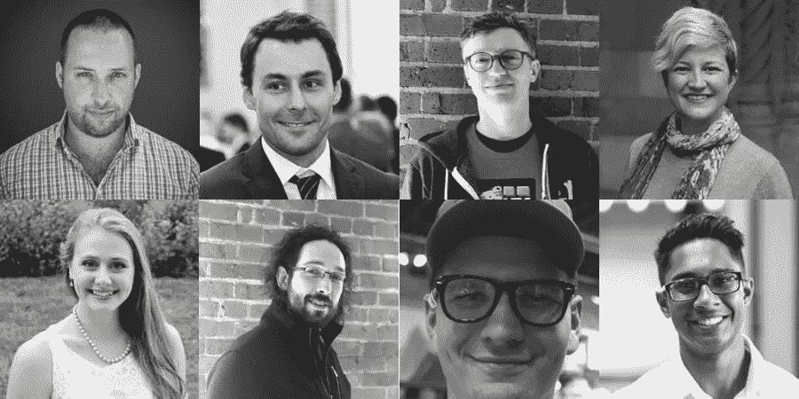

# 2025 年平价医疗看起来如何

> 原文：<https://medium.com/hackernoon/how-affordable-healthcare-looks-in-2025-ddf8ba4d1364>

## 对我们在[体面的](https://www.decent.com/)的团队来说，去中心化的未来是美好的

科罗拉多州博尔德市，2025 年:艾娃听到刹车声，用力撞上人行横道。那辆车不知从哪里冲进了十字路口，飞快地开走了。她受到了惊吓，但并没有受伤，所以她花了一点时间在手表上检查她的生命体征。她插上耳塞，打电话给她的健康池的护理热线。哈维在第二声铃响时接起电话。

“关心就行。这是怎么回事？”

“我在巴尔萨姆街和第 14 街被一辆汽车擦了一下。我想我没事，但我不确定。”

“明白了……看起来第十大街上有一家顶级诊所。泽冯医生 15 分钟后可以见你。你能做到吗？”

“我想是的。我对这个游泳池不熟悉。这要花我多少钱？”

“花费你多少？我们要确保你没事。现在就去那里，它是免费的。”

**保健的神经系统在这里。**

马库斯和凯瑟琳是健康泳池的老手。他们在 2019 年加入了第一批人，当时他们是自由开发者，凯瑟琳怀了他们的女儿比伊。一家名为正派的公司正在管理一个新的综合健康计划。回过头来看，这是一个很好的决定——它奖励了他们做出明智的健康选择，涵盖了各种类型的测试和预防性护理，并且每年都在扩大和改善——但当时现金紧张，他们选择了它，因为这是他们能找到的最实惠的选择。

第一个健康计划已经演变成一个分散的协议和网络，使得建立一个没有浪费或中间人的合法健康池变得简单。世界各地有数百个游泳池，每个游泳池都是由会员经营的合作社，涵盖从针灸到营养教练到锻炼跟踪到指导冥想等多种治疗方法。马库斯是糖尿病患者，所以他们加入了一个奖金池，奖励他保持对他的照顾。低收入会员可以享受免费福利，协议逻辑可以确保成本节约在各个福利池之间共享，健康福利包括对病人的护理。付费服务模式正在消失——医生因保持病人健康而获得回报。每天都有新的治疗池形成，如果他们覆盖的治疗有效，他们的保费就会下降，更多的成员加入并节省更多的钱。曾经由传统保险公司完成的工作——如录取、索赔管理和谈判——越来越多地由软件和智能合同处理。软件不能处理的事情被外包给分散网络的合格成员，他们的努力会得到代币的奖励。会员控制他们的健康信息，新的数据存储方法帮助提供者协调治疗而不损害隐私。该协议服务于 1 亿会员，并且还在增加。

**体面使我们的激励措施围绕高质量的平价医疗。**

传统的健康保险公司被要求将收取的每一美元保费中的至少 80%用于医疗保健。他们的利润和管理费用被限制在 20%,这创造了一个[不正当的激励](https://www.npr.org/sections/health-shots/2018/05/25/613685732/why-your-health-insurer-doesnt-care-about-your-big-bills?utm_source=pocket&utm_medium=email&utm_campaign=pockethits):只要他们能把上升的成本转嫁给他们的成员，他们就能拿走不断增长的馅饼的 20%,并且在成本上升时实际上有更多的机会赚钱。

在正派，我们相信[医疗保健中最深层次的问题是错位的激励](https://hackernoon.com/us-health-care-needs-a-nervous-system-4dc743fac5f8)。我们认为我们已经找到了一种更好的方式来调整我们对会员的激励，我们刚刚筹集了 800 万美元来证明这一点。我们的使命是创造一个更公平、更健康的未来:让所有人都能负担得起医疗保健。

如果这引起了你的共鸣，那就来说说吧。我们[刚刚从伟大的投资者那里筹集了 800 万美元](https://hackernoon.com/decent-com-just-raised-8mm-to-build-affordable-healthcare-for-all-554c15a739b6)，并且[我们正在旧金山和西雅图招聘](https://angel.co/decent/jobs)。我们正在 Telegram 上建立一个早期的[社区，它已经在帮助激励我们，激发我们的愿景，并让我们对实现目标负责。请今天加入我们，让我们听到你的声音。我们需要你的帮助，让每个人都有体面的工作。](https://t.me/DecentHealth)

Decent’s team in June 2018