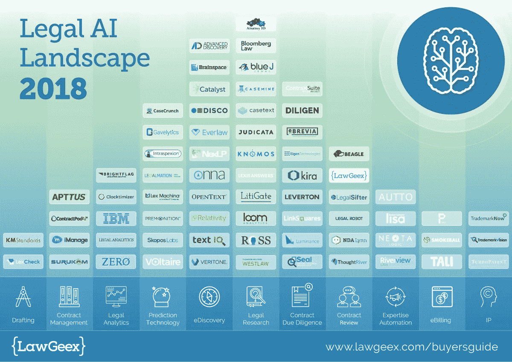
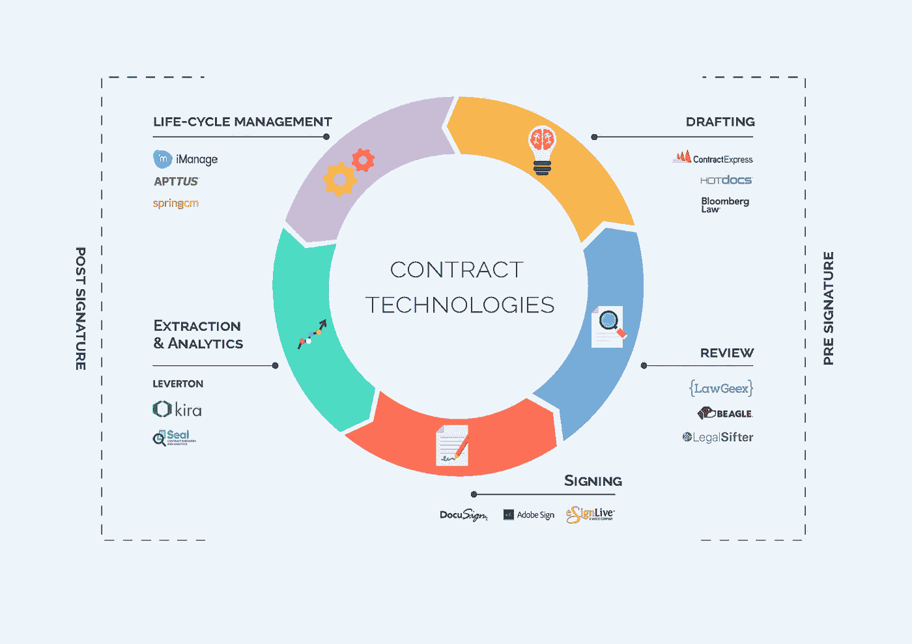
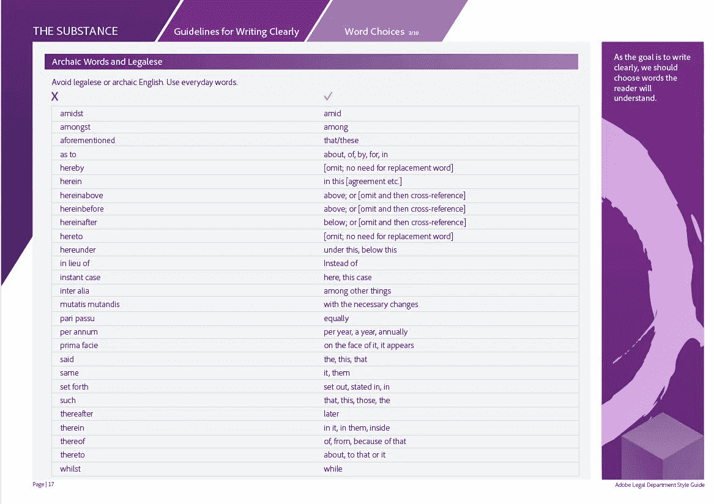

# 蓬勃发展的法律 AI 能否最终摧毁 Legalese？

> 原文：<https://medium.com/hackernoon/how-ai-broke-the-legalese-code-207261aaa067>

There has been an increase of 65% in legal tech companies utilizing AI in 2018

在《法律术语的奇妙世界》一书中，作者亚当·弗里德曼指出，律师的用词如此另类，以至于国会已经设计了几十个“通俗语言”法案来规范它们。然而，这种改革长期以来一直受到阻碍，因为许多律师反驳说，法律太复杂了，无法用“简单”的词来概括。

在这种情况下，我们仍然有被十九世纪狄更斯等作家嘲笑的法律术语在流通。[福特汉姆大学法学院的 Carl FelsenFeld 教授指出了一些常用词](https://ir.lawnet.fordham.edu/cgi/viewcontent.cgi?article=1475&context=faculty_scholarship)，如‘witnesseth’，‘here’和‘dully’，尽管它们“没有增加任何意义”。他补充说，对律师来说，停止使用这种语言并不容易，因为“这意味着动摇几个世纪以来专业强化的语言传统的影响。”

**进入 AI 和法律术语大洗牌**

然而，在其他努力失败的地方，人工智能的进步可能会证明是法律术语的最终征服者。合法的人工智能公司明显增加(当前的商业参与者如上图所示)，仅在 2018 年[合法的人工智能公司就获得了 3.55 亿美元的投资](https://blog.lawgeex.com/contracts-center-stage-as-legaltech-funding-on-course-to-top-1billion/)。

就像道格拉斯·亚当斯的巴别鱼一样，这些解决方案中的许多正在将一种难以理解的语言(同样混淆了陪审员和企业)翻译成简单的英语。斯坦福大学计算机科学专业 21 岁的企业家约书亚·白劳德本月发布了一款应用程序，生动地证明了这一点，该应用程序允许普通人通过删除所有行话来起诉企业。免费聊天机器人提供人工智能法律顾问，可以用来“按下按钮起诉任何人”。

聊天机器人的工作原理是穿过法律术语的网，问你一系列关于你的情况和你想起诉谁的简单易懂的问题。然后，它会起草文件，你需要发送到法院成为原告，并会生成一个脚本，供你阅读，如果你需要亲自出席。

在最近的一项研究中，人们发现 AI 可以比经验丰富的律师更好地理解法律术语。由(我工作的公司)LawGeex 与顶尖大学的顶级法律学者合作进行的[研究](https://www.lawgeex.com/AIvsLawyer/)涉及让人工智能接触数万份法律文件。这教会了人工智能理解法律术语的非自然语言。Bar Ilan 大学计算机科学系讲师 Yonatan Aumann 教授是 LawGeex 的顾问，他说:*人工智能的母语是法律术语。该算法现在可以识别此类合同中的概念，即使它们的措辞方式前所未见。”*

*在**预签名阶段**用于决定公司是否可以签署日常文件(想想保密协议、服务协议、SaaS 协议)，这个以人工智能为母语的法律术语以一种远比生硬的“关键词搜索”更复杂的方式运行关键词搜索可能包含过多或过少，因为单词可能在相关文档中不存在，或者出现在不相关的文档中。真正的人工智能可以识别一个概念，无论它是如何措辞的，或者出现在文档中的任何地方。*

***法律术语在合同阶段受到攻击***

**

*当涉及到创建、审查和管理数十亿份合同时，破解法律术语已成为圣杯。就像合同评审的情况一样(我可以签这个吗？)它也适用于联系人的初始起草(我该如何起草？).Contract Express、HotDocs 和 Bloomberg Law 等公司正在研究新技术来实现这一目标，而财富 500 强 NetApp NetApp 最近宣布了新的人工智能技术，用于其法律部门创建合同。这是通过提取与伙伴关系协议相关的信息并将信息上传到适当的数据库中实现的。该公司表示，这比他们以前完全手动的流程快了 600%。*

*在**签名后阶段**使用人工智能破解法律术语也至关重要，以从 IFRS、英国退出欧盟或欧洲新的一般数据保护法规中发现相关信息，特别是在不断变化的合规性规则的情况下。这代表着一个巨大的机会:财富 500 强仅在回应布鲁塞尔 GDPR 上就花费了 78 亿美元，相当于每家公司将近 1600 万美元。作为该领域的法律人工智能参与者之一，Kira Systems 最近筹集了 5000 万美元，解开法律术语以提高合同数据提取的准确性和监管合规性。Kira 可以快速审查大量遗留和第三方供应商合同，并仅突出显示可能受变更影响的数据。它包括费力地阅读数以千计的法律术语，将花在文档审查上的时间减少 20–90%。*

***智能合约的作用***

*英美计算机科学家史蒂夫·沃尔夫勒姆指出，基于技术的破解法律术语的方法并不新鲜。他说，事实上，早在 17 世纪晚期，戈特弗里德·莱布尼茨[就试图发明本质上的计算概念](https://www.businessinsider.com/how-smart-contracts-can-work-2018-10)，旨在将所有法律争论转化为可能由机器解决的纯逻辑问题。但是直到今天，科技才赶上了法律在传播法律术语方面长达一个世纪的领先。Wolfram 认为，随着区块链的出现，我们现在接近于编写一个“不是用法律术语而是用某种计算智能语言编写的计算契约，如果我们愿意，它实际上可以由计算机来执行，也可以被人类理解”。用另一位[黑客 Noon 撰稿人](https://hackernoon.com/even-the-best-smart-contracts-wont-put-lawyers-out-of-work-anytime-soon-a224736e0235)和律师 Brett Cenkus 的话说:“法律语言需要进入可执行代码”。一些所谓的“智能合同”的早期例子包括专业服务公司 EY，它为 T4 保险行业推出了一个智能合同和区块链平台，专注于全球航运。这包括从多方创建和维护资产数据的能力，将数据链接到保单合同的能力，以及接收和处理导致定价或业务变化的信息的能力。保险巨头安盛也推出了为消费者承保航班延误的自动执行合同。*

***法律术语上的叫停时间***

*事实证明，法律术语并不是一种没有受害者的犯罪，这使得技术的入侵变得更加重要。根据合同经理协会的年度基准调查，只有 12%的律师认为合同是可以理解和容易阅读的。其混淆语言的永久化也对消费者不利。普通美国人的阅读水平是八年级水平。一般的在线服务条款、隐私政策和消费者合同都是在大学水平或更高水平上编写的。*

***违反法律用语的公司***

*技术提供商已经从具有前瞻性思维的大企业(其中许多是科技公司本身)的新态度中受益。Adobe 的高级副总裁兼总法律顾问迈克尔·迪里昂(Michael Dillion)被迫改变了他在财富 500 强公司跨国软件公司的所有合同。他说:“不幸的是，法律行业的品牌被一种观念玷污了，那就是我们的墨水瓶里充满了令人困惑的东西”，他从他的法律团队的合同中手术般地删除了“上文”、“比照”和“此处”等词。*

**

*Ending Legalese: From the Adobe Legal Department Style Guide*

*通用航空公司总法律顾问肖恩·伯顿设立了这个标杆。他[说](https://www.ge.com/reports/keep-simple-plain-english-helping-ge-keep-business-humming/):“我应用了一个石蕊测试:如果一个高中学生在没有任何上下文的情况下不能理解它，那么它就不够简单”。*

***见证变化***

*技术，特别是人工智能，可能会提供一种方法来一劳永逸地结束复杂的法律术语。这个新时代有望让法律的曲折过程变得更清晰、更快捷，并把权力还给那些母语不是法律术语的人。这一突破有助于将一种超凡脱俗的语言翻译成我们都能理解的简单指令和更清晰的过程。*

*乔纳森·马西亚诺是 LawGeex 的公关总监*