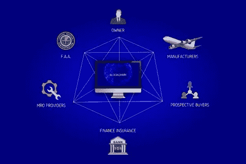
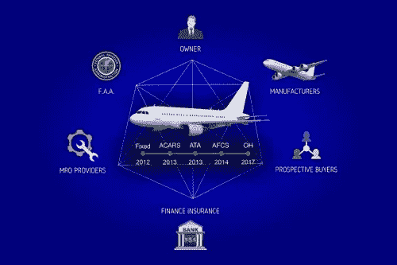

# 飞机系统如何与区块链一起工作

> 原文：<https://medium.com/hackernoon/how-an-airplane-system-works-with-blockchain-30d8b9fd7f6a>

Photo by [Rodrigo Rodriguez](https://unsplash.com/photos/x7bbQIY6H04?utm_source=unsplash&utm_medium=referral&utm_content=creditCopyText) on [Unsplash](https://unsplash.com/search/photos/aeroplane?utm_source=unsplash&utm_medium=referral&utm_content=creditCopyText)

随着每个人都选择环游世界和探索世界，旅游业在当今时代正在发生巨大的飞跃。航空业在旅行中起着至关重要的作用，因为今天的航班比以往任何时候都更容易获得和负担得起。预计 2017 年的机队数量将超过 21，600 架，航空业预计到 2037 年机队数量将增长约 43，560 架，几乎翻了一番。

# 航空业问题

尽管近年来航空业有了巨大的发展，但它仍然面临着一些需要借助技术来解决的问题。首先，该行业的安全部分需要引起重视，因为每年有近 3302 起航空事故发生。这可能是由于数据记录不准确、缺乏维护或员工不关心造成的。

让我们来看看影响航空业发展的问题。

**纸质活页夹-** 当今航空生态系统的运行结构包括使用纸质日志来存储维护数据或信息。在需要修理的情况下，根据日期检查过去记录的过程变得繁琐和麻烦。此外，在当前系统中生成的票据还涉及纸张的使用，这是不必要的浪费。

**数据隐私-** 乘客依赖航班系统，同时透露他们的身份和信息。保护这些数据是必要的，因为这些信息的泄露会导致系统的信任问题。

**安全-** 在航空生态系统中，当安全和安保出现问题时，运营的完整性和收入的产生就岌岌可危。从身份到数据记录，一切都需要安全，因为它们的影响会导致麻烦的情况

**多个隔离系统-** 航空公司由许多独立的隔离系统组成，如乘客服务和机组人员管理系统。由于这种隔离，这些系统之间的数据传输过程不是很顺畅。此外，单个系统容易出错，因为从多个资源中提取记录会增加冗余和出错的可能性。

不诚实的员工/部门- 虽然航空业的招聘过程很艰难，但不能保证所有的招聘都是最诚实的。由于飞行日志记录很容易伪造，飞行员可能没有他们展示的那么多经验。此外，飞行学校腐败的可能性同样受到质疑，因为他们有权根据飞行时间修改文件。除此之外，系统中的操作人员还可以通过少报飞行时间来节省维护成本。

# 进入区块链

区块链技术凭借其不变性和安全性的特点，可以成为航空业的救星。区块链系统以块的形式存储信息，块包含交易数据及其历史记录。

每个区块都经过共识过程的验证，并以保护任何人不破坏或操纵信息的方式密封。虽然信息是高度安全的，但它对网络的所有参与者都是可见的。

**什么是区块链？**

*   区块链是一个分散的网络，它不受任何一个实体的控制。
*   网络中的所有参与者都单独维护一份区块链，该副本被称为分类帐。
*   以新数据块的形式将信息添加到该分类帐后，该信息将在整个网络中共享，从而使所有副本保持同步。
*   由于区块链网络在本质上是分布式的，它被证明比传统的数据库更加健壮和安全。

当谈到航空生态系统时，它涉及到其保护伞下的多个子系统，区块链变得非常有用，因为它允许在这些系统之间透明地共享相同的数据，同时提供最大的安全性。基于区块链的平台可以创建一个航空系统，该系统以降低的成本和增加的数据传输以及新的可能性运行。

通过将该技术应用于独立的操作系统，可以充分利用区块链的潜力。飞机租赁中涉及的许多操作任务，如维护、支付、货币兑换，都可以放在区块链上，从而获得生态系统的整体视图。

考虑一个私有链的概念，这个私有链可以被所有的行业利益相关者根据他们的权限访问。这个链可以作为多个活动的单一位置。首先，维护过程中涉及的资产跟踪将受益匪浅。

维护日志可以完全转换并保存在区块链上，这将防止系统中的任何人修改条目或数据集。此外，团队可以轻松地检索这些存储的信息，以检查过去的记录并计划未来的维护需求。

此外，由于航空公司和租赁提供商在同一个系统上，可以使用智能合同来自动化这些功能。通过将令牌与诸如飞机或其任何部件的物理资产相关联，可以促进这种自动化。代币还可以被转移以兑换数字货币。

例如，纸质票证和电子票证都可以通过区块链中的智能合同以资产的形式进行令牌化。这些票证一旦与销售和购买的业务逻辑相关联，就可以由系统的任何成员在全球范围内实时销售。

除了主链，侧链的实现也是可能的。侧链将与主链一起运行，并可用作存储飞机内所有交互数据的单一介质。主链将有一个参考或散列，它将连接到侧链上的信息。

这将是有益的，因为它将保护主链免受信息过载。每架飞机的不同链将允许顺畅的分析，因为分析层可以保持在系统的顶部，该系统可以组合任何特定航空公司的机队信息，并通过仪表板共享。

此外，每架飞机的独立链将允许特定的人有读写权限。例如，对存储在链上的维护信息的读写访问权可以由 MRO 公司共享，而监管者可以仅被提供查看信息的读访问权。

# 区块链在航空领域的优势

1.  一架飞机的所有尺寸都可以包含在单源图像中
2.  网络中的所有用户都有自己的分类账副本，每个人都可以访问
3.  经过验证的交易被永久存储，防止丢失或更改
4.  网络参与者根据其管辖范围保留自己的分类账副本，以确保数据中不存在监管问题
5.  分散数据库的应用节省了开支，降低了基础设施和管理成本
6.  第三方合同可以在区块链上存储和执行，而不是纸质或电子邮件文档，以减少欺诈

区块链的革命性技术正在被许多业务流程和公司采用。同样，区块链在航空业实施时可以促进行业发展并创造新的基准。

> 尽管目前区块链在航空领域的使用案例可以改进系统并提高效率，但仍有许多案例有待改进。在航空领域采用区块链将降低成本、改善管理并增加业务。

要了解更多关于区块链在航空领域的知识，你可以查看我之前写的另一篇文章，[https://bit.ly/2sRH6k0](https://bit.ly/2sRH6k0)