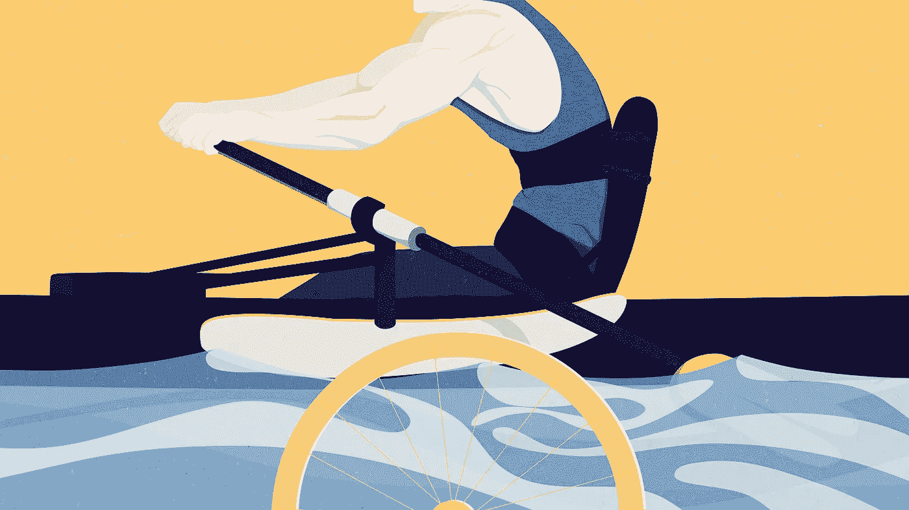
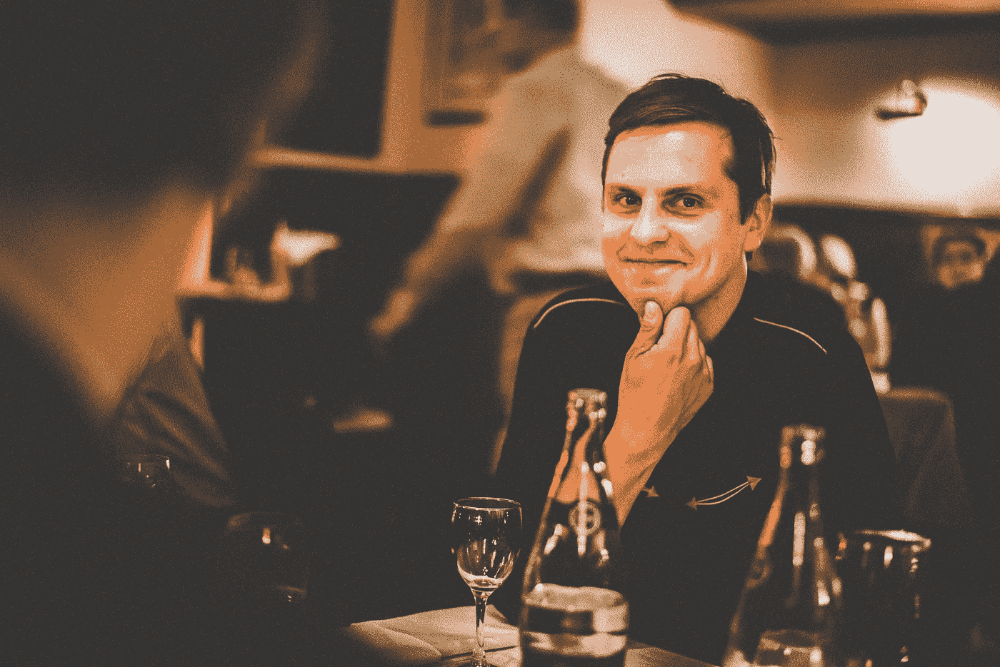
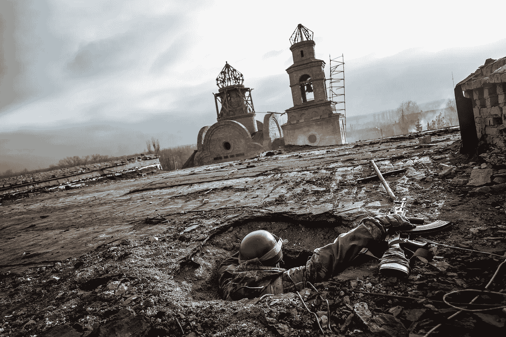
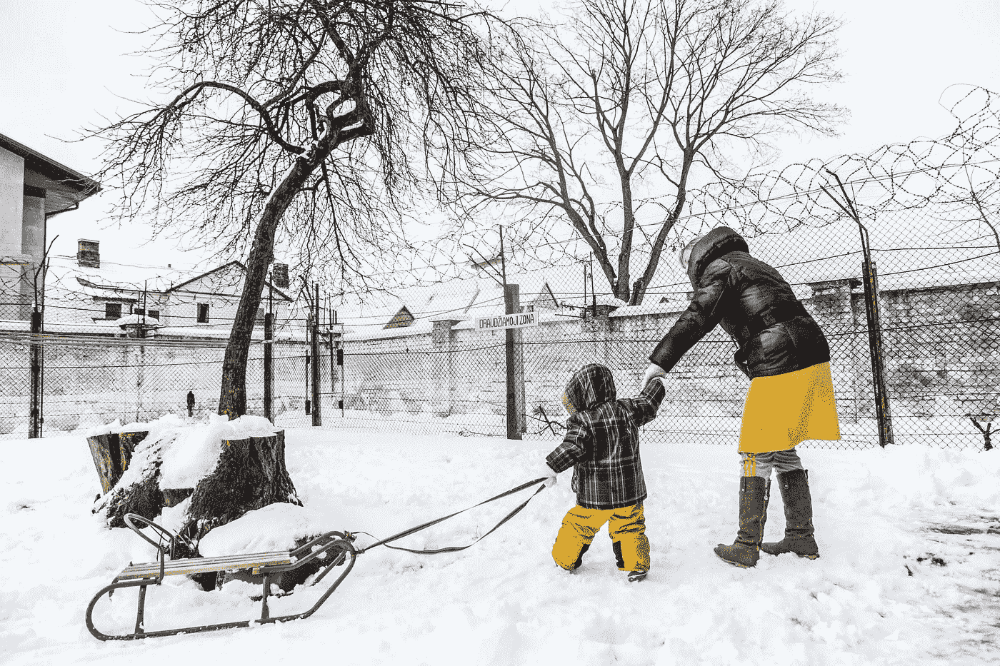
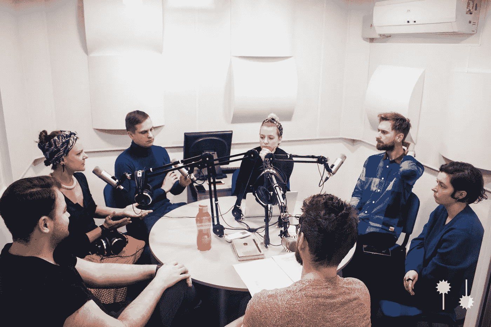
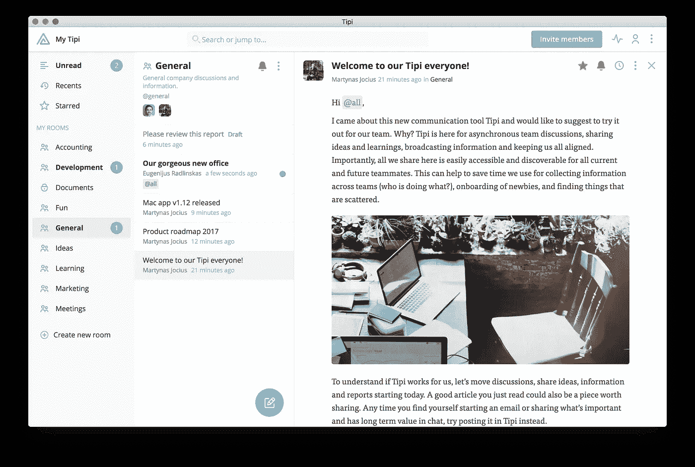

# 如何建立一个获奖团队并通过故事改变世界

> 原文：<https://medium.com/hackernoon/how-an-award-winning-team-of-journalists-is-changing-the-world-through-stories-ce1282d66ce0>

作者:Agota Bialobzeskyte

“Will to Win” / nanook.lt / ©[Egle Plytnikaite](http://egle.plytnikaite.com)

[*Arturas Morozovas*](http://www.artmor.lt)*是著名的摄影记者，也是独立创新的当代媒体机构* [*Nanook*](https://nanook.lt/en/home/) *的联合创始人。*

他参与了许多有意义的重大项目:他记录了政治危机，在战区呆过，报道过移民潮。尽管如此，他最自豪的成就是 Nanook，这是他和多媒体记者 Berta Tilmantaite 共同创立的。

在这次采访中，我们问 Arturas，作为一名媒体创新者，报道来自一个鲜为人知地区的艰难故事意味着什么？

Arturas Morozovas / ©Berta Tilmantaite

**什么是 Nanook？**

Nanook 是一家多媒体媒体机构，制作新闻、纪录片和创意项目。

我们创作自己感兴趣的故事，并使用多种媒体(文本、照片、视频、插图等)以创造性的方式讲述它们。).我们最近开始制作 [NYLA](http://www.nyla.lt) 播客，它引发了很多讨论，因为它涵盖了鼓舞人心和有点不舒服，但总是有影响力和推动变化的故事。

我们也相信教育的力量。Nanook 为年轻的专业人士提供了一个与我们一起实习的机会，并学习纪录片项目是如何创建的，以及记者道德有多重要。几名年轻记者已经从这个项目毕业。我们为这个实习项目感到非常自豪！

你是如何想出 Nanook 这个主意的？

我记得当我刚开始与一家国际机构合作时，他们发给我一份附在协议上的巨大的道德准则。我对此感到惊讶。毕竟当时我已经在国家媒体干了 3 年了，也没人讲伦理！

时间在流逝。我去过很多地方，报道过各种国际新闻，也和世界上一些最好的记者和摄影师一起工作过。所有这些经历让我明白了职业道德在新闻业中的重要性，并形成了一定的职业标准。我再也回不到以前做事的方式了。

War in Ukraine / ©Arturas Morozovas

但与此同时，我与立陶宛媒体结缘，并在为当地媒体工作时经历了令人难过的不同。

2014 年底的一天，我遇到了波塔·蒂尔曼泰。她是一名经验丰富的记者，曾在《国家地理》等媒体上发表过文章，到过世界各地。她对新闻职业道德有着同样的理解，也经历着同样的问题。我们在说彼此的语言！

因此，在 2015 年初，我们决定创建自己的记者团队，他们将按照我和波塔习惯的专业标准工作。

波塔邀请她的一些新闻学学生来实习，积累一些经验，我们开始着手我们的第一个项目，[“单调的日子”](https://nanook.lt/en/monotone-days/)，Nanook 诞生了！

Berta Tilmantaite / ©Lucas Cwierz

**是什么让 Nanook 独一无二？**

我认为我们的独特之处在于，我们有一个由不同专业人士组成的团队，从记者和摄影记者到摄像师和插画师，再到编码师和平面设计师，这让我们能够快速行动，以不同寻常的方式讲述故事。例如，[《单调的日子》](https://nanook.lt/en/monotone-days/)通过视频结合动画和声音讲述故事，图片和文字支撑故事。据我所知，全世界只有几支这样的球队，我们是唯一一支在东北欧的球队。

我们还覆盖北欧和东欧。起初，我们有点犹豫，认为来自这个地区的故事对这个地区以外的人来说可能没那么有趣。然而，在《单调的日子》被半岛电视台收购后，我们意识到人们对这类故事有着浓厚的兴趣。

我们觉得在报道这个地区的新闻时，我们处于一个特殊的位置。我们都在欧洲东北部长大，我们与交谈对象分享文化背景。这让我们发现了西方记者永远想不到的角度。

War in Ukraine / ©Arturas Morozovas

**哪些 Nanook 的故事影响最大？**

我会说[《单调的日子》](https://nanook.lt/en/monotone-days/)。

女人被期望扮演某些角色——顺从的女儿、可靠的妻子、负责任的母亲。还有什么比一个女人犯罪更远离这些期望呢？女囚犯处处受到排斥，她们的未来往往非常暗淡。通过“单调的日子”,我们想向人们展示这些女人不仅仅是罪犯——她们就像你我一样。我们认为我们成功了！

Panevezys 惩教所和当地社区之间有长达十年的宿怨。有必要为有孩子的妇女建造一栋单独的建筑，但是人们不希望这些妇女住在他们旁边。惩教所无法获得建造许可。这意味着儿童继续生活在贫困中，甚至不能体验最简单的事情，如看到一只猫或一只狗，或一辆经过的汽车。

我们的故事发表后，当地人更多地了解了这些妇女所处的困境，对她们产生了更多的同情，事情开始有所进展。现在，有孩子的妇女住在一栋独立的大楼里，在那里她们可以在更好的条件下抚养孩子，从而给孩子一个更快乐的童年。

“Monotone days” / nanook.lt / ©Berta Tilmantaite

然后是我们关于残奥会运动员的故事[“必胜的意志”](https://nanook.lt/en/will-to-win/)。

虽然与健康运动员相比，残奥会运动员在行动上受到更多限制，但他们最重要的战斗不是在跑道上或游泳池里，而是在日常生活中——他们正在与残疾人无法完整生活的刻板印象作斗争。

我们所有的研究对象都是有固定工作的普通人，他们把训练作为业余爱好。甚至有些教练自愿免费训练他们！当然，这不是我的选择，而是因为缺乏资金。此外，奥运会选手的国家奖金是残奥会选手的 7 倍。体育界有很多不平等现象。

当我们的故事发表后，读者开始用信件和电话轰炸国家奥委会，询问为什么残奥会运动员得到的关注和资金如此之少。这一反应导致了法律和资金方面的一些变化。立陶宛总理承诺将残奥会运动员的国家奖金提高到现在的两倍。与此同时，立陶宛总统本人建议让这些奖金与奥林匹克运动员获得的奖金相等！

“Will to Win” / nanook.lt / ©Egle Plytnikaite

**纳努克没有办公室。你为什么决定在远程团队工作？**

*嗯，我们在 Nanook 的主要规则是，我们只做我们感兴趣的项目，这意味着旅行的能力极其重要。*我们希望能够在世界任何地方工作。

此外，从事需要专注和创造力的工作的人需要自由选择自己的工作时间。有些人是早起的鸟儿，有些人是夜猫子。我们必须适应缪斯女神！

因此，简而言之，被束缚在一个地方和朝九晚五的工作时间对我们来说没有任何意义！

[Nanook team making podcasts](https://nanook.lt/en/podcast/) / ©Vilma Kulyte

**作为远程团队工作的主要挑战是什么？**

我认为有两个主要挑战。

首先，你需要学会如何在家工作(或者无论你当时在哪里)，这说起来容易做起来难。你需要有自律，你需要管理好自己的时间，你也需要得到足够的休息。我们花了很长时间才学会这一切。

第二，你需要找到一种有效的方式与对方沟通。起初，我们甚至没有想到这一点，我们只是在那一刻做什么是方便的，无论是发送电子邮件，使用脸书信使，或只是打电话给那个人。但这导致信息分散在许多不同的渠道，很难掌握所有信息。我们都或多或少错过了一些重要的东西。

当我们开始使用 Tipi 时，一切都变了。我们只花了几分钟就设置好了——我们创建了公共和私人房间，邀请了团队成员，并将我们所有的讨论和文件都移到了那里。突然间，所有东西都在一个地方，我们的交流变得更有效率。

这对我们的生产力产生了巨大的影响。例如，在切换到 Tipi 之前，我花了大量时间寻找对话、文件等。现在我可以立即找到我想要的任何东西！*我发现 Tipi 平均每周能为我节省近 4 个小时。当你考虑一个 10 人的小团队时，它每周加起来可以节省大约 40 个小时的时间，这太疯狂了！*

而且这样工作会更愉快。你不会经常感到压力。有空可以回消息。这让你安心，真正专注于你的工作。

改用 Tipi 对我们来说绝对是一个改变！

Tipi communication platform / www.tipihub.com

**你对其他拥有远程团队的公司有什么建议？**

你不需要办公室，但你需要纪律，因为没有纪律你将一事无成。

此外，确保你所有的交流都发生在一个地方，否则你会疯狂地试图跟上这一切！

**谢谢你，阿图拉斯！**

为您的团队试用 Tipi，创建您的帐户并在此下载应用:[www.tipihub.com](https://www.tipihub.com/?utm_source=medium&utm_medium=blog&utm_campaign=tipi-vs-slack&utm_content=direct-link)。