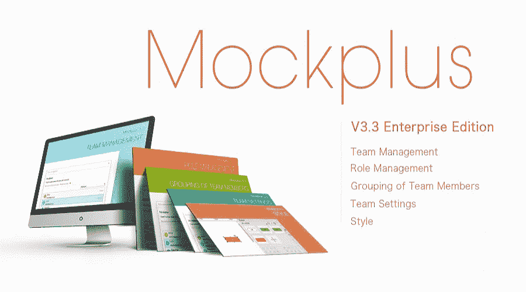
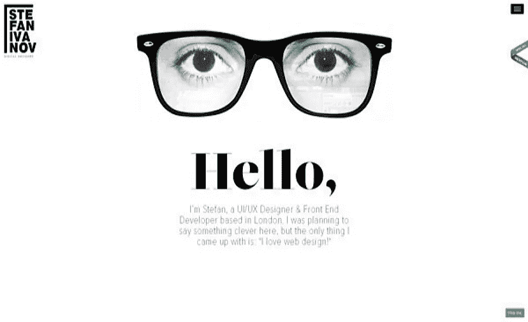

# 2018 年夏天怎么去哪里找设计实习

> 原文：<https://medium.com/hackernoon/how-and-where-to-find-design-internship-in-summer-of-2018-21ab2aae253f>

找设计实习不容易，但是不要放弃。我想出了 10 个最有用的技巧来帮助你在 2018 年夏天获得第一次设计实习。

**找不到设计实习？**

还不知道怎么去哪里找实习机会？

你在正确的时间来到了正确的地方。

找设计实习不容易，但是不要放弃。你只需要一些提示来指导你完成这个过程。作为一名高级设计师，我收到了很多学生设计师的邮件和实习申请，但很少有人能满足这个职位的要求。所以我想出了这些**10 大技巧来帮助你在 2018 年夏天获得你的第一份设计实习。**

让我们开始吧。

# 1.你不再是学生了

就算是本科也不要再把自己当大学生了。你是即将进入设计行业的设计师。不像在大学，职场很残酷。如果你不合群，任何人都可以取代你。

# 2.找到你的职业道路

让我们面对现实吧，弄清楚什么工作最适合你的技能和兴趣是有压力的。但是你必须在找到第一份工作之前做出选择。你想成为什么？UI 设计师，UX 设计师，交互设计师还是视觉设计师？如果你不确定你的职业应该朝哪个方向发展，问问有同样经历的人。

# 3.掌握这些设计技能可以让你被录用

你在大学里学到的理论知识，在现实的设计工作中不一定适用，但这些都是你应该掌握的基础知识。所以，想成为 UX 设计师，需要做[用户调研](https://www.mockplus.com/blog/post/user-experience-researcher)，画[线框和原型](https://www.mockplus.com/blog/post/basic-uiux-design-concept-difference-between-wireframe-prototype)，互动文案，用户心理学等等。然而，如果你想成为一名 UI 设计师，你应该具备图形设计能力，优秀的审美能力，界面设计能力，互动思维能力，等等。

如果你在大学不懂设计工具，没关系。但是在申请设计实习之前，你必须至少掌握一种设计工具。

Mockplus，一款简单易用的[原型制作工具](https://www.mockplus.com/)，价格极具竞争力，非常适合年轻设计师。尤其是对于没有太多预算的学生设计师。您可能会对一些突出的功能感兴趣:

*   通过简单的拖放来完成一个交互式页面。
*   “表格”组件的功能与 Excel 相同。它可以合并细胞和分裂细胞。
*   “复读”和“自动填充”功能可以为您节省大量的时间和成本，提高工作效率。
*   “定时器”组件可以很容易地创建一个闪屏页面。
*   有大量的经典图标和矢量图标为你做一个好看的界面。
*   只需一键快速生成“流程图”和“思维导图”。

学生有特别的折扣和优惠，你可以从这里了解更多:[https://www.mockplus.cn/buy/edu](https://www.mockplus.cn/buy/edu)

# 4.找到你最喜欢的应用程序

弄清楚自己喜欢的 app，是为了帮助你明确以后的设计方向。你可以在 App store 或 Android market 中选择一些你喜欢的，然后我们可以讨论细节。

比如你要思考设计师为什么要创造这种用户场景，你为什么喜欢这种设计，你什么时候用这种设计？这个功能怎么操作？你需要在面试前弄清楚所有这些问题。事实上，面试官喜欢问一些这样的问题，你需要先做好准备。

# 5.寻找实习机会的最佳地点

# 事实上:

1.UX 和设计实习，2018 年夏季[6 月—8 月]

2.2018 年暑期实习——UX/UI 设计

3.2018 年夏季 UX/UI 产品设计实习

# 简单雇佣:

**1。2018 年夏季用户体验研究实习生**

**2。数字体验设计// DXD 实习生:2018 年夏季—纽约州纽约市**

**3。用户界面(UX)设计实习生**

**4。暑期实习生——UI/UX 设计(加州)**

# 玻璃门:

**1。用户体验设计师实习生**

2.UI/UX 设计实习生

**3。UX 设计师**

**4。用户体验实习生(暑期)**

此外，你可以在 LinkedIn 上发布你的工作信息，如果有人感兴趣，他们会给你发消息，或者你可以直接给他们发消息。要有礼貌。

# 6.为您的财务计划做准备

实习期间，最重要的是多学习，多积累设计经验。最好能有一个导师全程指导你实习。事实上，你应该明白，你不会从设计实习中赚很多钱，而且，一些公司不会支付你的实习费用。所以，你需要为自己的理财计划做好准备。

# 7.选择大公司还是小公司？

在大公司工作可以接触到很多资源。他们在每个业务领域都有专家，他们会帮助和支持你。此外，简历上有一家知名公司可以打开很多大门。但是你不可能了解业务的每一个方面，往往只了解你所经营的整个业务中的一小部分。

在初创企业中，你只能靠自己。是的，在一段时间内，这将是令人难以置信的艰苦工作，长时间的工作和低工资，但有更多的潜力来提高你的技能和找到你的兴趣。

我认为实习就是学习，你不应该考虑太多报酬和其他不必要的因素。无论你选择什么公司，他们都不会指望学生设计师能为公司做多少事。因此，你应该去一个你能学到更多东西的地方。

# 8.为你将要面试的公司做更多的调查

在你去面试之前，你需要对公司做更多的研究。显然，许多面试官喜欢问“你为什么选择我们公司，你对我们了解多少”这样的问题。另一方面，你越了解这家公司，你就越认同他们的公司理念。分享相同的道德价值观是很重要的。毕竟你会在这个公司呆很长时间。

# 9.优化您的投资组合

设计作品集是向面试官展示设计技巧和能力的最好方式，一个好的作品集可以直接让你得到这份工作。因此，你需要花更多的时间来优化你的设计组合。

小贴士:

只放你最好的作品，不要让面试官质疑你的判断。打造完美的 UX 作品集，本文有详细介绍:【https://www.mockplus.com/blog/post/ux-portfolio-examples.

如果您需要优化 UI 组合，那么这篇文章肯定会帮助您:

【https://www.mockplus.com/blog/post/ui-design-portf... 

有 10 个免费的在线作品集网站来创建完美的 UX/UI 设计作品集:

[Https://www.mockplus.com/blog/post/free-online-por...](https://www.mockplus.com/blog/post/free-online-portfolio-websites)

# 10.准备一份简历

你可以从网上下载一份简历模板，并填写显示你最佳品质的信息。简历一定要简洁直观，突出你的优点，不要过多描述细节。如果是面对面的面试，那么，你的沟通能力是面试官非常看重的。不要犯愚蠢的错误，像，不礼貌或抄袭作品集等。

以下是最佳 UI 设计面试问答:

[你不能错过的 20 个 UI 设计面试问答](https://www.mockplus.com/blog/post/ui-design-questions-and-answers)

成功的 UX 面试技巧:

[成功 UX 设计面试的 5 个技巧](https://www.mockplus.com/blog/post/5-tips-to-a-successful-ux-design-interview)

[面试必备的 10 个 UI/UX 设计问题](https://twitter.com/zhaoxiaoyu2017/status/1013624992557199360)

# 结论

找设计实习可能会比较沮丧，但是只要坚持学习，一定会有很大的收获。希望以上 10 大实习小技巧能帮到你。

小贴士:设计实习结束后，和同事、领导保持联系。祝大家好运。