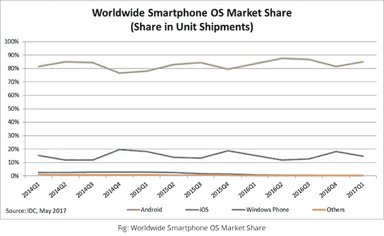

# Android Pie 将如何改变您的业务应用

> 原文：<https://medium.com/hackernoon/how-android-pie-is-going-to-transform-your-business-applications-b13a62b74b3a>

Android 9 或昵称为 Android Pie、代号为 Android P 的系统在移动世界是一个轰动的话题。

谷歌本月 6 日正式发布 Android 9 Pie。从那时起，它就成了技术爱好者、企业和开发者的新闻。这是人们谈论最多的 Android 操作系统(OS)更新。

目前，Android Pie 可以在 Pixels 和 Essential Phone 上使用。

*“索尼移动、小米、HMD Global、Oppo、Vivo、一加和 Essential 参与测试计划的设备以及所有符合条件的 Android One 设备将在今年秋季末收到此更新！我们还与其他一些合作伙伴合作，在今年推出或将设备升级到 Android 9”——谷歌*

# Android Pie 的商机

Android Pie 特性有很多值得讨论的地方！

这说明了什么？Android 是一个永恒的平台。如果你还在用你的 Android 应用程序进行市场竞争，那么你做的是对的。如果你还没有想过一个，那么这是时间和机会！

全球安卓用户比例接近 23 亿。这是一个重要的数字，一个值得你花费资源和金钱的数字。

当 IDC 对各种移动操作系统的市场份额进行研究时，它显示今年的市场份额下降了 0.3%。尽管这一数字有所下降，但 Android 仍然领先于 iOS、Windows 和其他操作系统。

请参见下图:

IDC 的上图显示了 2017 年 Android 操作系统在全球智能手机操作系统份额中的主导地位。是的，Android 在这个游戏中比其他人保持得好得多。

随着谷歌为 Android 操作系统带来更多进步，它为商业世界带来了大量机会。有了 Android Pie，我们将体验到 Android 应用程序性能的重大转变。

Android 应用程序将克服 Android Pie 在支持方面的常见问题。在许多方面，Android Pie 都比之前推出的 Android Oreo 好得多。你即将迎来新的导航系统、屏幕时间控制、电池优化等增强功能。它的人工智能能力和增强的隐私功能热衷于更好地理解用户并为他们提供更好的服务。

准备好你的[安卓应用](https://www.sayonetech.com/services/application-development/)！

现在，Android 有更高的潜力与 iOS 市场竞争。当我们分析到目前为止发布的各种操作系统更新时，很明显谷歌正在努力为他们的用户带来持续的改进。

Android Pie 加强了 Android 应用在市场中的存在，并提供了增强的用户体验。一款[手机应用](https://www.sayonetech.com/blog/why-mobile-app-for-your-retail-business/)对于任何企业都是必不可少的。对于像您这样的企业，您可以使用高性能的 Android 应用程序进入更广阔的市场。与过去不同，您不必对应用程序的性能和安全性感到犹豫和担忧。

Android Pie 为企业提供开发应用程序的机会，从而获得竞争优势并加速业务增长。您可以使用最小的开销获得性能更好的应用程序，在正确的时间接触到正确的客户群。

# 如何让你的应用为 Android 9 做好准备？

首先，以您现有的 Android 业务应用程序为例。我们已经知道了 Android Pie 的特性。除了这些新功能，它还为应用程序带来了许多行为变化。在新的操作系统功能和设备需求匹配之后，您需要调整或重写现有的代码库。

例如，如果您有一个需要后台运行的应用程序，电池优化功能可以在用户关闭应用程序后立即阻止这种情况。在这种情况下，您需要重新编写您的代码库来应对更新。

在新的操作系统版本中，对非 SDK 表面的使用有了新的限制。这些限制会影响应用程序的行为。对于您现有的应用程序，您需要测试非 SDK 表面，然后尽快启用对这些表面的访问。

Android Pie 特性不仅限于以上两点。与其深入博客中的每一个功能，不如让我们讨论一下需要做的工作。好吧，任何限制你的应用程序性能的新功能都需要审查，应用程序也必须相应地修改。

谷歌为将现有应用迁移到 Android 9 提供了巨大的支持。这些新功能和 API 让你有机会修改你的应用程序，使之成为一个用户友好的应用程序。

与 Android 的基本兼容性和良好的开发团队是所有需要的。如果你有一个在[移动应用开发服务](https://www.sayonetech.com/services/application-development/)方面有专长的合适的技术合作伙伴，那么你可以把它交给他们，然后享受好处。

***当你从零开始构建一个 Android 应用会发生什么？***

你已经有备忘单了！

首先，在经验丰富的专业 Android 移动应用程序开发团队的帮助下，深入了解 Android Pie 的基础知识。在此过程中，分析您选择用于应用程序的技术。

Java 和 Kotlin 是用于 Android 应用程序开发的两种流行语言。Android 9 也扩展了对流行编程语言 Java 的支持。此外，Android 开发者最近在他们的博客中宣布 Android Pie SDK 现在对 Kotlin 更加友好。

在 SayOne，我们的开发人员同时使用 Java 和 Kotlin 技术。如果你对新的 Kotlin 有疑问，你可以选择大家一直以来最喜欢的 Java 进行应用程序开发。这两种语言都非常兼容，可以轻松适应新的 Android 9 Pie 功能。

# 结论:获得更快、更智能、更强大的 Android 商业应用！

如果你还没有考虑过开发一个 Android 应用程序，那么现在正是时候！

通过 Android Pie，谷歌正在重新定义移动设备上的 Android 体验。所有关于 Android 应用不可持续的看法都将很快被淹没。在这里，拥有正确的应用目标、策略和团队将是你成功的提示。

Google Play 商店中已经有 330 万个应用程序。你越快获得兼容 Android 9 的应用程序，你就越有机会获得关注和发展。

今天就开始吧！

*最初发布于*[*https://www . sayone tech . com/blog/how-Android-pie-transforms-business-applications/*](https://www.sayonetech.com/blog/how-android-pie-transforms-business-applications/)*。*