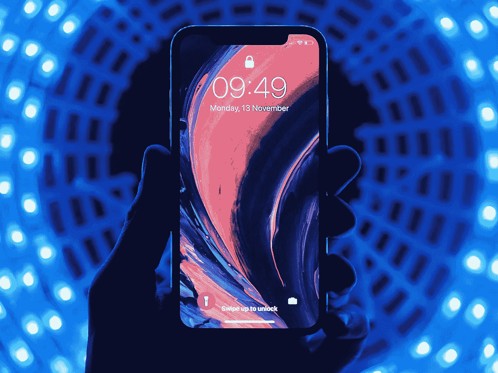
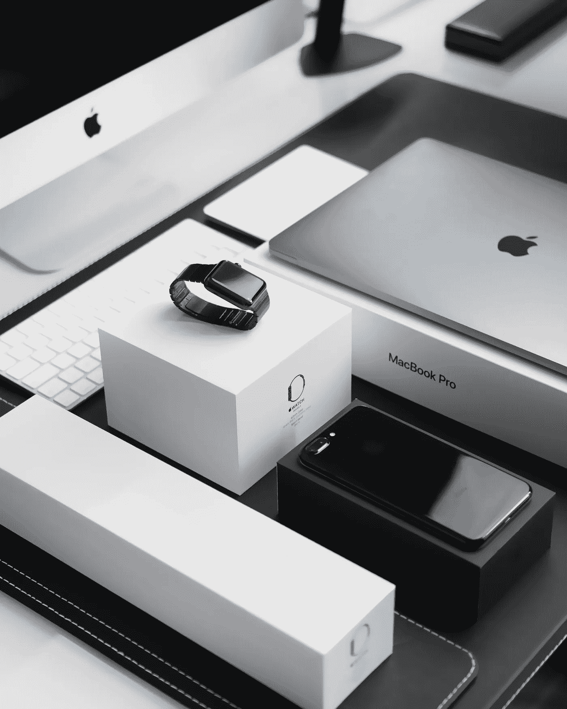
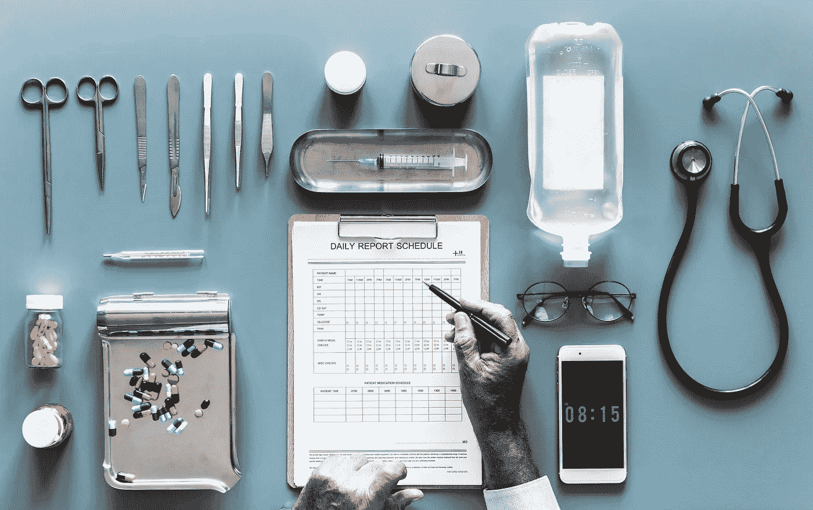
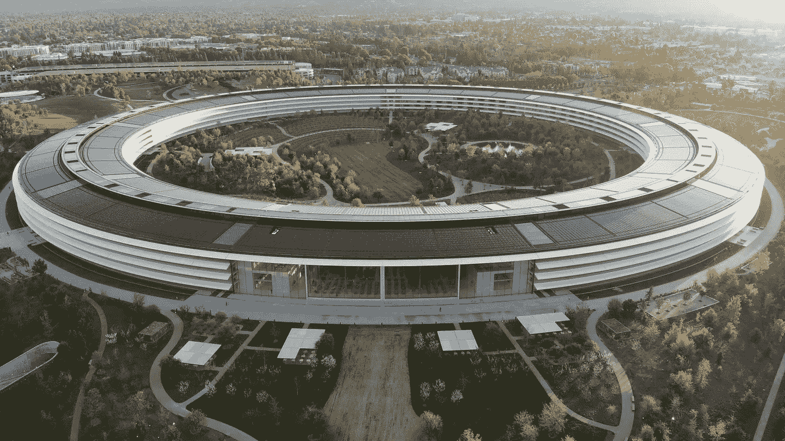

# 苹果如何在医疗保健领域击败谷歌和亚马逊

> 原文：<https://medium.com/hackernoon/how-apple-can-beat-google-amazon-in-healthcare-with-a-little-help-from-izzy-738d33a6d94b>

## (…在伊西的帮助下，我们团队的最新项目…)

所有最大的科技公司(微软、脸书、谷歌、亚马逊、苹果等)都在争夺数万亿美元的医疗保健市场，根据世界卫生组织的[数据，全球医疗保健支出**有望在 2020 年**超过 10 万亿美元。](https://www.who.int/gho/health_financing/en/)

以下是在医疗保健领域最活跃的三家科技巨头——谷歌、亚马逊和苹果的几个例子:

*   谷歌/Alphabet——专注于健康的子公司和 [Calico](https://www.calicolabs.com) ，以及对类似 [Oscar Health](https://www.hioscar.com) 、 [One Medical](https://www.onemedical.com) 、 [Forward](https://goforward.com) 、 [CityBlock Health](https://www.cityblock.com) 和[众多其他](https://www.gv.com/portfolio/#life)公司的投资。
*   亚马逊——家庭健康产品[的独家品牌](https://www.cnbc.com/2018/10/26/amazon-choice-exclusive-home-health-brand-created-by-arcadia-group.html)；[收购药丸包](https://www.cnbc.com/2018/06/28/amazon-to-acquire-online-pharmacy-pillpack.html)，[收购全食](https://www.bloomberg.com/news/articles/2017-06-16/amazon-to-acquire-whole-foods-in-13-7-billion-bet-on-groceries)；由 Atul Gawande 博士领导的 JPM 和 Berkshire Hathaway 联合健康倡议。
*   苹果— [AC 健康诊所](https://www.acwellness.com)，与健康系统的合作伙伴[与健康大猩猩](https://www.cnbc.com/2017/06/19/apple-working-with-start-up-health-gorilla-on-iphone-ehr-plan.html)在[健康记录倡议](https://www.beckershospitalreview.com/healthcare-information-technology/8-more-hospitals-clinics-join-apple-s-health-records-project.html)中合作，Apple Watch [与 Aetna](https://www.cnbc.com/2017/08/29/aetna-hires-ben-wanamaker-to-lead-its-joint-venture-with-apple.html) 合作，[收购 Gliimpse](https://www.fastcompany.com/3062865/apple-acquires-personal-health-data-startup-gliimpse) ，以及[与 Zimmer Biomet](https://www.beckershospitalreview.com/telehealth/apple-teams-up-with-zimmer-biomet-to-support-postoperative-recovery.html) 合作。

我个人认为，苹果可以击败谷歌和亚马逊，主导这个领域，积累下一个万亿美元的市场价值。

为什么？首先，医疗保健领域存在巨大的数据隐私问题——幸运的是，苹果首席执行官蒂姆·库克强烈支持加强对消费者数据的保护。第二，世界上有超过 13 亿台苹果设备，苹果并没有减速，已经连续七个季度同比收入增长率加快。

现在想象一下，如果苹果能够使用这十亿多台设备将他们的用户与直接面向消费者的个性化医疗服务联系起来。这可能是 T21 巨大的额外收入来源。然后，苹果可以利用这种对消费者医疗保健的直接访问，以及其与私人保险公司和医疗系统的现有合作关系，通过将用户连接到完整的连续护理来获得更多收入。

下面我将探讨苹果如何通过与伊西医疗中心的合作来实现这一战略。我们是无限制、个性化初级保健、心理健康治疗和营养&健康指导的低成本会员，在顶级医疗保健出版物中有特色，如 [*【医疗城新闻】*](https://medcitynews.com/2018/08/izzy-care-holistic-approach/?rf=1) *、* [*医疗保健周刊*](https://healthcareweekly.com/virtual-healthcare-startup-izzy-care/) *、*和 [*贝克尔医院评论*](https://www.beckershospitalreview.com/lists/36-health-it-revenue-cycle-up-and-comers-2018.html) *。*我们使用人工智能为我们的护理团队实现任务自动化，帮助我们的患者获得对其健康的个性化见解，并使用区块链实现巨大的成本节约和患者数据所有权。今年，我们在 Q2 的美国 50 个州推出了我们的服务[，并在此后迅速扩展。](http://www.prweb.com/releases/2018/05/prweb15467742.htm)

我相信，将我们的护理模式、技术和协议整合到苹果产品中，不仅可以帮助苹果击败谷歌和亚马逊，成为医疗保健生态系统中的主导者，还可以最终提供我们都希望在当今全球医疗保健生态系统中看到的高质量、低成本、以患者为中心的护理。

# 将伊西的技术整合到苹果的产品套件中

## iMessage 和 FaceTime +伊西护理团队——让医疗变得隐形

伊西护理的核心是一种直接、协作的护理模式。这意味着，只需支付固定的月会员费(99 美元/月)，我们的患者就可以无限制地使用他们的护理团队，包括他们自己的私人家庭医学医生、心理治疗师和营养与健康教练。

通过让这些不同的专家加入同一个团队，我们的护理团队可以提供绝对最佳的个性化综合护理。由于注重协作和预防，我们的护理团队可以帮助大幅节省下游成本，例如因慢性病恶化而导致的住院或手术。

我们的会员可以直接通过我们的应用程序，通过无限制的端到端加密消息和实时视频与他们的护理团队进行交流。

但是现在想象一下，如果这种安全通信直接集成到您的 iPhone 中，允许您直接从 iMessage 或 FaceTime 与您的专业护理团队联系，会怎么样？你的医疗保健会融入你生活的其他方面，变得几乎看不见。像给朋友发短信一样轻松地与医生交流，不需要单独的应用程序。

由于伊西护理是一项订阅服务，您不必担心咨询您的护理团队的个人费用-无论是与您的心理治疗师进行视频会议，还是与您的营养与健康教练谈论您的饮食和健身目标，这些都包含在固定会员费中。急症治疗护理不需支付 20 美元的共付额，30 分钟的心理医生或营养师治疗不需支付 200 美元。

## Siri +伊西——天作之合

伊西是我们的人工智能虚拟助手(因此我们的名字，伊西保健)。伊西通过自动化后台任务和临床工作流程的各个方面，使临床医生能够全心全意地关注患者护理。伊西还通过个性化评估和提醒，帮助患者获得数据驱动的健康洞察。

现在，想象一下如果这个功能被集成到 Siri 中。如果 Siri 可以根据你的数据为你提供个性化的健康见解，回答你的一些健康相关问题，并将你直接连接到你的医生和护理团队，会怎么样？

今天的医生们[花费将近 50%的时间在基于计算机的任务上](https://www.nytimes.com/2017/11/14/well/live/the-patients-vs-paperwork-problem-for-doctors.html)…如果他们重新获得这些时间会怎么样？如果 Siri 除了帮助你之外，还可以成为你的医生的助手，在后台自动化流程，以便你的医生可以专注于为你提供尽可能最好的护理，会怎么样？

三星已经通过与英国初创公司 Babylon Health 的合作，将专注于医疗保健的人工智能集成到他们的移动设备中。 [Babylon Health 的人工智能直接集成到三星的设备中](https://news.samsung.com/uk/samsung-and-babylon-introduce-ask-an-expert-powered-by-babylon-to-offer-live-video-doctor-appointments-and-symptom-checker)，允许人工智能驱动的医生咨询。

## 苹果 iPhone、手表+ IZZY Token 奖励——推动成本节约，实现患者数据所有权和货币化

你可能已经在以某种形式或方式朝着你自己的个人健康目标努力——无论是尝试去健身房更多，总体上更活跃，减掉一定量的体重，还是更好地管理某种慢性疾病。

最终，通过将您的保健掌握在自己手中，您将为健康保险公司节省数千英镑。如果你也因为自己取得的进步而获得经济奖励，会怎么样？许多健康保险公司现在为达到一定的每日步数目标提供积分奖励，你可以从保费中兑换几美元。

但是，如果你完全拥有这些财务奖励，并且可以随心所欲地使用它们，那会怎么样呢？如果你因为实现了你的个人目标而获得奖励，不管这些目标是什么，而不仅仅是健康保险公司任意选择奖励的一个标准计步目标，会怎么样？如果这些奖励实际上与你为健康保险公司创造的节省相关，而不是仅仅几美元和美分，而他们保留所有的利润，会怎么样？如果这个奖励计划是由代码保证的，而不是由保险公司的话保证的，会怎么样呢？

在伊西护理中心，我们的会员可以选择加入我们的健康奖励计划。我们的会员可以获得 IZZY token(ERC-20 token 标准)来满足他们自己的个人健康和健康目标，他们可以用它来以折扣价支付会员费用，或在交易所交易其他数字资产，如比特币(BTC)或以太坊(ETH)，并从那里兑换成美元，随心所欲地消费。通过使用智能合约和来自我们的会员选择连接的任何应用程序或设备(Apple Watch、myFitnessPal 等)的患者生成的健康数据(PGHD)。)，这些奖励是自动发放的，完全归患者所有。

我们还允许患者通过两种方式将他们的数据货币化:(1)选择与研究人员、制药公司和生物技术公司安全共享他们的匿名健康数据，和/或(2)选择以同样安全的方式与我们共享他们的匿名数据，以便我们可以使用这些数据来支持我们的深度学习算法，帮助我们获得精确的健康见解，并支持提供精确的(个性化)医学。它是您的数据，并且数据正迅速成为许多组织最有价值的资产。你应该因为分享这些数据而获得经济上的回报。

现在想象一下，如果这些协议，这些技术，被直接集成到苹果手表和苹果 iPhone 中。你可以在戴着苹果手表散步或去健身房时自动赚取加密货币。从苹果健康应用程序中，你可以选择与研究人员、医疗保健公司分享你的数据，并获得相应的经济补偿。然后你就可以在你的苹果钱包里查看所有你赚到的加密货币，并在那里随心所欲地使用它。

# 进入健康保险领域

在伊西护理中心，我们正在纽约市试点推出首个此类保险产品，目标是在 2019 年第四季度/2020 年 Q1 推出。该保险计划以核心伊西护理会员为中心，包含在单一固定费用中，并完全覆盖任何第三方服务，如专家护理、住院、实验室检测或药物治疗。本产品为每位注册会员分配了一名额外的护理团队成员，一名**护理协调员**，他可以提出护理建议并帮助会员安排任何必要的第三方服务。

我们希望参与本计划的患者能够看到**他们的总体医疗保健费用总共减少 50%** 。这是因为我们看到会员的直接协作护理模式节省了大量成本，并因此关注预防性护理、激励健康行为、初级护理和行为健康的整合等。我们还计划利用一些现有服务，在我们核心产品的基础上构建并扩展我们直接提供的服务:

*   作为我们会员护理团队的一部分，我们的家庭内科医生将可以通过 [RubiconMD](https://www.rubiconmd.com) 访问专家网络(即精神病学家、神经科医生、胃肠病学家)进行电子咨询。这将使组成我们会员护理团队的家庭医学医生能够与专家进行虚拟协作，处理高达 80%通常需要单独转诊的问题。因此，我们的患者不需要为不得不安排另一个临床团队而感到不便。
*   我们的营养与健康教练已经与患者一起制定个性化的饮食和锻炼计划。我们通过像 Instacart 这样的公司为新鲜食品配送提供部分补贴，使会员能够更容易地完成这些计划，达到他们的健康目标。
*   我们还通过像 [Helix](https://www.helix.com/) 这样的公司将基因组测序整合到会员的护理计划中，允许更高度个性化的护理，并帮助实施针对高危患者的预防措施(例如，如果他们的基因组显示出心脏病的倾向)。

在纽约市首次推出后，我们可以更容易地与传统保险公司、政府(国内和国际)和/或专门的医疗保健区块链保险解决方案合作，如我们在[正派](https://www.decent.com)的朋友，在其他市场复制/扩大这一覆盖范围。然后，我们将能够将纽约市以外的数千名现有会员转化为保险计划投保人。

## 苹果如何打入医疗保险

苹果已经与 Aetna 合作，通过他们的健康记录计划，向 Aetna 会员和众多医疗系统提供 Apple Watch 折扣。因此，对各方来说，这是一个巨大而轻松的胜利。

通过苹果和伊西的整合，数百万患者可以获得个性化的医疗服务。苹果、伊西和苹果现有的合作伙伴，如安泰，可以为这数百万患者/用户/会员提供一个联合的低成本保险产品，就像我们在纽约提供的计划一样。

该计划的一部分还可能包括免费的内部测试、选择程序，以及在 AC Wellness 诊所甚至 CVS Minute 诊所的仿制药(假设[Aetna-CVS 的拟议合并通过](https://www.healthcarefinancenews.com/news/aetnacvs-merger-faces-one-last-hurdle-new-york))。

# 让事情回到原点

The Apple campus is a circle, and this is a terrible pun

这在实践中如何行得通呢？

让我们假设苹果和伊西理工大学已经整合，就像我们到目前为止讨论的那样——Siri 获得了伊西人工智能的能力。整合到 iMessage 和 FaceTime 中的安全、加密的护理团队消息；集成到 Apple Watch、Apple Health & Wallet 应用程序中的 IZZY 令牌奖励、数据所有权和数据货币化功能。

让我们捆绑定价——购买 iPhone 包括 3 个月的免费伊西护理，以及 Apple Watch 的优惠券。让我们在苹果和伊西之间做一个收入分成的安排，苹果从通过会员收取的所有费用中拿走一部分。

在美国，T2 有将近 9000 万 iPhone 用户。让我们力争在这种整合/合作的头两年里，为这些 iPhone 用户中的 10%提供保健服务。

所以我们以 900 万用户为例。这项服务每月 99 美元，这相当于**107 亿美元的新年度经常性收入，根据收入分成协议的条款进行分配。或者，苹果可以直接收购我们，从一开始就保留全部收入。**

现在，让我们将这些患者/用户/会员连接到一个低成本的定制保险计划，将伊西、安泰和其他苹果医疗保健合作伙伴聚集在一起，为会员提供以下附加福利:

*   基因组筛选和整合到治疗计划中
*   家庭医学医生可以访问专家网络进行电子咨询，减少了对专家转诊的需求
*   护理协调服务
*   承保专家门诊、实验室检测、住院、杂货配送折扣等。
*   AC Wellness 诊所甚至 CVS Minute 诊所的免费/低成本亲自体检、现场测试、非专利药物(同样，假设 CVS-Aetna 合并通过)

想象一下这会给医疗保健带来什么样的破坏。颠覆不仅使苹果公司受益，还降低了成本，改善了患者的治疗效果，并更好地支持了处于医疗服务第一线的临床医生。

# 包扎

我相信，通过与伊西医疗合作，苹果可以超越谷歌、亚马逊，并抢占大量医疗保健市场份额，从而确立自己在该行业的主导地位。苹果和伊西一起，可以通过与消费者的直接联系和高度的消费者信任来领导医疗保健，降低成本和提供更好的结果，并帮助引导全球医疗保健的未来。

苹果+伊西。改变世界的合作。

*帮我个忙，把这个分享给蒂姆·库克*😉*。我很想听听他的想法。*