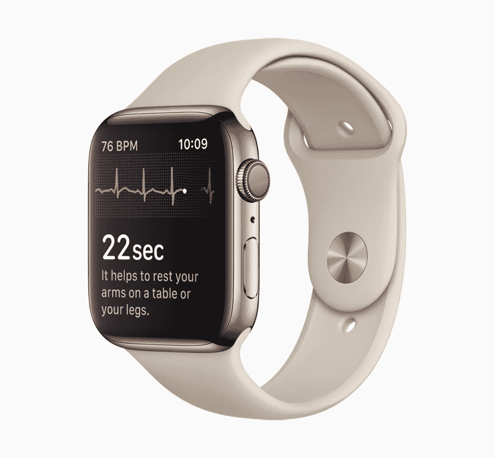
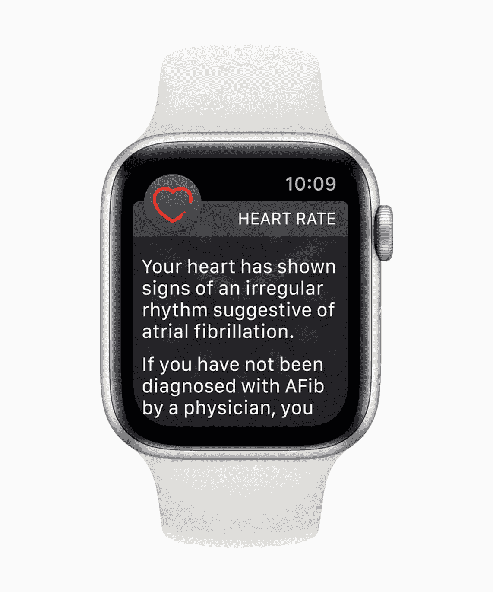
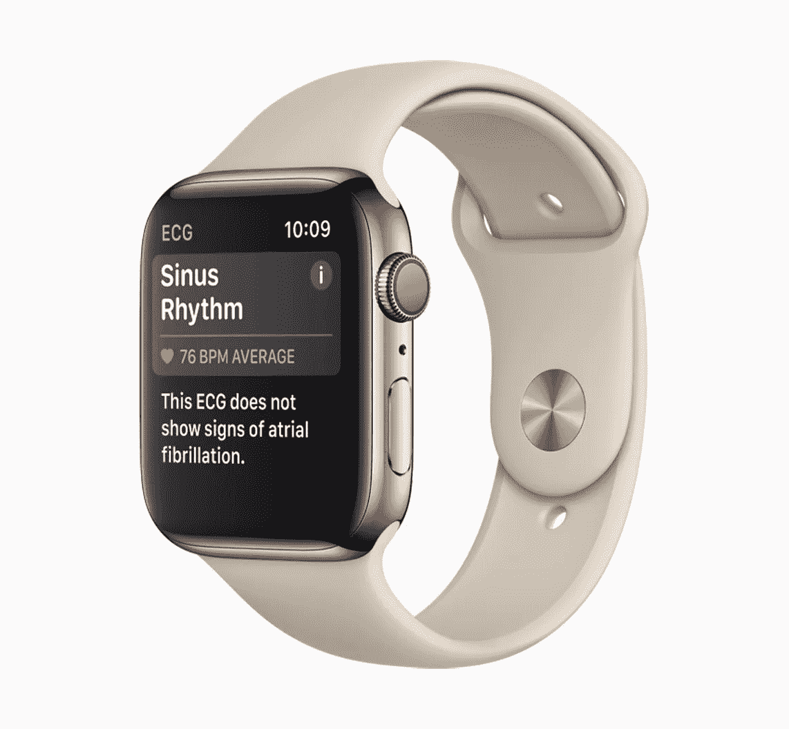
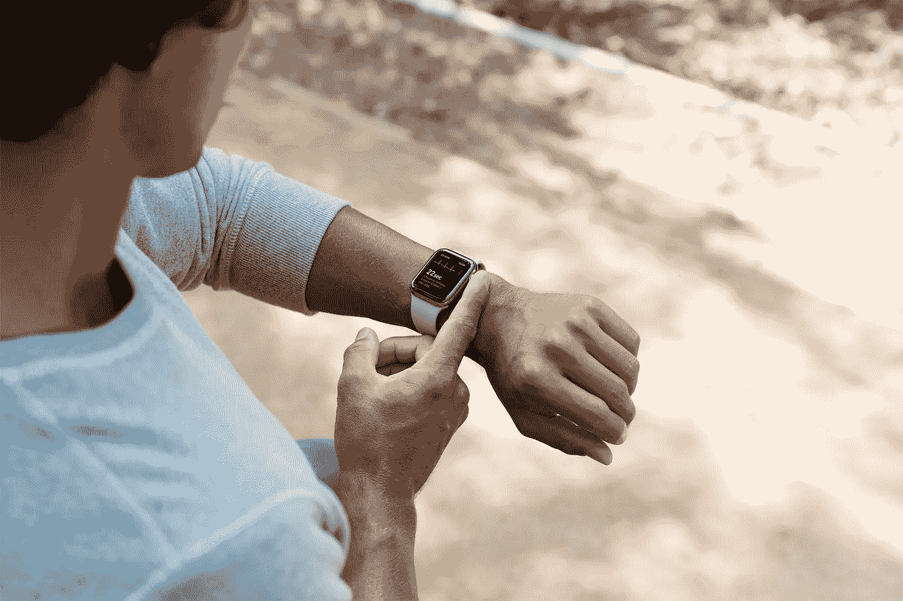

# 苹果如何通过合作改变医疗保健

> 原文：<https://medium.com/hackernoon/how-apple-is-changing-healthcare-through-partnerships-717fe5fc7377>

All images courtesy of Apple

随着心电图应用程序和不规则心律通知的[发布](https://www.apple.com/newsroom/2018/12/ecg-app-and-irregular-heart-rhythm-notification-available-today-on-apple-watch/),苹果在影响医疗保健的未来方面向前迈出了一大步。通过 Apple Watch Series 4，用户可以获得类似于单导联读数的心电图。Apple Watch Series 1 或更高版本(使用 watch OS 5.1.2)的用户可以收到通知，如果识别出不规则的心律，如[房颤](https://www.heart.org/en/health-topics/atrial-fibrillation)(AFib)([根据美国心脏协会](https://www.heart.org/en/health-topics/atrial-fibrillation/why-atrial-fibrillation-af-or-afib-matters/high-blood-pressure-afib-and-your-risk-of-stroke)，大约五分之一的中风中都有 AFib。)这项新功能已经因拯救了一个人的生命而受到赞誉。该应用的发布也带来了一个挑战:赢得医生的信任，他们对人们误读该应用的数据表示担忧。但是苹果已经准备好迎接挑战——并且会成功。这是因为多年来，苹果已经在医疗保健生态系统中建立了合作伙伴关系。这些合作伙伴关系为苹果的医疗保健应用提供了一个试验场，并为这个世界上最有价值的品牌之一带来了大量的善意。

## **医疗保健战略**

在苹果 9 月 12 日的特别活动上发布的 ECG 应用程序，通过成为患者护理的数据骨干来支持苹果改善医疗保健的战略。该战略有三个关键要素:

*   **软件**供患者和提供者监控和共享数据，这就是应用发挥作用的地方。
*   **硬件**:Apple Watch 和 iPhone 创造了一个无处不在的设备平台。
*   **与医疗保健提供商(如医院网络)的关系**，以监控和共享健康数据。

苹果在医疗保健领域的渗透支持了其在可穿戴设备和服务领域的增长，根据 11 月 1 日公布的第四季度收益结果，这两个类别虽然规模较小，但对苹果收入增长的贡献更大。但在医疗保健领域，首席执行官蒂姆·库克有着比创造更多收入更远大的抱负。正如他[最近告诉《时代》杂志](http://time.com/5472329/apple-watch-ecg/)，“苹果对人类最大的贡献将是改善人们的健康和福祉。”

他对健康保健的关注尤其让苹果公司处于有利地位。普华永道的健康研究所(HRI) [将健康护理列为塑造医疗保健行业未来的最重要力量之一](https://www.pwc.com/us/en/health-industries/health-research-institute/publications/health-industry-changes.html)，健康占美国 5 万亿美元医疗保健生态系统的 2760 亿美元。

## **医生的反应**

但是，为了改善健康和福祉，苹果需要医生加入。一些人公开批评心电图应用程序，而另一些人则表示支持。苹果在 9 月份的特别活动中宣布了心脏监测功能，这几乎立即引发了医生的担忧，他们担心患者会误诊自己。但是这个声明也得到医学界的支持。例如，马萨诸塞总医院的重症监护医生 Christopher Worsham 和马萨诸塞总医院的内科医生 Anupam B. Jena 在《哈佛商业评论》上写道。。。医生不应该太快放弃这项新功能，尤其是在消费者对测量健康行为的可穿戴设备越来越感兴趣的情况下。Apple Watch 有潜力提供有价值的数据，让整个医疗保健界受益。”

现在 ECG 应用程序已经上线，苹果公司经历了批评和良好的公关。一方面，橙色乡村的心脏病专家 Brian Kolski 博士抱怨说，许多患者联系他，因为他们认为他们的苹果手表报告了心脏问题，而实际上并没有什么问题。Kolski 医生讨论了一个病人，他在半夜联系他，对他在 Apple Watch 上看到的心脏读数感到恐慌。

“他给我发了一条短信，这完全正常，”科尔斯基医生[告诉《橘子郡纪事报](https://www.ocregister.com/2018/12/14/be-careful-with-apple-watchs-new-electrocardiogram-app-doctor-warns/)。"这是一个健康的 45 岁男子，他在自己的手表上玩耍，陷入了严重的恐慌。"

另一方面，新功能为苹果带来了正面的新闻报道。 [TechCrunch](https://techcrunch.com/2018/12/08/apple-watchs-ecg-feature-is-already-proving-its-worth/) 和[ABC news](https://abcnews.go.com/Health/apple-watch-told-46-year-man-irregular-heartbeat/story?id=59726093)已经报道了 Ed Dentel 的案例，他的医生告诉他，新的应用程序可能通过通知他异常的心率救了他的命。CNN 的首席医学记者 Sanjay Gupta 博士测试了心电图应用程序，并报告说它“[非常简单](https://www.cnn.com/2018/12/06/health/apple-watch-ecg-app-review/index.html)”，尽管他警告用户小心使用该应用程序。

他写道，“这款应用可能还会增加新关注的患者去看医生的次数。”。“尽管如此，医学界作为一个整体还是有相当大的热情。。。毫无疑问，苹果指望医生使用 Apple Watch 收集的数据。该公司已经很容易将你的心电图和症状描述直接从应用程序上传到你的私人医生，以促进沟通。这是他们在医疗保健领域施加影响的大赌注的一部分。”

## **牢固的关系到位**

公关很重要，苹果公司为了证实心电图应用的价值和准确性而炮制的数据也很重要。但是苹果已经有了其他的优势:与医疗界建立伙伴关系的能力。心电图应用的推出只是苹果在成为医疗保健公司的道路上取得的一长串成就中的最新一个——这些成功都是通过与医生的合作取得的，我在最近的白皮书中讨论过这些合作[苹果医生现在可以见你了](http://www.davidjdeal.com/assets/applehealthcarefin.pdf)。例如:

*   2014 年，苹果推出了[健康工具包](http://www.telegraph.co.uk/technology/apple/11395073/What-is-Apples-HealthKit.html)，为苹果用户提供了一个中央存储库，以跟踪他们苹果设备上的健康和健身数据。2015 年 2 月，新奥尔良的 Ochsner Health System 推出了“高血压数字医疗计划”，该计划依靠 HealthKit 帮助患者测量并与提供商分享他们自己的血压和心率。Oschner 根据研究结果调整(实时，如果需要)患者的药物治疗和生活方式咨询。
*   2015 年，苹果发布了 [ResearchKit](https://www.apple.com/newsroom/2015/03/09Apple-Introduces-ResearchKit-Giving-Medical-Researchers-the-Tools-to-Revolutionize-Medical-Studies/) ，这是一个为医疗和健康研究设计的开源软件框架，旨在帮助医生和科学家更频繁、更准确地从使用 iPhone 应用的参与者那里收集数据。罗切斯特大学已经使用 ResearchKit 为历史上最大的帕金森研究建立了一个应用程序。据苹果公司称，“该应用程序通过使用陀螺仪和其他 iPhone 功能来测量灵活性、平衡、步态和记忆，帮助研究人员更好地了解帕金森病。”
*   2018 年 1 月，苹果公司[宣布](https://superhypeblog.com/apple/apple-wants-to-liberate-your-medical-records)其健康应用程序将使用户能够在他们的 iphone 上直接查看他们的医疗记录，这将使拥有 iphone 的潜在 9000 万美国人受益。当苹果推出这项功能时，该公司一开始就有 [39 家医院网络参与](https://www.healthcareitnews.com/news/apple-reveals-39-hospitals-launch-apple-health-records)。(苹果在其[网站](https://support.apple.com/en-us/HT208647)上保存了一份参与医院网络的运行列表。)

苹果发布了更多医生合作成功的例子。例如，在约翰霍普金斯医院，医生为癫痫患者提供苹果手表，以跟踪他们的癫痫发作、可能的触发因素、药物和副作用。多亏了约翰霍普金斯大学开发的特殊应用程序 [EpiWatch](http://www.hopkinsmedicine.org/epiwatch#.WJ-qQBIrKHo) ，患者可以通过仪表板访问他们的个人信息，如果患者愿意，还可以与提供商共享数据。患者也可以向家人和提供者发送消息，让他们知道患者何时跟踪癫痫发作。约翰霍普金斯大学正在收集这些数据，以最终了解如何在癫痫发作发生前预测它们。

## 雇佣医生

据报道，苹果的医疗保健之旅也意味着雇佣大约 50 名医生。美国消费者新闻与商业频道[引用了](https://www.cnbc.com/2018/12/12/apple-has-dozens-of-doctors-on-staff.html)雇佣整形外科医生 Sharat Kusuma 的例子，Sharat ku suma 领导一个团队与医疗设备制造商 Zimmer Biomet 合作“研究[苹果技术是否能帮助病人从膝盖和髋关节置换手术中恢复过来](https://www.cnbc.com/2018/10/15/apple-and-zimmer-biomet-bring-apple-watch-to-people-getting-new-knees.html)在 12 月 12 日的一篇文章中，美国消费者新闻与商业频道的克里斯蒂娜·法尔写道，“在苹果寻求开发健康技术并将其集成到 Apple Watch、iPad 和 iPhone 中时，这些招聘可以帮助苹果赢得医生的支持——这可能是最严厉的批评者。”她补充道，

> 医生还可以帮助苹果公司指导医疗界如何使用苹果公司的新健康技术，并转移批评。举个例子，当苹果公司宣布其心电图传感器可以追踪心律不齐时，该公司[建立了一个网站](https://www.apple.com/healthcare/apple-watch/)来帮助回答医生的问题。这一点很重要，因为在害怕承担责任并且已经被科技压得喘不过气来的医生中，获得批准有很高的门槛。

这就是苹果与医疗网络建立的关系将获得回报的地方。苹果并没有试图从零开始建立关系和信誉。苹果已经通过在心电图应用程序之前的努力证明了自己，从而拥有了良好的信誉(如上所述)。苹果的另一张王牌是医生的使用:根据曼哈顿研究中心的一项研究，75%的美国医生拥有某种形式的苹果设备。

我们都知道史蒂夫·乔布斯是让苹果成为改变世界的代名词的超级力量。但蒂姆·库克也在围绕医疗保健打造一份遗产。这是因为苹果正在通过合作伙伴关系而不是颠覆来改善医疗保健。