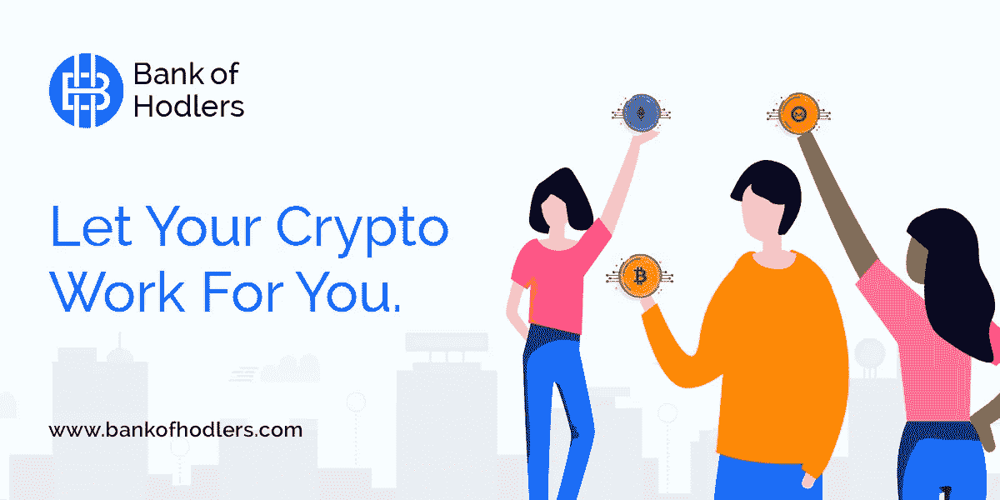

# 公司如何利用区块链炒作？

> 原文：<https://medium.com/hackernoon/how-are-companies-leveraging-the-blockchain-hype-e40377ced1c9>

Photo by **mohamed_hassan** from **Pixabay**

自比特币热潮以来，加密货币风靡全球。飙升的估值、不断增加的交易量和广泛传播的消息导致了加密领域前所未有的投资和投机水平。

然而，尽管[区块链协议具有众多潜在属性，](https://blog.bankofhodlers.com/how-many-more-industries-can-the-blockchain-disrupt/)许多加密货币和总部位于区块链的公司在最近几年已经成为欺诈的代名词。这主要是因为投资公众渴望进入这个迅速发展的空间，而且由于完全缺乏监管，欺诈方可以利用这一点来欺骗潜在的投资者。

事实上，由 ICO 咨询公司 **Statis Group** 进行的一项研究最近披露，2017 年超过 80%的 ICO 都是骗局。此外，网络安全公司**炭黑**透露，仅在 2018 年上半年，就有价值约 11 亿美元的数字货币被盗。

例如，一个主要的加密交易所， **BitKRX** 自称是一个加密货币交易所，作为韩国期货交易所 KOSDAQ 和韩国证券交易所 KOS DAQ 的分支机构运营。2017 年，在投资者被骗走价值数百万美元的加密货币后，这最终被证明是欺诈行为。

这只是众多欺诈公司事件中的一个。下面我们列举了几起震撼加密行业的重大事件:

# 重大事件

在最近的事件之后，人们发现大量曾经成立的公司利用区块链的炒作来激发虚假的信心和人为抬高股价。随之而来的往往是市场操纵和内幕交易，进而导致美国证券交易委员会的调查。这些公司经常在完全不相关的领域开展业务，但为了获得关注，它们在名称中使用了“区块链”一词。

一个很好的例子就是 **Long Blockchain Corp，它的前身是长岛冰茶公司**。该公司更名后股价飙升，并宣布将提供全球可扩展的区块链技术解决方案。另一个例子是 **Riot Blockchain，它的前身是 Bioptix** ，一家在生物技术领域运营的公司。这两家公司都受到了美国证券交易委员会(SEC)的调查，原因是涉嫌“抽水和倾倒”计划。

此外，值得注意的是，**伊士曼·柯达**曾经是摄影和数字印刷行业的主导力量，它推出了**柯达 KashMiner** 和 **KodakCoin** ，这是一种用于授权拍摄照片产生的支付的加密货币。批评者指责这只不过是制造短期股价上涨的噱头。当英国广播公司报道说没有任何许可协议实现，该项目从未启动时，这最终被证明是真的。

# 欺诈方试图欺骗投资者的方式有很多。其中包括:

## ICO 骗局

与受到严格监管、需要透明度和大量财务和会计信息披露的 IPO 不同，ico 可以不受限制地自由运行。这个缺点被骗子利用，制造出假的或无用的硬币，意图诈骗投资者。因此，在做出任何决定之前，彻底研究硬币、底层协议、公司和数字钱包是很重要的。

## 假贷款机构

一些平台参与了承诺以加密货币为抵押的贷款的做法，一旦资产转移给它们，这些平台就消失了。因此，对于借款人来说，重要的是只从可信和值得信赖的贷款人那里获得贷款，以避免被诈骗的可能性。

***你可能喜欢:*** [*加密贷款终极指南*](https://blog.bankofhodlers.com/the-ultimate-guide-to-crypto-backed-loans/)

## 抽水和倾倒骗局

由于缺乏监管，加密货币空间已经成熟，可以进行市场操纵，特别是由大型参与者进行操纵。这些集团瞄准一种市值较小的硬币，集体购买该硬币以推高其价格，对硬币进行炒作并进一步人为抬高其价格，然后出售。这通常会导致没有经验的投资者上当受骗，损失大量金钱。

虽然这种做法在受监管的证券市场中是非法的，但已知这些骗局通常发生在加密货币领域，有几个团体和论坛被记录多次参与这种做法。

## 区块链庞氏骗局

‘庞氏骗局’这几个字足以打击任何投资者心中的恐惧。将这个词与区块链结合起来，可能会产生更为灾难性的影响。庞氏骗局向投资者承诺高回报，并以这样的借口运作，即如果投资者带来更多的客户，这种回报将持续下去。在此之后，这些骗局将后来的投资者投资的钱支付给最初的投资者，并继续这样做，直到欺诈方决定带着钱消失。这种骗局在区块链公司领域已经变得相当普遍。

# 如何才能远离这些骗局？

作为一个聪明的投资者，有几种方法来识别和避免潜在的骗局。

例如，在选择投资之前，了解公司的商业模式和管理是很重要的。同样重要的是要进行彻底的尽职调查、SWOT 分析，并详细说明所承担项目的基本面和可行性。

此外，留意一下**白皮书**中是否有太多的术语。该白皮书旨在简化复杂的问题，并向读者简要介绍该组织的理念、意识形态、愿景和实施路线图。因此，一份不必要的复杂白皮书可能是一个危险信号，暗示该公司试图欺诈投资者。

此外，投资者关注[代币出售](https://blog.bankofhodlers.com/what-happens-when-a-company-releases-an-ico/)以及行业专家对该公司的反应也很重要。必须指出的是，投资者在投资时必须谨慎，因为如果市场条件不佳或设计不当，即使是拥有坚实商业模式的合法公司也可能失败。

永远记住，如果听起来好得不像真的，那么它很可能就是真的。

*原文链接可以在* [*这里找到*](https://blog.bankofhodlers.com/how-find-out-company-leveraging-blockchain-hype/) *。*

Created by our Head of Design — **Asaithambi Vajaravelu**

***关于*** [***霍德勒银行***](https://www.bankofhodlers.com/)***:****我们是一家基于区块链空间提供加密货币盗窃保险、加密信用卡、加密支持贷款等服务的 FinTech 公司。*

*你可以在我们的原创博客* *这里找到更多我们的内容* [*。*](https://blog.bankofhodlers.com/)

上面这篇文章是由我们的客座作家诺亚·阿德里安·伯吉斯写的。