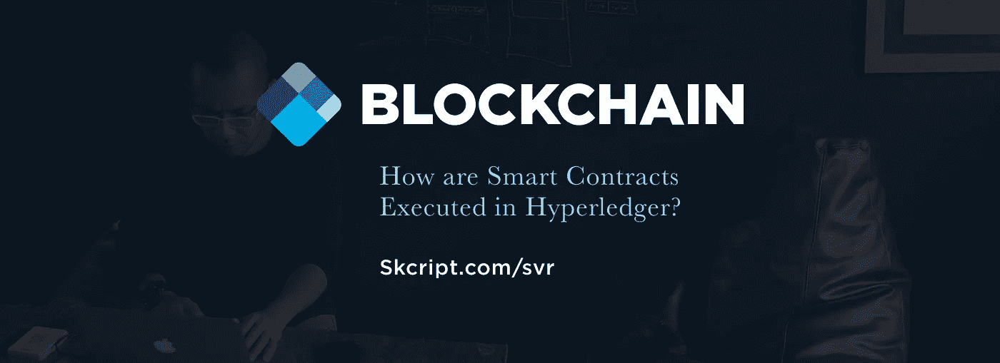
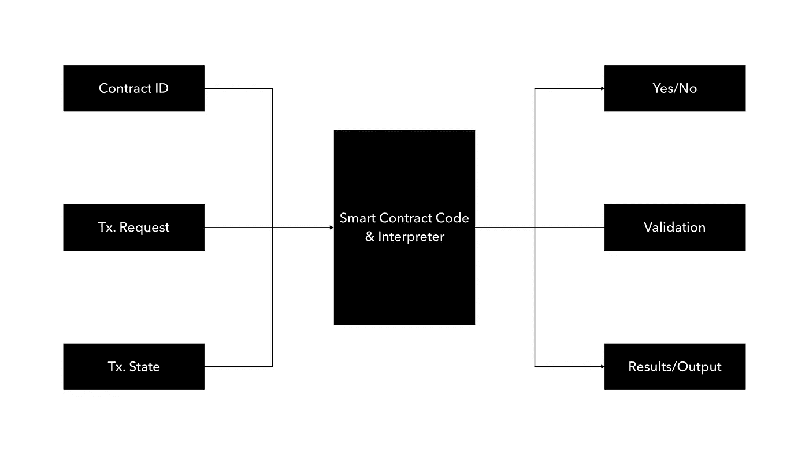

# 智能合同在 Hyperledger 中是如何执行的？

> 原文：<https://medium.com/hackernoon/how-are-smart-contracts-executed-in-hyperledger-57efebf03f12>

智能合同是任何区块链实施的核心。商业逻辑是区块链许多事情的驱动力，而 [Hyperledger](https://hackernoon.com/tagged/hyperledger) 让我们实现智能合同变得更加容易。

在我们的许多[区块链商业研讨会](https://www.skcript.com/blockchain/business-workshop/)中，我们非常关注的一个领域是智能合同，以及它们如何在 Hyperledger 或任何区块链框架中执行。

在我们进入它的执行策略之前，这里有一些关于智能合约的基本信息:

# 什么是智能合约？

智能合同是运行在区块链上的业务逻辑。智能合同的复杂程度取决于你用什么策略来解决你和区块链的业务问题。

> 智能合同是区块链的商业逻辑。

智能合约根据其实施的用例分为两类:

1.  链上智能合约
2.  已安装智能合同

**链上智能合约**

当交易在区块链上发生时，这些被执行。它们也存放在区块链内部。

**已安装智能合约**

这些智能合约在提交分类账或启动网络之前执行。

为了更好地理解智能合约，[看看我们的首席信息官几周前写的 Hyperledger 架构](https://www.skcript.com/svr/understanding-hyperledger-fabric-s-architecture/)。

# 智能合约是如何执行的？

为了解释如何在 Hyperledger 中执行智能合同，下面的图表将为您提供一个非常快速的流程概览:

一切都从输入块或契约解释器开始，契约的 ID 被发送给事务请求。每当智能合约发现请求无效时，它就会拒绝该合约，然后将交易提交到区块链的总账中。

一旦验证通过，事务包就被发送到位于处理单元中间的共识服务。这是智能合约验证交易是否可以提交给区块链的地方。

这种验证不仅仅是智能协定代码中“是”或“否”规则的简单实现。验证交易时，智能合约验证两个主要内容:

1.  语法错误
2.  逻辑错误

验证语法错误非常简单。但是验证逻辑错误非常复杂。

当验证逻辑错误时，智能合约验证转向策略驱动的决策制定。最好的例子是在链中存储一个双重事务的细节，以备审计之用。如果政策要求你这样做，这是可以做到的。

Hyperledger framework 最大的优点是能够在每个框架中以独特的方式处理智能合约:

1.  超分类帐结构
2.  超分类帐锯齿
3.  超分类帐洞穴
4.  Hyperledger Iroha

**专业提示:**当使用 Hyperledger 进行大规模交易时，考虑到它以加密方式处理智能合同的方式，而不是简单的验证，使用 Hyperledger 锯齿是首选。