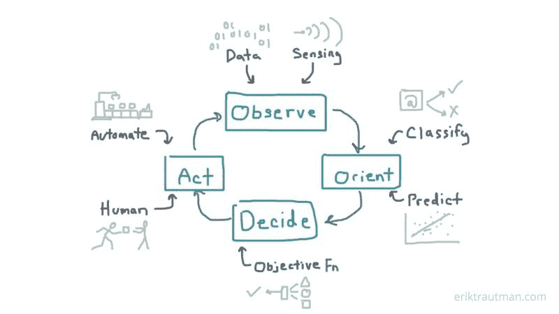
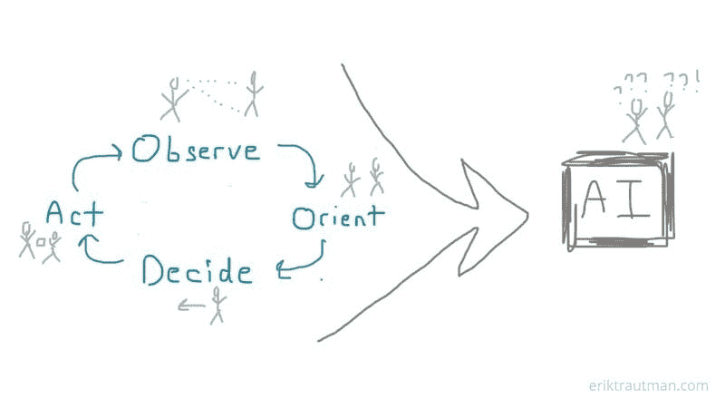

# 人工智能如何通过更好的预测来结束这个循环

> 原文：<https://medium.com/hackernoon/how-artificial-intelligence-is-closing-the-loop-with-better-predictions-1e8b50df3655>

围绕人工智能的大肆宣传大多集中在某种模糊的感觉上，即它不断从周围的世界中学习，因此在执行任务时变得越来越好。事实上，重要的是要理解这背后的核心事实更简单也更强大:人工智能技术允许我们*做出比以前更好的预测*。

尽管这一事实很简单，但它是一个非常强大的构件，通过打破信息和物理世界中的任务循环，实现了我们从未见过的大规模自动化。理解它会让你更好地欣赏它能够并将推动的变化。

半导体为这种减少提供了一个有用的类比。半导体[技术](https://hackernoon.com/tagged/technology)显然改变了世界，但这些帝国建立在一个简单的事实之上:它降低了*算术*的成本。这一最基本的用例构成了计算的基础，在足够大的规模上，允许我们做我们今天能做的一切。

就人工智能而言，它显著提高/加快/降低的是预测。就像半导体算术形成了高级计算的基础一样，更好的预测形成了更好的决策制定的基础，并最终在广泛的任务中实现了人类行动的自动化非中介化。

让我们看看这是如何工作的，以及为什么它对我们周围的每一项任务都有巨大的影响。

# 对任务的剖析

我们将从一个单独的任务开始。任务实际上只是有意义工作的最小量子，也就是“你想完成的事情”。这可能像在第一首歌曲结束后播放另一首歌曲一样简单，也可能像在查看图像后完成放射报告一样复杂。或者在仓库里收集合适的包裹。或者向田里的杂草喷洒除草剂。或者发送销售电子邮件。诸如此类。

我们所做的一切都被分解成任务，人工智能的潜力在于，它使这些任务变得更好，并最终闭合环路，实现完全自动化。

为了理解其中的原因，让我们来分析一下特定任务:

每项任务都有 4 个关键步骤，我将按照约翰·伯伊德流行且惊人相关的 [OODA 循环](https://en.wikipedia.org/wiki/OODA_loop) [框架](https://hackernoon.com/tagged/framework)(此处简化)进行建模:

1.  **观察**:通过感知收集关于世界的事实(数据)
2.  **定位**:通过对当前状态进行分类并预测未来可能的状态，将这些事实联系起来。
3.  **决定**:根据目标函数选择最佳路径
4.  **行动**:完成已决定的行动

*必要时重复*

# 改进任务

当你看到其中的每一个组成部分时，有一些关键的方法可以改进一项特定的任务。我们历来将自动化工作的重点放在“行动”部分，但新技术的真正潜力是解决前面的 3 个步骤:

1.  **改进观察:**改进数据本身，使其具有更好的感知准确性、及时性、相关性等，或者提高我们的能力*以更高的吞吐量使用*数据[学习](https://hackernoon.com/tagged/learning)过程
2.  **改进导向:**改进当前状态的分类和未来状态的预测
3.  **改进决策:**通过更好的目标函数提高路径选择能力

第一步，“改进观察”是通过改进传感技术(用于需要了解环境的应用)、更强大的数据管道、更快速的数据反馈循环以及在组织或应用中更民主化地访问数据来实现的。比以往任何时候都能够向今天的[机器学习(ML)](https://en.wikipedia.org/wiki/Machine_learning) 模型输入更深入、更广泛的数据，这意味着我们也可以利用比以往任何时候都更广泛的观察范围。其中一些改进是通过补充技术(如传感、数据处理)实现的，而另一些则更符合公认的广泛的“人工智能”(ML，计算机视觉)的范畴。

“定向”改进是今天机器学习过程的面包和黄油，它使预测明显更好，更便宜。分类模型预测某物应该落入哪个桶，以更好地理解当前状态(例如，这是谁的脸？行人还是邮箱？垃圾邮件还是非垃圾邮件？).其他模型预测未来状态(例如，客户接下来可能会购买哪种产品？哪个电子邮件版本最有可能转换？).这两个过程过去主要是人工操作，现在是高度机器操作。

“决策”已经通过对未来更准确的定位和预测得到了显著的改进，但通过自动化的再训练过程得到了进一步的改进，今天的模型可以部署该过程来调整它们的目标函数以实现期望的行动结果。也有专门为优化设计的模型，有助于增压这一步。

# 含义:结束循环

不久前，整个 OODA 循环还完全由人力驱动。工业革命帮助减轻了许多人手的“行动”步骤，增强了我们的生产能力。自动化的早期阶段允许我们开始卸载全部任务，只要观察和定位非常简单，并且决策可以提前进行逻辑硬编码。

这使得整类任务仍然大量依靠人工完成。例如，销售人员在决定跟踪哪条线索时，只依赖于他们自己收集的观察结果，并根据他们多年实践中形成的启发进行导向。现在，自动化流程从每条线索的 100 个地方收集数据，[预测模型根据它们的质量和转化的可能性对它们进行评分](https://blog.appliedai.com/predictive-sales-lead-scoring/)，这样销售人员可以更有效地集中精力。在许多情况下，向谁伸出手的决定和这样做的行动已经是自动化的，让销售人员只在最需要的时候介入(完成交易)。即使是这样，也是越来越脆弱。

这意味着，任何以前基于有限的传感能力或人类正确分类、预测或决策的需要而抵制自动化的任务，都面临着被人工智能驱动的自动化中断的重大危险。

目前，各种更复杂的任务正在过程的每一步中被逐步淘汰，而更简单的任务正在完全结束循环，并变得完全自动化。这不是一个单一的过程，而是数百项技术和业务的结合，每项技术和业务都致力于改善链条中的一个特定环节，而这种改善中最大的一步变化来自人工智能技术。

事实上，目前在必须将人带回循环的每一步都花费了过多的精力，因为系统必须重新定位人并使其清楚预期的是什么。随着 OODA 循环中更多的步骤变得自动化，系统开始通过减少不必要的交互来提高效率。由于这个原因，一个完全闭合的回路比其各个部分的总和要强大得多。

# 任务中断启发法

以下是思考特定人工任务对人工智能破坏的脆弱性的简单启发式方法:

1.  **观测中断**

*   狭隘的观察:目前依赖于相对狭窄(或“矮胖”)的输入集的任务容易受到更大范围的自动数据收集的影响(例如，销售线索资格，现在可以使用 100 多个输入)
*   缓慢观察:依靠人工收集数据或人类感知的任务很容易受到更好的传感器和传感技术的影响(例如卫星或无人机成像的屋顶检查)

2.**方向中断**

*   人工分类:依靠人工分类的任务(例如装配线上的缺陷)容易受到 ML 辅助分类的影响
*   过于一般化的任务:使用过于宽泛的目标的任务(例如在所有植物上喷洒杀虫剂)容易增加分类以提高精确度
*   人类预测:要求人类使用直觉来预测未来的任务(例如，在广告活动中使用哪种创意)容易受到 ML 驱动的过程的影响。

3.**决策中断**

*   复杂决策:决策越复杂，机器就越能正确遵循前两步，并最终恰当地权衡数据(如数据中心优化或搜索)
*   重复决策:人类会经历真正的决策疲劳，而机器不会(例如人工质量控制)
*   快速决策:在人类能够思考之前必须发生的任务(例如避免撞车)已经可以自动化了

4.**行动中断**

*   连锁动作:一个主任务(例如在仓库中挑选一个包)可能由几十个子任务组成，因此它的自动化受到了其中最具挑战性(抓取)的自动化的限制。修复限制性子任务可以使整个主任务链变得可行。
*   灵巧的动作:基于人工智能的反馈循环，机器人的灵巧性(例如物体抓取)正在迅速提高

从本质上来说，让我们变得缓慢、不精确或受限的每一个方面都受到了专注于这些狭窄维度的技术的攻击，这些技术最终将继续为我们完成越来越多的任务。这将使这些任务比以往任何时候都更好、更快、更便宜，并在整个过程中开辟新的使用案例和新的市场。

最终，始于人工操作第一次机械化的过程将会把我们从许多工作流程中完全解放出来。

# 前瞻性思维:可解释性

当一项任务出错时，你如何找出出错的原因？有了人类在每一步的操作，我们就有了简单的可解释性(尽管人类在现实中很少擅长解释自己)。有了人工智能，其中许多步骤可能会在模型下变得模糊不清，可解释性更具挑战性。

这已经是一个主要问题了，随着人工智能在越来越多的任务上完成循环，观察它的发展将会很有趣。

*想讨论？打我一下* [*上推特*](https://twitter.com/eriktrautman) *。原贴* [*于 eriktrautman.com*](https://www.eriktrautman.com/posts/how-artificial-intelligence-is-closing-the-loop-with-better-predictions)*。*

# 额外资源

*   [用人工智能开始做出更好决策的简单工具](https://hbr.org/2018/04/a-simple-tool-to-start-making-decisions-with-the-help-of-ai) (HBR 2018)
*   [为什么人工智能推动更好的商业决策](https://www.salesforce.com/blog/2017/11/why-ai-drives-better-business-decision-making.html) (Salesforce 2017)
*   [对人工智能有什么期待](https://sloanreview.mit.edu/article/what-to-expect-from-artificial-intelligence/)(麻省理工学院 2017)
*   [人工智能:加速决策制定](https://artificial-intelligence.cioreview.com/cxoinsight/ai-accelerating-decisionmaking-nid-23303-cid-175.html)(首席信息官评论 2017)(请注意，他们对 OODA 循环的分解略有不同)
*   [AI 上黑客正午](https://hackernoon.com/artificial-intelligence/)