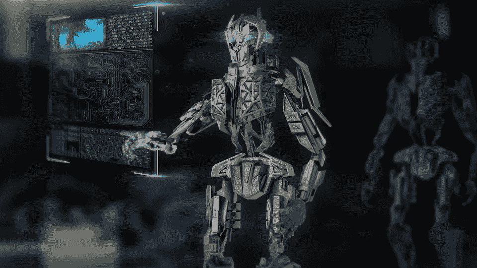
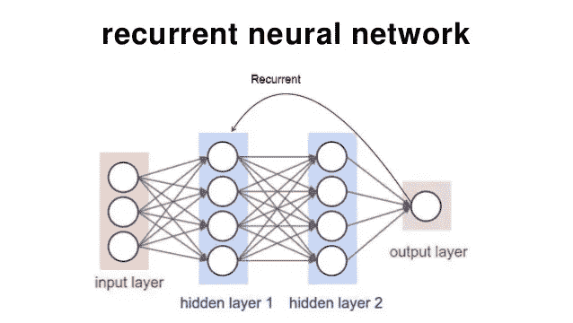
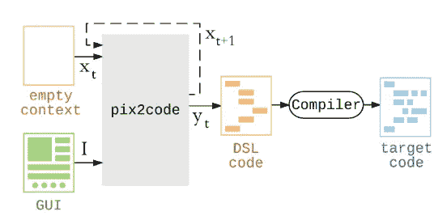

# 人工神经网络如何比 GUI 程序员更聪明地编码

> 原文：<https://medium.com/hackernoon/how-artificial-neural-networks-can-code-smarter-than-gui-programmer-1cdfaecb4851>

是什么将所有基于技术的创新聚集在一起？开发者渴望让它们以人类的方式工作。这种愿望刺激了人工智能和深度学习的发展——这些技术将影响许多相关的工作。

正如 [Gartner](https://www.gartner.com/newsroom/id/3811367) 所说，今天在一项创新实现之前，会有另外两项创新到来。但是结果是有争议的。例如，预计到 2019 年，人工智能在[消除的工作岗位将超过它创造的工作岗位，同时该技术也被认为可以创造足够多的新工作岗位，并在效率和生产力方面丰富当前人们的职业生涯。在未来，模板设计师和 GUI 程序员可能会被淘汰。原因将是“类人”程序的加速增长，即 ***人工神经网络*** 。](https://www.gartner.com/newsroom/id/3811367)

# **RNN 架构及其在自动编程中的使用方法**

自动化过程被逐步实现，以提高智能任务的效率，例如 ***生成源代码*** 。这里没有什么奇迹:代码是由一个基于特定功能的编写程序自动生成的。例如，开源的谷歌/麻省理工学院应用程序 Inventor 允许用户在开发区域拖放一些需要的功能，将它们相互连接，定义应用程序的工作方式，并根据准备好的模板获得生成的源代码。使用这个应用程序，即使是编程新手也不用花什么力气就能创建基于 Android 的应用程序。

但是如何将编码提升到一个全新的水平呢？每个人都会同意创建 GUI 是一个费时费力的过程。在小规模项目中，开发人员通常负责创建 GUI，尽管这不是他们的优先任务。如果他们能摆脱这个负担呢？如果一个程序可以捕获和识别 GUI 的屏幕截图，并从图像数据中生成源代码，会怎么样？

[递归神经网络](http://www.asimovinstitute.org/neural-network-zoo/) (RNNs)有一点神奇。事实上，[训练多层 RRN](https://github.com/karpathy/char-rnn) 并没有看起来那么难。这种类型的神经[网络](https://hackernoon.com/tagged/network) [架构](https://hackernoon.com/tagged/architecture)被组织成递归层:输入层、隐藏层和输出层。

View more on RNN structure here: [https://bit.ly/2yl0Od6](https://bit.ly/2yl0Od6)

递归层允许输入先前时间步长的信息，并将其与当前时间步长的输入相结合。这意味着输入信息的顺序很重要。这就是为什么编码人员经常使用梯度下降的算法来训练神经网络。该算法允许持续改进所需的输出，从而使网络随着每次新的更新而“更加智能”。

RNNs 可以成功地用于许多领域，其中数据可以表示为序列，即用于模式识别和自动代码生成。

# **pix 2 代码和“从草图”生成 GUI 代码**

这里我们进入主要问题:如何[利用人工智能和深度学习](https://indatalabs.com/)来促进基于设计师模型的编码过程？到目前为止，有许多编程语言专用于定制软件应该运行的不同系统。这使得实现 GUI 代码的过程变得冗长而耗时。

[UIzard Technologies](https://arxiv.org/pdf/1705.07962.pdf) 已经提出了一个***pix 2 code****基于包括 RNN 在内的几种神经网络架构，能够从截图生成源代码。该模型是在一个小数据集上训练的，因此， ***Pix2Code*** 只是自动化代码生成过程的开始。*

*开发人员非常接近完美，解决了以下三个问题:*

*计算机视觉。机器无法识别和处理输入图像上的对象或字符。这个问题是通过专门对图像数据进行训练的[卷积神经网络](http://www.asimovinstitute.org/neural-network-zoo/) (CNN)解决的。*

***语言问题。**实际负责文本识别和代码生成的 RNNs，饱受消失和爆炸梯度问题的困扰。为了解决这个问题，他们使用了另一种神经架构，长短期记忆(LSTM)。*

***网络培训问题。**由于该网络没有现成的图像代码数据集，因此训练过程涉及实验。然而，该网络在链接文本、图像和代码以及为各种平台生成一个***77%准确代码*** 方面展示了足够的能力。*

**

*The way Pix2Code functions: [https://bit.ly/2t8xFwW](https://bit.ly/2t8xFwW))*

*生成的代码不需要很大的改动，并且兼容不同的平台，比如 iOS、Android 和 Web。如前所述，当前代码的精确度足够高。但是在变成一个伟大的工具之前， ***Pix2Code*** 要通过在大型数据库上的训练得到显著的提升。*

# ***视角***

*AI 和深度学习的统一符合在单个流程中结合设计和编码的趋势。尽管如此，朝这个方向前进的前景是有争议的。*

*一方面，开发过程将大大加快，这将允许开发人员将更多的优先级放在其他项目任务上。然而，开发人员不会采用 GUI 代码生成的全自动过程，直到可能的用户界面的数量被限制在神经网络被训练识别的屏幕截图的数量。在未来，这个问题可以通过在大规模数据集上训练神经网络来解决。*

*似乎更具挑战性的是训练一个网络来挑选 GUI 代码生成的算法。这意味着这样的神经网络不应该只是基于熟悉的模式进行线性选择。它应该像自然神经网络一样“思考”和处理数据。*

*另一方面，代码生成过程的自动化无疑会影响相关工作的数量。说不需要这样的专家是鲁莽的，但人工智能的飞跃肯定会给就业市场带来重大变化。*

****喜欢这篇文章吗？在这里找到更多故事:***[***https://indatalabs.com/blog***](https://indatalabs.com/blog)*

****挖掘数据科学的力量！****