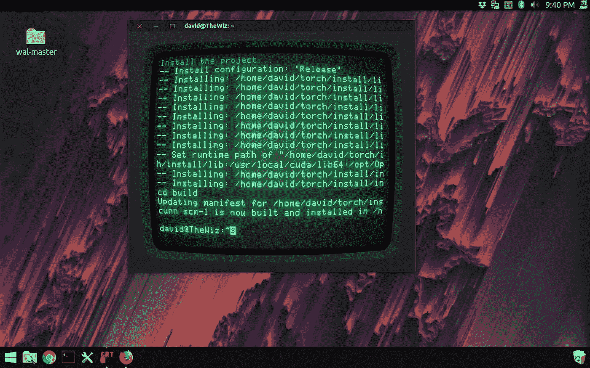

# 艺术家如何建立自己的神经网络——第一部分——装置

> 原文：<https://medium.com/hackernoon/how-artists-can-set-up-their-own-neural-network-part-1-installation-5dddac1ca331>

> 最初发表于 [Jackalope.tech](https://www.jackalope.tech/how-artists-can-set-up-their-own-neural-network-part-1-installation/) (点击链接订阅更多)

这篇文章旨在帮助艺术家、设计师和其他非技术人员在他们的电脑上建立一个神经网络。[这里有一篇文章](https://www.jackalope.tech/how-artists-can-use-neural-networks-to-make-art/)，我在其中介绍了神经网络的概念以及艺术家如何使用它们。

*我认为这是用词不当，但那篇文章还没有完成。

## 你需要什么

1.  Windows 或 Linux PC
2.  功能强大的显卡
3.  至少有 8 gb 空间的闪存驱动器
4.  至少有 150 gb 可用空间的硬盘
5.  有线键盘和鼠标

你需要一台 Windows 或 Linux 电脑。如果你有一台苹果电脑，让它工作起来会更容易和更难。解释这一点已经超出了我的范围，而且[我也不是一个真正的 Mac 迷。](https://en.wikipedia.org/wiki/John_Hodgman#/media/File:John_Hodgman.jpg)

你还需要一个强大的显卡。图形卡是一种在屏幕上制作图像的处理器。大多数人都有“集成图形卡”，这意味着图形卡是内置在他们的电脑。你需要一个“专用显卡”来运行神经网络。这些显卡用来玩视频游戏，运行 3D 建模程序，或者运行 [VR](https://www.jackalope.tech/what-ive-learned-sculpting-in-virtual-reality%e2%80%8a-%e2%80%8aoculus-medium/) 。我有一辆 [GTX 970](http://gpuboss.com/graphics-card/GeForce-GTX-970?q=GeForce%20GTX%20970&ts=1521647912943) 。你至少需要这么强大的东西来运行神经网络。

My most recent painting. I premiered a first edition print of it at the [vurv](http://www.vurv.co/) group show last month.

## 为 Linux 安装 Ubuntu

你需要使用神经网络的第二个东西是 Ubuntu for Linux。Linux 是一种操作系统，就像 Windows、Mac、iOS 或 Android 一样。它是你的计算机用来与你交流的图形用户界面。它将您的硬件输入连接到计算机的软件。它还将计算机的软件连接到计算机的处理硬件。它就像一个忙碌的办公室助理，帮助人们在办公室里获得他们需要的东西。不是所有的软件都与所有的操作系统兼容。这就是为什么有些应用程序可以在 iPhone 上运行，但不能在 Android 上运行。神经网络是非常前沿的技术。它们不是为消费者制造的。大学的研究人员制作它们来学习如何制作它们。大多数研究人员使用 Linux 是因为它是免费和“开源”的。开源意味着他们可以修改代码来满足自己的需求。Windows 和苹果不会允许你对他们的操作系统这么做。

我们准备安装 Ubuntu。这是 Linux 的一个特定的发行版，或者说风格。它相对用户友好，这也是这个程序的初衷。要安装操作系统，你需要对你的硬盘进行分区。这意味着你要分出一部分硬盘空间来运行 Ubuntu。您的操作系统目前“格式化”或组织您的整个硬盘。你不希望两个办公室助理在同一个办公室，因为他们最终会纠缠在一起。我们正在分配办公空间，这样他们可以分开工作。

*   给你的硬盘分区。关于如何做到这一点的教程可以在[这里](https://www.lifewire.com/how-to-partition-a-hard-drive-2626081)找到。
*   在这里下载 Ubuntu 安装程序。
*   在这里下载 Ubuntu 安装程序。
*   在这里下载 USB 安装程序[。它将帮助你运行 Ubuntu 安装程序。](https://rufus.akeo.ie/)
*   按照本教程[的其余部分](https://tutorials.ubuntu.com/tutorial/tutorial-create-a-usb-stick-on-windows)制作一个可引导的 USB 驱动器。
*   现在按照本教程[的其余部分](https://tutorials.ubuntu.com/tutorial/tutorial-install-ubuntu-desktop#3)来实际安装 Ubuntu。确保在你分区的驱动器上安装 Ubuntu。不要在 c 盘上安装 Ubuntu。这是 Windows 所在的驱动器，如果覆盖，您将丢失所有文件。
*   在这里下载 Ubuntu 安装程序。

一旦你完成了安装过程，你就会发现自己在 Ubuntu 中。

这是我的场景。我想让这个教程看起来很酷。

第 1 部分到此结束！下周我将发布第 2 部分，我将谈论如何安装神经网络深度风格。然后第 3 部分我将解释运行神经网络的过程，并为您提供一个免费的脚本来帮助您自动化您的过程，最后第 4 部分将讨论如何在 Photoshop 中的混合媒体数字绘画中使用神经网络材料。

请务必订阅 [FB](https://www.facebook.com/Jcklpe/) 或 [RSS feed](https://www.jackalope.tech/feed/) 以获取最新更新，或者[订阅简讯](https://mailchi.mp/f75162f1141a/design-x-code_newsletter)以获得额外的额外内容！