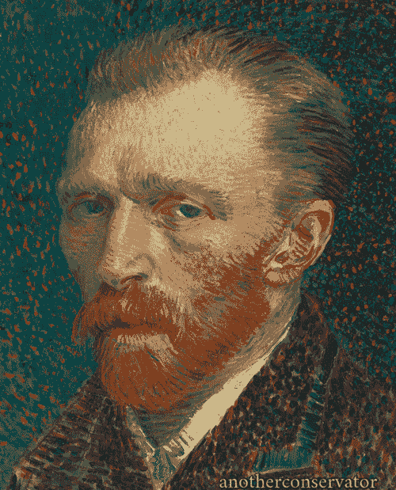

# 艺术家如何建立自己的神经网络——第三部分——图像生成

> 原文：<https://medium.com/hackernoon/how-artists-can-set-up-their-own-neural-network-part-3-image-generation-2e7679f6959c>


好了，我们已经安装了 linux 和神经网络，现在是时候实际运行它了！

首先，我想为推迟发布本系列教程的最后两部分道歉。正如我在我的 [Skonk Works](https://www.jackalope.tech/skonk-works/) 帖子中解释的那样，我学得太快了，以至于很难抽出时间来消化和写下来。

例如，这个系列教程从教你如何安装 Ubuntu 16.04 开始，但对 Ubuntu 16.04 的支持刚刚结束，你真的应该安装 Ubuntu 18.04，这是我在擦拭我的桌面并将其变成一个全职个人云服务器后所做的！这很好，因为现在我有了一台完全专用的 Linux 机器来全天候运行神经网络批处理作业！虽然弄清楚这个新工作流程的过程非常混乱，结果我最近只有足够的时间来确保我的工作管道稳定，并经历了重新安装深度风格的麻烦(我也更新了第二部分的文章的原文[，提供了一些在 18.04 上安装的技巧)](https://www.jackalope.tech/how-artists-can-set-up-their-own-neural-network-part-2-neural-network-install/)

好消息是，现在我对 Linux 有了更多的了解！我现在有一些其他的事情需要处理，但我希望用我所学到的知识制作一个续集或更新系列，为艺术家和其他非程序员创建一个更简单、更自动化的过程。

现在，虽然我想适当地完成这个系列，所以本周我们将谈论如何实际运行 DeepStyle，以及如何将该过程转换为脚本，可以生成大量图像供您使用。在教程的最后，我甚至会包含一个 Bash shell 脚本的链接，您可以将自己的变量插入其中！

要运行 neural style，您需要打开终端。


my linux desktop looks way different now

## 如何运行 DeepStyle 命令

然后，您需要:

```
cd ~/neural-style
```

这将“改变目录”到文件夹“neural-style ”,其中已经安装了神经网络实现 DeepStyle。

要运行神经网络，你需要运行一个命令。在上一个教程中，我告诉您使用以下命令来测试您的安装是否正常工作:

```
th neural_style.lua -gpu 0 -print_iter 1
```

让我们一点一点地把它分解。

```
th
```

`th`是你安装的神经网络框架“torch”的简称。你把它叫做一个程序去做一些事情。

```
neural_style.lua
```

`neural_style.lua`是为运行 DeepStyle 而创建的脚本。它的文件扩展名是“lua ”,因为它是用 lua 语言编写的。一些计算机程序必须被编译(你在上一个教程中已经编译过了，以使 DeepStyle 工作),但是一些程序运行在更高的层次上，你可以把它们作为文本文件来运行。这些“脚本语言”更容易使用。

所以`torch`正在调用`neural_style`的 lua 脚本。但是你需要告诉它你具体想做什么！这可以通过标志来实现。旗帜看起来像这样:

```
-gpu 0
```

或者这个:

```
-print_iter 1
```

或者这个:

```
-this_aint_a_real_flag true
```

基本上，它会是 `-something`，旁边有一个破折号，表示正在使用的设置名称，后面是正在设置的设置。很简单，对吧？

## 我推荐的命令

以下是您可以运行的一个非常标准的命令:

```
th neural_style.lua -save_iter 400 -image_size 512 -style_image library/van-gogh.jpg -content_image library/picture-of-me.jpg -num_iterations 1200 -gpu 0 -output_image library/output/picture-of-me/van-gogh-picture-of-me.png
```

现在我将解释每一个标志。

```
-save_iter 400
```

这意味着神经网络应该每 400 次迭代保存一张进度图。以这种方式转换图像的神经网络通过迭代来实现。我推荐你阅读[我的第一篇神经网络和艺术文章](https://www.jackalope.tech/how-artists-can-use-neural-networks-to-make-art/)(不是教程)，它讲述了神经网络的一些概念背景，并链接到一些可能有助于理解的资源。有了上面的设置，我让它每 400 次迭代保存一张进度图，但是你可以做得更多，如果你想在样式中加入一些动画，以我的经验来看这是很酷的。


```
-image_size 512
```

以上是我指定输出图像大小的地方。我的桌面上有一个 970 的 gpu，512 是我能可靠输出的最大值。你也许可以做得更多，但即使有更强大的机器也很难，因为随着规模的扩大，它不是线性增长，而是呈指数增长。换句话说，你把图像的尺寸扩大一倍，你就需要四倍的火力。因为不仅仅是增加宽度，还有长度。

```
-style_image library/van-gogh.jpg
```

这个标志告诉 DeepStyle 使用哪个图像作为您的样式图像引用。(同样，参考第一篇文章来理解风格和内容图像的术语)。在这种情况下，我在名为 library 的神经风格文件夹中创建了一个文件夹，并将一幅梵高的画保存为 jpeg 格式。



```
-content_image library/picture-of-me.jpg
```

这就是设置内容图像。我也把它放在图书馆的文件夹里了。我喜欢将我所有的风格、内容和输出图像保存在一个独立于神经网络文件的文件夹中，这样我在工作时就不会把事情弄得超级乱。(实际上，现在我已经将我的桌面设置为个人云服务器，我让它自动将内容输出到云文件夹，然后下载到我的笔记本电脑上，在那里我用 Photoshop 等软件进行实际的绘画)。

```
-num_iterations 1200
```

这将告诉 DeepStyle 我想要进行的迭代总数。假设你做的迭代越多，你就可以让内容图像和样式图像越相似，但是我发现超过 1200 后，基本上是收益递减的。

```
-gpu 0
```

这告诉 DeepStyle 使用 gpu。

```
-output_image library/output/picture-of-me/van-gogh-picture-of-me.png
```

最后一块！这告诉 DeepStyle 在哪里输出图像。在这种情况下，我让它在库内创建一个名为“output”的文件夹，然后让它创建一个以所用内容图像命名的文件夹，然后我给它一个包含内容图像和样式图像名称的名称。我认为这样做是个好主意，因为一旦你开始批量处理这些东西，你将会得到大量的输出，而且必须把它们组织起来。

这就是标准脚本的基本分解。但是代码的伟大之处在于它真的很擅长一遍又一遍地做重复的事情，所以即使我们可以一遍又一遍地复制和粘贴它，并且每次都改变图像和输出的名称，我们也不需要这样做！我为它写了一个剧本！

# [**拿过来**](https://github.com/jcklpe/NeuralArtTutorial/blob/master/deep-style-batch.sh)

## 自动化它！

下面是这段代码的样子:

```
function neural_fusion() {
th neural_style.lua -save_iter 400 -image_size 512 -style_image library/$1.jpg -content_image library/$content.jpg -num_iterations 1200 -gpu 0 -output_image library/output/$content/$content-$1.png

};

content=mantis;
mkdir library/output/$content;

neural_fusion zebrasmoothie;
neural_fusion wolfhowl;
neural_fusion wood;
```

这是代码的意思。首先我创建一个函数。函数只是存储一系列动作的一段代码。这有点像一个魔咒，我把它写在卷轴上，这样我就不必每次想用它的时候都记住所有复杂的单词。这是函数:

```
function neural_fusion() {
th neural_style.lua -save_iter 400 -image_size 512 -style_image library/$1.jpg -content_image library/$content.jpg -num_iterations 1200 -gpu 0 -output_image library/output/$content/$content-$1.png

};
```

您可以看到它包含带有运行 DeepStyle 的标志的命令。它也有一些有趣的美元符号。这些都是变量。变量类似于函数，但更简单。你可能在数学课上认识他们。X+Y=250 然后你得算出 X 是多少才是对的？x 和 Y 只是其他数字的替身，或者在这种情况下是单词的替身。

```
content=mantis;
```

这里我将变量`$content`设置为等于 mantis。可以看到，`$content`被用作内容图像的名称。所以我在图书馆里有一个图像叫做`"mantis.jpg"`。

```
mkdir library/output/$content;
```

这里，我在我的输出文件夹中创建了一个名为“mantis”的新目录，用来存放我的 mantis 内容图像输出。保持东西整洁！

```
neural_fusion zebrasmoothie;
neural_fusion wolfhowl;
neural_fusion wood;
```

这是我运行 DeepStyle 的地方。每一行都是我调用我创建的 neural_fusion 函数，并赋予它一个附加到样式图像的变量，该变量在函数中表示为$1。我不需要像声明 mantis 和 content 那样声明这个函数，因为它会在函数的每次运行之间发生变化。

基本上就是这样了！你可以运行这些程序，得到大量的图像。

## 让它们变大！

如果你想用它们来绘画，你需要把这些图像的分辨率变大，对吗？但是……你怎么能让图像变大呢？我的意思是，你可以把图像放大，但它们会像素化…对吗？


这就是神经网络魔法再次出现的地方。我们要用一个叫“Waifu2X”的神经网络。外服是日本书呆子对妻子的俚语称呼。但这是一种特殊的妻子。这是…嗯是动漫老婆。这就像…你有一个生气勃勃的妻子。基本上这只是一个日本书呆子说他们真的喜欢某个角色的一种方式…呃…听着，我不会向你解释的。你可以查一下。

重点是。有些人非常喜欢动漫。他们非常喜欢它，他们训练了一个神经网络来制作更大的动画！

(也不要一查外服就马上在谷歌图片搜索上查“大动漫”。)

外服 2x 就是这样。这是一个神经网络，它是在数千帧 1080p 和 4k 分辨率的动画上训练的，所以你可以给它一个 1080p 的图像，它就会变成 4k。或者你可以给它任何大小的图像，它会让它变得更大。起始图片越小，它的信息就越少，但是从各方面考虑，它都非常令人印象深刻！我很惊讶 Adobe 还没有尝试把这个打包进 Photoshop。可能是因为这种神经网络有可能彻底摧毁他们一直试图进入的库存照片行业，但是…你知道…

无论如何，我不打算详细介绍这个，因为它很容易在 Windows 上安装，而且它使用 GUI，所以大部分内容都是不言自明的。

基本上你只需要从[这里](https://github.com/lltcggie/waifu2x-caffe/releases/download/1.2.0.1/waifu2x-caffe.zip)下载。

拉开拉链。然后你只要打开文件夹，点击。exe 文件，GUI 将打开:


选择输入路径，选择输出路径，然后设置放大尺寸。2.00 意味着它将是两倍大。4.00 表示 4 倍大。很基本的东西。去噪可能是有帮助的，尽管它也可以洗掉样式图像赋予的许多纹理，并且它可以导致一种统一的“塑料”外观。其余的设置你真的不需要弄乱。您选择一个文件夹作为输入路径来制作一大批图像。这很简单。

下周是最后一部分！

(但不是关于这个主题的最后一篇文章。我还有更多的消息，所以请订阅我的 [RSS](https://www.jackalope.tech/feed/) ，或者[时事通讯](https://mailchi.mp/f75162f1141a/design-x-code_newsletter)，或者 [facebook 页面](https://mailchi.mp/f75162f1141a/design-x-code_newsletter)。一如既往，如果您有任何问题或意见，请务必联系我们。在我离开后收到的“粉丝邮件”是鼓励我坚持下去并回来完成这个系列的原因之一。我不想让你们失望！)

*最初发布于*[*jackalope . tech*](https://www.jackalope.tech/neural-networks-for-artists-tutorial/)*。*