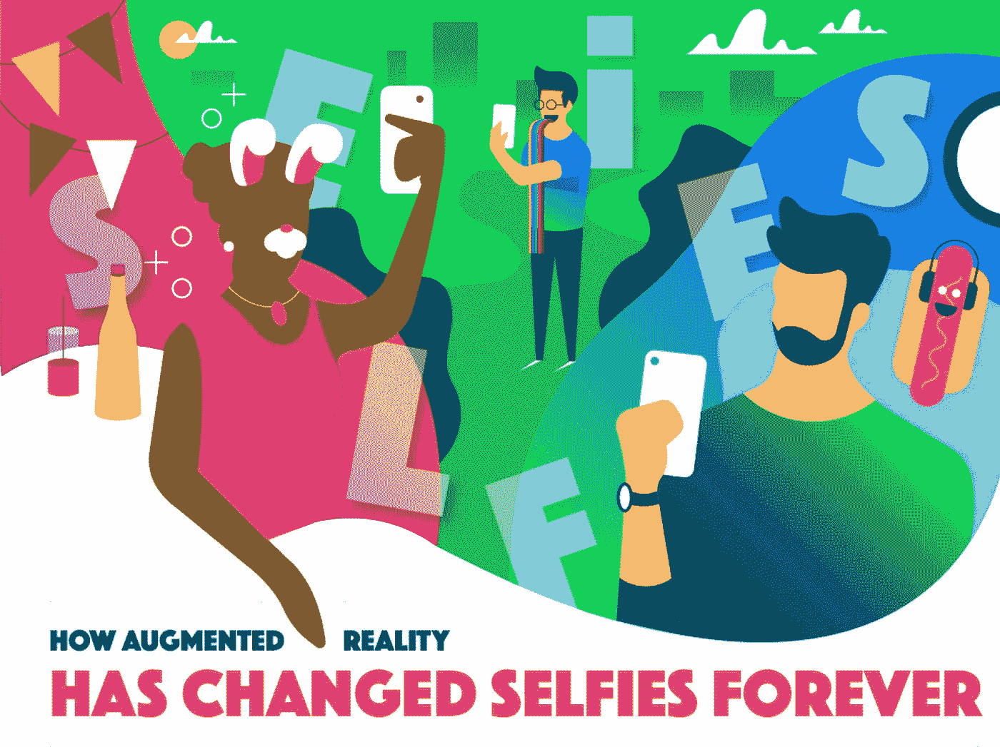
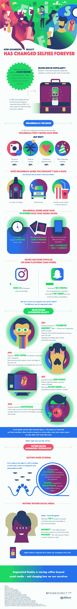

# 增强现实如何永远改变了自拍

> 原文：<https://medium.com/hackernoon/how-augmented-reality-has-changed-selfies-forever-2945a2f19270>

2015 年，Snapchat 推出第一款交互式滤镜时，自拍照风靡全球。这种标志性的滤镜被我们许多人简单地称为“呕吐彩虹”，它开创了实时过滤自拍的潮流。计算机跟踪技术为某些焦点绘制面部地图，如眼睛和鼻子，以将用户的面部与过滤器匹配。结果是一张定制的、有时有些傻乎乎的自拍，只求与朋友分享。Snapchat 仍然是分享自拍的顶级社交媒体平台，即使是在 Instagram 上，这是有原因的。

这项面部映射技术甚至更进一步。苹果公司在 iPhone X 的发布上更进一步，iPhone X 拥有面部识别手机解锁功能，取代了典型的密码和 PIN 码。在欧洲，超过三分之一的人表示，使用自拍形式的面部识别作为银行账户的密码，他们会感到更安全。

增强现实可能会[提升我们的自拍游戏](https://www.framesdirect.com/blog/how-augmented-reality-has-changed-selfies-forever)，但它背后的面部识别技术具有更大的潜力。看看这个来自 Frames Direct 的信息图，关于 AR 的所有事情，它如何转变，我们的自拍，甚至管理我们的安全。

