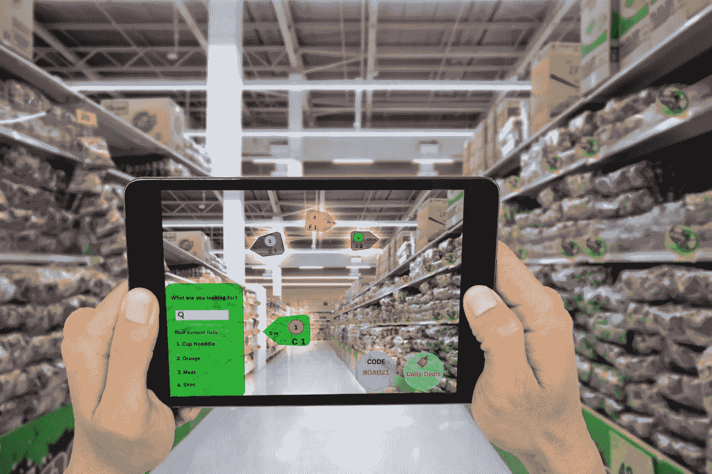

# 增强现实是如何颠覆零售业的

> 原文：<https://medium.com/hackernoon/how-augmented-reality-is-disrupting-the-retail-industry-9168b34ab8a1>

许多人仍然认为增强现实技术仅仅局限于娱乐和消遣。人，请自我更新！自从被引入市场以来，今天的增强现实技术已经走过了漫长的道路。它现在已经准备好帮助各行各业，比如零售业。该行业的企业正在关注增强现实应用开发的实际需求。

增强现实已经成为零售商实体商店和单调商店的关键技术。AR 具有所有的优势，可以像人们在电子商店一样，给实体店带来高度的活力和快速，例如检查数百种产品，将它们保留在愿望清单中，然后制作最终清单，以购买其中选定的产品。事实上，对于实体零售店来说，AR 技术更进一步，允许顾客虚拟试穿衣服。

AR 技术是正在进行的数字化革命的结果，这场革命现在几乎触及了我们生活的方方面面。智能手机是这场革命最大的例子之一。零售商已经了解到 [AR 技术](http://www.rapidsofttechnologies.com/augmented-reality-mobile-app-development.php)可以完全改变实体零售店和在线零售店今天的运营方式。我们来了解一下。

**使用 AR 技术打造激动人心的新店体验**

拥有实体店的零售商正看到在线购物网站对公共购物场所造成的破坏。几年前，同样的公共购物场所被一大群人参观，以探索不同的产品。他们现在没有那么多人了。结果，实体店在过去的对比中销量很少。

人们并没有停止购物。他们仍在购买，但现在他们在网上购买。在逛实体店的比较中，越来越多的人对网购表现出兴趣。这种注定的局面是由某些因素造成的。其中一些提到如下:

没有或只有最低限度的交互性

不与购物者接触

付费柜台前的长队等候

这些问题中的大部分都可以通过增强现实技术轻松解决。让我展示一些增强现实和移动性可以帮助客户享受更顺畅购物体验的使用案例。

Lisa 进入一家商店，在那里她被告知，如果她下载该商店的 AR 应用程序，她将有完全不同的购物体验。

她下载了应用程序并进入商店，但很快她意识到所有的售货员都在忙着接待其他顾客。在这里，她使用手机上的应用程序，开始扫描产品，以获取每件产品的详细信息。

如果她选择了一条牛仔裤并将其放入购物车，具有人工智能功能的 AR 应用程序会推荐与牛仔裤搭配的 t 恤或鞋子。

当她点击一件匹配的 t 恤或一双鞋时，AR 应用程序会指导她如何到达商店中可以挑选这些产品的确切位置。

此外，该应用程序允许用户通过应用程序本身进行支付。这将有助于顾客在商店购物和结账，而无需在付款柜台前排长队。

使用 AR 技术，可以消除一些无聊的过程，如找到所购买产品的正确匹配，在大商店中找到产品，排队几分钟进行支付。实体店可以再次变得有趣和更有活力。

**电子商务的增强现实**

增强现实也在支持电子商务商店。将该技术应用于电子商务商店的重点是使产品的虚拟购买接近实体购买体验。

网上购物的人对他们使用的电子商务应用程序并不完全满意。这几乎是一种片面的体验。他们不能当场试用产品，以避免以后退货，这无疑是一个比购买产品然后送货更长的过程。他们不确定产品的大小，因为不同品牌的产品大小不同。他们也不确定某种颜色是否适合他们。

电子商务商店仍然缺少几样东西。但是，增强现实可以非常智能地解决这些问题，甚至不会失去过程的真实意义。

让我在这个故事中再次提到丽莎。以下是 Lisa 在使用支持 AR 的电子商务移动应用时将体验到的一些使用案例。

丽莎想在网上买一副太阳镜，但她既不确定镜框和颜色，也不确定适合她脸型的尺寸。感谢上帝，她想买的品牌已经有了一个具有 AR 功能的移动应用程序，允许人们拍照并应用商店应用程序中的任何太阳镜。当 Lisa 在应用程序中调整她的照片时，应用程序会自动调整太阳镜的大小。

Lisa 的客厅需要一张咖啡桌，她在一个家具电子商务应用程序上找到了一个选择。但是她再次怀疑实际的桌子是否适合可用的空间。她发现，她想买一张桌子的品牌有一个 AR 应用程序，可以让她在任何想放家具的地方放家具。她那样做了，最后买了她喜欢的桌子。当产品交付给她时，她发现它与她通过应用程序虚拟查看后订购的完全一样。

丽莎喜欢化妆，她在网上购买。很多时候，她在网上购买的美容产品并不是她自己选择的，因为她在购买前不能试用。但后来她发现了一个应用程序，可以让她在自己的照片上虚拟地涂上唇色。她立即下载了应用程序，并点击了她的照片。然后她在照片上试了上百种颜色，决定哪种颜色适合她。

这就是为什么 Lisa 可以因为增强现实技术而虚拟地拥有更流畅和更真实的在线购物体验。

**结束**

AR 已经有了想要的步伐。企业知道如何提供更好的体验，以不断吸引实体店和电子商务商店的客户。

**作者简介:** Sofia 是 Rapidsoft Technologies 的数字营销专家，Rapidsoft Technologies 是一家领先的 IT 咨询公司，提供全方位的 IT 服务，包括[物联网应用开发](http://www.rapidsofttechnologies.com/ioT.php)、区块链开发、 [ERP 开发](http://www.rapidsofttechnologies.com/enterprise-resource-planning-app-development.php)和大数据应用开发解决方案。