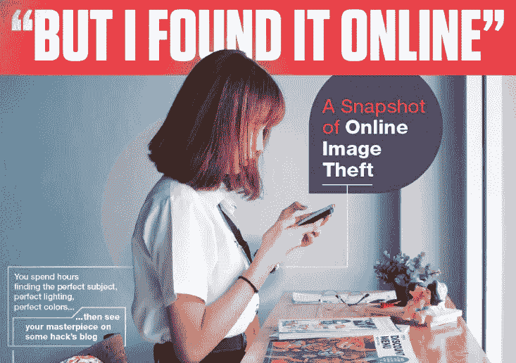

# 网上图像盗窃有多严重？

> 原文：<https://medium.com/hackernoon/how-bad-is-image-theft-online-a07024cd3ecf>

你能做些什么呢？

经常发生的最常见的犯罪之一是在线图像盗窃，大多数时候人们甚至没有意识到他们正在盗窃。他们的想法是“我在网上找到的，所以肯定可以拿。”不幸的是，事实并非如此。大多数专业摄影师报告说他们的作品被盗过数百次，甚至 44%的业余摄影师报告说他们的照片在网上被盗过。

部分问题是人们没有意识到仅仅因为你*可以*下载某些东西并不意味着你*应该*。所有原创作品，如摄影作品，无论是出版还是未出版，注册还是未注册，都有自动版权。1978 年以后制作的任何作品都是创作者终身加 70 年的财产，该创作者拥有复制、展示、从中赚钱以及以该财产为基础创作其他作品的唯一权利。

谷歌正在通过加大下载他人作品的难度来进行反击，但不在网上窃取真的取决于个人。如果你是一名摄影师，你可以使用一些工具来找到你被盗的作品，比如谷歌的反向图像搜索或 Berify。一旦你发现你的图片未经许可就被使用，你可以决定采取何种行动来补救这种情况。从这张信息图中了解更多关于[在线图像盗窃](https://berify.com/blog/image-theft/)问题的信息。

