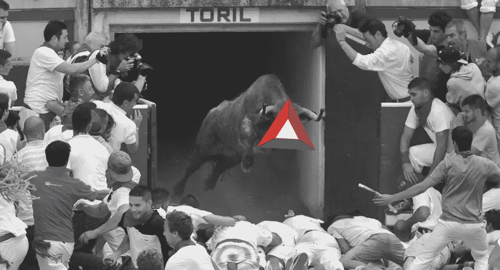

# BAT 如何开始更大的加密货币牛市

> 原文：<https://medium.com/hackernoon/how-bat-could-enable-an-even-bigger-cryptocurrency-bull-run-301e9d9c33b1>

基本注意力标志(BAT)可能看起来不像是一个开始牛市的候选人，更不用说一个更大的牛市了，但最终可能会证明它在再次获得主流兴趣方面的宝贵价值。为了解释为什么，我们首先需要知道是什么导致了之前的牛市。

在 2017 年底的上一轮牛市期间，比特币和加密货币整体上每天都得到媒体的报道。美国消费者新闻与商业频道有一个*“快钱加密”*插曲，福布斯&彭博每天至少有一篇关于比特币的文章，加密货币广告在国家电视台播出，几乎每个人都在谈论它。这导致价格以前所未有的速度上涨，得到了更多的媒体关注，带来了投机投资者，并造成了滚雪球效应。

比一般人更“鲁莽”的部分，谁不想错过他们唯一的快速致富的机会，没有做适当的(甚至任何)研究就决定投资。我们现在都知道，这是一场灾难。

# 下一轮牛市

目前投资者很谨慎，主流兴趣已经消失，根据媒体报道，比特币仍然是一个毫无价值的泡沫。和上次的条件差不多，对吗？

不完全是，这些鲁莽的投资者要么已经损失了大部分资金，要么不会被两次‘忽悠’了。

这就是为什么在我看来，下一轮牛市最有可能是由用例、主流采用，或者说实际的现实世界价值引发的。毫无疑问，价格仍然会受到媒体关注和猜测的影响，但与以前不同的是，这些不会是背后的主要驱动力，至少在最初是这样。

因此吸引了更保守的投资者，但有一个问题，这些投资者不会马上冒险投入大量资金。他们需要被说服，用自己的眼睛(或金钱)去看。

# **蝙蝠的作用**

这是 BAT 将证明其价值的地方，要找出原因，我们需要理解 BAT 背后的概念:

> 基本注意力令牌(BAT)是一种用于分散式广告交换的令牌，它对浏览器用户的注意力(观看广告)进行补偿，同时保护其隐私。BAT 将广告商、出版商和用户联系在一起，同时消除与现有广告网络相关的社会和经济成本，例如欺诈、侵犯隐私和恶意广告。

现在让我们专注于薪酬方面，因为这将是推动主流采用的杀手级特性。[据 Basic Attention Token 的首席执行官布伦丹·艾希(Brendan Eich)](https://www.reddit.com/r/BATProject/comments/7l4033/transcript_of_ama_with_brendan_eich_ceo_of_brave/)称，用户通过浏览网页和观看不常见的广告，每年大约可以赚到 224 美元。对大多数人来说，这不是一笔小数目。

这些收入可以以法定货币或加密货币支付，并且最有可能由比特币基地处理，正如我在[上一篇文章](/@PolarChain/why-basic-attention-token-bat-will-be-the-first-erc-20-token-listed-on-coinbase-9d82ce9c23ad)中提到的。这意味着每个选择观看 BAT 广告的用户都将接触到其他加密货币，如比特币、以太坊、莱特币，甚至可能是一堆 ERC-20 代币。

现在，这些用户大多会选择直接将收益套现。然而，他们中的一些人会愿意将他们基本上“免费的钱”赌在一些加密货币上，类似于在赌场免费下注或免费旋转。一旦这些人看到他们的无风险投资增值，他们甚至可能倾向于投资一些他们的“血汗钱”。大多数网上赌场提供这种促销是有原因的，因为这是让人们花“自己的钱”的最有效方式。

# 推动采用

为了实现这一切，BAT 将首先需要实现主流采用，但这不会发生，直到他们的杀手级功能(BAT 广告)发布。[据 Brave 的高级技术专家 Luke Mulks 称，公共广告路径将在仲夏推出，因此最有可能在八月左右。所以目前来说，让我们把重点放在这个特性发布后会发生什么。](https://i.imgur.com/kh9ePhm.png)

目前，集成了 BAT 平台的 web 浏览器应用 brave 正在运行一个推荐计划，出版商可以从每个下载 Brave 浏览器的用户那里获得价值 5 美元的 BAT。超过 7444 名创作者目前正在参与其中，包括像[菲利普·德弗兰克](https://youtu.be/-_fqzg8PNgY?t=5m44s)(600 万用户)和[巴特·贝克](https://youtu.be/f5aDlwO8hDU)(1000 万用户)这样的大型 Youtubers。

结合这一点，以及用户通过简单地切换到不同的浏览器可能获得的 224 美元/年的收入，你就有了用户采用率巨大爆炸的完美配方。

# 潜在用户

有整个社区致力于在网上赚取一些额外的钱，数千个 Youtube 教程，数百个 T2 脸书团体，甚至一个非常活跃的 T4 Reddit 页面，都致力于这个话题。现在大多数的方法要么花费大量的时间，要么支付很低的金额，以至于你甚至达不到支付的门槛，问题是人们仍然做他们，不管他们不值得做的事实。

这就是英美烟草可以改变游戏的地方，一种本质上被动的赚取大量额外收入的方式，以及一个给这些“大师”传播消息的激励的推荐计划。一旦 BAT 的广告向公众发布，甚至不需要一个月，这些社区中的几乎每个人都会使用它。这些用户然后会把这个消息传播给他们的朋友和家人，因为谁不喜欢‘免费的钱’。媒体也可能会加入这一潮流，用点击诱饵标题，如*“这个浏览器会付钱让你浏览互联网”*或*“这个加密公司是谷歌杀手吗？”。换句话说，每个人都会谈论这件事。*

# 滚雪球效应

随着 BAT 知名度的提高，用户的采用增加，更多的广告资金流入系统。这意味着价格上涨得更快，投资者出售的动力更小，进一步减少了实际流通供应量。导致 BAT 价格迅速失控，带出投机投资者，产生滚雪球效应。

这开始听起来很像之前的牛市，对吗？嗯，是的，但有一个“小”的区别，它不会只基于投机，因为将有真正的需求和广告客户花的钱。

这不仅对 BAT 有利，对整个加密货币市场也是如此。由于这些钱不会流向大公司或独角兽初创公司，几乎所有的钱都会直接流向用户，因此正如前面提到的那样，很多钱会投资回加密货币市场。

# 可持续牛市

这将导致整个市场迅速超越之前的高点，同时将加密货币重新置于媒体的聚光灯下，并吸引新投资者的注意力。几乎完全重复了之前牛市的场景，但有一个小小的不同，广告客户的钱源源不断地分配给用户，他们有望将大部分钱花在加密货币上。

这本身将导致更大的滚雪球效应，因为市场上涨越快，越多人愿意将他们的 BAT 收入投资于加密货币。说服更多的人投资“他们自己的钱”，导致市场上涨更多，并重复循环。

这意味着，只要新用户不断加入生态系统，这种循环以及这种潜在的牛市就可以持续下去。即使这个循环被打破，因为没有新用户加入 BAT 生态系统，整个市场可能会保持增长很长一段时间，因为每天都有大量新投资者涌入市场。

***免责声明:*** *本文为本人观点，仅供参考，无意作为投资建议。向有执照的专业人士寻求投资建议。*

## 通过在 [Medium](/@PolarChain) 和 [Twitter](https://twitter.com/PolarChain) 上关注我，获得我的新文章通知:

 [## 极化链(@极化链)|推特

### PolarChain (@PolarChain)的最新推文。边缘分析组的基本分析师，活跃于…

twitter.com](https://twitter.com/PolarChain)