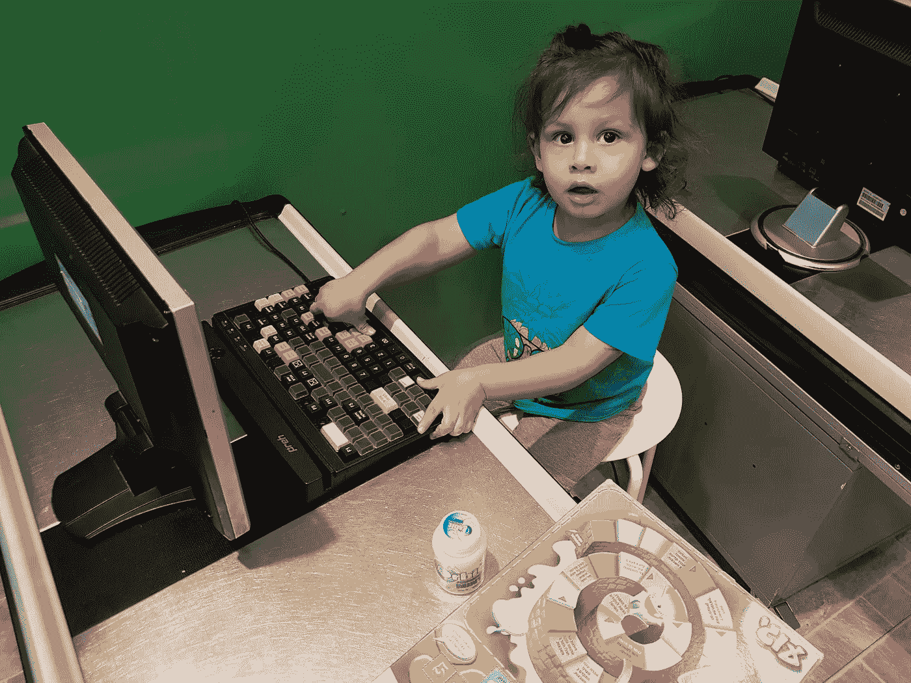
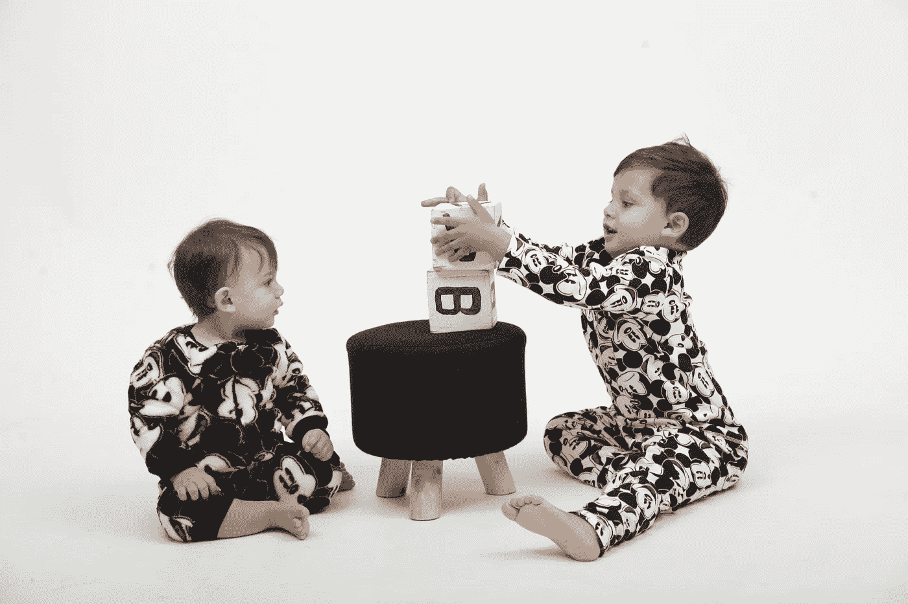
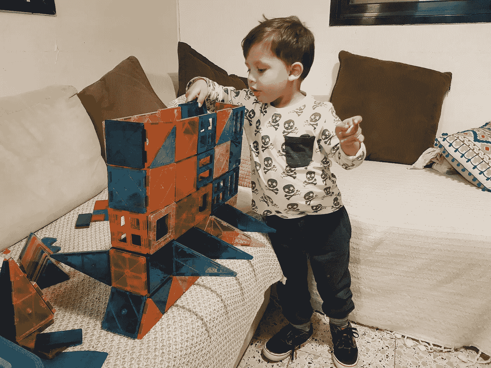
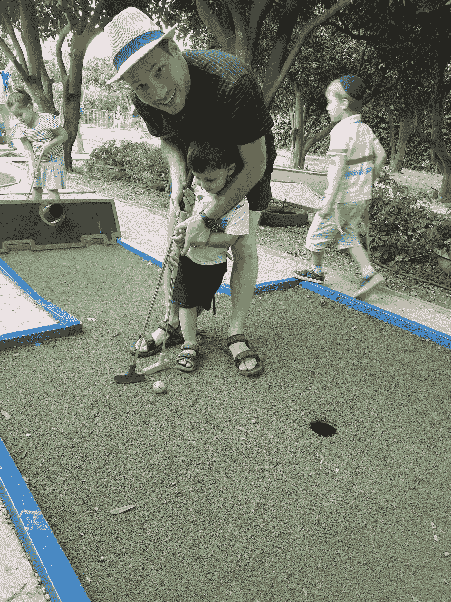

# 做父亲如何让我成为更好的开发人员(反之亦然)

> 原文：<https://medium.com/hackernoon/how-being-a-dad-makes-me-a-better-developer-and-vice-versa-85a92884eeaf>

## 我的孩子教我如何构建软件，反之亦然！

Me and my family

嗨，我是吉拉德。我领导着 Bit 的开源团队，我是 Sivan 的丈夫，也是两个小男孩的父亲:Arad (3 岁)和 Tavor (1 岁)。

在这篇文章中，我将分享我作为父亲、丈夫和软件开发人员的个人生活经历。

虽然这并不总是简单的，但是当我写代码的时候，当我和家人在一起的时候，我生活中的这些不同部分每天都在相互影响。

这是我的亲身经历。我希望你会觉得有趣，甚至有用。请随意评论，分享你的见解，甚至从一个母亲的角度分享这种感觉！享受吧。

# 关于我的生活

Me and my family

我是两个好男孩的父亲:阿拉德 3 岁，塔沃尔还不到一岁。两人都有点能量弹，充满了好奇和喜悦。虽然我不记得睡了几年，但它们是发生在我身上最好的事情。

我在 [**比特**](https://bitsrc.io) 工作。我不只是在那里工作，我还建立了我相信的东西。我正在研究一种开源技术[T7，它可以改变我们用更小的组件构建软件的方式。我对这个未来感到非常兴奋。](https://hackernoon.com/tagged/technology)

我的生活由家庭、工作、朋友和我所有的业余爱好组成，比如大学的辩论俱乐部、开源、跑步等等。

在过去的三年里，我越来越注意到我生活中的某些方面有着相同的经历，需要相同的技能才能成功。

# 写代码和抚养孩子

作为一个父亲，我所发展的技能和特点实际上让我在工作中变得更好，而且让我非常惊讶的是，工作确实让我成为一个更好的父亲和丈夫。这些技能包括从创造力和坚持到团队合作，甚至算法思维和设计模式:

*   创造力
*   持续
*   责任
*   协力
*   逻辑思维
*   学习新技能

让我们开始吧！

# 创造力与不可能

Sleeping is never impossible — when you’re tired, be creative

在我看来，这是任何一个开发者最重要的技能之一。

作为一名软件开发人员，您总是会面临需要创造性解决方案的新问题。如果你有足够的创造力，看似不可能的事情是可以实现的。这是创新的关键。

作为一名开发人员，您不断地提升和培养您的创造力。这也让你成为一个更好的爸爸。

创造力影响着你抚养孩子的方方面面。例如，当你的孩子哭泣、悲伤或生气时，它可以帮助你安抚他们。

当你的孩子无缘无故地哭，或者当他们决定想要他们现在不能拥有的东西时，每个父母都非常熟悉这种不可能的情况。尖叫声可以穿透任何进入范围内的人的灵魂。

作为家长，这种情况很让人沮丧。在公共场合，也很尴尬。

那么，你如何“解决”一个孩子在凌晨 4 点想要糖果的情况呢？你变得有创造力！

就我个人而言，我发现当我提供与他想要的相似的替代品时，我只会让他更生气。然而，创造性的解决方案通常是发明一些你现在就可以给他的全新的东西。

他们没有预料到的事情意味着他们措手不及。然后，他们开始思考和评估形势。当你思考的时候，你不会像以前那样大喊大叫。他们也会很快忘记自己想要什么。

当然，这需要大量的创造力(随着时间的推移，你会越来越多地使用这种方法；你能想出多少东西？).

## 将这种创造力传递给你的孩子

孩子们天生就有创造力。不幸的是，随着他们开始长大，他们变得越来越没有创造力，越来越墨守成规。

通过创新和奖励创新思维，您将:

1.  让你的孩子长时间保持创造力。你保护他免受那些试图关闭他的思维让他变得更可预测的人的伤害，这样他们就能更好地控制他。这是一件大事。
2.  用你自己的创造力来增强他的创造力。将几个有创造力的头脑结合在一起，创造一种协同效应，产生惊人的结果。

# 即使艰难也要承担责任

Being responsible is hard!

一个伟大的开发人员不仅仅是有创造力，他们也是负责任的。从事产品核心部分工作的开发人员对他们的团队成员、他们的组织、他们的产品用户等等负有责任。

那些“思想狭隘”的开发者，没有意识到强大的力量伴随着巨大的责任，最终会伤害到他们自己和其他人。

我相信责任最好通过榜样来学习。

它是你学习、实践并应用到生活方方面面的东西。如果你在编码时有责任心，你就更有可能在生活的其他方面有责任心。

作为一名父亲，从构建软件中学到的责任感对我的生活非常有用。当你的孩子知道你对自己的话负责并以行动支持时，他们会以你为榜样。

上班不偷工减料，在家也不做。

孩子需要很多关注和努力。他们也有很多小东西要处理。例如:

*   别忘了多带些衣服，以防弄湿！
*   别忘了给宝宝带个玩具！

就像我不会点击“部署”并在晚上回家一样，我不会带我的孩子去任何没有准备好的地方。做好准备，有责任心，把事情看清楚。

# 面对失败的坚持

There must be a way up

坚持就是不要放弃，即使遇到障碍、失败或只是一些无聊的时候，也要坚持不懈地前进。

开发软件是为了尝试做一些东西。这通常意味着一次又一次的尝试，直到成功。

几乎每天，开发人员都必须尝试不同的事情、不同的解决方案和方法(由开发人员最好的朋友 Google 建议)来解决理论上可行的问题，一次又一次地失败。

你需要能够从失败中成长，这说起来容易做起来难。

孩子们是敏感的动物，容易在情感上接受失败。如果事情不顺利，就像我们所知道的，这通常是世界末日。

另一方面，他们也充满了能量、动力和想象力。

一个孩子经常在没有意识到努力比看起来要难的情况下做出努力。然后，他们开始意识到这很难，他们经历了失败。这可能会导致他们崩溃并停止追求他们的目标，不管他们有多努力或已经走了多远。

就像解决软件问题一样，你应该把他们引向一条更好的道路。向他们展示你也失败过，以及你是如何克服失败走向成功的。激励他们，教他们把失败当成通往成功的一步。毕竟每个人都会失败。

一些提示:

*   有时候，他们看不到事情的全貌。帮助他们看到它。
*   环境和条件可能不适合成功。教他们改。
*   教他们体验挫折，以此作为获得成功的动力。

关键不是教他们应该一直成功，而是建立他们能够成功的内在信心。

# 团队合作是关键

Teamwork is key

开发者的工作往往被认为是个人的事情，主要涉及到你自己和你的电脑。

那远不是真的。都是人的问题。

软件开发通常在团队中完成，不同的人扮演不同的角色，所有人一起玩。在 [**Bit**](https://bitsrc.io) 中，我常常觉得自己是一个伟大篮球队的一员:我把东西传给其他人，为他们阻挡，我们一起训练，这样我们中的一个人就能得分，所有人都赢了。

架构会议、代码评审、寻求建议、整合事物、教导他人和学习，都是每天工作的一部分。

优秀的开发人员必须将复杂的概念和结构翻译成团队成员能够理解和交流的简单语言。

他们需要学会如何微笑着给予和接受批评。他们需要让别人分享和理解你的挑战和需求，即使他们不知道你的全部背景。

开发者之间的交流和父母与孩子之间的交流有很多共同点。

大部分时间，大多数孩子缺乏理解你在说什么所需的大部分背景知识。这意味着你的大部分对话是关于你试图向一个孩子解释一件复杂的事情。

练习这种能力能让你更好的与成年人交流。你从如何让你的孩子理解事物中学习，并在工作中使用它。你从如何帮助你的团队成员理解你中学习，并将其应用到你的孩子身上。它工作了。

另一个方面是给予或接受建筑批评的能力。

作为父母，你必须教你的孩子明辨是非，建立明确的界限。孩子就是孩子，他们会犯很多错误。没关系。

当他们犯错误时，你会给他们反馈，帮助他们学习和提高。你不想打击他们的信心或阻止他们尝试，而是教他们如何变得更好。

能够以一种建设性的方式而不是破坏性的方式做到这一点，将使双方的事情变得更容易，也更有成效。这很像为团队中的另一个开发人员进行代码审查。

如果我们能采取这种方式来教育我们的孩子，并将其应用到我们的工作中，我们将极大地改善团队工作，使每个人在工作中做得更好。如果接受审查的人因为被审查的方式而听不到被审查的内容，那么世界上最好的代码审查也是毫无价值的。

这是双向的——学会像孩子一样倾听，当听到别人谈论你的工作时不要生气。我知道这很难。学习如何给出和接受反馈的核心原理，提炼需要改进的地方，并以开放的心态处理信息。

当你情绪高涨时(当你的孩子对你大喊大叫时，这很难，相信我这一点)，这对你和你的孩子也有帮助，你需要明白真正的问题是什么。

我学到的另一个有用的技巧是如何用道具来解释自己。乐高积木、图画、厨房用具——应有尽有。毕竟，视觉胜于千言万语。它对孩子们和我的团队都有效。

# 算法思维和模式识别

这部分不需要开发者方面做太多解释。

我们每天都在编写算法，并在我们看到的每段代码和学习的每个框架中找到模式。

孩子们的思维方式通常更具联想性。

这种思维有很多优点，但往往缺乏清晰的逻辑结构。大多数孩子只是在后来才形成这种想法。

作为开发人员，您通常会将复杂的事情分解成较小的逻辑步骤和决策树。挑战在于将这种想法传达给你的孩子，并帮助他们从中学习。

对我来说，最有效的方法是向我的孩子展示我是如何处理问题、分解问题并找到解决方案的。不要随便发答案；教给他们同样的逻辑思维，让你成为一名优秀的开发人员。

你也可以用一些图画来展示不同的部分以及它们是如何一起工作的。这将提高你的孩子自己做同样事情的能力，并为他们的工具链增加一个重要的能力。

一步一步来，他们将获得使用两种思维的经验，并决定哪一种更适合特定的情况。

另一方面，有时你对问题的思考过于逻辑化。向你的孩子学习！有时候，直觉和无忧无虑的思考可能是你成功的最佳途径，即使事情看起来太复杂。

你孩子的思考方式可以带来新的视角，让你联想到你可能错过的重要步骤。

# 学习技能

Driving for the first time

软件开发是当今世界最具活力的领域之一(尤其是 web 开发)。不学习会让你很快被淘汰。

我估计大多数开发人员每天都会花几个小时学习新东西。这是作为一名开发人员最好的事情之一。这也是一项你可以在生活的几乎每个方面练习、提高和利用的技能。

学习意味着能够理解你在寻找什么，找到它(今天，只需点击几下)，理解它，辨别什么是重要的，什么是不重要的，然后将这些知识与你已经知道的东西一起应用。

当我们需要做我们不知道如何做的事情时，我们都会面临很多情况。自然地，孩子们更容易接触到这种情况。这让孩子们成为了出色的天生学习者。

让你在学习过程中指导他们对他们来说是一笔巨大的财富。你可以给他们指出一些他们之前已经学过的东西。你可以在整合一些知识的过程中帮助他们。你可以通过询问关键问题来帮助他们(并且只在必要的时候提供答案)。

孩子们天生有无限的好奇心和学习新事物的欲望。重要的是不要压抑这种与生俱来的天性，而是要培养它。提高他们的学习技能会让孩子们更快乐，有更好的未来。

# 结论

抚养孩子是世界上最复杂的任务之一。构建软件也是如此。我们都想成为更好的父母和更好的开发者。

没有金科玉律。只有不断改进、学习和变得更好的持续过程，同时将这些关键技能传授给我们的孩子。

以上是我的看法。其他人可能有不同的信仰。就我个人而言，我试图思考我能给我的孩子最好的工具是什么，以便他们更好地了解这个世界，并决定什么对他们最好。

我在努力给他们配备我相信会给他们这个世界最好的起点的工具，这会让他们最幸福。

我发现学习如何和我的团队一起构建软件适用于做父亲的许多方面，我生活的这两个部分可以从彼此身上学到很多东西。真正审视你自己和你所拥有的技能，以便将它们传递给你的孩子，这是一个非常重要的过程。

如果你是一名开发人员，我鼓励你审视自己作为开发人员的技能，并思考如何运用这些技能来培养孩子。

感谢阅读。如果你喜欢这篇文章，请随意点击那个按钮👏帮助其他人找到它。请在下面分享你的想法！

在 [Twitter](https://twitter.com/ShohamGilad) 上打招呼，或者查看我们在 Bit 上正在构建的内容。

 [## 位—与代码组件共享和构建

### Bit 帮助您在项目和应用程序之间共享、发现和使用代码组件，以构建新功能和…

bitsrc.io](https://bitsrc.io) 

https://upscri.be/hackernoon/