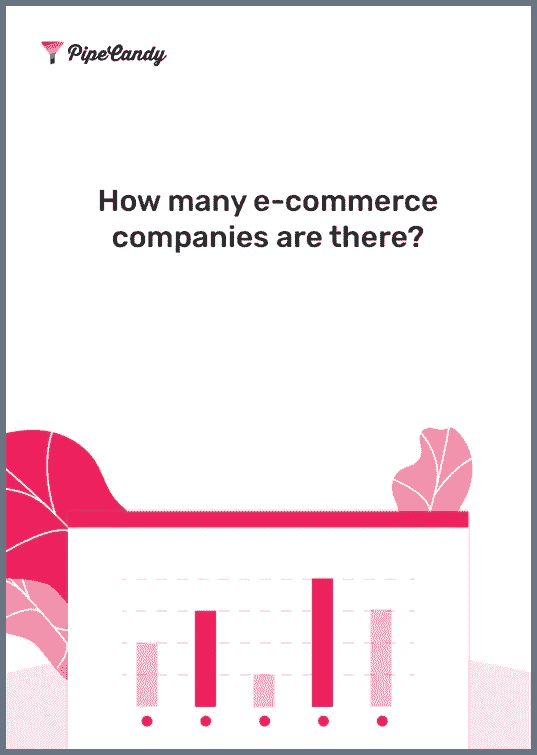
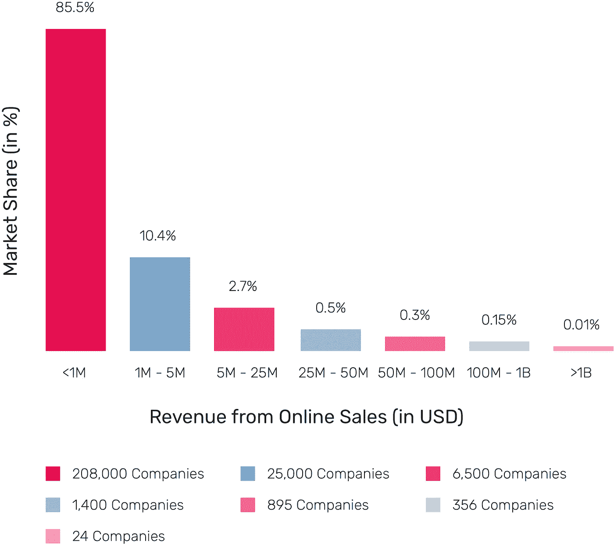
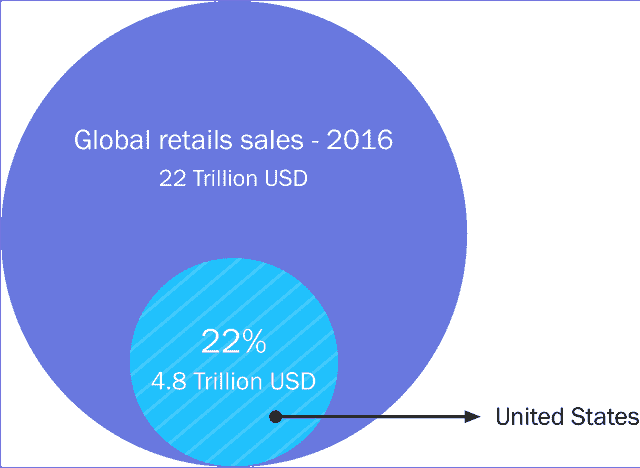
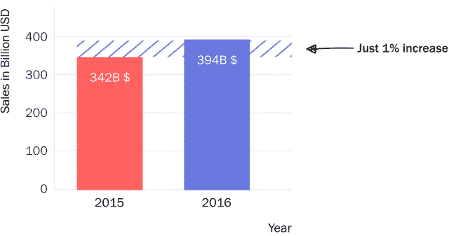

# 全球电子商务市场有多大？

> 原文：<https://medium.com/hackernoon/how-big-is-the-global-e-commerce-market-93920e61f687>

“有多少家[电商](https://hackernoon.com/tagged/e-commerce)公司？全球电子商务市场规模有多大？”

无论你是在研究电子商务[市场](https://hackernoon.com/tagged/market)规模以进行投资，还是在寻找电子商务前景，你都会被这个问题搞糊涂。

> 电商不是同质化的东西。

有些零售商有电子商务业务(有些人称之为“电子零售商”)。有电子商务公司，也有在亚马逊、易贝、Lazada、Mercadolibre 等网站上销售的市场卖家。

有些零售商有电子商务业务(有些人称之为“电子零售商”)。有电子商务公司，也有在亚马逊、易贝、Lazada、Mercadolibre 等网站上销售的市场卖家。

> 一句话:在评估电子商务市场规模时，有太多移动的部分，而且不是微不足道的。

我们已经为你解决了这些复杂的问题。

## 【PipeCandy 如何融入其中？

我们是一家(到目前为止，唯一一家)基于数据科学的预测性潜在客户挖掘公司，专注于聚合超过 100 万家电子商务公司以及对它们的洞察。我们的客户是全球领先的履约、技术、支付、POS 公司和代销商/广告网络。

## **我们如何估计电子商务公司的数量？**

我们的数据库通过查看各种来源，跟踪大约 750，000 家电子商务公司(就整洁度而言，这是您可以获得的最好和最大的数据库)。我们建立了自己的自然语言处理和机器学习模型，以了解每家公司的业务，并自下而上地汇总这些见解。

我们与一些资本市场和 firmographic 数据提供商合作，以获得公司收入(这不同于网络收入！)等诸如此类的见解。其余—技术使用数据、履行洞察、SKU 洞察等。都是由我们结合技术和人工审查建造起来的。

随着我们的深入，我们将对我们使用的方法进行评论。

## **那么，电子商务公司有多少？**

1.  据我们估计，全球(不包括中国)有 200 万至 300 万家电子商务公司。我们将在另一篇博客文章中讨论中国。
2.  北美(美国和加拿大)大约有 130 万家电子商务公司。如果不包括市场卖家，美国将有大约 25 万至 30 万家电子商务公司。
3.  全球纯玩电商不到 10 万家。也就是说，电商默认就是全渠道。纯游戏是个例外。你可能会有不同的想法，因为电子商务作为一个类别变得明显是因为亚马逊和易贝等开拓性的纯业务公司，但零售业是如此之大，以至于一旦他们开始认真对待电子商务，全渠道电子商务或电子零售商已经开始超过纯业务几乎一个数量级(是的，我们在数学意义上使用“数量级”)。)

但是，你一定想知道我们是否正确，因为仅 Shopify 就声称有 50 万家公司使用 Shopify。如果你看看 BuiltWith，他们声称有 30 万个网站使用 Shopify。同样，如果你看看 Magento，根据 BuiltWith 的数据，有 50 万个网站使用这个平台。

那么，可以说全球约 40%的电子商务网站都是由这两个平台驱动的吗？我们不这么认为。或者，从另一个角度来看，如果这两个平台驱动了 10%左右的电子商务网站，那么整个电子商务公司是否有 800 万家？绝对不是！

## **方法问题**

像 Builtwith 这样的工具将“代码片段的存在”作为判断一家公司是否涉足电子商务的资格标准。购物车的存在并不总是电子商务活动的良好指标——尤其是如果你正在考虑潜在客户或投资。如果忽略 100 个 1000 个(一点也不夸张！)不相关的网站(可疑的网站，中文和俄文的垃圾邮件工厂，主要业务不是在线销售的数字商品的卖家，属于单个公司实体的网站)，我们估计前 4 或 5 个电子商务平台控制了大约 30% — 40%的电子商务网站。值得注意的是，我们确实将成人网站纳入了估算范围，因为其中有几个是按技术、广告库存和支付技术分类的。他们中的一些运送成人玩具，因此与履行公司相关。

在电子商务中，根据网站出售的商品(我们称之为“商品类别”)对网站进行错误分类的现象非常普遍。这是因为大多数数据提供商将电子商务公司归类为零售业中的一个子集，并强迫它们归入符合 SIC 或 NAICS 代码的类别。此外，该过程传统上一直是手动的，导致解释或有时标记他们的人的不足。

[PipeCandy](http://www.pipecandy.com/) 已经建立了一个分类字典，以发现每个电子商务公司出售的商品，并将它们归类到逻辑商品类别中。因此，如果我们说一家公司属于“时尚”类别，它肯定会属于这一类别。

## **美国有多少电子商务公司？**

大约 130 万，就像我们开始说的。但是其中只有大约 50 万是重要的。以美国为例，我们的研究显示，大约有 245，000 家公司进行网络销售。

有近 66 万家电子商务公司的在线收入达到 100 万美元。然而，我们不会很快将网络销售额低于 100 万美元的公司视为无足轻重。几家大型全国性和地区性零售商正在建立电子商务业务，我们看到它们属于“低于 100 万美元”的网络销售领域。

在未来几年中，这些“低在线贡献的全渠道”群体中的很大一部分将升级到更高的收入层级。他们当前的支出模式反映了企业实体的数字(主要来自实体收入)，因此，如果您作为供应商正在计划您的“走向市场”战略，请正确看待这一数据点。

## **美国电子商务收入与美国零售收入相比如何？**

**全球零售额对比美国零售额**

**全球电商销售额对比美国电商销售额**

[美国 2016 年零售销售额](https://www.digitalcommerce360.com/2017/02/17/us-e-commerce-sales-grow-156-2016/)约为 4.8 万亿美元。如果增长率保持不变，2017 年将超过 5.3 万亿美元。在全球范围内，2016 年的零售额估计为[22 万亿](https://www.emarketer.com/Article/Worldwide-Retail-Ecommerce-Sales-Will-Reach-1915-Trillion-This-Year/1014369)美元。美国占全球零售额的 22%。这一估计数不包括旅行、餐馆和活动门票。一段时间以来，让我们只关注美国。

## **电子商务的一小步，美国零售业的一大步**

电子商务占零售业的 11.7%，2016 年在美国约为 3940 亿美元。2015 年为 342B(约占美国零售规模的 10.8%)。大约 1%的增长，对吗？这 1%意味着仅一年内电子商务销售额就增加了近 500 亿美元。据我们所知，有多少行业的 500 亿美元支出仅在一年内就从一个渠道转移到了另一个渠道？
(注:剔除一般不会在网上购买的商品，如燃料、汽车以及餐馆和酒吧的销售，2016 年美国零售总额为 3.375 万亿美元。电子商务占其中的 11.7%，即 3940 亿美元)

## **进入亚马逊**

这种转变的主要原因是亚马逊。让我们记住这一点——如果明天“当权者”在美国禁止网上销售，什么都不会发生。人们会很乐意去沃尔玛和凯马特购物。美国不会停止运转。即使在美国，电子商务也是小规模的新生事物。这就像著名的维生素或止痛药的争论——你不‘需要’维生素。但是，如果你感到疼痛，你需要止痛药。零售是止痛药。电子商务是维生素。所以这是一个“最好拥有”而不是“必须拥有”的问题。仅仅在美国，亚马逊的执行天才就解决了一个“很好解决”的问题，并创造了 4000 亿美元(具体是 3940 亿美元)的产业！

## 有多少电子商务市场？

我们已经把市场排除在对话之外一段时间了。他们过得怎么样？它们有多大？未来，电子商务将由市场主导。看看中国和美国——世界上最大的两个经济体。在每一个市场中，电子商务都是由市场所拥有的。事实上，在全球 250 多家估值超过 1B 美元的私人控股公司中，有 35-40 家是电子商务公司(如果你包括在线服装和配饰品牌的话)。也就是 16%左右。其中，近 33 个是市场。所以，如果你从事电子商务，想要成为十亿美元的海湾，你必须成为一个市场。再来看电商巨兽:亚马逊。

## **亚马逊:**

1.  3940 亿美元(2016 年电子商务销售额)的 37%流向了亚马逊一家。那就是 1470 亿美元。这高于亚马逊在 2015 年销售产品的 1120 亿美元销售额。这相当于一年增加了 350 亿美元！
2.  还记得同年美国电子商务销售额如何增长 500 亿美元吗？其中的 350 亿美元仅仅是因为亚马逊。那就是 70%。所以在美国，亚马逊*就是*电子商务！
3.  在 2016 年来自电子商务的 114 亿美元收入中(不包括 AWS、Prime、Alexa)，有 220 亿美元来自卖家佣金和服务(包括 FBA，这是亚马逊代表其卖家提供的运输服务)。也就是 20%。
4.  亚马逊 2017 年的收入估计在 1500 亿美元左右，其中 300 亿美元将来自卖家佣金。各个市场的卖家佣金比例这里是[这里是](http://insider.zentail.com/marketplace-commission-rates-comparison-jet-com-walmart-amazon-ebay/)。卖家售出的%单位可在此处找到[。](https://www.statista.com/statistics/259782/third-party-seller-share-of-amazon-platform/)
5.  亚马逊在全球有超过 100 个 2M 卖家。但每年至少盈利 10 万美元(在美国足以养活一个人的家庭)的卖家大约有 10 万。因此，这 10 万名卖家向亚马逊支付 300 亿美元的佣金。
6.  亚马逊收取 15%-40%的佣金。假设是 15%。那么，如果 300 亿美元= 15%，亚马逊卖家的实际收入会是多少？2000 亿美元。因此，平均而言，如果有 10 万个重要的卖家，每个卖家都在赚 2M 美元(当然，这不是未来的情况——有些人会赚得更多，有些人会赚得更少，但想象一下一个市场，其中 10 万家公司每个都有 2M 美元的收入)。这是亚马逊推动的生态系统。

你喜欢你刚刚读的吗？如果您在其他地方使用这些见解，请引用我们的链接。向电子商务/零售行业销售或希望我们在您的会议上讨论电子商务和零售市场见解？[跟我们谈谈](https://pipecandy.com/schedule-a-demo/)！我们拥有市场上最干净、最有洞察力的数据！