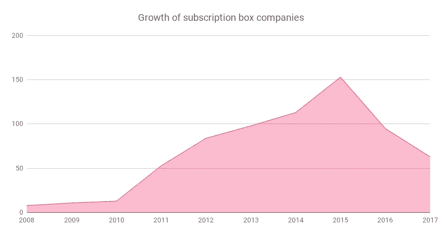
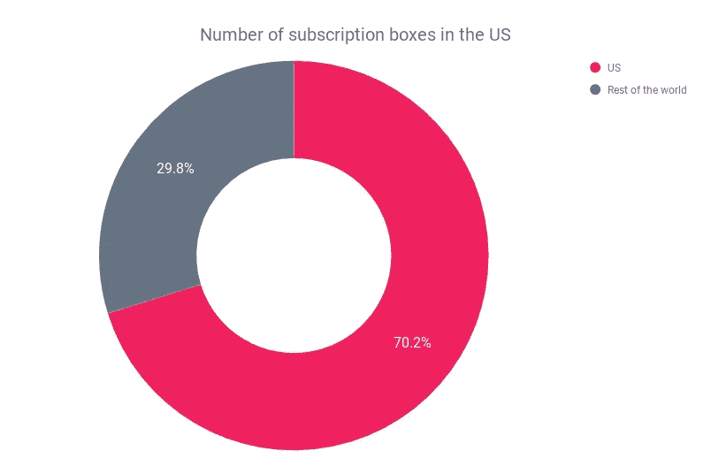
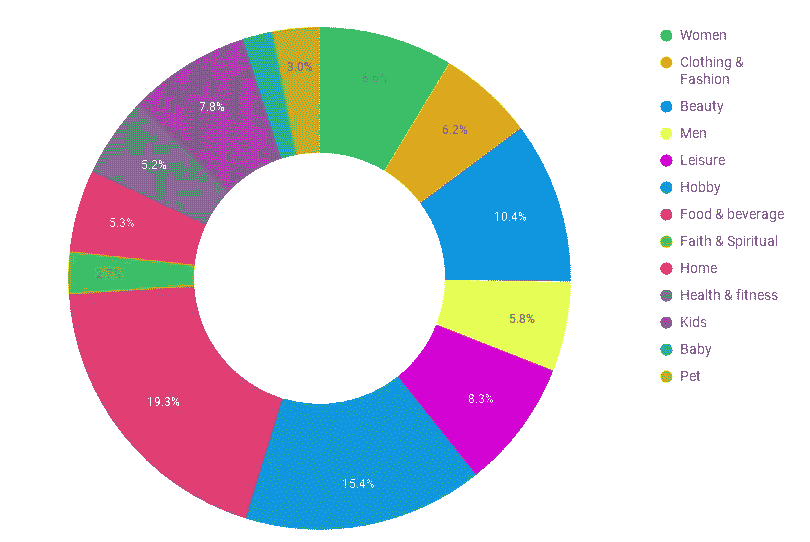
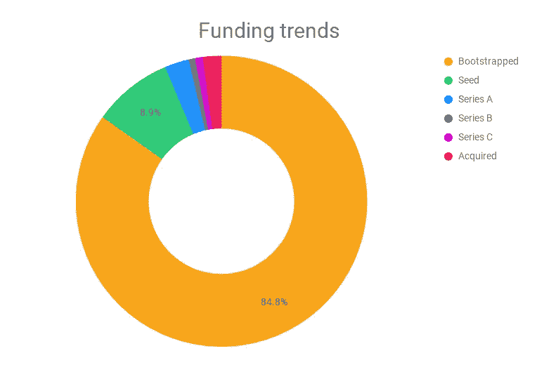
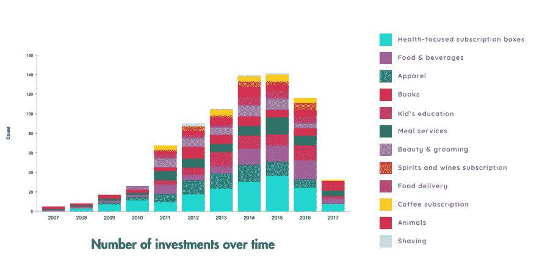
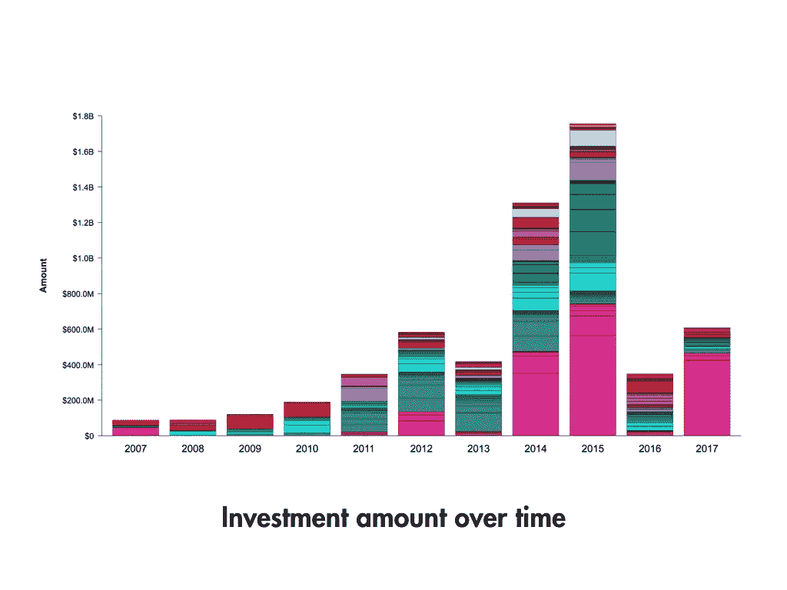
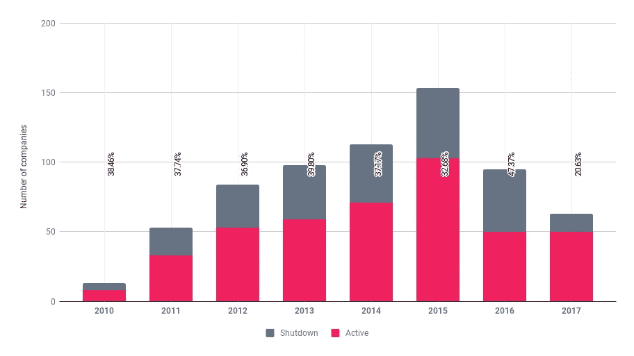

# 全球订阅盒子行业有多大？

> 原文：<https://medium.com/hackernoon/how-big-is-the-global-subscription-box-industry-4b8dcb756937>

订阅箱已经存在一段时间了。在 2007 年至 2008 年间，早期的 B2C 尝试包括“私人销售”、图书订阅等。被审判了。他们都没有成功，我们也不太了解他们的故事。

2011 年至 2012 年期间，Dollar Shave Club、Birchbox 和 Club 围裙。发起并打开了订阅盒繁荣的闸门。从月经用品到大麻，每一类都有一个美元剃须俱乐部或一个保险箱。基本的订阅模式是非常有益的(对购物者来说，就是这样！).选择你最喜欢的类别，获得订阅，每个月都会有该类别的一些产品带给你惊喜。我们将在报告的其余部分跟踪这一类别。

另一个类别是“每月补充”,这是亚马逊等公司熟悉的补充杂货的类别，但在本报告中没有考虑。

自从联合利华(T4)以 10 亿美元收购美元剃须俱乐部(T5)以来，T2 的“订阅箱”行业(T3)就一直很热闹。这是其年收入的五倍(2016 年年中收购时，2016 年的预期收入约为 2 亿美元)。

为什么美元剃须俱乐部会成功？它跳过了类似电子商务的估值(通常为 1-2 倍),达到了类似 SaaS 的估值(5 倍),是第一个采用订阅模式的消费品牌。

但是，这并不是订阅盒领域的所有玫瑰。最早的订阅盒子之一 Birchbox 在 2016 年经历了两轮[裁员](http://fortune.com/2016/06/29/birchbox-lays-off-more-employees/)，在 2017 年筹集了 1500 万美元的资金，并正在与包括沃尔玛在内的零售商谈判出售事宜。那么,“订阅盒”世界到底发生了什么？是一个从未有过的时代吗？

我们开始探寻订阅盒商业世界到底发生了什么。

# [PipeCandy](https://pipecandy.com/) 做了什么？

由于该平台跟踪全球超过 50 万家电子商务公司，我们拥有大数据集的优势，可以挖掘和发现几乎完全覆盖的订阅电子商务公司。因此，我们第一次能够知道到底有多少订阅商务公司。

然后，我们分析了订阅箱细分市场(不包括数字订阅)中各个类别的进入、融资、退出和关闭情况，以形成我们对该细分市场的理解。

# 我们是怎么做到的？

为了获得指标，我们依赖于我们的内部爬行和 ML 平台。

我们将一大组公司标记为“订阅箱”和“非订阅箱”,结合使用订阅箱列表和网站的人工验证。这被作为学习数据传递给我们的数据科学引擎，该引擎使用 NLP 和 ML 算法的集合来产生“订阅箱预测模型”。

对于任何给定的网站，该模型从网站读取一堆页面，并输出一个分数，该分数指示该网站是否代表“订阅箱”业务。出于对技术的好奇，我们使用 Apache Spark 在超过 100 万个网站和超过 1000 万个网页的数据上大规模部署该模型。根据我们的模型，得分高的公司已被纳入本文的考虑范围。

# 订阅盒商务的增长

该行业从 2010 年至 2011 年开始腾飞(Dollar Shave Club、Birchbox、Ipsy)，公司继续以轻快的步伐启动，直到 2015 年。此后，订阅盒公司的推出速度开始放缓。自 2015 年以来，每年都有越来越少的订阅盒公司推出。截至 2018 年 2 月，全球共有接近 7000 家订阅盒子公司。这些公司中几乎 70%的总部都在美国以外。出于报告的目的，我们选取了大部分数据可用的宇宙的一部分，并查看了各种属性，如资金、类别、子类别等。

与美国的实力受到中国质疑的电子商务不同，在订阅盒领域，主要是美国在推动行动。

但是，当你将订阅盒公司的数量与常规电子商务公司进行比较时，前者只是太平洋中的一滴水。根据我们之前关于[全球电子商务市场规模](http://blog.pipecandy.com/e-commerce-companies-market-size/)的报告，我们认为全球电子商务公司数量大约超过 100 万(不包括中国)，我们可以得出结论，订阅商务是一个舍入误差。

# 类别增长和分布

市场被咖啡、茶、餐具等小众产品所垄断。它占据了将近 20%的市场份额。销售从情侣周末体验到文具到大麻的任何东西，爱好作为市场的一部分贡献了超过 15%的市场，大约 13%的公司向男人、女人和他们的宠物销售美容和美容产品。

令人惊讶的是，迎合女性生活方式和需求的类别，如月经盒、针织品和内衣订阅盒，比实际的服装和时尚类别更大。即使是像玩具和书籍这样迎合孩子们的盒子也胜过了服装和时尚。

总而言之，订阅式商务公司专注于产品和服务，这些产品和服务应该满足人们对体验的渴望&一种幸福感。消费者将会对可自由支配的购买品变化无常&与普通商品等品类相比，这种支出与经济周期的联系更为紧密。这里有一些线索可以解释为什么你在订阅空间看不到很多独角兽。如果我们在 2007 年至 2008 年衰退后在美国见证的繁荣周期结束，我们将看到对订阅箱类别的影响。

根据 [Quid](https://quid.com/feed/dollar-shave-club-beyond-why-the-subscription-box-craze-may-fade) ，食品和饮料订购箱(咖啡、健康小吃、餐包等。)看到了 146.5%的 CAGR。

# 订阅式商务公司的资金来源是什么？

我们依靠公共新闻来源来跟踪资金公告。虽然我们已经努力跟踪非美国地区的资金，但这些数字可能需要进一步调查，以确认全球覆盖范围。

80%以上的订阅盒子公司都是自举。更能说明问题的是，在过去 10 年里，在这个领域创业的公司中，只有 2%被收购或上市，只有 4%的公司在过去 10 年里筹集了成长型股票。Blue 围裙是 2017 年美国该领域唯一的 IPO，也被认为是今年表现最差的 IPO 之一，而其来自德国的竞争对手 HelloFresh 在交易所的表现更好。Plated 被 Albertsons 收购了。

从 2010 年到 2017 年，该领域的投资数量和投资额一直在过山车。根据 Quid[关于订阅盒子商务的文章](https://quid.com/feed/dollar-shave-club-beyond-why-the-subscription-box-craze-may-fade)，“该行业在 2014 年至 2015 年间迅速饱和，总投资和最高投资金额都发生在这几年。”

尽管 2014 年至 2016 年的投资数量没有显著变化，但投资额在 2015 年后有所下降。原因是，投资者变得越来越谨慎，但希望有机会涉足，因为除了个别案例，成功的退出和首次公开募股还没有发生过。

# 进进出出

从 2010 年到 2017 年，我们跟踪了每一类公司。从一开始，每个群体都有超过 35%的公司倒闭。2016 级是个例外，超过 47%。

尽管数据显示，2017 届只有超过 20%的学生选择了退学，但很难对这个数字进行过多解读，也很难将它视为一种趋势逆转。我们从一月底开始汇编数据。因此，并非所有 2017 届公司的状态都会被捕捉到，关于它们状态的消息也不会公开。通常，我们通过域重定向或流量模式来跟踪关闭。这种信号是滞后指标，将在未来几个季度出现。

# 最后

订阅商务是电子商务中的一个小趋势，并将继续占据一席之地。Amazon Fresh 和 Albertsons 收购 Plated 等趋势表明，“订阅”正在成为更广泛的电子商务战略中的一项功能。公开市场和二级出口很难获得，而且仅限于特定类别。从这个意义上说，资金也很难获得。订阅盒业务对消费者来说很好，但不足以吸引他们的注意力和消费。