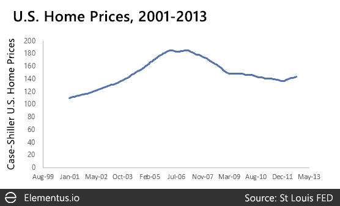

# 比特币与历史资产泡沫相比如何

> 原文：<https://medium.com/hackernoon/how-bitcoin-compares-to-historical-asset-bubbles-4a48e9c2e8a2>

这些天，主流新闻一如既往地充斥着*比特币是泡沫*的观点碎片，争论不休，从外面往里看。基本原理通常归结为比特币没有内在价值(T2 有内在价值，菲亚特没有内在价值)，或者是对比特币最近价格的人为解释。

例如:

*   BTC 崛起了-> [这就跟郁金香狂热一样，是泡沫](https://www.wsj.com/articles/bitcoins-wild-ride-shows-the-truth-it-is-probably-worth-zero-1505760623)
*   BTC 已经沦陷-> [看，我们告诉过你这是泡沫](http://fortune.com/2018/02/02/bitcoin-bubble-burst-trouble/)
*   BTC 既没涨也没跌-> [没人再关心比特币了，它最终会归零](https://www.ft.com/content/fb55f168-807f-11e4-872b-00144feabdc0#axzz3TkFgzlrI)

“比特币是泡沫”从一开始就是主流新闻的共识观点。在我看来，它没有什么分量。但是仅仅因为基本原理不成立，这并不意味着比特币肯定是*不是*泡沫。

过去几个月的大幅上涨和抛售，至少看起来像是泡沫。没有办法确切地知道比特币是否是一个泡沫，但这里有一些我们正在研究的指标，可能也有助于你的直觉。

# 比特币确实看起来很像其他资产泡沫

前几天，我们[在推特上发布了这张图片](https://twitter.com/elementus_io/status/959197392548581376)，对比了互联网泡沫起起落落期间比特币和纳斯达克的价格历史。

Credit: [Elementus](https://elementus.io/blog/bitcoin-bubble/)

时间尺度不一样。纳斯达克用了几年时间达到顶峰，而比特币在不到一年的时间里上涨了 20 倍。但是模式看起来惊人的相似。

这两个图表都以稳定的上升速度开始，然后是一个拐点，斜率向上移动，增长开始。在顶部，它们都显示相同的双峰模式，第一个比第二个高。然后他们开始返回地球。

当纳斯达克最终到达下跌的尽头时，它在戏剧性的上涨中积累的几乎所有收益都丧失了。

比特币会面临类似的命运吗？

# 历史上的相似之处不止于此

下一张图表来自 Jean-Paul Rodrigue 博士对市场繁荣和萧条的研究。他通过将泡沫的寿命分为四个阶段来解释这种模式。

Stages in a bubble

将这张图表与上面的图表进行比较。几乎完全匹配。

市场泡沫的时间跨度和幅度随着时间的推移和不同资产类别而变化，但同样的模式一再重复。

例如，这是 1929 年危机前后的标准普尔 500 指数。

*The S&P 500, 1920–1933*

你也可以在 1980 年的[黄金泡沫](http://wallstreetpit.com/24414-what-gold-bubble/)、80 年代末的[日本股市、2007 年的](https://seekingalpha.com/article/128738-equity-markets-slippery-slope)[上证综指](http://www.businessinsider.com/the-shape-of-market-bubbles-with-a-special-look-at-gold-2010-10)以及许多其他资产泡沫中看到同样的模式。

如果你眯着眼睛，你可以看到 2006-2007 年美国房价同样的“牛市陷阱”双峰模式。

Case-Shiller U.S. National Home Price Index, 2001–2013

2007 年美国房价的泡沫程度不亚于 2001 年的纳斯达克。但是价格趋势看起来很不一样…

# 泡沫和正常的市场波动有什么区别？

大多数人都会同意，2007 年的美国房地产市场肯定是一个泡沫。但就价格下跌而言，它远没有之前显示的其他泡沫那么严重。从最高点到最低点，美国房地产市场损失了大约 25%的价值。

相比之下，在互联网泡沫中，纳斯达克损失了 78%的市值，在 1929 年的股市崩盘中，到 20 世纪 30 年代末，标准普尔 500 指数下跌了 85%。

更极端的情况是，将美国房地产市场比作比特币，它可以在一天内上下波动 25%或更多。它定期这样做——准确地说，自 2013 年以来有 8 次。

对于比特币来说，下跌 25%并不意味着泡沫破裂，而是一种正常的价格波动，你预计每年会看到几次。对于历史上非常稳定的美国房价来说，下跌 25%是一代人难得一遇的事情。

比特币一直以来都是一种高度不稳定的资产。下图显示了其在过去五年中的每日波动与同期纳斯达克、标准普尔 500 和美国房地产市场的比较。

The bars are histograms of daily price moves. The blue curves are smoothed estimates of the distributions ([kernel density estimations](https://en.wikipedia.org/wiki/Kernel_density_estimation)).

每个市场的**日波动率**:

*   比特币:4.80%
*   纳斯达克:0.89%
*   S&P: 0.76%
*   凯斯-席勒:0.04%

平均而言，比特币价格的波动幅度是纳斯达克的 5 倍，标准普尔 500 的 6 倍，美国房地产市场的 100 多倍。

# 那么，比特币是泡沫吗？

谁知道呢？比特币看起来和感觉上很像过去的其他市场泡沫。它具有泡沫的所有特征——投机性购买、害怕错过机会、公众兴趣的突然爆发。

即使按照比特币的标准，最近的价格下跌也很大，但鉴于其过去的波动，并没有超出“正常”的范围。

比特币是一种高度易变性的资产，远远超过我们习惯关注的其他金融市场。我们应该小心运用同样的直觉来预测它未来的价格。

[*Elements Us*](https://elementus.io/)*是一个语义推理机和数据层，用于加密资产智能。*

*想投稿或有想法讨论吗？* [*我们很乐意收到您的来信*](https://elementus.io/contact) *。*

*原载于 2018 年 2 月 12 日*[*elementus . io*](https://elementus.io/blog/bitcoin-bubble/)*。*