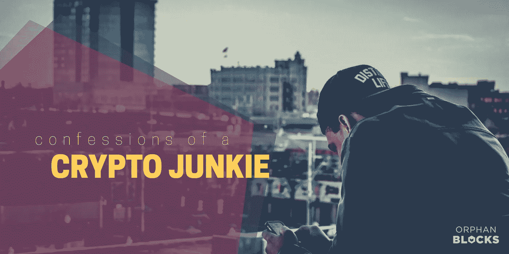
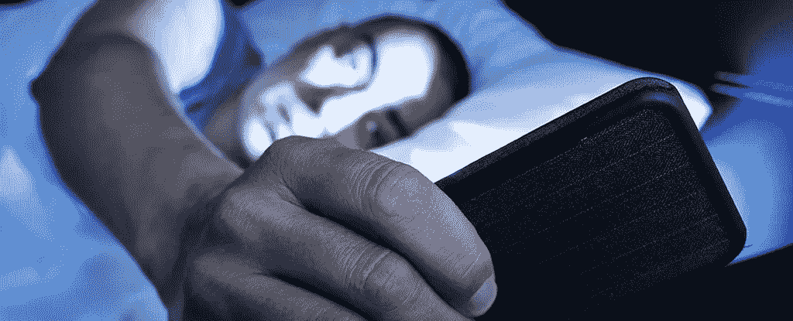
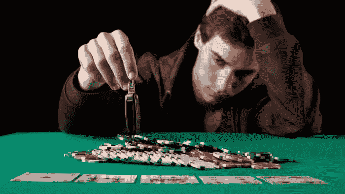
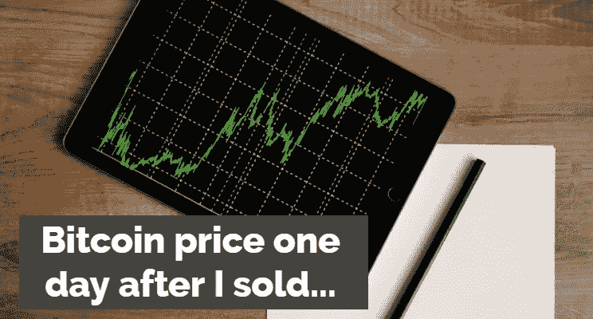
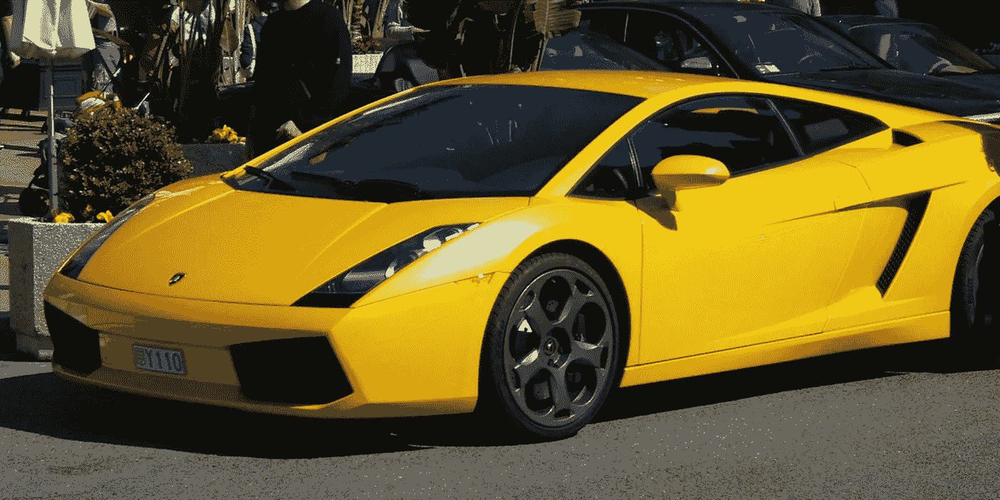

# 比特币如何几乎摧毁了我的精神健康

> 原文：<https://medium.com/hackernoon/how-bitcoin-nearly-destroyed-my-mental-health-eb1a7217cbc4>

【2017 年 12 月 22 日。我作为秘密投资者的低谷。现在是早上 5:30，我在书桌抽屉里翻来翻去，伸手去拿我的硬件钱包。这个东西给了我很多快乐的时光，但是今天早上，我慌慌张张地把它从盒子里撕了出来。比特币正在贬值。一万五千美元。一万四千五一万四。这就是了。泡沫已经破裂。我出来了！

唯一比看着你的利润分崩离析更难的事情是意识到你的精神健康状况比你的比特币兑美元余额还要糟糕。随着圣诞假期的到来，这是我第一天休假。我已经几个月没有休息了，然而我渴望的睡眠却被我智能手机的强光打破了。我整晚都在观察比特币的价格，在我看到数字上下跳动的梦境中进进出出。当我的女朋友被我的 Macbook 启动的声音吵醒时，我知道我有麻烦了。

“猪，你在干什么？”，她完全困惑地叫道(顺便说一下，这是她对我的爱称——我们都不知道为什么)。就在昨天，我们就 crypto 如何接管我的生活进行了一次长谈。显然，我还不够‘在场’，她也厌倦了我一直盯着手机看。现在我一大早就站在这里，除了短裤什么也没穿，疯狂地在我的账本上敲密码。“没什么。我只需要给一个同事发一封电子邮件”，我回答道，祈祷她不要进那间空着的卧室。几分钟过去了，她就在那里，站在门口，盯着我的比特币基地账户。她摇摇头，什么也没说就走开了。

四个小时后，我终于提现了(哇，比特币慢！).我已经卖掉了所有的东西。两周前我预测了市场的顶部，我应该跟随我的直觉。但是，嘿，一大块利润仍然完好无损。不幸的是，我的精神健康显然不是这样。我已经好几天没有好好睡一觉了，说实话，我真的很尴尬，她发现我很恐慌。毕竟，我花了几个月的时间让她相信比特币是一项可靠的投资，而不是像她经常说的那样，“一场完全的赌博”。我很确定沃伦·巴菲特不会在半夜畏缩在电脑屏幕前。

尽管感到羞耻，但到了上午 10 点，我感觉非常得意。我在 13k 美元时退出，现在一个比特币的价格是 11k 美元。“比特币有分形增长模式”，我向她解释，试图证明我的恐慌是有道理的。“我并不是不相信它——比特币一定会改变世界。但它在泡沫中成长，而那些泡沫会破裂。我打算获利了结，在它触底时买入更多。”她假装相信我的逻辑，但我看得出她持怀疑态度。她认为我有赌博的毛病，并且知道这不会是结束。

我跳进淋浴间，高兴地唱着收音机里播放的一首劣质圣诞歌曲中的几行。真是如释重负。我在市场彻底崩溃之前退出了，我已经在梦想，一旦它回到 5k 美元，我可以用我的利润买多少比特币。然后，我开始梦想在下一次泡沫破灭时，这些比特币会值多少钱。好家伙，我聪明吗！我要成为百万富翁了！最棒的是，当价格直线下降时，我没有压力。现在我绝对可以享受圣诞节，而不必每 10 分钟刷新一次 Blockfolio。

我在穿衣服，准备去拜访家人。像往常一样，我在抱怨她今天早上在浴室里呆了至少 12 分钟。“快点，我讨厌迟到！”我坐在楼梯上等着，拇指被手机上的 Blockfolio 标志吸引住了。让我看看这些冤大头在希望比特币反弹的同时，损失了多少钱。我打开应用程序，但它不是我所期望的。哦，糟糕——又涨到 13k 美元了！

接下来的几天应该是平静的。一个与家人和朋友共度时光的机会，知道我在短短几个月内就获得了 200%的回报。无论如何，这都是一个巨大的成功。但相反，我的情绪一落千丈，就像比特币反弹一样快。到平安夜的午餐时间，它已经超过了 16k 美元，FOMO 开始大规模上涨。我是不是犯了一生中最大的错误？我突然确信比特币将在 2018 年达到 10 万美元，我想象着自己看着价格远离我的图表。焦虑紧紧抓住我的脖子，圣诞节剩下的时间里，我会在比特币上涨时强颜欢笑，或者在价格下跌时感觉自己站在世界之巅。

这种不稳定的资产类别的金融影响经常被谈论，大多数人在知道风险的情况下进入比特币。在中国政府被报道禁止加密货币的三天前，我就敏锐地意识到了这些投资。我的投资几乎在一夜之间减少了一半，我用尽了全身的力气才坚持下来。但是，虽然人们经常告诉你“永远不要投资超过你承受得起的损失”，但他们很少触及持有比特币的心理影响。我投资了一大笔钱，但失去这笔钱不会从根本上改变我的人生轨迹。然而，随着投资的增长，它会成为你生活中非常非常大的一部分。

加密论坛充满了火箭的照片和拥有兰博基尼的渴望。人们正在赚很多钱，我们大多数人都是年轻人，他们更喜欢蜜獾迷因，而不是讨论我们的心理健康(他是非官方的比特币吉祥物，如果你想知道的话)。然而，在公开谈论了我和几个朋友的经历后，我知道我肯定不是唯一有这些担忧的人。

文章的标题可能有点戏剧性。幸运的是，我还没有完全崩溃。但是，当你的情绪随着虚拟货币的剧烈波动而波动时，你必须停下来总结一下。通过分享我自己的经历，我只是希望它能激发一些讨论。我毫不怀疑有许多人有过比我更糟糕的经历。人们已经贷款投资，许多人已经平仓交易，损失了大部分资本，其他人可能在黑客或精心策划的骗局中失去了一切。

我的圣诞节比特币插曲只是“现实生活”和虚拟资产之间的平衡变得严重扭曲的一个例子。在我的下一篇文章中，我会分享更多区块链如何扰乱你的头脑的例子，以及一些在市场玩弄你的情绪时如何保持理智的建议。

通过电报加入我们:[https://t.me/joinchat/G4azAxIeNJDsuUsaJTprhA](https://t.me/joinchat/G4azAxIeNJDsuUsaJTprhA)
或者在推特上关注我们:[https://twitter.com/orphanblocks](https://twitter.com/orphanblocks)