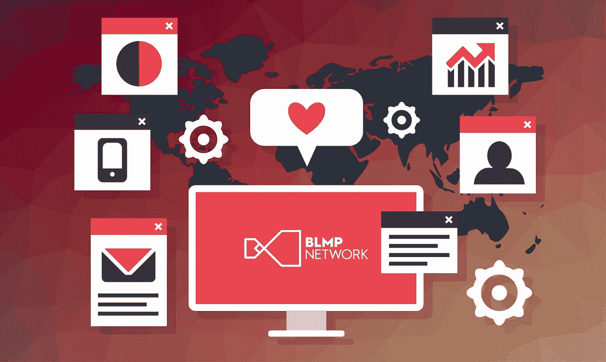

# BLMP 如何帮助您保持对内容的完全控制

> 原文：<https://medium.com/hackernoon/how-blmp-helps-you-retain-complete-control-over-your-content-17a277fa6573>

BLMP 允许品牌和内容创作者保持对其所有 IP(知识产权)的完全控制，拥有一套利用最新区块链技术的独特功能。

这些包括跟踪工具、智能合同等保护知识产权的元素，所有这些都可以从一个易于导航的界面进行管理，消除了以前阻碍所有类型内容正确管理的麻烦。

例如，使用智能合同，也称为直接与区块链绑定的“自我执行合同”，未经双方同意，协议的任何方面都不能无效或以其他方式更改。相反，指令存储在区块链上，合同条款自动执行，任何实体都不必执行任何操作或复查收入是否公平、及时地分配。这可以防止任何人不披露销售额，因此内容创作者、出版商和品牌都可以毫不延迟地获得适当的收入分成，没有人会被欺骗。

此外，这些协议的条款明确规定了内容的所有使用方式，从而防止未经授权的使用。每当虚拟物品被创建时，它就被分配一个自己的序列号，该序列号存储在区块链上，并且每次被使用时，这个动作都被记录下来。因此，如果任何虚拟资产或其他形式的内容被滥用，恶意方可能会终止合同，违规方将无法再访问该知识产权。

不仅如此，BLMP 还开发了自己的加密货币，使交易更加可追踪和透明。各种各样的代币为购买它们的人提供了许多优势，并且是在平台上购买许可虚拟商品的唯一手段。

有了这些特征，各种类型和各行各业的内容创作者很容易通过创建许可的虚拟商品来扩大他们的影响，这些虚拟商品的价值对买方、卖方和知识产权持有人来说是显而易见的。这将为这些虚拟资产带来一个繁荣的市场，其中每个参与者都可以安全、放心地进行交易。

BLMP 2018，新加坡

BLMP(block chain Licensing market place)是区块链的一家技术公司，致力于消除障碍，促进虚拟商品行业中围绕供应链管理交易的复杂问题的信任。

*BLMP Network 利用区块链技术，将全球的数字平台与全球品牌连接起来，将跨任何数字平台的官方授权虚拟商品货币化；从游戏到流媒体服务&社交媒体，让数百万用户能够接触到一个全新的品牌虚拟产品世界。*

联系我们:

[网站](https://www.blmp.network/)

[推特](https://twitter.com/BLMPNetwork)

[脸书](https://www.facebook.com/BlmpNetwork)

[电报](http://t.me/EpikToken)

[领英](https://www.linkedin.com/company/blmp/)

[AngelList](https://angel.co/blmp-network)