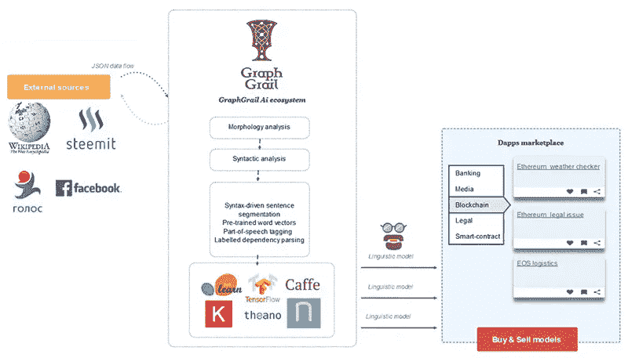

# 区块链和人工智能集成如何改变商业

> 原文：<https://medium.com/hackernoon/how-blockchain-and-ai-integration-is-changing-business-8130fd4de689>

自从人工智能这个术语开始出现在科幻小说中以来，它就一直吸引着人类的想象力。计算机科学发展迅速，如今智能计算机不再是虚构的——它们已经成为现实。

2008 年，比特币的匿名发明者中本聪首次描述了区块链技术。没有人知道这个人或这个群体的任何事情，中本聪在 2010 年离开了这个项目。然而，他(或他们)的创意仍然活跃，并在世界各地的创新项目中得到实施。

如今，我们正面临两大进步技术的发展时代——区块链和人工智能。区块链已经改变了我们对互联网功能的看法，并使互联网交易的速度大幅提高，使其更加透明。人工智能已经为不同的商业领域开辟了新的视野，允许优化日常工作，并将人类工人的注意力转移到更重要和更复杂的任务上。

在这篇文章中，我们将告诉你区块链和人工智能技术集成的可能性和挑战。我们还将展示这个想法是如何在一个真实的项目中实现的。

# 整合的前景

人工智能的概念被广泛用来指那些可以在需要人工智能工作的项目中工作的计算机。人工神经网络、机器学习和深度学习等技术使这成为可能。

区块链是一种以加密和分布式方式存储数字信息的新系统。它允许创建一个高度安全的数据库，其中所有信息可以以结构化的方式存储，并将公开提供。

让我们看看如何从区块链和人工智能的结合中获益。

## 区块链比人更好地解释了人工智能的行动

人类可以创建人工神经网络，并在机器学习算法的帮助下，根据经验教会计算机算法扩展它们的能力。然而，即使是人工智能的开发者也无法预测它的行为或解释它的思维方式。操作复杂决策树的人工智能系统是人类智能的黑匣子。我们无法理解人工智能的思维方式。

这是因为计算机有能力分析我们无法想象的大量数据。机器的内存包含的信息比世界上最聪明的人的大脑还要多，它必须确定哪些信息更重要或更不重要。我们可以创建算法来教会计算机这样做，但我们无法预测这种算法将如何发展。

如果人工智能系统的所有决定都被记录在区块链中，我们将获得大量的数据库，并将能够检查人工智能做出的决定并解释它们的逻辑。此外，它将确保数据的安全，因为储存在区块链的信息是不可篡改的。

## 人工智能可以提高区块链的效率

区块链交易是由矿工验证的，他们将计算能力用于尝试不同的字符组合，以便猜测正确的组合并获得奖励。然而，钱只给了第一个找到密码的人，而其他矿工所花费的能量被浪费了。未来，由机器学习算法训练的 AI 将能够以智能的方式猜测代码，而不是浪费时间和精力尝试每个变体。这将加快验证过程并降低成本。

将区块链引入我们日常生活的另一个挑战是数据的规模。每一条信息都被安全地记录在区块链，保存在网络中的每一台计算机上。随着时间的推移，块的数量增加，链变得更重。区块链的数据存储方法也可以在机器学习算法的帮助下进行优化。

# 集成的好处

分散人工智能的工作将基于一个并行计算系统，该系统由遍布世界各地的无数独立节点组成。

该系统的分布式特性将使其能够最大限度地利用所有计算能力，并快速分析庞大的数据集。数据集将被分割成更小的单元，由单独的节点进行分析，然后将结果合并到一个完整的数据库中。

这个世界范围的数据库将不会被一个占主导地位的公司所控制，信息将会被网络中的每一个成员所获得。也有可能使用这些巨大的数据来训练先进的人工智能算法。

与此同时，人工智能的决定也将被记录在数据库中，这将使他们的工作对人类来说更加透明和易于理解。

# 整合的挑战

尽管在探索区块链和人工智能技术上花费了大量的时间和金钱，但为了做好整合的准备，仍然需要克服一些挑战。

## 安全挑战

为了发挥功能并完善自己，基于人工智能的应用程序需要处理大量数据。区块链是一种安全加密的全球分布式数据库，可以为人工智能提供无限可靠的信息。

由于区块链技术是基于加密算法的，所以犯罪分子很难侵入系统并窃取敏感信息。然而，为了对受保护的数据进行更改，必须首先对文件进行解密，这使得它们容易受到黑客的攻击。

这个挑战可以在**同态加密**的帮助下解决:这是一种加密方法，允许对加密数据进行数学运算，并接收加密结果。这项技术是由 Craig Gentry 在 2009 年首次描述的，他是 IBM 的实习生，也是斯坦福大学的博士生。

尽管 Gentry 的加密系统具有先进性和安全性，但目前还不可能实现，因为它需要使用大量的计算能力。例如，像谷歌搜索这样的简单操作将花费大约一万亿倍的时间。然而，科学家正在逐步优化该系统，在未来，人工智能的力量将使其在现实生活中的实施成为可能。

# 分布式人工智能的实际实现:GraphGrail

现代市场没有一种服务能够在没有编程的情况下提供语言模型的全生命周期开发的可能性。通常，为此会雇佣其他软件公司，开发的过程非常漫长(大约 5-12 个月)且昂贵。

GraphGrail AI 的创造者试图通过开发一个基于区块链的市场来解决这个问题，该市场用于构建自然语言处理的分布式应用程序。该项目的任务是创造一个世界范围的开放人工智能，由全世界的程序员控制和开发。

# 数据分析变得更加容易

GraphGrail AI designer 是一个渐进式分析平台，允许企业和政府机构处理大量文本数据的分析和分类。

以下业务分支与大数据分析密切相关:

*   **金融部门**(分析货币/房地产/证券市场，创建预测，构建数据，生成图表和报告输出)
*   **电信和媒体**(最新新闻和趋势分析，内容生成)
*   **咨询、客服、旅游、医药**等。(培训聊天机器人以改善用户体验)

GraphGrain 为面向 NLP 的应用程序的设计提供了一个快速方便的平台，无需开发团队的参与。还可以测试和改进应用程序，以提高其精确度，并在市场上销售。该平台将简化数据分析的以下方面:

*   过滤掉不相关的信息(垃圾邮件和欺诈内容，低质量的文章)
*   知识提取(分析公司内部信息、竞争对手的服务和产品、新闻分类、分析数字和统计数据等。)

GraphGrail 的主要优势是它能够执行完整的生命周期开发，从收集数据和训练神经网络开始，到在 web 界面或必要格式的报告中输出最终结果结束。

# 项目的结构

GraphGrail AI 的架构由两个模块组成，每个模块执行不同的功能:

**语用**模块负责理解课文的内容。它包括:

*   每个独立单词的词法分析
*   对每个独立句子的结构和内容进行句法分析
*   对全文进行高层次的语用分析。

**神经网络**模块负责根据接收到的数据训练神经网络，同时通过实用模块进行数据处理。

## 双模块架构的优势

*   即使没有技术背景的人也可以创建基于 NLP 的应用程序
*   它不断提高训练神经网络的质量
*   它使得确定某一特定领域的复杂语言特征成为可能

# 项目的实际应用

GraphGrail AI designer 允许他们的客户为特定的业务创建基于 AI 的解决方案。平台的可能性可以通过以下方式使用:

## 预测分析

借助该平台开发的定制解决方案能够收集和监控与加密货币相关的帖子。结果被输出到一个建议仪表板上，有可能帮助交易和预测数字货币市场。

## 过滤相关消息

这一功能将得到积极使用信使的用户的赞赏。不可能阅读活动聊天中的所有消息，基于 NLP 的过滤器将解析具有相关内容的消息:商业报价、新闻、参与者的体验。

媒体行业的公司也可以应用 GraphGrail AI designer。要了解更多关于新闻业中的 NLP 技术，请参考我们的[最近的文章](https://sloboda-studio.com/blog/how-nlp-is-transforming-the-news-industry/)。

# 结论

读完这篇文章，你现在知道区块链和人工智能集成可能带来的好处和挑战。联合这些进步的技术将彻底改变商业运作的方式，GraphGrail AI-designer 正在证明这一点。斯洛博达工作室也有去中心化 AI 开发的经验。在我们的下一篇文章中，我们将很乐意与您分享。请继续关注，如果您有任何问题，请告诉我们。

*原载于 2018 年 6 月 26 日*[*sloboda-studio.com*](https://sloboda-studio.com/blog/how-blockchain-and-ai-integration-is-changing-business/)*。*