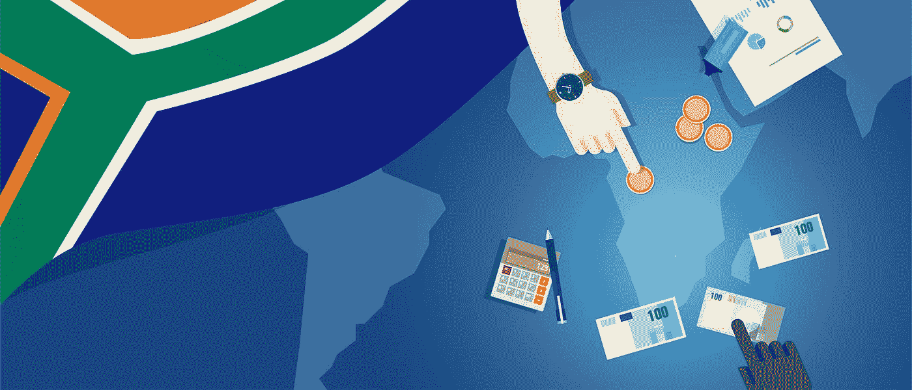

# 区块链如何创造金融普惠的未来

> 原文：<https://medium.com/hackernoon/how-blockchain-can-create-a-financially-inclusive-future-f7c214b1a4b7>

全球有 20 亿工作年龄的成年人无法获得金融服务。他们被认为是世界上没有银行账户的人。这些人大多生活在新兴国家。他们无法直接获得信贷、存款账户、转账或保险。金融包容性可以为他们创造新的机会。它可以帮助他们自我改善他们的生活。

对于没有银行账户的人来说，缺乏资金限制了他们克服贫困的前景。传统银行没有合适的基础设施来支持它们。基于区块链的解决方案可以发挥重要作用。这些解决方案可以创造解决基础设施和成本管理问题的新方法。结果将是为没有银行账户的人群提供更有利可图的服务。

## **无银行账户者的机遇和障碍**

对于这个世界来说，没有银行账户的人是一个错失的机会。世界三分之一的人口没有参与全球经济。这些无银行账户人群的繁荣和财富会产生积极的影响，这种影响会远远超出新兴市场。

撒哈拉以南非洲、中东、东亚和太平洋地区有很大一部分人没有银行账户。这些地区缺乏基础设施、交通和教育。贫困和失业经常导致内乱，甚至内战。由于目前的事态，在这些地区建立传统银行通常很困难，即使有最好的意图。此外，由于投资回报率较低，传统机构往往不可持续。建设银行基础设施的成本非常高，而没有银行账户的人大多收入非常低。因此，从金融角度来看，整个商业模式对银行来说并不具有吸引力。

另一方面，发达国家经济增长放缓。但新兴市场的增长迅猛。这些市场有很大的扩张空间。例如，非洲大陆正在取得巨大进步。一些非洲国家的国内生产总值年增长率达到了 4%到 6%。爆炸式的增长率可以帮助这些国家在短时间内创造财富和繁荣。发达市场可以从参与这些经济中获益。

非洲中产阶级预计将从 2010 年的 3 . 55 亿增长到 2060 年的 11 亿。这一强大的人口群体将在塑造非洲的社会经济格局方面发挥重要作用。他们需要获得稳健的金融工具和服务。缺乏金融服务将严重阻碍进步的潜力。

移动技术和人类创造力的最新创新正在帮助新兴国家开发自己的解决方案。他们在建设银行服务基础设施方面正逐步取得进展。倡议往往是非传统的。

能够利用自己的灵活性创造新产品的金融科技公司正在占领市场。M-Pesa，一个基于移动的资金转移和小额融资应用，已经在[非洲获得了很大的地盘，那里有 11.3 亿人拥有手机](https://guardian.ng/technology/africas-mobile-phone-penetration-now-67/)。M-Pesa 正在帮助非洲在经济上向前发展。然而，只有 10 个国家的 3000 万人可以使用这项服务。因此，其他金融服务仍有很大的增长潜力。更好的解决方案会导致更快的中断。

## **区块链:一个潜在的解决方案**

基于区块链的加密货币为在没有银行账户的人群中创造充满活力的经济提供了一种简单的方式。加密货币消除了建设昂贵的银行基础设施的需要。更多的人可以使用他们连接互联网的手机参与其中。它简化了流程，使更多的人能够获得金融服务。

通过[区块链](https://hackernoon.com/tagged/blockchain)和[加密货币](https://hackernoon.com/tagged/cryptocurrency)解决方案，有可能走得更远。以下是几种可能性:

*   **小额融资:**对于拥有传统基础设施的银行来说，小额融资利润不够丰厚。但是基于区块链的解决方案可以显著降低成本，使小额信贷有利可图。
*   **支付:**对于几乎没有数字支付方式的新兴国家，区块链可以作为权宜之计。这也可能导致区块链技术本身的突破。实施区块链支付的公司将能够在现实世界中改进这项技术。
*   **身份:**在新兴市场建立身份是一项挑战。银行和政府都在为此苦苦挣扎。印度政府的 [Aadhaar](https://qz.com/1174285/aadhaar-indias-biometric-id-project-putting-the-identities-and-personal-data-of-millions-at-risk/) 是一个集中的身份管理项目，已经引起了很多问题。在这样的系统中，数据泄露和操纵的风险很高。分散的区块链解决方案可以缓解这些问题。
*   **资金转移:**大型金融机构仍在努力向新兴市场转移资金。需要大量的人工验证。在去中心化的自治组织中得到验证的区块链智能合约，降低了成本，提高了新兴市场本地和国际转账的速度。
*   保险:没有银行账户的人也无法获得保险。这让他们特别容易受到伤害。如果发生金融灾难，他们会被进一步推入贫困的漩涡。区块链银行可以作为分散的保险提供商。

区块链技术不仅仅是加密货币银行。使用个人区块链分类账的金融普惠不仅可以通过银行交易增强 20 亿无银行账户世界的权能。有了新的数字身份，微型企业家成为新的经济动力。他们的智能手机使用区块链技术进行产品集群通信、P2P 信用评分验证、金融教育、共享最佳管理实践经验和可持续生产可追溯性。

考虑到区块链解决方案的所有好处和可能性，许多公司正试图扰乱这个领域。例如，Humaniq 位于区块链的分散平台可以与 MicroAid 等其他区块链初创公司连接，为新的微型企业家用户提供所需的全面、集成的解决方案。客户将可以通过智能手机使用新的加密货币和区块链技术。许多企业将有机会向数十亿观众提供服务。

随着金融公司试图利用区块链的力量，去中心化的银行业将获得动力。加密货币只是冰山一角。使用加密货币可以创造更全面的银行体验。它可以比任何传统解决方案更快地释放新兴市场的力量。

## **展望未来**

今天，世界人口的很大一部分被排除在金融发展之外。他们无法为自己的企业获得贷款，无法使用数字 P2P 通信来提高生产率和信用价值。区块链技术使金字塔底层的微型企业家能够在全球经济阶梯上迈出第一步。

对数十亿没有银行账户的人进行金融普惠可以开启一个世界经济增长的新时代。这将有利于全球经济。区块链技术为这种金融包容性提供了途径，并推动了一场新的微观经济革命。