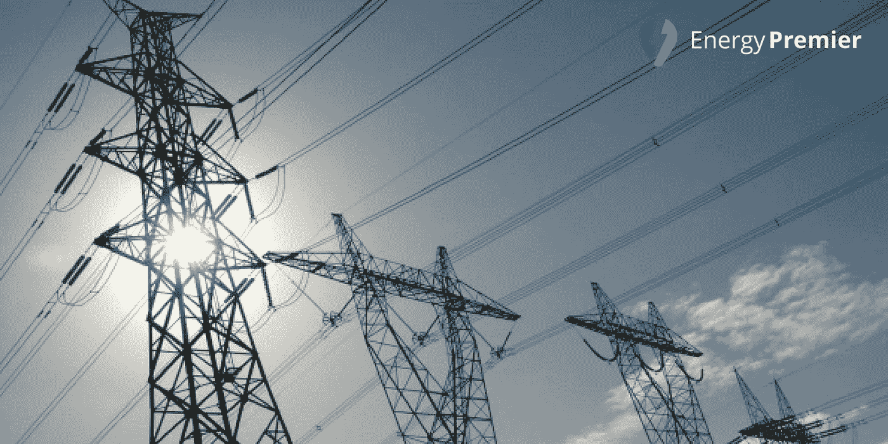

# 区块链如何为更好的电网供电

> 原文：<https://medium.com/hackernoon/how-blockchain-can-give-us-better-power-grids-662d6df99d7c>

*区块链——全球领先的数字资产软件平台，一个旨在虚拟记录金融交易以及一切有价值事物的数字账本。最初是为比特币创造的，区块链技术现在正在寻找它的其他用途。并非所有的区块链业务都与比特币或其他加密货币有关。区块链还有很多其他的机会，比如智能合约等交易。*

区块链的数据库分布在计算机网络中，没有给黑客留下任何空间。它的系统是完全透明的，所有用户都可以看到公共区块链上的交易和变更。这就是为什么许多行业都在努力将区块链实施到他们的行业中。这些行业之一是**能源行业**。

## **当前的能源创新过程包含区块链。**

今天，我们正在寻找区块链技术的下一步，因为它被认为是能源领域的一个潜在参与者。区块链可以帮助我们拥有更好的现代化电网。

区块链有可能被用来分配或资助电力资源，因为它是电网现代化的伟大工具。在电力方面利用区块链意味着区块链试图通过使其成为智能电网来改善当前的电网。

技术每天都在改善我们的生活。区块链是一个分散的网络，有助于保护信息，同时允许用户查看区块链上存储的数据。**因此，区块链技术可以成为电力公司创建智能电网的绝佳解决方案**。

当某个部门出现故障时，每个流程都将进入死胡同，人们正在努力修复电网以继续他们的工作。停电可能会导致利润损失，电网故障对公司来说是一项可怕的任务，需要花费大量时间来修复。

## **区块链如何预防电网故障？**

有了区块链，追踪电网故障的过程将变得更好。电网将能够通信，并且在发生故障或停电时，它们将很容易通知公司。区块链似乎是一个有前途的应用的原因之一是因为电网将能够快速地把它们的状态传递给公司，以便公司可以更快地发现问题。

随着现代技术和智能区块链网络的使用，电网能够向当局发送关于需要什么工具和设备来使电网恢复正常工作状态的建议。此外，如果一家公司遭遇失败，区块链的修复过程会更短更快。

我们相信，在电网中使用区块链将是一个成功的过程，因为区块链可以减少公司在发生故障时造成的损失。区块链不仅可以通知当局当前或潜在的故障，还可以存储与电网相关的一切信息，包括过去的问题。存储这样的信息将提高透明度，也将允许用户看到电网是否需要一些改变、更新或新的安装。

区块链技术使客户能够匿名通知公司一些停电事件。这将改善电网，降低所有故障，同时减少公司的损失。许多公司和政府，以及能源专家，已经看到了电网区块链作为所有故障和中断的解决方案的好处。

> 能源总理认识到区块链在电网中的重要性。这就是为什么我们的平台是一个位于区块链**的电力交易平台**，同时利用**的 EPC 令牌和智能合约**。我们相信区块链是能源行业的未来，因此我们在区块链之后为您提供一个新的电力投标地点。

区块链技术的使用使能源总理完全值得信赖和可靠的地方。区块链不仅可以确保发送给接收方的令牌在几秒钟内送达，无需第三方介入，而且由于智能合约，它还提供了额外的安全性，同时消除了潜在的欺诈。

我们目前正在启动[预售](https://tokensale.energypremier.com/)，众筹将于 9 月 21 日开始。此外，我们有一个[奖金计划](https://bitcointalk.org/index.php?topic=3043285.0)，作为对所有能源高级参与者和贡献者的奖励。了解我们为您提供的服务，并向我们发送反馈！

> 感谢您的阅读。
> 
> [订阅最大的电力竞价平台](/@energypremier)随时关注我们的更新。也参与我们电报频道的讨论:[https://t.me/joinchat/Hq0j1hDxZ3eRKFNo5f7oTw](https://t.me/joinchat/Hq0j1hDxZ3eRKFNo5f7oTw)
> 
> 在这里加入预售和众筹:[https://tokensale.energypremier.com/](https://tokensale.energypremier.com/)

