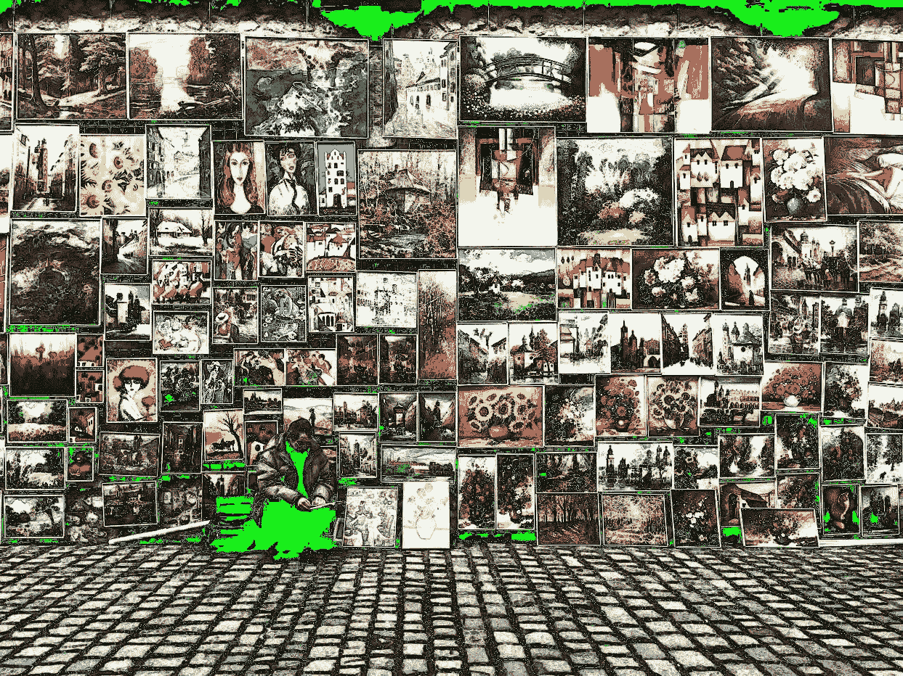

# 区块链如何帮助艺术家的转售权利

> 原文：<https://medium.com/hackernoon/how-blockchain-can-help-artists-resale-rights-8178f4e058e1>

> 区块链艺术集体的执行董事杰奎琳·奥尼尔。[原载](http://qr.ae/TUpw5M)于 [Quora](http://By Sam Radocchia, Co-Founder at Chronicled (2015-present). Originally published on Quora.) 。

转售权已经存在于许多创意产业中。

要在广告中使用歌曲，公司必须获得许可，并向音乐家支付版税。每购买一本书，作者就能获得销售额的一小部分。

但是对于许多视觉艺术家来说，一旦他们创作并出售了一件艺术品，这将是他们最后一次听说这件作品。他们的转售权利基本上不存在。如果一件作品卖了几千美元，十年后又卖到几十万美元，这位艺术家就倒霉了。

幸运的是，这种情况正在开始改变。区块链正在艺术界掀起波澜，艺术家转售权是这些浪潮最终可能对艺术家产生巨大影响的一个领域。

> 它是这样工作的:

# **使用区块链的主要好处之一是提高转售权利。**

现在，当一名艺术家出售他们的作品，或者利用画廊为他们出售作品时，他们放弃了从下一次出售中获利的任何权利。

对于像汽车或沙发这样的日常用品来说，这不是问题。没有卖家会梦想从 Craigslist 的每笔交易中获利。

艺术品的问题在于，它通常会随着时间的推移而增值。一位艺术家最初可能会以适中的价格出售一件作品，但几年后，拍卖行会以数倍于此的价格出售。这位艺术家从未见过这种新价值的一毛钱。

区块链可以通过在涉及艺术家艺术品的每笔交易中嵌入支付给艺术家的款项来帮助平衡利润竞争环境。

这意味着每次艺术品被转售时，都会自动收取类似版税的费用。没有讨价还价或来回参与。付款可以说都是在引擎盖下。但每卖出一件作品，艺术家都会得到补偿。

报酬的大小可能是浮动的，由艺术家决定。但是假设他们选择从 1%开始。这件作品第一次被转卖时，价值可能不多。但也许二十年后，这位艺术家已经有些名气，这件作品的价值也成倍增加。现在，转售价值的 1%对艺术家来说可能是非常有价值的。

# **区块链还允许艺术家跟踪他们作品的销售情况，改善出处。**

这一切都是可能的，因为当一件艺术品被注册到区块链名下时，就产生了物理-数字链接。这种联系是由一种[隐封](https://blog.chronicled.com/how-and-why-we-invented-the-cryptoseal-6577d8633a2)创造的——一种附着在物理艺术品上的防篡改粘合剂。

当一枚加密印章被应用于一件艺术品时，它所创造的物理-数字链接允许艺术家在整个生命周期中跟踪他们的作品，并证明其出处。

现在，艺术家们不可能知道他们的作品发生了什么。已经丢了吗？存放在阁楼里？卖了一百万美元？除非有关于这项工作的某种媒体报道，否则他们可能永远不会知道。

但随着每一笔与艺术品相关的交易都在区块链上注册，艺术家们将能够更好地了解他们的艺术品是如何被使用的——并从其在市场上的成功中获利。

拥有这种物理和数字上的联系将会增加艺术家作品的价值。购买这些作品的收藏家和机构进行了大量的尽职调查，以确保他们得到的是真实的。

如果作品标有隐印，那么它的独特身份就被保存在了区块链上。它减少了人们验证艺术品所花费的时间和金钱。因为一旦它在区块链上被认证和注册，购买者只需要物理-数字链接就可以确定他们得到的是真货。

# **随着追踪和转售权利的提高，艺术品盗窃将会动摇。**

大多数艺术品盗窃都是为了倒卖艺术品。没有多少厚颜无耻的艺术品窃贼仅仅是为了装饰自己的客厅墙壁。

目前，在一个隐海豹里没有 GPS 系统。如果有人想偷一件艺术品并藏在阁楼里，我们无法追踪。

但在某个时候，如果窃贼想要获利，这些作品将不得不重新浮出水面。如果加密印章没有被篡改，但区块链注册与卖家不一致，这将很明显有一个缺失的环节。一旦最初的联系建立起来，去掉封条就会降低这件作品的价值。很明显艺术品不是赝品就是偷来的。

虽然坏演员的黑市将永远存在，但区块链将使小偷和伪造者更难将伪造或被盗的艺术品传递给不知情的收藏家。

随着越来越多的艺术品交易通过区块链完成，艺术家们将能够意识到他们艺术的真正价值

**感谢阅读！**

我们的团队很高兴能与艺术家合作，将他们的作品数字化。要亲自尝试，请在此处 **获得入门套件和基于区块链的真品证书** [**。**](http://ethereumartcollective.com/)

**也可以在 Instagram 上关注我们**[**@ blockchainartcollective**](https://www.instagram.com/blockchainartcollective/)**。**

> 区块链艺术集体的执行董事杰奎琳·奥尼尔。[原载](http://qr.ae/TUpw5M)于 [Quora](http://By Sam Radocchia, Co-Founder at Chronicled (2015-present). Originally published on Quora.) 。
> 
> 更多来自 Quora 的趋势科技答案，请访问[HackerNoon.com/quora](https://hackernoon.com/quora/home)。