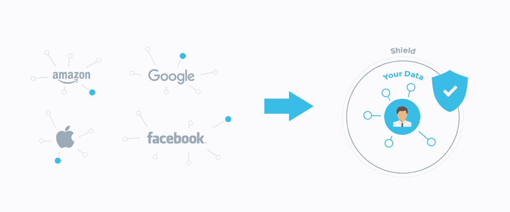

# 区块链如何解决脸书问题

> 原文：<https://medium.com/hackernoon/how-blockchain-can-solve-the-facebook-problem-bb05ffc4159e>

也许你已经听说了。脸书有一个问题。相当多。

这一切都始于俄罗斯为 2016 年总统选举购买的广告。

它随着剑桥分析公司丑闻而达到高潮。约 8700 万用户的数据在未经其同意的情况下被暴露。

在此期间，脸书保留用户删除的视频、整个“假新闻”争议、对 Messenger 上分享的照片进行系统扫描、扎克拥有从其他人的收件箱中删除自己信息的超能力，等等。

这些丑闻似乎来自各个地方。但是他们有一个共同点。他们展示了脸书已经变得多么强大，以及脸书是如何利用它的力量的:首先是让脸书受益。最常见的是损害其用户的利益。有些人甚至争辩说，这不利于整个社会。

每个人都清楚，脸书不仅是无可争议的社交媒体领袖。它也是一家媒体公司、数据经纪人和广告网络。这给隐私带来了不少问题。

这些不再仅仅是理论上的恐惧。最近事情变得非常真实。这不是一个漏洞，也不是一个可以修复的故障。这是一种商业模式。脸书的本质就是伤害人们的隐私。

这家社交媒体公司以前所未有的规模收集人们的私人数据。它通过与第三方共享来利用这些数据。以这样的速度，它使脸书成为世界上第六大最有价值的公司。顺便说一下，谷歌位居第二，其商业模式基本相同。

那么我们从这里做什么？引入监管，将脸书的业务(媒体公司、数据经纪公司、广告网络)分开，就像 2008 年金融危机后零售和投行业务分开一样？这似乎不是个好主意。

实际上，品牌已经开始依赖脸书和谷歌来获得新客户。仅脸书和谷歌就控制了整个数字广告行业 60%以上的份额。目前，它们是不可或缺的。

合理的解决方案不是摧毁一个破碎的系统。而是想出一个更好的。

为了*真正*重塑人与品牌的联系方式。想象一个保护人们隐私的新系统，这对人们和品牌都更有利。一个对每个人都更好的系统。更好的选择。

区块链技术和去中心化人工智能的最新进展是这样一个系统的基石。

现在是时候建立一个总部位于区块链的去中心化平台，将人和品牌直接联系起来，省去营销中间人，以保护用户隐私并提高品牌业绩。

下面是我们提出的系统将如何工作:

1.  **人们生成自己的数据，以保护他们的隐私**

人们以保护其隐私的方式提供对其在线活动的大量数据的访问，而不是让广告网络暗中收集人们的私人数据。

通过浏览器扩展和/或专用浏览器，在用户自己的设备上收集、存储、匿名化和加密用户数据，以保证用户隐私。

数据包括他们访问的页面、购买的产品、参与的社交媒体内容等。它不会离开用户的设备，也不会发送到任何服务器，更不用说与第三方共享了。

这是允许人们利用自己的数据而不损害隐私的第一步。

2.**人与人匹配高度相关的品牌**

然后，用户数据在人们自己的设备上进行处理，将它们与高度相关的产品和品牌进行匹配。

我们的目标是通过高度相关的匹配，帮助人们发现能够真正改善他们生活的产品和服务。不要推销出价最高的品牌的产品，这些品牌付钱给广告网络来吸引你的注意力。

不需要像广告网络这样的中间人来建立这种联系。人和品牌是直接匹配的，以一种完全去中心化的方式。也更相关:广泛的用户数据意味着更好的匹配。

例如，可以向千禧一代女性推荐 Blue 围裙这样的品牌，他们经常在健康食品连锁店吃饭，在 Instagram 上关注特定的美食家，在网上购买食品，但尚未订阅食品配送服务，并在过去 48 小时内一直在搜索健康食谱。

即使是通过最具侵入性的广告网络，也无法在如此精细的层面上做到这一点。

**3。人们获得优先定价**

这就是分权的魔力真正发挥的地方。品牌可以通过给用户很大的折扣来激励他们购买，而不是仅仅为了与用户联系而参与竞标战和支付广告网络。

折扣由代币表示。在用户购买之后，代币从品牌转移到用户。

在这样的系统中，品牌产生更多的销售，因为用户被激励去购买。人们得到优惠价格作为购买的奖励。

该系统重新分配目前由广告网络获取的价值。它优化了经济效率，保护了人们的隐私。

人们从他们自己的数据中受益，而不会损害他们的隐私。品牌产生更多的销售，降低营销成本，只有当人们购买时才会产生成本。

因为这个系统为品牌提供了一个更有利的选择，它给了他们一个绕过脸书直接与用户联系的很大理由。这让脸书少了一个与第三方分享用户数据的理由，第三方现在有了更好的方式与用户联系。

这是我们正在研究的系统。它叫做 Cryptopal。这只是一个开始，我们对接下来的事情感到非常兴奋。加入对话吧！

## 加入我们的社区

*   [**订阅 Cryptopal 的简讯**](https://meetcryptopal.com)
*   [在电报上加入 Cryptopal](https://t.me/meetcryptopal)
*   [在 Twitter 上加入 Cryptopal](https://twitter.com/meetcryptopal)