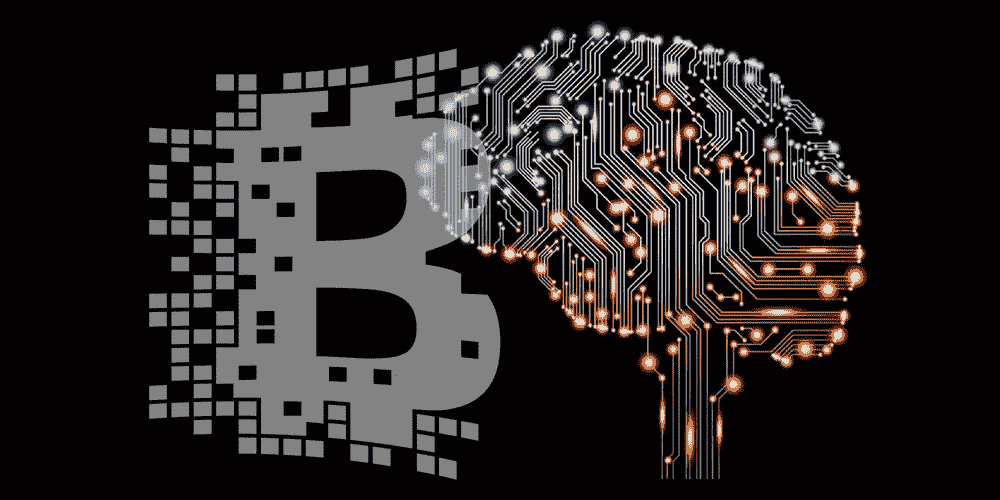
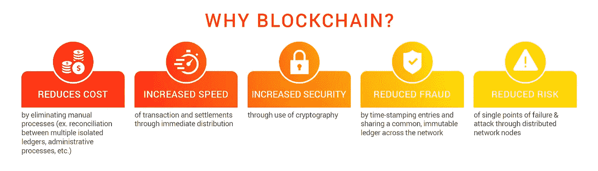
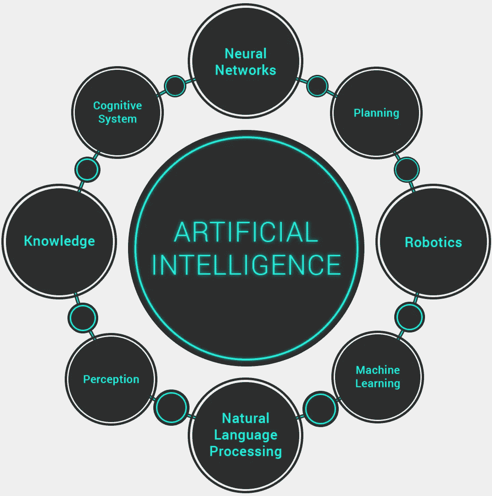
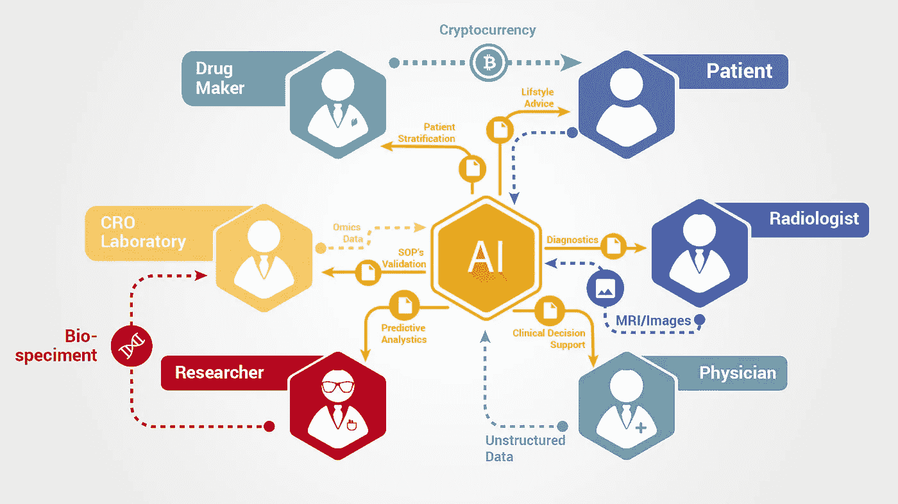
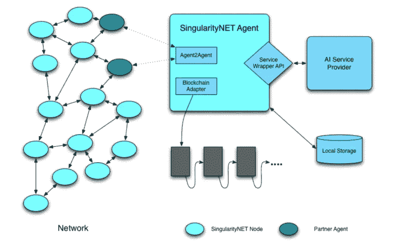
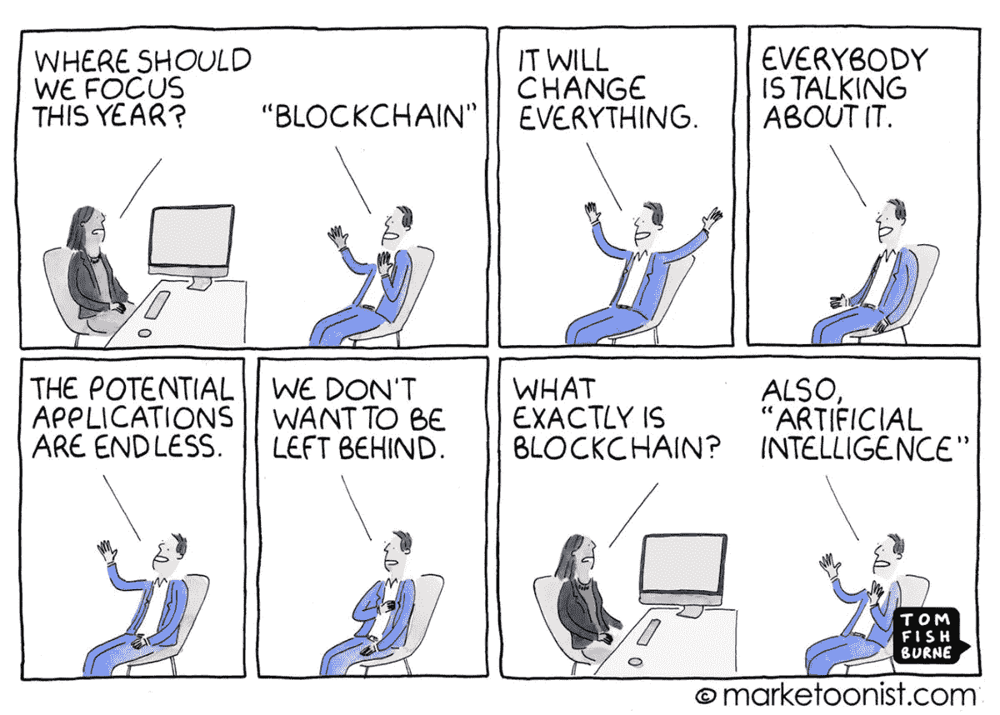

# 区块链如何变革人工智能

> 原文：<https://medium.com/hackernoon/how-blockchain-can-transform-artificial-intelligence-76910d2c9201>

[**区块链**](https://dashbouquet.com/blog/blockchain/blog/blockchain/blockchain-solutions-the-way-to-transform-your-business-processes) 被吹捧为新兴技术之一，有可能颠覆所有可用的行业。区块链技术的分散系统与今天使用的固有的集中操作系统是对立的。通过采用一种形式的分散数据库体系结构，某些操作的记录和认证取决于几方的协议，而不是单个机构。

相比其他集中式技术， [**区块链技术**](https://dashbouquet.com/blog/blockchain/blog/blockchain/blockchain-solutions-the-way-to-transform-your-business-processes) 使运营更安全、更快捷、更透明。

随着比特币、以太坊和莱特币等加密货币成为新闻，这一技术的影响已经在金融领域得到了体现。该应用还扩展到其他领域，如广告、医疗保健、商业物流、安全等。

目前，研究人员正在钻研更深的领域，试图将区块链纳入更复杂的技术领域，如大数据、物联网，尤其是；人工智能。

[**人工智能**](https://dashbouquet.com/blog/blockchain/blog/artificial-intelligence/machine-learning-and-ai-trends-for-2018-what-to-expect) 是一个总括术语，指与机器能够更加独立和高效地行动有关的领域中记录的各种技术进步子集。从语音模式识别到自动驾驶汽车，人工智能的目标是让机器学习并应用从大量数据流中收集的知识，使它们变得更加智能。

基本上，区块链关注的是保持准确的记录、认证和执行，而人工智能则帮助做出决策，评估和理解某些模式和数据集，最终产生自主交互。艾和区块链有几个共同的特点，这将确保在不久的将来无缝互动。下面列出了三个关键特征。

## 一、AI 和区块链需要数据共享

分散式数据库强调在特定网络上的多个客户端之间共享数据的重要性。同样，人工智能非常依赖大数据，更依赖数据共享。随着更多开放数据的分析，机器的预测和评估被认为更正确，生成的算法也更可靠。

## 二。安全性

在区块链网络上处理大额交易时，对安全性有很高的要求。这是通过现有的协议来实施的。对于人工智能来说，机器的自主性也需要高度的安全性，以降低灾难性事件发生的概率。

## 三。信任是一项要求

对任何被广泛接受的技术的进步来说，没有比缺乏信任更大的威胁了，人工智能和区块链都不例外。为了促进机器对机器的通信，有一个预期的信任级别。要在区块链网络上执行某些交易，需要信任。

**用例** —以人工智能为中心的医疗保健区块链技术。这种解决方案为流程带来了透明度和灵活性。

通过几个显示人工智能和区块链共享相似功能的例子，我们现在可以继续了解**区块链技术将如何转变人工智能**。

## 开放数据市场

如前所述，人工智能技术的进步取决于来自无数来源的数据的可用性。即使像谷歌、脸书、亚马逊等公司。可以访问大量的数据来源，这些数据可以证明对许多人工智能过程是有用的，但这些数据在市场上是不可访问的。

区块链旨在通过引入点对点连接的概念来解决这一问题。由于它是一个开放的分布式注册表，网络上的每个人都可以访问数据。现有的数据寡头垄断即将结束，一个开放和免费的数据时代即将到来。

## 大规模数据管理机制

即使在数据可用之后，管理数据也是另一个障碍。目前可用的数据量估计为 1.3 吉字节。有一个人工智能的子领域被称为人工智能，它可以被建模为反馈控制系统。该功能有助于自主代理更好地与物理环境交互。

由于大量数据存储在一个分散的系统中，与传统的中央存储中心相比，它有几个优点。在发生危机和自然灾害时，数据不是存储在一个单一的位置，因此会被保存下来。此外，黑客攻击被消除，这使得数据集更不容易损坏。

## 更值得信赖的人工智能建模和预测

计算机系统的一个基本原则是 GIGO。垃圾进，垃圾出。人工智能领域严重依赖于大量的数据流。一些个人或公司故意篡改提供的数据以改变结果。传感器和其他数据源的意外故障也可能导致垃圾数据。

通过创建已验证数据库的片段，模型可以仅在已验证的数据集上成功构建和实现。这将检测数据供应链中的任何故障或异常。它还有助于减少故障排除和查找异常数据集的压力，因为数据流是分段提供的。最后，区块链技术是不变性的同义词，这意味着数据是可追踪和可审计的。

## 控制数据和模型的使用

这是整合区块链技术和人工智能的一个非常重要的方面。例如，当你登录脸书和推特时，你放弃了你上传到他们平台上的任何内容的权利。同样的事情也会发生在歌手签唱片合约的时候。同样的概念也可以应用于 AI 数据和模型。

当为了建立模型而创建数据时，您可以指定导致限制或许可的许可。区块链技术使这一过程变得相对容易。

解释一下，在区块链网络中，查看或使用这些数据的权限被视为一种资产。同样，硬币可以在加密货币平台上转移，这些访问网络信息的权限也可以转移。

**用例:**AI market by[**singularity net**](https://singularitynet.io/)**，**这是一个开源协议和智能合约的集合，用于协同 AI 服务的分散市场。该团队表示，由于其交易和簿记优势，区块链技术为管理 SingularityNET 上的网络交易提供了一个理想的工具。该平台允许添加人工智能服务供网络使用，并接收网络支付令牌作为交换。但首先，必须设计一个基于区块链的框架，允许人工智能代理相互之间以及与外部客户进行交互。这里是它的高层网络架构图。

有了这些，您就可以控制您的数据如何用于您拥有的任何数据集。对于需要隐私的行业来说，这项技术会派上用场。随着这两种技术目前在几乎所有可用的行业中掀起波澜，这两个领域的协同作用有望带来更大的好处。技术的未来不可避免地是一个去中心化的操作系统，机器可以更好地互动，对人类活动的理解可以更好地建模。

[由德米特里·布德科撰写](https://www.linkedin.com/in/dmitrybudko/%5C)