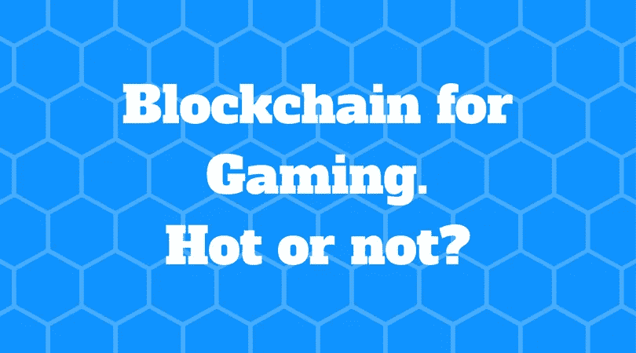

# 区块链如何改变我们的游戏方式？

> 原文：<https://medium.com/hackernoon/how-blockchain-changes-the-way-we-game-30553d9d86e6>

我最近参与了游戏控制台项目，这激起了我对加密货币在游戏行业中的应用的兴趣。

## 它们的发展和相互作用是什么？以下是我的想法。

不久前，全球加密货币市场达到 7000 亿美元的创纪录高点，这明显表明人们对数字货币及其背后的区块链技术的兴趣日益浓厚。[区块链](https://hackernoon.com/tagged/blockchain) [技术](https://hackernoon.com/tagged/technology)正被成功应用于各种市场领域，并有望在各种不同领域实现:资金转账、网上交易、房地产、保险、约会甚至娱乐。

视频游戏行业——虚拟经济的主导者之一——也不例外。有几家公司，如 MobileGo、GameCredits 和魔咒创世纪，已经成功地将区块链应用于视频游戏市场。手机游戏开发商 Tapinator 最近成立了一家子公司 Revolution Blockchain LLC，计划开发区块链应用和游戏。他们的第一个项目计划于 2018 年第二季度启动。总体而言，对于加密货币和区块链的采用来说，游戏是一个非常有前途的领域，将对游戏玩家和开发者产生影响。

从游戏玩家的角度来看，加密货币将是一个简单的转换，因为几乎每个游戏都已经使用了自己的虚拟货币——钻石、信用等。—玩家买来玩的。实施区块链系统可以让玩家有机会将他们从一个游戏中获得的收入再投资到另一个游戏中，并随时兑现他们的游戏天赋。这种货币的自由流动还将允许绕过信用卡微交易和国际费用，并最终导致一个更快、更简单的系统。此外，在游戏和流媒体领域建立职业生涯的游戏玩家可以受益于更容易与全球观众和合作伙伴进行货币兑换。

对于游戏开发商来说，区块链可以成为解决许多行业漏洞的灵丹妙药，例如玩家保留和安全性方面的困难。首先，它将通过建立透明的注册系统和可核实的游戏内大型资产所有权来解决重复和网络盗窃问题。因此，玩家将能够在游戏之外购买、出售和交易他们的虚拟物品。这种安全的环境和明确的所有权转移选项将刺激玩家投入更多的资金和时间到游戏中。

> 首先，它将通过建立透明的注册系统和可核实的游戏内大型资产所有权来解决重复和网络盗窃问题。

但这还不是全部！有了区块链技术，开发商在不久的将来可以通过利用多级推荐系统来减少营销费用。深渊，命运号为游戏玩家和开发者打造的数字发行平台。游戏，是开始其深渊代币销售今年 1 月。该平台专注于 F2P 浏览器和客户端 MMO 游戏，将成为一个社区，玩家和开发者都可以从多级推荐、激励计划、游戏物品拍卖和其他游戏社交活动中获利。开发商将通过重组他们的广告逻辑来节省营销工作。与其竞争，深渊将提供他们的用户合作，直接购买和出售有针对性的流量给对方。

随着区块链和加密货币行业的发展，其在商业中的应用也在扩大。对于开发者、创业企业家，尤其是技术和网络驱动的项目，采用区块链甚至不是可有可无的，而是必须的。

对于区块链的注入来说，博彩业看起来是最有希望的，坦率地说，也是最令人兴奋的领域之一。我们必须承认，除了它唤醒的所有额外的“宣传”，它正迅速成为今天和未来的一个重要部分。