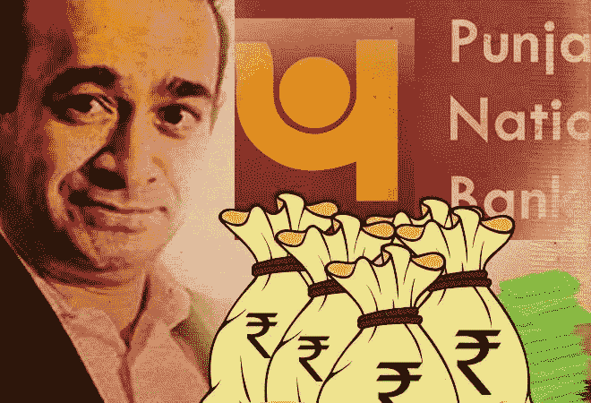
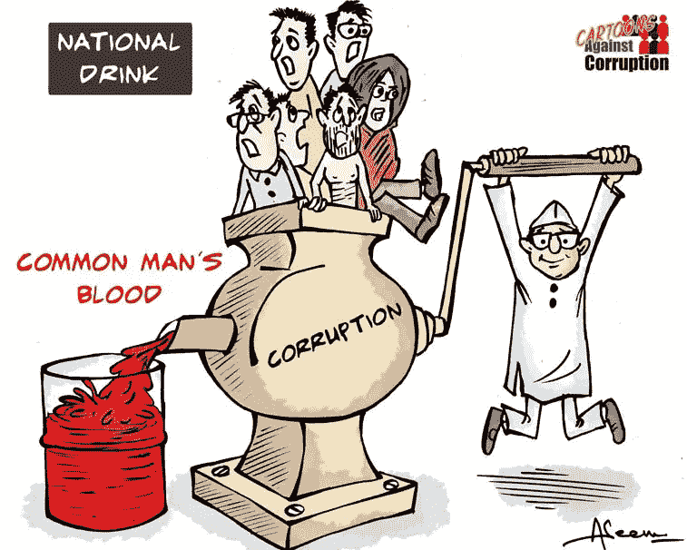

# 区块链如何避免印度最大的银行骗局

> 原文：<https://medium.com/hackernoon/how-blockchain-could-have-averted-biggest-banking-scam-in-india-9aed823edcc0>

本文观点纯属我个人观点。在讲述了几个段落之后，我将说明**[*技术*](https://hackernoon.com/tagged/technology) *如何能够避免这种骗局。***

****

**Source: [http://www.thefunlearning.com/2011/12/cartoons-against-corruption-in-india.html](http://www.thefunlearning.com/2011/12/cartoons-against-corruption-in-india.html)**

**这篇文章是关于最近在我的国家印度出现的最大的银行诈骗。一个商人，Nirav **莫迪**抢劫了一整个国家银行(旁遮普国家银行)据称价值 18 亿₹11,400 卢比。**

# **₹ 11,40,00,00,00,000.让它深入人心。**

****

**Source: [http://www.dailyedge.ie/taylor-swift-must-be-stopped-2294879-Aug2015/](http://www.dailyedge.ie/taylor-swift-must-be-stopped-2294879-Aug2015/)**

*   **旁遮普国家银行(PNB)是印度第二大公共贷款机构。**
*   **最近，印度政府(GoI)批准了约₹6,000 克罗尔，以帮助银行覆盖其不良资产问题。骗局发生时，PNB 的全部市值是₹33,000·克罗尔。**
*   **₹11,400·克罗尔= 8.5 倍(pnb 2016-2017 财年的利润)**

**数字就是这么大。**

**目前，这个问题已经变成了政治问题。印度人民党(BJP)指责国大党，反之亦然。指责游戏是印度政坛的一个传统。每次都是这样。他们称之为 **chai par charcha** (茶语)**。****

****

**Source: [http://popkey.co/search/Tom%20and%20Jerry](http://popkey.co/search/Tom%20and%20Jerry)**

**你看，高尔夫球员正和爆米花坐在一起享受节日。**

## **尼拉夫·莫迪为什么会被陷害？**

**基本上，一名低级别的孟买分行官员代表与尼拉夫·莫迪有关联的公司错误地签发了承诺书。承诺书的作用是授权公司从印度的外国银行获得买方信贷(贷款),将原材料进口到印度。这个叫 Nirav 的家伙在没有任何担保的情况下获得了外币贷款。而且这些钱在印度从来没有用来进口商品。而是 Nirav 用来偿还其他银行的贷款！**

## **这件事从 2011 年就开始了，怎么到现在才被注意到？**

**因此，当初级官员向外国银行发送指令时，是通过名为环球银行间金融电信协会(SWIFT)的信息系统完成的。毫无疑问，这个系统事实上受到全世界所有银行的信任。为什么？因为它是在指令下达前由主管背书的。**

## **转折点:**

**PNB 的核心银行系统没有记录这些指令。Infosys 为 PNB 的银行和金融系统提供技术支持。**

> **这意味着 PNB 管理层没有注意到这些指示，实质上是对其他银行的承诺，即旁遮普国家银行将偿还他们向尼拉夫·莫迪提供的信贷。**

## **那么银行是怎么发现的呢？**

**当尼拉夫·莫迪的公司再次寻求承诺书时，他们被要求提供 110%的现金保证金作为担保。Nirav Modi 的公司告诉银行，他们几年来一直在利用承诺书的便利，而没有提供任何现金保证金。**

****这拉响了警报，其振幅超过了地球上最大的噪音。****

**然后，该银行通过 SWIFT 跟踪检查该分行实际发生了什么，这时骗局出现了。**

## **那么到底是谁在为这个烂摊子买单呢？**

**现在，压力是在其他提供贷款的外国印度银行身上，而不是 PNB。但这些银行没有错，因为它们是根据 SWIFT 指令发放资金的。**

**阿拉哈巴德银行被认为在这里拥有最大的风险敞口，该银行表示，它的债务是旁遮普国家银行的，而不是个别公司的，因此它预计银行会付清欠款，不必担心从莫迪的公司收取资金。**

**上述问题没有直接的答案，但最终受害的还是普通人。**

****

**Source: [http://www.thefunlearning.com/2011/12/cartoons-against-corruption-in-india.html](http://www.thefunlearning.com/2011/12/cartoons-against-corruption-in-india.html)**

# **区块链解决方案**

**我想我抄袭得够多了。现在来说说解决办法。**

**引发骗局的主要特征:**

1.  ****下级官员擅自发出承诺书:**在区块链，有一些精明的合同，需要指定的人签字才能生效。例如，如果我说要卖掉我的房子，我和我的父母必须同意。所以只要我同意或者只要我父母同意，房子就卖不出去。条件是我们俩都得同意。**
2.  ****银行出具无任何担保的承诺函:【Nirav Modi 在发放贷款前没有保留任何担保，这完全违反了银行的政策。智能合同的概念在这里也可以适用。除非借款人成功存入证券，否则贷款不会被批准。****
3.  ****PNB 的银行系统没有记录任何交易:**有一个中央数据库，必须由银行专门手动更新。存在人工错误的“可能性”。在区块链，只有一本账本是终极真理。不存在人工失误，这是违规操作。**

***如果我遗漏了解决方案中的任何一点，请在下面评论。会很感激的。***

**我希望 GoI 着眼于解决问题，而不是指责对方。印度需要摆脱所有这些混乱。它是世界历史上最古老的国家之一，但仍在发展。肯定有问题。作为一名印度公民，我为我的国家感到自豪。但是，这种我们的政府和领导人无能的事件，让我陷入困境。**

**仅此而已。**