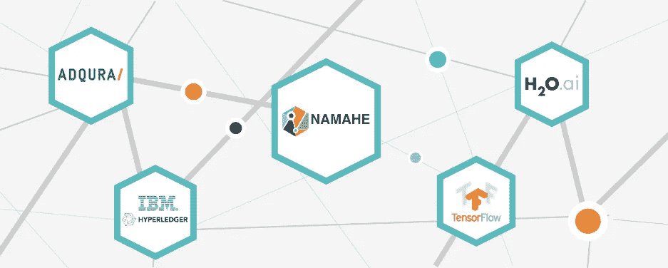
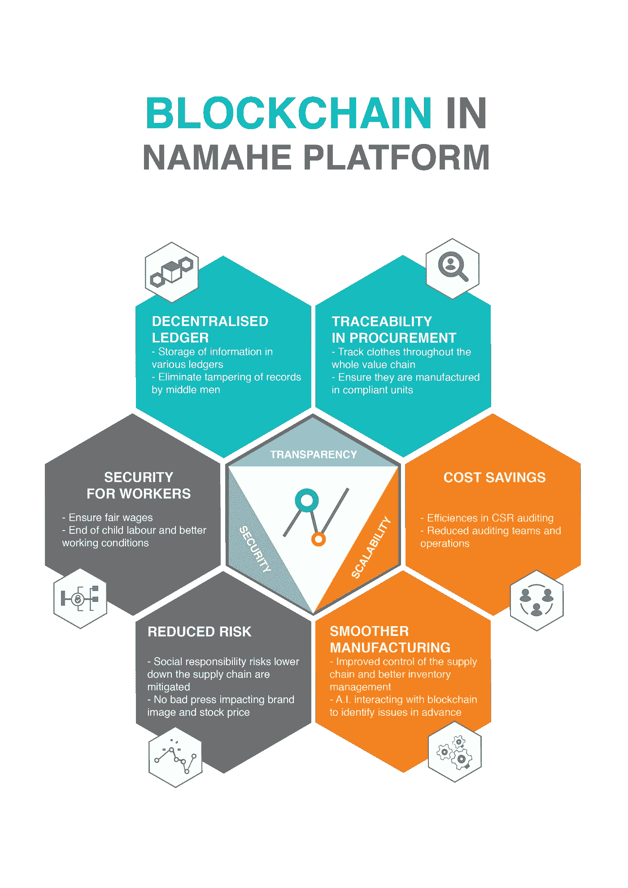

# 区块链如何革新供应链

> 原文：<https://medium.com/hackernoon/how-blockchain-could-revolutionize-the-supply-chain-3805f0a03ad6>

## 创始人访谈

Namahe co-founder Kumar Mudaliar (left), & Adqura Director & Namahe partner Sameer Prakash (right)

> 披露: [**纳玛赫**](http://bit.ly/hackernoonnamaheblogpost) ，基于区块链的供应链，之前赞助过黑客正午。

*今天我们要追到的是* [*纳马河*](http://bit.ly/hackernoonnamaheblogpost) *联合创始人* [*库马尔·穆达里亚尔*](https://www.linkedin.com/in/kmudaliar) *，以及 Adqura 导演&纳马河合伙人萨米尔·普拉卡什。Kumar 在银行业拥有超过 15 年的经验，擅长金融、战略和业务运营。*[*same er pra kash*](https://www.linkedin.com/in/sameerprakash/)*领导了平台的 AI 实现，并在纳马河的合作伙伴 Adqura 担任了 7 年的 CTO。*

[*那马河*](http://bit.ly/hackernoonnamaheblogpost) *的代币发售现已上线。在*[*NAMA he . io*](http://bit.ly/hackernoonnamaheblogpost)*了解更多。*

[**大卫**](https://medium.com/u/7f91547ce9c9?source=post_page-----3805f0a03ad6--------------------------------) **:那马河为什么需要存在？**

**Kumar & Sameer:** 因为即使是最大的公司也无法实现供应链的完全透明，仍然有证据表明在许多行业的供应链中存在工作条件、工资、童工、骚扰和违反当地法律等问题。

你能分享一下这家公司的创始故事吗？公司名字“那马河”背后有什么故事？

“Namahe”在梵语中的意思是“感谢造物主”

> [Namahe](http://bit.ly/hackernoonnamaheblogpost) 背后的全部目的是确保产品价值创造中的公平实践以及参与创造产品的每个利益相关方的公平待遇。

该公司由 Ajay Lakhwani 于 2009 年根据他在南亚 Gap Inc .管理社会责任的 9 年经验创立。Ajay 了解服装供应链中正规和非正规部门的根本原因和现状。他致力于改善工作条件，并与不同的利益相关方合作，以减少供应链中的道德问题。然而，由于这些问题的规模和复杂性，他认为技术需要发挥重要作用。

[**你们的白皮书上说**](http://namahe.io/whitepaper) **纳马和将是“第一个有社会责任的供应链”用通俗的话来说，你能解释一下那是什么意思吗？如果世界上有一个广泛使用的社会责任供应链，社会影响会是什么？**

Namahe 是一个平台，任何行业的任何公司都可以使用它来创建供应链的可追溯性和透明度。它将把从工人和工厂到零售商和消费者的所有利益相关者联合在一个平台下。通俗地说，作为一名消费者，人们可以相信他们正在使用的产品是在道德条件下制造的。作为零售商，他们将通过区块链获得所有必要的信息，将能够与其他零售商合作共享信息，并将能够受益于人工智能带来的效率。对于制造商来说，他们可以更好地控制他们的制造层级，特别是在非正规部门的运作。对于工人来说，他们可以通过 Namahe 平台，通过提供给他们的用户友好界面，输入自己关于工作量、收到的工资和申诉的信息。

**纳马和更多的是 AI 公司还是区块链公司？纳马和是什么类型的技术？**

Namahe 是两者的融合。

该平台提供了一个真正的端到端的供应链视图，通过使用技术来跟踪订单，因为它们是在现代供应链的蛛网上进行的。

> 1.接口

该平台提供(移动和桌面)应用程序和界面，允许注册的利益相关者在平台上执行功能。

> 2.区块链

正如你所料， [Namahe](http://bit.ly/hackernoonnamaheblogpost) 平台建立在区块链之上，每个订单都是一份智能合同，包含预期的 SLA 和参数。随着订单向下传递，然后沿链向上传递，每个利益相关者都被视为区块链中的节点，他们需要满足合同中规定的任务的要求。

> 3.人工智能

AI 跟踪成百上千个任务中的每一个，以及它对整体交付 SLA 的影响。在个人层面，它是一个友好的虚拟助手，帮助和提醒用户跟踪和完成他们的任务。在平台层面，它评估影响并调整链的各个部分，以进行补偿和重新计划来达到目标。

这是我们的解决方案——一个由人工智能支持的智能区块链平台，作为一系列应用程序 UX / UI 暴露给最终用户。

**该产品目前的状态如何？哪些技术将成为平台的核心？**

产品背后的概念是在 Namahe 1.0 中构建的。作为 Namahe 2.0(当前项目)的一部分，我们已经与一个潜在品牌达成了一个真实世界的试点用例。

产品路线图如下所示:

> 1.设计概念验证(2018 年 5 月至 6 月)

作为 POC 的一部分，我们正在探索 IBM Hyperledger 上可用的“设计”选项，以及如何在我们的平台上以最佳方式使用这些功能。这项工作目前正在进行中。

> *2。技术演示器(2018 年 6 月)*

在设计概念验证的同时，我们正在构建一个工作版本，向潜在品牌展示试点使用案例。我们说话这会儿已经开始了。

> *3。第一个参与的品牌和项目启动(2018 年 10 月)*

我们正在与一个顶级品牌和我们的合作伙伴积极合作，在 2018 年第 4 季度开始 live 项目的第一阶段。

**纳玛赫的短期和长期商业模式是什么？**

短期商业模式是将端到端供应链平台分成不同的模块，如分包商模块和非正规部门模块。我们已经在与零售商和开发组织讨论在地面上测试这些模块。一旦所有模块完成和测试，我们将开始向零售商发放许可证，并围绕 Namahe 平台开发 Namahe 市场。然而，这将是一个独立的市场，使中小型制造商和零售商能够进行交易。

**NAMA he 团队目前的构成是什么(技能组合、位置、数量等)。)?接下来的一年，你打算招聘什么样的人？(随意链接招聘广告)**

Ajay Lakhwani，联合创始人，英国

17 年在电子商务、时尚和消费品行业的一般管理、销售和供应链方面的专业经验。在全球最大的服装零售商之一 Gap Inc .的南亚地区担任区域和全球领导职位的丰富经验，包括供应商开发和社会责任管理。

Kumar Mudaliar，联合创始人，英国

Kumar 在银行业拥有超过 15 年的经验，擅长金融、战略和业务运营。除了他的会计和金融技能，Kumar 还是一个密码爱好者，并且相信区块链技术的力量。

Kanika Dhyani 博士，数据科学家，运筹学专家，意大利
Kanika 在数据中心的容量规划环境中应用优化算法和预测模型，并用于包括 Amazon 和 Azure 在内的混合云项目。她专攻运筹学、数据分析、统计学和数学建模。

Razvan Pitic 博士，RFID，IOT 和无线专家

物联网/M2M 领域经验丰富的技术专家，在无线通信领域拥有丰富的研究背景。Razvan 是物联网和 RFID 技术方面的专家。他专门研究 R&D 的无线网络、媒体接入技术、资源分配、分组调度算法、QoS 供应和 ICT 咨询。

美国区块链开发商 Anthony Colón Jr

安东尼·C·Jr 是区块链神童。他 14 岁时就开始编程，创作流行的网络游戏版本。17 岁时，他成为专业人士，设计房地产网站，但几年后又回到了加密圈，成为 ICO 社区的活跃成员，并参与了许多成功的 ICO 项目。他加入 Namahe，成为区块链的首席开发人员。加密和音乐是安东尼的激情所在。

法国营销和社交媒体主管 Sane Lebrun

Sane 在数字营销的所有领域为科技公司工作了 8 年，包括品牌开发、移动营销、合作伙伴管理、社交媒体增长、SEO、内容营销、影响者营销和创意资产管理。他专门为区块链地区的公司设计和推动营销活动。

在接下来的一年里，我们将扩大团队，与新的零售商和非政府组织合作，在非正规部门密切合作，就像我们与 SEWA·巴拉特合作一样。该团队将由销售、技术和社区团队成员组成，以交付 Namahe 平台。

**为什么 Namahe 会在时尚界起步？时尚界的人会怎么采纳？**

Namahe 将从时装业开始，因为这是一个价值 3 万亿美元的行业，有一个漫长的全球供应链，由正式和非正式部门组成，使其不透明，因此更容易被剥削。它还包括全球数千万工人，其中大多数来自欠发达市场的低收入至极低收入群体。时尚界人士会采用 Namahe，因为它将为他们提供工具、流程和界面，帮助他们避免或发现供应链中的道德问题，这是他们几十年来一直试图实现的目标，但收效甚微。此外，Namahe 将使用人工智能和区块链进行持续学习和改进，从而提高效率。

当发现劳工剥削(如童工或低于最低工资的劳工)时，Namahe 将如何干预？

Namahe 将通过使用区块链提供可追溯性，并将提供流程、工具和界面以避免和检测剥削。Namahe 将以顾问身份与所有利益相关方合作，包括零售商、制造商、政府机构、发展组织和工人团体。然而，对任何发现的问题采取行动将是相关利益攸关方的责任。

**你能告诉我们 NMH 硬币是如何工作的吗？**

NMH 是一个公用事业令牌，在纳马河市场中扮演着一个新的重要角色，在那里，大大小小的零售商和供应商都在注册，并为交付订单而互动。

Namahe marketplace 将被设计为一个全球平台，旨在支持使用流行的数字货币进行支付，优先使用 NMH 代币(符合当地法律法规)。

ERC-20 兼容的 NMH 令牌将在区块链公共以太坊上交易，并允许用户在纳马河市场上购买和销售商品和服务。NMH 代币将在主要交易所上市(待公布)，并可转换为其他加密货币和法定货币。

预计 NMH 代币的需求将受到交易所交易和纳马赫市场使用需求的推动，而公共领域的代币数量保持不变。

**代币销售的目标(数量和时机)是什么？目前提供什么样的折扣？**

Namahe 代币销售有 400 万美元的软上限(如果没有达到限额，资金将返还给投资者)和 3000 万美元的硬上限。我们以 1 ETH = 1000 NMH 代币的比率发行 6000 万 NMH 代币用于公开销售。在 6 月 6 日之前，我们有 20%的奖励代币，此后到 6 月 20 日，我们将提供 15%的奖励代币。

**区块链如何以其他技术无法做到的方式创造供应链的透明度？**

供应链的最大问题是供应链的不可见或非正式部分、信息流和篡改记录的风险。使用区块链将有助于我们分散记录，防止篡改，使所有利益相关者都能获得信息，并使工人能够输入与其工作相关的信息。

**那马河 5 年后是什么样子？**

五年后， [Namahe](http://bit.ly/hackernoonnamaheblogpost) 将成为零售商供应链中广泛使用的平台。Namahe Marketplace 将成为全球中小型制造商和零售商之间 B2B 交易的新兴在线平台。

## [那马河](http://bit.ly/hackernoonnamaheblogpost)的代币售卖现已开始。在 [Namahe.io](http://bit.ly/hackernoonnamaheblogpost) 了解更多信息