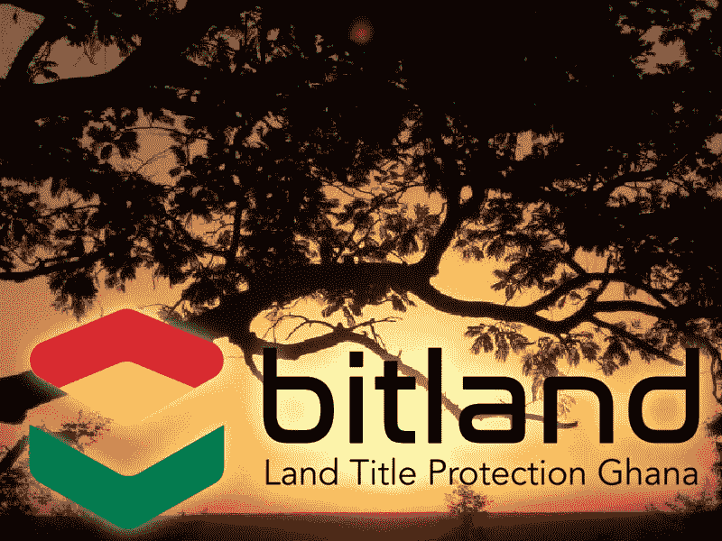
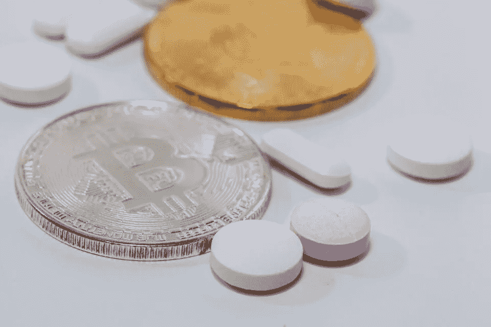
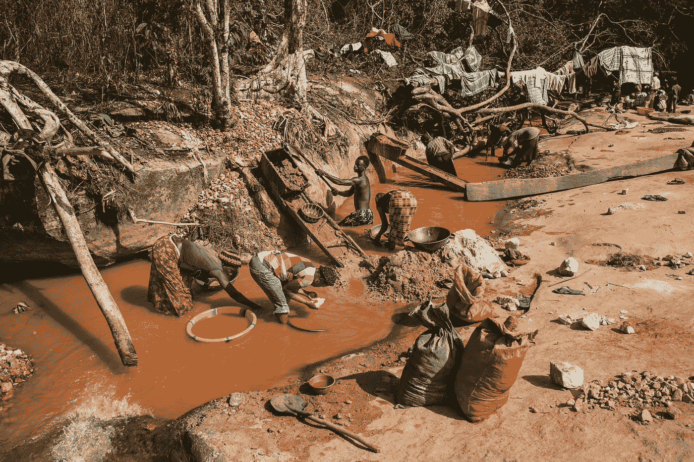

# 区块链如何拯救世界？

> 原文：<https://medium.com/hackernoon/how-blockchain-could-save-the-world-a1929897eb2>

如果你还不知道什么是[区块链](https://hackernoon.com/tagged/blockchain)以及它是如何工作的，你可以在这里阅读我以前的文章

**所以，今天的问题是 Blochain [技术](https://hackernoon.com/tagged/technology)如何拯救世界？**

**嗯，这个问题有好几个答案！**

**首先，blochain 在安全和信任方面是一个很好的概念，因为它是一个去中心化的、分布式的和公共的账本。**

**好吧，但是在现实生活中，这意味着什么呢？**

**让我们看一些例子来理解区块链是如何拯救世界的！**

# **基于区块链技术的新型可信地籍系统**

****

**谁想成为一个没有可靠和安全地籍系统的国家的房东/女房东？**

**例如，在加纳，90%的非洲农村土地没有在官方数据库中登记。但是加纳并不是唯一一个处于这种情况的国家。**

**这种情况有许多后果。信任的缺乏使发展农业经济的投资最小化。而且，人们没有任何邮政地址。这是限制网络经济的主要情况。**

**此外，没有所有权证书阻止人们购买他们的土地和房屋。如果你不确定能否保住自己的产权，你就不能也不想从银行获得贷款。**

**[**比特大陆项目**](http://www.bitland.world/overview/) 是一个安全土地登记的区块链系统。该项目得到了加纳政府的认可，他们与所有政党合作，以确保该项目不会因政府更迭而受到影响。**

> **按照他们的话来说，他们最大的抱负*“将是帮助确保加纳和非洲通过透明的注册来开发他们的土地。目标是建立一个可以减少土地冲突中人类腐败的系统。公民需要一种制度来防止他们的政府不公平地利用他们。该项目可以为整个社区带来财富，而不仅仅是少数人的财富。”* [**区块链法国**](https://blockchainfrance.net/2016/03/03/des-cadastres-sur-la-blockchain/)**

**其他一些项目在世界各地启动，如佐治亚州的 [**区块链土地所有权项目**](https://bitcoinmagazine.com/articles/bitfury-announces-blockchain-land-titling-project-with-the-republic-of-georgia-and-economist-hernando-de-soto-1461769012/) 。格鲁吉亚共和国国家公共注册局、秘鲁经济学家**和比特币公司 [**BitFury**](http://bitfury.com/) 于 2017 年春季宣布合作。****

****雪球效应在世界范围内慢慢变好。****

# ****确保获得真正的药物****

> ****国际刑警组织于 9 月 25 日星期一宣布，在全球范围内查获了创纪录的 2500 万假药和禁药，这些假药和禁药是通过互联网销售的，价值超过 5100 万美元(4300 万英镑) [**解放**](http://www.liberation.fr/planete/2017/10/01/faux-medicaments-un-fleau-mondial-tres-lucratif_1592623)****

********

****比海洛因更有利可图的繁荣市场。即使像中国这样的一些国家加强了处罚力度，对于全世界需要药物的人来说，这仍然是一个大问题，特别是在发展中国家。****

****区块链的一个公共分布式账本项目可以改变这种状况，保证每个人都能获得安全的药物。我希望它是世界卫生组织的优先项目。****

****此外，随着区块链技术的发展，医疗数据管理在未来将得到真正的改善。****

****例如，在美国，MedRec 是试图提高安全性和访问医疗记录的区块链原型。****

> ****目标是“让患者和他们的提供者一站式访问他们见过的所有提供者的全部病史。” [**福布斯**](https://www.forbes.com/sites/bernardmarr/2017/11/29/this-is-why-blockchains-will-transform-healthcare/#510ed2861ebe)****

****该主题的其他项目如 [**Medicalchain**](https://medicalchain.com/en/) 等也已启动。****

# ****打击奢侈品市场的欺诈行为****

> ****“欺诈保险每年损失 450 亿美元，保险公司每年因珠宝欺诈损失 20 亿美元。” [**总账**](https://www.everledger.io/)****

****这也是为什么 [**符晓薇肯普**](https://twitter.com/leanne_kemp) 在 2015 年 4 月推出 [**总账**](https://www.everledger.io/) 的原因。****

> ****Everledger 是一家全球性的初创公司，它使用最好的新兴技术，包括区块链、智能合同和机器视觉，来帮助银行、保险公司和开放市场减少风险和欺诈。 [**总账**](https://www.everledger.io/)****

****自 2015 年以来，Everledger 已经用密码**保护了超过 100 万颗钻石**。****

****这个想法是为全世界的每一颗钻石建立一个不可逃脱的网络。如果不能证明钻石的来源，他的价值就会大打折扣。****

# ****每颗钻石是如何注册的？****

****Everledger 列出了 40 个属性(大小、颜色、纯度、克拉重量、提取地点等。).他们用这些数据创造一个独特的序列号。然后，这个序列号被刻在石头上，并被添加到区块链中。所有这些数据和序列号都被加密并在 Everledger 网络的每个节点上复制。这是对任何破坏寄存器的攻击的保护。****

****有了公共的、分散的和分布式的账本，任何政府和组织都不能修改或干预网络。****

****这是一个推广区块链技术好处的大项目。事实上， [**血钻情况**](https://www.globalwitness.org/en/campaigns/conflict-diamonds/) 代表了非洲非国家武装组织的一个重要组成部分。****

********

****Miners at work in Sierra Leone. [Source](https://thevelvetrocket.com/2014/01/28/photo-of-the-day-artisanal-gold-miners-in-sierra-leone/)****

****减少他们从钻石生意中获得的收入，应该会削弱他们的对抗力量，稳定非洲的政治局势。****

# ****最后，区块链只是一项新技术，一个新系统。没有好坏之分。作为世界公民，这才是我们该做的事情。****

# ****所以，让我们一起做一些伟大的事情吧！****

****感谢您的阅读。我希望它能帮助你发现区块链技术的伟大前景。****

****喜欢就分享给朋友吧。****

****永远鼓掌****

********